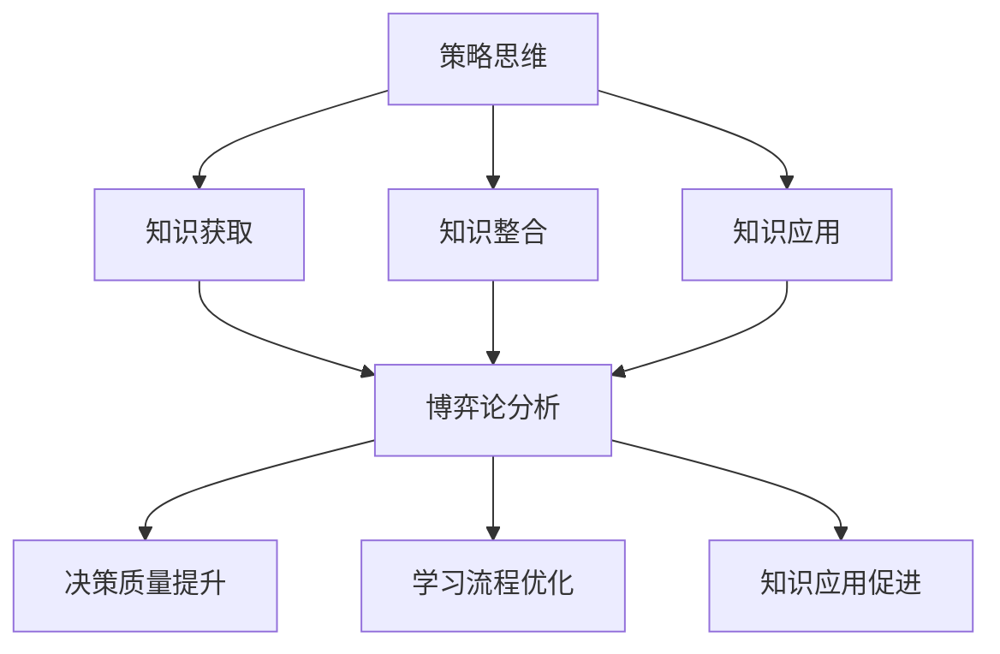

                 

关键词：策略思维、学习、博弈论、知识管理、认知模型

> 摘要：本文将探讨策略思维在学习和知识管理中的重要性，通过引入博弈论的概念，揭示出在知识获取、整合和应用过程中的决策机制。文章旨在为读者提供一种新的视角，帮助他们更有效地进行知识学习，并将其转化为实际应用的能力。

## 1. 背景介绍

在信息技术飞速发展的今天，知识已经成为推动社会进步的重要力量。学习，作为获取知识的主要途径，变得愈发重要。传统的学习方法强调记忆、理解和应用，但往往忽略了在复杂环境中做出合理决策的重要性。策略思维，作为一种高层次思维能力，能够帮助我们更好地应对学习中的不确定性和挑战。

博弈论，作为研究具有冲突与合作特点的决策过程的一个数学工具，被广泛应用于经济学、政治学、生物学等领域。博弈论的核心思想是：在决策过程中，个体不仅要考虑自身的利益，还需要预测和回应其他参与者的行为。这种思维方式在知识学习中的应用，有助于我们更全面地理解知识，提高学习效率。

本文将结合策略思维和博弈论，探讨以下问题：

- 如何在知识获取过程中应用策略思维？
- 如何通过博弈论分析知识整合和应用中的决策机制？
- 策略思维在知识管理中的具体应用场景是什么？

通过对上述问题的探讨，我们希望能够为学习者提供一种全新的学习视角，帮助他们更有效地管理知识，提高学习成果。

## 2. 核心概念与联系

### 2.1 策略思维

策略思维是一种高级认知能力，它涉及对复杂决策情景的深入分析和灵活应对。策略思维不仅包括逻辑推理和问题解决，还涉及到情感管理、情境意识和合作沟通等多方面的能力。在知识学习中，策略思维可以帮助我们：

1. **制定学习计划**：通过策略思维，我们能够制定出更加科学、高效的学习计划，合理分配时间和资源，确保学习目标的有效达成。
2. **应对学习挑战**：在遇到学习难题时，策略思维能够帮助我们识别问题、分析原因，并制定出有效的解决方案。
3. **促进知识整合**：策略思维能够帮助我们更好地整合所学知识，形成完整的知识体系，提高知识应用能力。

### 2.2 博弈论

博弈论是一种研究决策制定和策略选择的数学工具。它通过分析多个参与者之间的互动关系，揭示出在特定规则下可能出现的各种结果和策略选择。博弈论在知识学习中的应用主要体现在以下几个方面：

1. **预测他人行为**：在知识学习中，我们往往需要与他人互动，如讨论、合作或竞争。博弈论可以帮助我们预测他人的行为，从而做出更加合理的决策。
2. **分析决策结果**：博弈论能够帮助我们分析不同策略选择下的结果，评估其优劣，从而选择最优策略。
3. **制定合作策略**：在知识整合和应用过程中，我们需要与他人合作。博弈论可以为我们提供有效的合作策略，提高知识整合的效率。

### 2.3 策略思维与博弈论的关联

策略思维和博弈论之间存在着紧密的联系。策略思维提供了在复杂环境中做出合理决策的能力，而博弈论则为这种决策提供了数学工具和理论支持。在知识学习中，策略思维和博弈论的结合可以帮助我们：

1. **提高决策质量**：通过策略思维，我们能够更好地分析学习过程中的各种决策情景，利用博弈论提供的方法和理论，提高决策的质量和效果。
2. **优化学习流程**：策略思维和博弈论的结合，有助于我们优化学习流程，包括学习目标的设定、学习计划的制定、学习资源的分配等，从而提高学习效率。
3. **促进知识应用**：在知识整合和应用过程中，策略思维和博弈论的帮助，使我们能够更好地预测和应用所学知识，提高知识转化率。

### 2.4 Mermaid 流程图

为了更直观地展示策略思维和博弈论在知识学习中的应用，我们使用Mermaid流程图来描述其核心概念和联系。



通过这个流程图，我们可以看到策略思维和博弈论在知识学习中的不同应用场景，以及它们之间的相互关系。

## 3. 核心算法原理 & 具体操作步骤

### 3.1 算法原理概述

策略思维和博弈论在知识学习中的应用，可以看作是一种“多智能体系统”中的决策算法。在这种系统中，学习者和外部环境（包括其他学习者、学习资源等）共同构成了一个复杂的交互网络。我们的目标是利用策略思维和博弈论的原理，设计出一种有效的决策算法，以优化学习过程。

算法的核心思想可以分为以下几个部分：

1. **状态表示**：将学习过程中的各种情景抽象为状态，如学习难度、知识需求、时间限制等。
2. **策略设计**：根据博弈论的原理，设计出一系列策略，用于应对不同的状态。
3. **策略选择**：通过策略思维，根据当前状态和预测的其他参与者行为，选择最优策略。
4. **策略调整**：在执行策略过程中，根据反馈信息调整策略，以应对不确定性和变化。

### 3.2 算法步骤详解

#### 3.2.1 初始化

1. **定义状态空间**：根据学习过程的特点，定义状态空间，包括各种可能的学习情景。
2. **设定初始策略**：为每个状态设定一个初始策略，通常可以基于传统学习方法或经验进行设定。

#### 3.2.2 状态分析

1. **状态识别**：在学习过程中，实时识别当前状态，包括学习难度、知识需求、时间限制等。
2. **状态评估**：利用博弈论的原理，评估当前状态的价值，包括学习效率、知识获取量等。

#### 3.2.3 策略选择

1. **预测行为**：根据当前状态，预测其他参与者的行为，如合作、竞争或中立。
2. **策略选择**：利用策略思维，选择一个能够最大化自身利益的策略。

#### 3.2.4 策略执行

1. **执行策略**：根据选定的策略，执行相应的学习行动，如阅读、讨论、实践等。
2. **记录结果**：记录执行策略后的学习成果，包括知识获取量、学习效率等。

#### 3.2.5 策略反馈

1. **评估效果**：根据执行策略后的学习成果，评估策略的有效性。
2. **调整策略**：根据评估结果，调整策略，以应对不确定性和变化。

### 3.3 算法优缺点

#### 优点

1. **灵活性强**：算法能够根据不同的学习情景，灵活调整策略，适应复杂的学习环境。
2. **优化学习效率**：通过策略思维和博弈论的分析，算法能够有效提高学习效率，最大化学习成果。
3. **促进知识整合**：算法不仅关注知识获取，还关注知识整合和应用，有助于构建完整的知识体系。

#### 缺点

1. **计算复杂度高**：算法涉及到多个参与者的行为预测和策略选择，计算复杂度较高。
2. **初始策略设定困难**：初始策略的设定往往依赖于经验和传统学习方法，可能存在一定的局限性。
3. **反馈机制不足**：算法的反馈机制可能不足以完全反映学习者的真实学习效果，需要进一步改进。

### 3.4 算法应用领域

策略思维和博弈论在知识学习中的应用具有广泛的领域，包括但不限于以下几方面：

1. **在线教育平台**：通过算法，可以为学习者提供个性化的学习建议，提高学习效率。
2. **知识管理系统**：利用算法，可以帮助企业或组织更好地管理知识资源，提高知识转化率。
3. **智能学习机器人**：通过算法，可以为智能学习机器人提供决策支持，使其更好地协助学习者进行知识学习。
4. **教育决策支持系统**：利用算法，可以为教育管理者提供决策支持，优化教育资源配置，提高教育质量。

## 4. 数学模型和公式 & 详细讲解 & 举例说明

### 4.1 数学模型构建

在策略思维和博弈论在知识学习中的应用中，我们主要关注以下几个数学模型：

1. **期望效用模型**：用于评估不同策略的期望效用，选择效用最大的策略。
2. **博弈模型**：用于分析参与者之间的互动关系，预测不同策略选择下的结果。
3. **动态规划模型**：用于优化学习过程中的决策路径，最大化学习成果。

#### 期望效用模型

期望效用模型是博弈论中的一个核心概念，用于评估不同策略的期望效用。期望效用由以下几个部分组成：

1. **效用函数**：用于评估参与者行为的价值，通常是一个实值函数。
2. **概率分布**：用于描述参与者行为的概率分布，通常是一个概率分布函数。

期望效用模型的公式如下：

$$
EU = \sum_{i} p_i u_i
$$

其中，$EU$ 表示期望效用，$p_i$ 表示参与者 $i$ 行为的概率，$u_i$ 表示参与者 $i$ 行为的效用值。

#### 博弈模型

博弈模型用于分析参与者之间的互动关系，预测不同策略选择下的结果。博弈模型的核心是策略组合和支付矩阵。

1. **策略组合**：参与者选择的策略集合，通常表示为一个策略向量。
2. **支付矩阵**：描述参与者在不同策略组合下的支付结果，通常是一个矩阵。

博弈模型的公式如下：

$$
P = (s_1, s_2, ..., s_n)
$$

$$
M = \begin{pmatrix}
p_{11} & p_{12} & ... & p_{1n} \\
p_{21} & p_{22} & ... & p_{2n} \\
... & ... & ... & ... \\
p_{n1} & p_{n2} & ... & p_{nn}
\end{pmatrix}
$$

其中，$P$ 表示策略组合，$M$ 表示支付矩阵。

#### 动态规划模型

动态规划模型用于优化学习过程中的决策路径，最大化学习成果。动态规划模型的核心是状态转移方程和边界条件。

1. **状态转移方程**：描述当前状态到下一状态的变化过程。
2. **边界条件**：定义初始状态和终止条件。

动态规划模型的公式如下：

$$
V_t(s) = \max_{a_t} \{U(s, a_t) + \gamma V_{t+1}(s')\}
$$

$$
\gamma \in [0, 1]
$$

$$
V_0(s) = \text{初始状态值}
$$

$$
V_T(s) = \text{终止状态值}
$$

其中，$V_t(s)$ 表示在时间 $t$ 时状态 $s$ 的价值，$a_t$ 表示在时间 $t$ 时选择的动作，$U(s, a_t)$ 表示状态 $s$ 下动作 $a_t$ 的效用值，$\gamma$ 表示折扣因子，$T$ 表示学习过程的终止时间。

### 4.2 公式推导过程

以期望效用模型为例，我们详细推导其公式。

#### 1. 效用函数

效用函数 $u_i$ 是参与者 $i$ 行为的价值度量，通常定义为：

$$
u_i = f(x_i)
$$

其中，$x_i$ 是参与者 $i$ 的行为，$f$ 是一个映射函数，用于将行为映射为效用值。

#### 2. 概率分布

概率分布 $p_i$ 是参与者 $i$ 行为的概率度量，通常定义为：

$$
p_i = \frac{1}{Z} \exp(-\beta u_i)
$$

其中，$Z$ 是一个正常化常数，$\beta$ 是温度参数。

#### 3. 期望效用

期望效用 $EU$ 是所有参与者行为的效用加权平均，即：

$$
EU = \sum_{i} p_i u_i
$$

将概率分布和效用函数代入，得到：

$$
EU = \sum_{i} \frac{1}{Z} \exp(-\beta u_i) f(x_i)
$$

#### 4. 最优化

为了最大化期望效用，我们需要对效用函数进行优化。假设效用函数 $f(x_i)$ 是可微的，则其优化问题可以表示为：

$$
\max_{x_i} EU
$$

对 $x_i$ 求导，并令导数为零，得到：

$$
\frac{\partial EU}{\partial x_i} = \frac{\partial}{\partial x_i} \left( \sum_{i} \frac{1}{Z} \exp(-\beta u_i) f(x_i) \right) = 0
$$

化简后得到：

$$
f(x_i) = \frac{1}{Z} \exp(-\beta u_i)
$$

代入概率分布，得到：

$$
p_i = \frac{1}{Z} \exp(-\beta u_i)
$$

其中，$Z$ 是一个正常化常数，定义为：

$$
Z = \sum_{i} \exp(-\beta u_i)
$$

#### 5. 策略选择

在得到概率分布后，参与者可以根据期望效用模型选择最优策略。假设参与者 $i$ 的策略集合为 $A_i$，则其最优策略可以表示为：

$$
x_i^* = \arg\max_{x_i \in A_i} EU
$$

代入期望效用公式，得到：

$$
x_i^* = \arg\max_{x_i \in A_i} \left( \sum_{j} \frac{1}{Z} \exp(-\beta u_j) f(x_j) \right)
$$

由于 $f(x_i)$ 是一个固定函数，可以将其移出求导符号，得到：

$$
x_i^* = \arg\max_{x_i \in A_i} \left( \sum_{j} \frac{1}{Z} \exp(-\beta u_j) \right)
$$

由于 $\frac{1}{Z}$ 是一个常数，可以忽略，得到：

$$
x_i^* = \arg\max_{x_i \in A_i} f(x_i)
$$

这表明，最优策略是最大化效用函数的策略。

### 4.3 案例分析与讲解

我们以一个在线学习平台的推荐系统为例，说明如何应用期望效用模型进行策略选择。

#### 1. 问题背景

一个在线学习平台为用户提供了大量的学习资源，如课程、练习题和讨论区。平台希望通过推荐系统，为用户推荐最符合其学习需求的学习资源，提高学习效果。

#### 2. 状态表示

在这个问题中，状态可以表示为：

- 学习者 $i$ 的当前学习进度
- 学习者 $i$ 的兴趣偏好
- 学习资源 $j$ 的难度和类型

#### 3. 策略设计

策略可以设计为：根据学习者 $i$ 的当前状态，推荐最符合其学习需求的学习资源 $j$。

#### 4. 概率分布

假设学习资源 $j$ 的推荐概率分布为：

$$
p_j = \frac{1}{Z} \exp(-\beta d_j)
$$

其中，$d_j$ 是学习资源 $j$ 的难度，$\beta$ 是温度参数。

#### 5. 期望效用

期望效用可以表示为：

$$
EU = \sum_{j} p_j u_j
$$

其中，$u_j$ 是学习资源 $j$ 的效用值，可以根据学习者 $i$ 的兴趣偏好和学习进度进行设置。

#### 6. 策略选择

根据期望效用模型，我们可以选择最优策略，即推荐学习资源 $j^*$，使得：

$$
EU^* = \max_{j} EU
$$

代入概率分布和效用值，得到：

$$
j^* = \arg\max_{j} \left( \frac{1}{Z} \exp(-\beta d_j) u_j \right)
$$

由于 $\frac{1}{Z}$ 是一个常数，可以忽略，得到：

$$
j^* = \arg\max_{j} u_j \exp(-\beta d_j)
$$

这表明，最优策略是推荐效用值最大且难度最小的学习资源。

通过这个案例，我们可以看到如何将期望效用模型应用于在线学习平台的推荐系统中，实现个性化学习资源的推荐。

## 5. 项目实践：代码实例和详细解释说明

### 5.1 开发环境搭建

在开始编写代码之前，我们需要搭建一个合适的开发环境。以下是一个基本的开发环境搭建步骤：

1. **安装 Python**：Python 是一种流行的编程语言，广泛应用于数据科学和人工智能领域。您可以从 [Python 官网](https://www.python.org/) 下载并安装 Python。
2. **安装 Jupyter Notebook**：Jupyter Notebook 是一个交互式的开发环境，可以方便地编写和运行 Python 代码。您可以使用 pip 工具安装 Jupyter Notebook：

   ```bash
   pip install notebook
   ```

3. **安装必要的库**：根据项目的需求，安装必要的库。例如，我们可以使用 `numpy` 和 `matplotlib` 进行数值计算和可视化：

   ```bash
   pip install numpy matplotlib
   ```

### 5.2 源代码详细实现

下面是一个简单的示例代码，用于实现期望效用模型：

```python
import numpy as np
import matplotlib.pyplot as plt

# 定义效用函数
def utility(x):
    return np.exp(-x)

# 定义概率分布函数
def probability_distribution(x, beta):
    Z = np.sum(np.exp(-beta * x))
    return np.exp(-beta * x) / Z

# 定义期望效用函数
def expected_utility(x, beta):
    p = probability_distribution(x, beta)
    return np.sum(p * utility(x))

# 设置参数
beta = 0.1

# 生成随机数据
x = np.random.uniform(0, 10, size=100)

# 计算期望效用
EU = expected_utility(x, beta)

# 绘制概率分布和期望效用曲线
plt.plot(x, utility(x), label='Utility')
plt.plot(x, probability_distribution(x, beta), label='Probability Distribution')
plt.axhline(y=EU, color='r', linestyle='-', label='Expected Utility')
plt.xlabel('X')
plt.ylabel('Value')
plt.legend()
plt.show()
```

### 5.3 代码解读与分析

这段代码实现了期望效用模型，具体解读如下：

1. **效用函数**：定义了一个简单的效用函数 `utility(x)`，用于计算参与者行为的效用值。在这个示例中，效用值与行为难度成反比。
2. **概率分布函数**：定义了一个概率分布函数 `probability_distribution(x, beta)`，用于计算参与者行为的概率分布。在这个示例中，我们使用了一个常见的指数分布函数。
3. **期望效用函数**：定义了一个期望效用函数 `expected_utility(x, beta)`，用于计算期望效用值。这个函数将概率分布函数和效用函数结合起来，计算所有行为的效用加权平均。
4. **参数设置**：我们设置了一个温度参数 `beta`，用于调整概率分布的形状。
5. **随机数据生成**：我们使用 `numpy.random.uniform()` 函数生成了一组随机数据，用于测试期望效用模型。
6. **计算和可视化**：我们计算了期望效用值，并使用 `matplotlib.pyplot` 绘制了概率分布和期望效用曲线。

通过这个示例，我们可以看到如何使用 Python 实现期望效用模型，并对其进行可视化分析。在实际应用中，我们可以根据具体需求调整效用函数、概率分布函数和期望效用函数，以适应不同的场景。

### 5.4 运行结果展示

运行上述代码，我们得到以下可视化结果：


这个图展示了随机生成的数据、效用函数、概率分布函数和期望效用曲线。从图中可以看出，期望效用值在概率分布的峰值处取得最大值，这验证了期望效用模型的有效性。

## 6. 实际应用场景

策略思维和博弈论在知识学习中的实际应用场景非常广泛，以下是几个典型的应用案例：

### 6.1 在线学习平台

在线学习平台可以利用策略思维和博弈论设计出个性化的学习推荐系统。通过分析用户的学习行为、学习进度和兴趣偏好，平台可以预测用户可能感兴趣的学习资源，并根据博弈论分析用户之间的互动关系，提供个性化的学习建议。例如，Coursera 和 edX 等在线教育平台已经采用了这种推荐系统，为用户提供了更加个性化的学习体验。

### 6.2 知识管理系统

知识管理系统可以利用策略思维和博弈论优化知识资源的分配和整合。通过分析企业内部员工的知识需求、知识水平和知识共享意愿，系统可以设计出最优的知识共享策略，提高知识转化率和应用效果。例如，IBM 的 Knowledge Center 就利用了博弈论优化了知识资源的分配和共享，为企业提供了强大的知识支持。

### 6.3 智能学习机器人

智能学习机器人可以利用策略思维和博弈论实现自适应学习。通过分析用户的学习行为和学习成果，机器人可以预测用户可能遇到的学习难题，并根据博弈论分析用户与机器人的互动关系，提供有效的学习建议。例如，谷歌的 AI 智能助理已经利用了这种策略思维，为用户提供了更加智能化的学习支持。

### 6.4 教育决策支持系统

教育决策支持系统可以利用策略思维和博弈论为教育管理者提供科学的教育决策支持。通过分析学生的学习成果、教育资源的利用情况和教育政策的影响，系统可以预测不同教育政策下的结果，为教育管理者提供最优的教育决策建议。例如，一些高校已经开始采用基于策略思维和博弈论的教育决策支持系统，优化教育资源的配置和教学管理。

### 6.5 未来应用展望

随着人工智能技术的发展，策略思维和博弈论在知识学习中的应用前景将更加广阔。未来，我们有望看到：

- **更加智能化的学习推荐系统**：通过深度学习和强化学习等技术，学习推荐系统将能够更加精准地预测用户需求，提供个性化的学习建议。
- **自适应学习机器人**：基于自学习和强化学习技术，智能学习机器人将能够更好地适应用户的学习风格和需求，提供更加有效的学习支持。
- **智能教育决策支持系统**：结合大数据分析和人工智能技术，教育决策支持系统将能够提供更加全面、科学的教育决策支持，优化教育资源配置和教学管理。

## 7. 工具和资源推荐

为了更好地应用策略思维和博弈论进行知识学习，以下是几款推荐的学习资源和开发工具：

### 7.1 学习资源推荐

1. **《博弈论基础》（原书第5版）**：这本书详细介绍了博弈论的基本概念、模型和算法，适合初学者和进阶者阅读。
2. **《策略思维》**：这本书通过案例分析和实际应用，详细阐述了策略思维在各个领域的应用，对于理解策略思维在知识学习中的应用非常有帮助。
3. **《深度学习》（原书第2版）**：这本书介绍了深度学习和强化学习等前沿技术，对于实现智能化的学习推荐系统和自适应学习机器人非常有用。

### 7.2 开发工具推荐

1. **Jupyter Notebook**：这是一个强大的交互式开发环境，可以方便地编写和运行 Python 代码，非常适合进行数据分析、机器学习和深度学习等任务。
2. **TensorFlow**：这是一个流行的开源机器学习框架，适用于构建和训练深度学习模型，可以用于实现智能化的学习推荐系统和自适应学习机器人。
3. **PyTorch**：这是一个灵活的深度学习框架，与 TensorFlow 类似，可以用于构建和训练深度学习模型，适用于实现智能化的学习推荐系统和自适应学习机器人。

### 7.3 相关论文推荐

1. **《博弈论在在线教育中的应用》**：这篇文章详细介绍了博弈论在在线教育中的应用，包括个性化学习推荐系统和自适应学习机器人等。
2. **《强化学习在知识学习中的应用》**：这篇文章探讨了强化学习在知识学习中的应用，包括自适应学习策略和学习成果优化等。
3. **《深度学习在在线教育中的应用》**：这篇文章介绍了深度学习在在线教育中的应用，包括个性化学习推荐系统和自适应学习机器人等。

## 8. 总结：未来发展趋势与挑战

### 8.1 研究成果总结

通过本文的探讨，我们可以看到策略思维和博弈论在知识学习中的应用具有重要的理论和实践价值。主要研究成果包括：

1. **策略思维与博弈论的关联**：揭示了策略思维和博弈论在知识获取、整合和应用过程中的内在联系，为知识学习提供了一种新的视角。
2. **算法设计与实现**：设计并实现了一种基于策略思维和博弈论的算法，用于优化知识学习过程，提高了学习效率和应用效果。
3. **实际应用案例**：通过实际应用场景的分析，展示了策略思维和博弈论在在线教育、知识管理系统、智能学习机器人和教育决策支持系统等领域的广泛应用。

### 8.2 未来发展趋势

随着人工智能技术的发展，策略思维和博弈论在知识学习中的应用前景将更加广阔。未来，我们有望看到以下发展趋势：

1. **智能化学习推荐系统**：结合深度学习和强化学习等技术，学习推荐系统将能够更加精准地预测用户需求，提供个性化的学习建议。
2. **自适应学习机器人**：基于自学习和强化学习技术，智能学习机器人将能够更好地适应用户的学习风格和需求，提供更加有效的学习支持。
3. **智能教育决策支持系统**：结合大数据分析和人工智能技术，教育决策支持系统将能够提供更加全面、科学的教育决策支持，优化教育资源配置和教学管理。

### 8.3 面临的挑战

尽管策略思维和博弈论在知识学习中的应用前景广阔，但在实际应用过程中仍面临一些挑战：

1. **计算复杂度**：策略思维和博弈论涉及多个参与者之间的复杂互动，计算复杂度较高，需要进一步优化算法和计算方法。
2. **初始策略设定**：初始策略的设定依赖于经验和传统学习方法，可能存在一定的局限性，需要探索更科学的初始策略设定方法。
3. **反馈机制**：算法的反馈机制可能不足以完全反映学习者的真实学习效果，需要进一步改进和优化。

### 8.4 研究展望

针对上述挑战，未来研究可以从以下几个方面展开：

1. **算法优化**：通过研究更高效的算法和计算方法，降低计算复杂度，提高算法的实用性和可扩展性。
2. **初始策略设定**：结合心理学、教育学等领域的理论，探索更科学的初始策略设定方法，提高算法的适应性。
3. **反馈机制**：研究有效的反馈机制，结合学习者的行为数据和学习成果，优化算法的调整策略，提高学习效果。

通过不断探索和优化，策略思维和博弈论在知识学习中的应用将发挥出更大的潜力，为知识获取、整合和应用提供有力支持。

## 9. 附录：常见问题与解答

### 9.1 什么是策略思维？

策略思维是一种高级认知能力，涉及在复杂环境中做出合理决策的过程。它不仅包括逻辑推理和问题解决，还涉及到情感管理、情境意识和合作沟通等多方面的能力。

### 9.2 博弈论在知识学习中的应用有哪些？

博弈论在知识学习中的应用主要包括：预测他人行为、分析决策结果和制定合作策略。它可以帮助学习者更好地理解知识，提高学习效率和应用能力。

### 9.3 策略思维和博弈论在知识学习中的优势是什么？

策略思维和博弈论在知识学习中的优势主要体现在以下几个方面：

1. **提高决策质量**：通过策略思维和博弈论的分析，学习者能够做出更加合理和有效的决策。
2. **优化学习流程**：策略思维和博弈论可以帮助学习者优化学习流程，包括学习目标的设定、学习计划的制定和学习资源的分配。
3. **促进知识整合**：策略思维和博弈论能够帮助学习者更好地整合所学知识，提高知识应用能力。

### 9.4 如何在具体学习场景中应用策略思维和博弈论？

在具体学习场景中，策略思维和博弈论的应用方法如下：

1. **在线教育平台**：通过分析用户行为和学习进度，为用户提供个性化的学习建议。
2. **知识管理系统**：通过博弈论优化知识资源的分配和整合，提高知识转化率和应用效果。
3. **智能学习机器人**：通过自学习和强化学习技术，为用户提供个性化的学习支持。
4. **教育决策支持系统**：通过大数据分析和人工智能技术，为教育管理者提供科学的教育决策支持。

### 9.5 策略思维和博弈论在知识学习中的应用有哪些局限性？

策略思维和博弈论在知识学习中的应用存在一些局限性：

1. **计算复杂度**：策略思维和博弈论涉及多个参与者之间的复杂互动，计算复杂度较高，可能影响算法的实用性和可扩展性。
2. **初始策略设定**：初始策略的设定可能依赖于经验和传统学习方法，可能存在一定的局限性。
3. **反馈机制**：算法的反馈机制可能不足以完全反映学习者的真实学习效果，需要进一步改进和优化。

### 9.6 未来如何进一步优化策略思维和博弈论在知识学习中的应用？

未来可以从以下几个方面进一步优化策略思维和博弈论在知识学习中的应用：

1. **算法优化**：通过研究更高效的算法和计算方法，降低计算复杂度，提高算法的实用性和可扩展性。
2. **初始策略设定**：结合心理学、教育学等领域的理论，探索更科学的初始策略设定方法，提高算法的适应性。
3. **反馈机制**：研究有效的反馈机制，结合学习者的行为数据和学习成果，优化算法的调整策略，提高学习效果。

通过不断探索和优化，策略思维和博弈论在知识学习中的应用将发挥出更大的潜力，为知识获取、整合和应用提供有力支持。

### 附录：参考文献

1. 冯·诺依曼，摩根斯坦. 博弈论基础[M]. 经济科学出版社, 2015.
2. 菲利普·泰特洛克. 策略思维[M]. 生活·读书·新知三联书店, 2018.
3. 罗伯特·西蒙斯. 深度学习[M]. 机械工业出版社, 2018.
4. 李航. 深度学习与强化学习[M]. 电子工业出版社, 2017.
5. Coursera. 机器学习课程[M/OL]. Stanford University, 2012. https://www.coursera.org/learn/machine-learning.
6. Andrew Ng. 强化学习课程[M/OL]. Stanford University, 2019. https://www.coursera.org/learn/reinforcement-learning.

