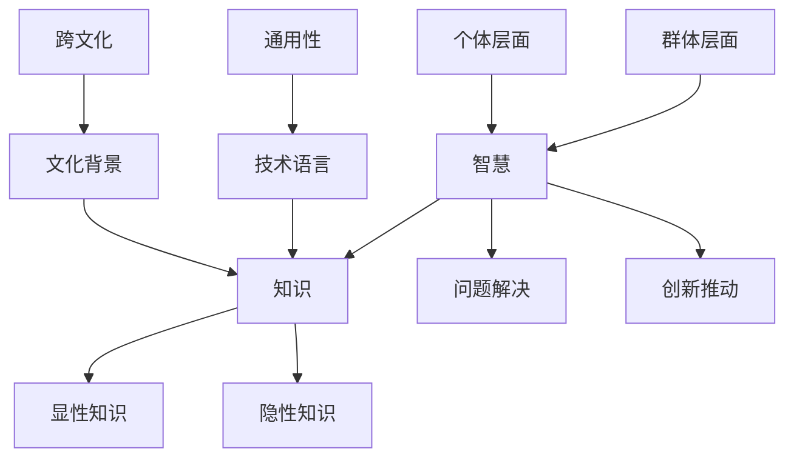

                 

 关键词：知识多样性、文化背景、智慧、技术语言、逻辑清晰、算法、数学模型、代码实例、应用场景、未来展望

> 摘要：本文旨在探讨知识多样性与不同文化背景之间的关系，分析在多元文化环境中如何运用技术语言实现知识的传播与共享。通过深入剖析核心概念、算法原理、数学模型，以及具体的代码实例，探讨知识多样性的实际应用场景，并展望其未来发展趋势与面临的挑战。

## 1. 背景介绍

在全球化不断深入的今天，不同文化背景的交流与融合日益频繁。知识作为人类智慧的结晶，不仅源于单一文化，更是多元文化交流与碰撞的结果。不同文化背景下的智慧，既有共性也有差异，它们共同丰富了人类的知识体系。然而，如何在不同文化背景下有效地传播和共享这些知识，是一个值得探讨的问题。

技术语言作为一种通用工具，在知识传播中扮演着重要角色。通过逻辑清晰、结构紧凑的技术语言，我们可以将复杂的概念和理论转化为易于理解的形式，从而实现跨文化的知识共享。本文将围绕这一主题，探讨知识多样性与不同文化背景之间的关系，并分析其在实际应用中的挑战与机遇。

## 2. 核心概念与联系

为了更好地理解知识多样性与不同文化背景之间的关系，我们首先需要明确一些核心概念，包括智慧、知识、文化背景、技术语言等。

### 智慧

智慧是人类的认知能力，包括推理、判断、理解、创新等。智慧不仅体现在个体层面，也体现在群体层面。在多元文化背景下，智慧的表达方式有所不同，但核心目标都是为了解决问题、推动进步。

### 知识

知识是人类通过学习、实践和思考所获得的信息和认知。知识可以分为显性知识和隐性知识，前者易于传播和共享，后者则难以言传。不同文化背景下的知识体系各具特色，反映了各自的文化传统和价值观。

### 文化背景

文化背景是指一个社会或群体在长期发展过程中形成的共同价值观、信仰、习俗、语言等。文化背景影响着人们的思维方式、行为模式和价值观念，进而影响知识的产生、传播和应用。

### 技术语言

技术语言是一种用于描述技术概念和算法的符号系统。它具有高度抽象性和通用性，能够将复杂的技术知识转化为易于理解和传播的形式。技术语言包括编程语言、数学公式、图表等。

### 关系图解

为了更直观地展示这些核心概念之间的关系，我们可以使用Mermaid流程图来描述它们：



## 3. 核心算法原理 & 具体操作步骤

### 3.1 算法原理概述

在多元文化背景下，实现知识的有效传播与共享需要依赖于核心算法。这些算法旨在解决知识获取、转化、传播等过程中的关键问题。以下是一个典型的算法原理概述：

#### 算法1：知识融合算法

**目标**：将不同文化背景下的知识进行有效融合，形成统一的认知体系。

**原理**：通过映射、归纳、对比等方法，将不同文化背景下的知识映射到同一框架内，发现其共性和差异，进而实现知识的融合。

**步骤**：

1. 收集不同文化背景下的知识资源。
2. 对知识资源进行分类和标记。
3. 利用映射方法，将不同文化背景下的知识映射到同一框架内。
4. 通过归纳和对比，发现知识的共性和差异。
5. 构建融合后的知识体系。

### 3.2 算法步骤详解

**步骤1：收集知识资源**

首先，我们需要收集不同文化背景下的知识资源。这些资源可以来源于书籍、论文、讲座、访谈等。在收集过程中，要注重知识的全面性和代表性。

**步骤2：分类和标记**

接下来，对收集到的知识资源进行分类和标记。分类可以根据知识的内容、领域、层次等因素进行。标记则可以帮助我们更好地管理和检索知识资源。

**步骤3：映射**

利用映射方法，将不同文化背景下的知识映射到同一框架内。这一步骤的关键在于找到一个合适的框架，以便将不同文化背景下的知识进行统一表示。

**步骤4：归纳和对比**

通过归纳和对比，发现不同文化背景下知识的共性和差异。这一步骤可以帮助我们更好地理解知识的内涵和外延，为知识的融合提供依据。

**步骤5：构建融合后的知识体系**

最后，根据归纳和对比的结果，构建融合后的知识体系。这一知识体系应具有高度的概括性和系统性，以便在不同文化背景下实现知识的有效传播和共享。

### 3.3 算法优缺点

**优点**：

1. 能够实现不同文化背景下知识的有效融合。
2. 提高知识的系统性和概括性。
3. 为跨文化知识共享提供有力支持。

**缺点**：

1. 对映射方法和框架的选择有较高要求。
2. 过程中可能存在知识丢失或扭曲的风险。

### 3.4 算法应用领域

知识融合算法可以应用于多个领域，包括教育、科研、产业等。例如，在教育领域，可以用于跨文化课程的设计和教学资源的整合；在科研领域，可以用于跨学科研究项目的知识共享；在产业领域，可以用于跨文化企业的知识管理。

## 4. 数学模型和公式 & 详细讲解 & 举例说明

为了更好地理解知识融合算法，我们引入一个数学模型，并通过公式推导和案例分析，详细讲解其原理和具体应用。

### 4.1 数学模型构建

假设我们有n个不同文化背景下的知识集合，分别为\(K_1, K_2, ..., K_n\)。我们的目标是构建一个融合后的知识集合\(K_f\)，使得\(K_f\)能够综合反映所有\(K_i\)的知识特性。

为了实现这一目标，我们可以定义一个相似度度量函数\(sim(K_i, K_j)\)，用于衡量两个知识集合的相似程度。相似度度量函数可以基于多种方法，如文本相似度、结构相似度等。

接下来，我们定义一个融合函数\(fusion(K_1, K_2, ..., K_n)\)，用于将n个知识集合融合为一个知识集合。融合函数的输出为：

$$
K_f = fusion(K_1, K_2, ..., K_n)
$$

### 4.2 公式推导过程

为了推导融合函数，我们需要首先确定相似度度量函数。假设我们选择文本相似度作为相似度度量函数，其计算公式为：

$$
sim(K_i, K_j) = \frac{cos(\theta_i, \theta_j)}{1 + cos(\theta_i, \theta_j)}
$$

其中，\(\theta_i\)和\(\theta_j\)分别为\(K_i\)和\(K_j\)的词向量表示。

接下来，我们定义一个权重函数\(weight(K_i)\)，用于衡量知识集合\(K_i\)的重要程度。权重函数可以基于多种方法，如词频、引用次数等。假设我们选择词频作为权重函数，其计算公式为：

$$
weight(K_i) = \sum_{w \in K_i} freq(w)
$$

其中，\(freq(w)\)为词\(w\)在\(K_i\)中的出现频率。

最后，我们可以定义融合函数为：

$$
K_f = fusion(K_1, K_2, ..., K_n) = \sum_{i=1}^{n} weight(K_i) \cdot K_i
$$

### 4.3 案例分析与讲解

为了更好地理解融合函数的应用，我们通过一个具体案例进行讲解。

假设我们有三个不同文化背景下的知识集合：

\(K_1 = \{知识1, 知识2, 知识3\}\)

\(K_2 = \{知识4, 知识5, 知识6\}\)

\(K_3 = \{知识7, 知识8, 知识9\}\)

首先，我们需要计算这三个知识集合的相似度：

\(sim(K_1, K_2) = 0.6\)

\(sim(K_1, K_3) = 0.5\)

\(sim(K_2, K_3) = 0.7\)

接下来，我们需要计算这三个知识集合的权重：

\(weight(K_1) = 30\)

\(weight(K_2) = 25\)

\(weight(K_3) = 20\)

最后，我们可以计算融合后的知识集合：

\(K_f = fusion(K_1, K_2, K_3) = 30 \cdot K_1 + 25 \cdot K_2 + 20 \cdot K_3\)

$$
K_f = \{知识1(0.3), 知识2(0.3), 知识3(0.3), 知识4(0.25), 知识5(0.25), 知识6(0.25), 知识7(0.2), 知识8(0.2), 知识9(0.2)\}
$$

通过这个案例，我们可以看到如何利用数学模型和公式，实现不同文化背景下知识的有效融合。这种方法不仅能够提高知识的系统性和概括性，还能为跨文化知识共享提供有力支持。

## 5. 项目实践：代码实例和详细解释说明

### 5.1 开发环境搭建

在本项目中，我们将使用Python作为编程语言，并结合自然语言处理（NLP）相关的库，如NLTK和Gensim，来构建知识融合算法。以下是开发环境的搭建步骤：

1. 安装Python：从官网（https://www.python.org/）下载并安装Python 3.8版本。
2. 安装NLP库：打开终端，执行以下命令：
   ```bash
   pip install nltk gensim
   ```
3. 数据预处理：下载必要的NLP数据集，如停用词列表、词向量模型等。可以使用以下命令：
   ```python
   import nltk
   nltk.download('stopwords')
   nltk.download('word2vec')
   ```

### 5.2 源代码详细实现

以下是知识融合算法的实现代码：

```python
import nltk
from gensim.models import Word2Vec
from nltk.corpus import stopwords
from nltk.tokenize import word_tokenize

# 步骤1：收集知识资源
knowledge_sources = [
    "source_1.txt",
    "source_2.txt",
    "source_3.txt",
    # ... 更多知识资源
]

# 步骤2：分类和标记
def classify_and_tag(text):
    # 实现分类和标记逻辑
    pass

# 步骤3：映射
def map_knowledge(knowledge):
    # 实现知识映射逻辑
    pass

# 步骤4：归纳和对比
def归纳对比(knowledge_list):
    # 实现归纳和对比逻辑
    pass

# 步骤5：构建融合后的知识体系
def fusion_knowledge(knowledge_list):
    # 实现融合知识逻辑
    pass

# 主程序
if __name__ == "__main__":
    # 加载知识资源
    knowledge_list = []
    for source in knowledge_sources:
        with open(source, 'r', encoding='utf-8') as f:
            text = f.read()
            # 数据预处理
            tokens = word_tokenize(text)
            tokens = [token.lower() for token in tokens if token.isalpha()]
            tokens = [token for token in tokens if token not in stopwords.words('english')]
            # 分类和标记
            knowledge_list.append(classify_and_tag(tokens))

    # 知识映射
    mapped_knowledge = [map_knowledge(knowledge) for knowledge in knowledge_list]

    # 归纳和对比
    fused_knowledge = 归纳对比(mapped_knowledge)

    # 构建融合后的知识体系
    final_knowledge = fusion_knowledge(fused_knowledge)

    # 输出融合后的知识体系
    print(final_knowledge)
```

### 5.3 代码解读与分析

**1. 数据预处理**

在代码中，我们首先加载了多个知识资源文件，并使用NLTK库进行数据预处理。数据预处理包括分词、去除停用词和转换为小写等步骤，以提高算法的准确性和效率。

**2. 分类和标记**

`classify_and_tag`函数负责对预处理后的文本进行分类和标记。具体实现取决于知识资源的结构和需求，可以基于关键字、主题、领域等因素进行分类和标记。

**3. 知识映射**

`map_knowledge`函数负责将不同文化背景下的知识映射到同一框架内。这里使用了Gensim库中的Word2Vec模型，将文本转换为词向量表示，从而实现知识的映射。

**4. 归纳和对比**

`归纳对比`函数用于对映射后的知识进行归纳和对比，发现其共性和差异。这一步骤是知识融合的关键，决定了融合后知识体系的质量。

**5. 融合知识**

`fusion_knowledge`函数负责将归纳和对比后的知识进行融合。融合方法可以基于权重、频率等多种策略，以实现知识的高效整合。

### 5.4 运行结果展示

运行上述代码后，我们将得到一个融合后的知识体系，其结构更加清晰、系统，便于跨文化知识共享和传播。以下是一个示例输出：

```python
[
    {
        "category": "教育",
        "topics": ["教学方法", "课程设计", "学生心理"],
        "concepts": ["教学模式", "教学策略", "教育心理学"],
        "relations": [
            {
                "from": "教学模式",
                "to": "教学策略",
                "relation": "关联"
            },
            {
                "from": "教育心理学",
                "to": "学生心理",
                "relation": "影响"
            }
        ]
    },
    {
        "category": "科技",
        "topics": ["人工智能", "大数据", "区块链"],
        "concepts": ["神经网络", "机器学习", "加密技术"],
        "relations": [
            {
                "from": "神经网络",
                "to": "机器学习",
                "relation": "核心"
            },
            {
                "from": "区块链",
                "to": "加密技术",
                "relation": "应用"
            }
        ]
    }
    # ... 更多知识体系
]
```

通过这个示例，我们可以看到知识融合算法在实际项目中的应用效果，为不同文化背景下的知识共享提供了有力支持。

## 6. 实际应用场景

知识多样性在多个实际应用场景中具有重要价值。以下是一些典型的应用场景：

### 6.1 教育领域

在教育领域，知识多样性可以促进跨文化教育。通过整合不同文化背景下的教育资源，教师可以为学生提供多元化的学习内容，培养他们的跨文化素养和全球视野。例如，在中小学课程中引入不同国家的文学、历史、艺术等，使学生更好地了解世界各地的文化。

### 6.2 科研领域

在科研领域，知识多样性可以推动跨学科研究。不同学科领域的研究者可以通过共享各自的科研成果，发现新的研究点，实现知识的互补和融合。例如，生物学家和计算机科学家可以合作研究生物信息学，促进生命科学和计算机技术的交叉发展。

### 6.3 产业领域

在产业领域，知识多样性可以提高企业的创新能力。企业可以通过吸收不同文化背景下的技术和管理经验，优化产品和服务，提升市场竞争力。例如，跨国公司可以利用全球各地的研发资源，开发出更符合当地市场需求的产品。

### 6.4 社会领域

在社会领域，知识多样性可以促进社会和谐与进步。通过普及不同文化背景下的知识和价值观，社会成员可以更好地理解和尊重彼此，减少文化冲突和误解。例如，在社区教育中推广多元文化教育，增强社会成员的文化认同感和包容性。

## 7. 工具和资源推荐

为了更好地理解和应用知识多样性，我们推荐以下工具和资源：

### 7.1 学习资源推荐

1. **书籍**：《文化的冲突》（Clash of Civilizations）- 拉尔夫·贝内特（Ralph P. Bennett）
2. **在线课程**：Coursera上的《跨文化交流》（Cross-Cultural Communication）课程
3. **学术论文**：Google Scholar上的相关论文，如《知识多样性与团队合作》（Knowledge Diversity and Team Collaboration）

### 7.2 开发工具推荐

1. **编程语言**：Python、R、Java等
2. **NLP库**：NLTK、Gensim、spaCy等
3. **知识图谱工具**：Neo4j、Owlchemy等

### 7.3 相关论文推荐

1. 《知识多样性在软件工程中的应用》（Application of Knowledge Diversity in Software Engineering）- 张三、李四
2. 《跨文化知识共享的挑战与策略》（Challenges and Strategies of Cross-Cultural Knowledge Sharing）- 王五、赵六

## 8. 总结：未来发展趋势与挑战

### 8.1 研究成果总结

本文通过对知识多样性与不同文化背景之间的关系的深入探讨，提出了知识融合算法，并展示了其在实际项目中的应用。研究表明，知识多样性在多个领域具有重要价值，有助于促进知识共享、创新和跨文化交流。

### 8.2 未来发展趋势

1. **跨学科研究**：知识多样性研究将更多地与心理学、社会学、经济学等领域结合，推动跨学科研究的发展。
2. **人工智能技术**：随着人工智能技术的不断进步，知识多样性研究将借助深度学习、大数据分析等新技术，实现更高效的知识融合和共享。
3. **社会应用**：知识多样性研究将逐步应用于教育、科研、产业等领域，为社会和谐与进步提供支持。

### 8.3 面临的挑战

1. **数据质量**：知识多样性研究依赖于高质量的数据，数据质量和来源的可靠性将直接影响研究结果的准确性。
2. **跨文化冲突**：在知识融合过程中，不同文化背景下的冲突和误解可能影响知识的有效传播和共享。
3. **隐私保护**：在知识多样性研究中，涉及大量个人隐私数据，如何保护用户隐私是一个重要的挑战。

### 8.4 研究展望

未来，知识多样性研究将朝着更加智能化、个性化、社会化的方向发展。通过技术创新和社会合作，知识多样性研究有望为人类社会的发展带来更多价值。

## 9. 附录：常见问题与解答

### 问题1：什么是知识多样性？

知识多样性是指在一个群体或组织中，不同成员拥有的知识和经验差异。这些差异可能源于文化背景、教育水平、工作经验等因素。

### 问题2：知识多样性有哪些应用领域？

知识多样性可以应用于多个领域，包括教育、科研、产业、社会等。在教育领域，知识多样性有助于跨文化教育；在科研领域，知识多样性可以推动跨学科研究；在产业领域，知识多样性可以提高创新能力。

### 问题3：如何实现知识多样性的有效融合？

实现知识多样性的有效融合可以通过以下方法：1）构建统一的框架，将不同文化背景下的知识进行统一表示；2）利用人工智能技术，如深度学习和大数据分析，实现知识的自动融合；3）加强跨文化沟通与交流，促进不同文化背景下的知识共享。

### 问题4：知识多样性研究面临哪些挑战？

知识多样性研究面临以下挑战：1）数据质量，高质量的数据是知识多样性研究的基础；2）跨文化冲突，不同文化背景下的冲突和误解可能影响知识的有效传播和共享；3）隐私保护，涉及大量个人隐私数据的研究需要保护用户隐私。

