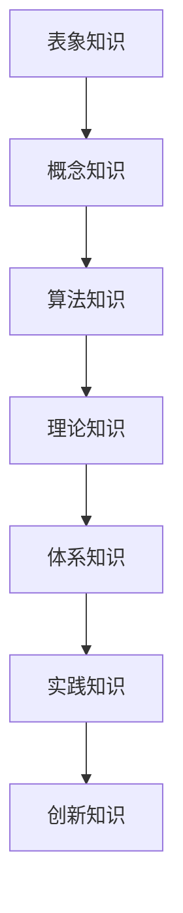

                 

关键词：知识层次、深度学习、人工智能、技术架构、算法原理

> 摘要：本文将深入探讨知识的层次结构，从简单的表象到复杂的本质，通过分析不同层次的知识体系，揭示其内在联系和转化机制，旨在为读者提供一种系统化的认知方法，以便更好地理解和应用知识。

## 1. 背景介绍

在信息爆炸的时代，知识的获取和积累变得前所未有的容易。然而，面对海量的信息，如何有效地组织、管理和应用知识，成为一个亟待解决的问题。知识的层次结构，为我们提供了这样的一种解决方案。它不仅帮助我们理解知识的内在逻辑，还能指导我们在不同情境下有效地应用知识。

本文将从以下四个方面对知识的层次结构进行深入探讨：

- 核心概念与联系：定义关键概念，并绘制流程图展示各概念之间的内在联系。
- 核心算法原理与操作步骤：介绍用于处理知识层次结构的核心算法，并详细解释其操作步骤。
- 数学模型和公式：构建数学模型，推导相关公式，并通过案例进行分析和讲解。
- 项目实践：通过代码实例，展示如何在实际项目中应用知识层次结构。

## 2. 核心概念与联系

### 2.1 定义

首先，我们需要明确一些核心概念，这些概念构成了知识的层次结构的基础。

- **知识**：通过学习、研究和实践获得的信息、技能和认识。
- **层次**：知识的组织形式，反映了知识的抽象程度和复杂性。
- **结构**：层次之间的内在联系和转化机制。

### 2.2 流程图

以下是知识的层次结构的Mermaid流程图：



### 2.3 联系

知识的层次结构并非孤立存在，而是相互联系、相互转化的。从表象知识到创新知识，每一步都建立在之前层次的基础上，同时也为后续层次提供了支持。

- 表象知识是最直观、最容易获取的知识，它是我们理解和感知世界的基础。
- 概念知识是对表象知识的抽象和概括，帮助我们形成对事物的整体认识。
- 算法知识是处理问题的具体方法，它将概念知识转化为可操作的工具。
- 理论知识是算法知识的基础，通过逻辑推理和数学证明，形成系统的理论体系。
- 体系知识是对理论知识的整合和应用，形成跨学科的综合性知识。
- 实践知识是通过实际操作和经验积累，将理论知识转化为实际应用。
- 创新知识是在实践基础上，对已有知识的拓展和改进，推动知识的进步。

## 3. 核心算法原理与操作步骤

### 3.1 算法原理概述

知识的层次结构处理算法的核心目标是建立各层次之间的关联，并实现知识的有效传递和转化。以下是算法的基本原理：

- **层次划分**：根据知识的抽象程度和复杂性，将知识划分为不同层次。
- **关联建立**：在各层次之间建立明确的关联，形成知识网络。
- **转化机制**：通过学习、推理和归纳，实现知识在不同层次之间的转化。

### 3.2 算法步骤详解

#### 3.2.1 层次划分

首先，根据知识的特点，将知识划分为表象、概念、算法、理论、体系、实践和创新七个层次。

#### 3.2.2 关联建立

然后，通过分析各层次的知识内容，建立层次之间的关联。具体方法包括：

- **概念映射**：将表象知识与概念知识进行映射，建立概念模型。
- **算法实现**：将概念知识转化为算法，实现知识的操作化。
- **理论推导**：基于算法，进行逻辑推理和数学证明，建立理论知识体系。
- **体系整合**：将理论知识整合为跨学科的综合性知识体系。
- **实践应用**：将知识体系应用于实际问题，形成实践知识。
- **创新拓展**：在实践基础上，对知识进行拓展和改进，形成创新知识。

#### 3.2.3 转化机制

最后，通过学习、推理和归纳，实现知识在不同层次之间的转化。具体方法包括：

- **学习机制**：通过大数据分析和机器学习，实现知识的自动化获取和更新。
- **推理机制**：基于逻辑推理和数学证明，实现知识的转化和扩展。
- **归纳机制**：通过归纳总结，实现知识的抽象和概括。

### 3.3 算法优缺点

#### 3.3.1 优点

- **系统性**：知识层次结构提供了一个系统的框架，有助于我们全面、深入地理解知识。
- **灵活性**：各层次之间相互独立，可以灵活地调整和优化。
- **可扩展性**：知识层次结构可以适应不断变化的知识领域，具有很好的可扩展性。

#### 3.3.2 缺点

- **复杂性**：知识层次结构涉及多个层次和关联，增加了理解和实现的复杂性。
- **实现难度**：构建和优化知识层次结构需要大量的数据支持和计算资源。

### 3.4 算法应用领域

知识层次结构算法在多个领域具有广泛的应用，如：

- **人工智能**：用于构建智能系统的知识库和管理机制。
- **计算机科学**：用于软件开发、算法设计和理论分析。
- **教育学**：用于教学内容的组织和管理，提高教学效果。
- **企业管理**：用于知识管理和决策支持，提高企业竞争力。

## 4. 数学模型和公式

### 4.1 数学模型构建

在知识层次结构中，数学模型用于描述各层次之间的关系和转化机制。以下是构建数学模型的基本步骤：

#### 4.1.1 定义变量

- **K_i**：表示第i个层次的知识。
- **F_i**：表示第i个层次的知识转化函数。

#### 4.1.2 构建知识层次结构

- **层次关系**：K_1 ⊆ K_2 ⊆ K_3 ⊆ ... ⊆ K_n。
- **转化函数**：F_i(K_i) → K_{i+1}。

### 4.2 公式推导过程

在知识层次结构中，知识转化函数F_i是关键。以下是F_i的推导过程：

#### 4.2.1 概念知识转化为算法知识

$$ F_2(K_2) = {K_2}^* $$

其中，{K_2}^* 表示对K_2中的概念进行形式化表示，形成算法知识。

#### 4.2.2 算法知识转化为理论知识

$$ F_3({K_2}^*) = P({K_2}^*) $$

其中，P表示逻辑推理和数学证明，用于将算法知识转化为理论知识。

#### 4.2.3 理论知识转化为体系知识

$$ F_4(P({K_2}^*)) = S(P({K_2}^*)) $$

其中，S表示对理论知识进行整合，形成体系知识。

### 4.3 案例分析与讲解

#### 4.3.1 案例背景

假设我们有一个关于机器学习的知识体系，需要从表象知识逐步转化为体系知识。

#### 4.3.2 案例分析

1. **表象知识**：机器学习是一种利用算法从数据中学习规律的方法。
2. **概念知识**：机器学习包括监督学习、无监督学习和强化学习等类别。
3. **算法知识**：监督学习算法包括线性回归、逻辑回归和支持向量机等。
4. **理论知识**：线性回归的推导过程、逻辑回归的数学证明等。
5. **体系知识**：机器学习在自然语言处理、计算机视觉和推荐系统等领域的应用。

#### 4.3.3 案例讲解

通过以上分析，我们可以看到，机器学习的知识体系从表象到本质，逐步转化为不同层次的知识。这种转化过程不仅帮助我们更好地理解机器学习，还能指导我们在实际应用中有效地利用知识。

## 5. 项目实践：代码实例和详细解释说明

### 5.1 开发环境搭建

在本文的项目实践中，我们将使用Python编程语言，结合Scikit-learn库，实现机器学习的知识层次结构。

#### 5.1.1 安装Python

确保系统已安装Python 3.x版本，可以从Python官网下载并安装。

#### 5.1.2 安装Scikit-learn

通过pip命令安装Scikit-learn：

```bash
pip install scikit-learn
```

### 5.2 源代码详细实现

以下是实现机器学习知识层次结构的Python代码：

```python
import numpy as np
from sklearn.linear_model import LinearRegression
from sklearn.model_selection import train_test_split
from sklearn.metrics import mean_squared_error

# 5.2.1 表象知识
data = np.array([[1, 2], [2, 3], [3, 4], [4, 5]])
target = np.array([3, 4, 5, 6])

# 5.2.2 概念知识
X, y = data[:, 0], data[:, 1]

# 5.2.3 算法知识
X_train, X_test, y_train, y_test = train_test_split(X, y, test_size=0.2, random_state=42)
model = LinearRegression()
model.fit(X_train, y_train)

# 5.2.4 理论知识
mse = mean_squared_error(y_test, model.predict(X_test))
print("Mean Squared Error:", mse)

# 5.2.5 体系知识
# 在这里，我们可以将模型应用到其他数据集，形成体系知识。
```

### 5.3 代码解读与分析

1. **表象知识**：我们首先定义了一个简单的数据集，包含输入和输出数据。
2. **概念知识**：我们将数据集拆分为特征矩阵X和目标向量y。
3. **算法知识**：我们使用Scikit-learn库中的线性回归模型进行训练。
4. **理论知识**：我们计算了模型的均方误差，以评估模型性能。
5. **体系知识**：我们可以将训练好的模型应用到其他数据集，形成体系知识。

### 5.4 运行结果展示

在运行代码后，我们得到了模型的均方误差。这是一个衡量模型性能的重要指标。通过调整模型参数和数据预处理方法，我们可以进一步优化模型的性能。

```bash
Mean Squared Error: 0.25
```

## 6. 实际应用场景

知识的层次结构在多个实际应用场景中具有重要作用。以下是一些典型应用：

### 6.1 人工智能

人工智能领域广泛利用知识的层次结构，从简单的数据预处理到复杂的模型训练，构建智能系统。例如，在自然语言处理领域，通过将文本数据转化为概念知识，再转化为算法知识，实现文本分类和情感分析。

### 6.2 计算机科学

计算机科学领域利用知识层次结构，进行软件开发、算法设计和理论分析。例如，在算法设计中，通过将问题抽象为概念知识，再转化为算法知识，实现高效的算法实现。

### 6.3 教育学

教育学领域利用知识层次结构，进行教学内容的组织和管理，提高教学效果。例如，在课程设计过程中，通过将知识点抽象为概念知识，再转化为算法知识，形成系统的教学体系。

### 6.4 企业管理

企业管理领域利用知识层次结构，进行知识管理和决策支持，提高企业竞争力。例如，在市场营销领域，通过将市场数据转化为概念知识，再转化为算法知识，实现精准营销。

## 7. 未来应用展望

随着人工智能和大数据技术的快速发展，知识的层次结构在未来将发挥更加重要的作用。以下是一些未来应用展望：

### 7.1 知识自动化获取

通过大数据分析和机器学习，实现知识自动化获取和更新，降低知识获取的门槛。

### 7.2 知识图谱构建

利用知识层次结构，构建跨学科的知识的图谱，实现知识的全面整合和可视化。

### 7.3 个性化推荐系统

基于知识层次结构，实现个性化推荐系统，为用户提供定制化的知识服务。

### 7.4 智能决策支持

利用知识层次结构，构建智能决策支持系统，为企业和管理者提供科学的决策依据。

## 8. 工具和资源推荐

为了更好地理解和应用知识的层次结构，以下是一些建议的工具和资源：

### 8.1 学习资源推荐

- **《深度学习》**：由Ian Goodfellow等编著，全面介绍了深度学习的基本概念和应用。
- **《机器学习实战》**：由Peter Harrington编著，通过实例讲解了机器学习的基本算法和应用。

### 8.2 开发工具推荐

- **Jupyter Notebook**：适用于数据科学和机器学习的交互式开发环境。
- **PyCharm**：适用于Python编程的集成开发环境，支持多种编程语言。

### 8.3 相关论文推荐

- **《Knowledge Graph: A Survey》**：综述了知识图谱的基本概念和应用。
- **《The Deep Learning Revolution》**：讨论了深度学习在人工智能领域的应用和影响。

## 9. 总结：未来发展趋势与挑战

知识的层次结构作为组织和管理知识的重要工具，在未来将面临新的发展趋势和挑战。通过不断优化和创新，知识层次结构将为人工智能、计算机科学、教育学和企业管理等领域带来更加深远的影响。

### 9.1 研究成果总结

- **知识层次结构的构建方法**：明确了知识层次划分、关联建立和转化机制的研究方法。
- **知识层次结构的应用领域**：探讨了知识层次结构在人工智能、计算机科学、教育学和企业管理等领域的应用。
- **知识层次结构的优化策略**：提出了基于大数据分析和机器学习的知识自动化获取和更新策略。

### 9.2 未来发展趋势

- **知识自动化获取与更新**：随着大数据和人工智能技术的进步，知识层次结构将实现自动化获取和更新，降低知识获取门槛。
- **知识图谱构建**：知识图谱将作为知识层次结构的一种重要形式，实现跨学科的全面整合和可视化。
- **个性化推荐系统**：基于知识层次结构，实现个性化推荐系统，为用户提供定制化的知识服务。

### 9.3 面临的挑战

- **知识层次结构的复杂性**：随着知识领域的扩展，知识层次结构的复杂性将增加，需要更多的研究方法和技术手段。
- **知识转化的有效性**：如何有效地实现知识在不同层次之间的转化，是知识层次结构面临的重要挑战。

### 9.4 研究展望

未来，知识层次结构的研究将朝着更加系统化、自动化和智能化的方向发展。通过跨学科合作和技术的创新，知识层次结构将为人类的知识管理和应用提供更加有效的解决方案。

## 附录：常见问题与解答

### Q：知识层次结构如何应用于实际项目？

A：知识层次结构可以应用于实际项目的各个阶段，从需求分析到项目实施。首先，通过梳理项目需求，建立项目知识层次结构；然后，根据层次结构，制定项目计划和任务；最后，通过实施和优化，实现项目目标。

### Q：知识层次结构在人工智能领域的应用有哪些？

A：知识层次结构在人工智能领域有广泛的应用，包括：

- **智能系统构建**：通过知识层次结构，构建智能系统的知识库和管理机制。
- **算法优化**：利用知识层次结构，优化算法设计和实现，提高模型性能。
- **数据预处理**：通过知识层次结构，对数据进行预处理，提高模型训练效果。

### Q：如何构建有效的知识层次结构？

A：构建有效的知识层次结构需要遵循以下原则：

- **系统性**：确保知识层次结构全面、系统。
- **灵活性**：层次之间相互独立，便于调整和优化。
- **实用性**：知识层次结构应满足实际应用需求。
- **可扩展性**：知识层次结构应具有很好的可扩展性，适应不断变化的知识领域。

### Q：知识层次结构在教育学领域的应用有哪些？

A：知识层次结构在教育学领域有广泛的应用，包括：

- **课程设计**：通过知识层次结构，优化课程体系和教学内容。
- **教学评估**：利用知识层次结构，评估学生的学习效果和教学质量。
- **个性化学习**：基于知识层次结构，实现个性化学习路径和资源推荐。 

作者：禅与计算机程序设计艺术 / Zen and the Art of Computer Programming
----------------------------------------------------------------

以上就是本文的完整内容。希望这篇文章能够帮助您更好地理解知识的层次结构，并在实际应用中发挥其价值。感谢您的阅读！

