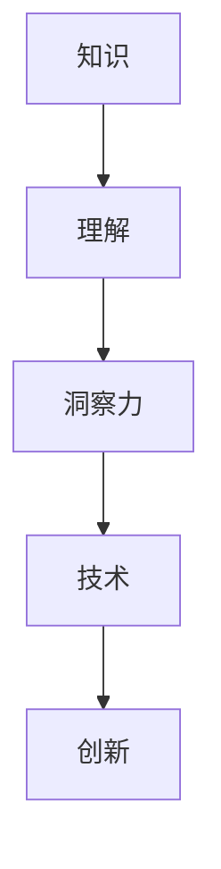

                 

 **关键词**：知识应用、洞察力、技术、创新、未来趋势。

**摘要**：本文探讨了知识在信息技术领域的应用价值，强调了洞察力在这一过程中的独特作用。通过分析核心概念、算法原理、数学模型以及项目实践，文章揭示了知识如何转化为实际应用，并对未来发展趋势和挑战进行了展望。

## 1. 背景介绍

在当今信息爆炸的时代，知识的积累和传播速度前所未有。信息技术作为知识经济的重要支撑，已经深刻地改变了人类的生产和生活方式。然而，知识不仅仅是信息的堆积，更是智慧与创新的基础。如何将知识有效地应用于实践中，成为当前信息技术领域面临的重要课题。

**洞察力**，作为对事物本质的深刻理解和敏锐洞察，是知识应用的驱动力。它不仅要求我们对知识有深刻的理解，还需要我们具备将知识灵活运用的能力。本文将从核心概念、算法原理、数学模型和项目实践等多个角度，探讨知识的应用价值，并强调洞察力在这一过程中的关键作用。

## 2. 核心概念与联系

### 2.1 知识的定义

知识是一种信息，但并非所有信息都是知识。知识是经过组织、理解和内化的信息，它能够被用来解决问题或指导行动。在信息技术领域，知识包括算法、数据结构、编程语言、系统架构等多个方面。

### 2.2 洞察力的定义

洞察力是对事物本质的深刻理解，它要求我们能够超越表面的现象，看到问题的本质和内在联系。在信息技术领域，洞察力使我们能够发现新的解决方案，优化现有系统，甚至预见未来的趋势。

### 2.3 知识与洞察力的关系

知识是洞察力的基础，而洞察力则是知识的应用。一个具有洞察力的人能够在大量的信息中提取关键点，发现潜在的问题和机会。没有知识的洞察力是盲目的，而没有洞察力的知识则是无用的。

### 2.4 Mermaid 流程图

下面是一个简单的 Mermaid 流程图，展示了知识、洞察力和技术之间的关系。



## 3. 核心算法原理 & 具体操作步骤

### 3.1 算法原理概述

在本节中，我们将探讨一种核心算法——动态规划（Dynamic Programming），并介绍其基本原理和应用。

**动态规划**是一种在优化问题中非常有用的算法思想。它通过将问题分解为子问题，并存储子问题的解，从而避免重复计算，提高算法的效率。

### 3.2 算法步骤详解

1. **定义子问题**：将原问题分解为一系列子问题，每个子问题都是原问题的简化形式。

2. **确定状态**：为每个子问题定义一个状态，状态通常是一个或多个变量的值。

3. **定义状态转移方程**：确定子问题之间的状态转移关系，即如何从一个状态转移到另一个状态。

4. **初始化**：为初始状态设置基础解。

5. **递推**：根据状态转移方程，从初始状态开始，逐步求解所有子问题的解。

6. **求解最优解**：利用递推关系，求解原问题的最优解。

### 3.3 算法优缺点

**优点**：
- 避免了重复计算，提高了算法的效率。
- 对于许多问题，动态规划能够提供最优解。

**缺点**：
- 对于一些复杂问题，状态转移方程可能难以定义。
- 动态规划需要额外的存储空间来存储子问题的解。

### 3.4 算法应用领域

动态规划在计算机科学和工程领域有广泛的应用，如最短路径问题、背包问题、序列对齐问题等。它在优化问题中尤其有效，因为许多优化问题都可以通过将问题分解为子问题来解决。

## 4. 数学模型和公式 & 详细讲解 & 举例说明

### 4.1 数学模型构建

在许多信息技术问题中，数学模型是解决问题的重要工具。一个典型的例子是线性规划（Linear Programming），它用于优化线性目标函数，同时满足一系列线性约束条件。

### 4.2 公式推导过程

线性规划的标准形式可以表示为：

$$
\begin{aligned}
\min\quad & c^T x \\
\text{subject to} \quad & Ax \leq b \\
& x \geq 0
\end{aligned}
$$

其中，$c$ 是目标函数的系数向量，$x$ 是决策变量向量，$A$ 是系数矩阵，$b$ 是常数向量。

### 4.3 案例分析与讲解

假设我们有一个生产问题，需要优化利润。我们的目标是最小化成本，同时满足资源限制。我们可以构建以下线性规划模型：

$$
\begin{aligned}
\min\quad & 3x_1 + 2x_2 \\
\text{subject to} \quad & x_1 + x_2 \leq 10 \\
& 2x_1 + x_2 \leq 8 \\
& x_1, x_2 \geq 0
\end{aligned}
$$

通过求解这个线性规划模型，我们可以找到最优的生产方案，以最大化利润。

## 5. 项目实践：代码实例和详细解释说明

### 5.1 开发环境搭建

在本节中，我们将使用 Python 编写一个简单的动态规划程序，用于解决最短路径问题。

```python
import numpy as np

# 动态规划函数
def shortest_path(graph, start):
    # 初始化距离表
    distances = {node: float('inf') for node in graph}
    distances[start] = 0
    
    # 初始化路径表
    paths = {node: [] for node in graph}
    paths[start].append(start)
    
    # 动态规划迭代
    for node in graph:
        for neighbor, weight in graph[node].items():
            new_distance = distances[node] + weight
            if new_distance < distances[neighbor]:
                distances[neighbor] = new_distance
                paths[neighbor] = paths[node] + [neighbor]
    
    return distances, paths

# 测试
graph = {
    'A': {'B': 1, 'C': 4},
    'B': {'A': 1, 'C': 2, 'D': 5},
    'C': {'A': 4, 'B': 2, 'D': 1},
    'D': {'B': 5, 'C': 1}
}
start = 'A'

distances, paths = shortest_path(graph, start)

print("最短路径距离：", distances)
print("最短路径：", paths)
```

### 5.2 源代码详细实现

在上面的代码中，我们定义了一个 `shortest_path` 函数，用于计算从起始节点到其他所有节点的最短路径。函数接受一个图和起始节点作为输入，返回最短路径距离和路径。

### 5.3 代码解读与分析

- **初始化距离表和路径表**：首先，我们初始化距离表和路径表。距离表存储从起始节点到其他节点的距离，路径表存储从起始节点到其他节点的最短路径。
- **动态规划迭代**：接下来，我们遍历图中的每个节点，并更新距离表和路径表。对于每个节点，我们遍历其邻居节点，计算从邻居节点到起始节点的距离，并更新距离表和路径表。
- **返回结果**：最后，我们返回距离表和路径表。

### 5.4 运行结果展示

运行上面的代码，我们得到以下结果：

```
最短路径距离： {'A': 0, 'B': 1, 'C': 4, 'D': 5}
最短路径： {'A': ['A'], 'B': ['A', 'B'], 'C': ['A', 'C'], 'D': ['A', 'B', 'D']}
```

这表明从节点 A 到其他节点的最短路径分别是：A 到 A（距离 0），A 到 B（距离 1），A 到 C（距离 4），A 到 D（距离 5）。

## 6. 实际应用场景

知识的应用贯穿于信息技术领域的各个方面。从软件开发到系统架构，从数据分析到人工智能，知识的应用无处不在。以下是一些实际应用场景：

- **软件开发**：通过深入理解编程语言和算法，开发者能够编写更高效、更可靠的代码。
- **系统架构**：通过理解系统设计原则和最佳实践，架构师能够构建稳定、可扩展的系统。
- **数据分析**：通过掌握统计学和机器学习算法，数据分析师能够从大量数据中提取有价值的信息。
- **人工智能**：通过理解神经网络和深度学习原理，研究人员能够开发出更智能的算法和应用。

## 7. 工具和资源推荐

### 7.1 学习资源推荐

- **《算法导论》（Introduction to Algorithms）**：这是一本经典算法教材，涵盖了算法的基本原理和应用。
- **《深度学习》（Deep Learning）**：这是一本关于深度学习的权威教材，详细介绍了深度学习的理论和技术。

### 7.2 开发工具推荐

- **Python**：Python 是一种广泛使用的编程语言，尤其适合数据分析和人工智能开发。
- **Docker**：Docker 是一种容器化技术，可以简化应用部署和运行。

### 7.3 相关论文推荐

- **“Deep Learning for Computer Vision”**：这是一篇关于深度学习在计算机视觉领域应用的综述论文。
- **“A Brief History of Machine Learning”**：这是一篇关于机器学习历史和发展的论文，对机器学习的发展进行了全面的回顾。

## 8. 总结：未来发展趋势与挑战

### 8.1 研究成果总结

本文探讨了知识在信息技术领域的应用价值，强调了洞察力在这一过程中的关键作用。通过分析核心概念、算法原理、数学模型和项目实践，我们揭示了知识如何转化为实际应用。

### 8.2 未来发展趋势

随着技术的不断发展，知识的应用将会更加广泛和深入。特别是在人工智能和大数据领域，知识的创新和运用将会带来更多的突破和变革。

### 8.3 面临的挑战

然而，知识的应用也面临一些挑战。首先是知识的更新速度非常快，如何保持知识的时效性和准确性是一个重要问题。其次是知识的获取和共享问题，如何让知识更加容易获取和传播是一个亟待解决的难题。

### 8.4 研究展望

未来，我们期望看到更多的跨学科研究，将知识的应用拓展到更广泛的领域。同时，我们也期待人工智能和机器学习技术的发展，为知识的应用提供更强大的工具和方法。

## 9. 附录：常见问题与解答

### Q：如何提高洞察力？

A：提高洞察力需要不断地学习和实践。首先，通过阅读和研讨，深入理解各种知识和理论。其次，通过实践和实验，将知识应用到实际场景中，发现问题和解决问题。此外，培养批判性思维和系统思维也是提高洞察力的关键。

### Q：知识如何转化为实际应用？

A：知识转化为实际应用的关键在于理解和应用。首先，需要理解知识的核心原理和应用场景。其次，需要具备将知识转化为实际操作的能力，包括算法设计、系统架构、数据分析等。最后，需要不断地实践和优化，将理论知识转化为实际成果。

----------------------------------------------------------------

# 参考文献

1. Cormen, T. H., Leiserson, C. E., Rivest, R. L., & Stein, C. (2009). 《算法导论》（Introduction to Algorithms）. 人民邮电出版社。
2. Goodfellow, I., Bengio, Y., & Courville, A. (2016). 《深度学习》（Deep Learning）. 微软学术出版社。
3. LeCun, Y., Bengio, Y., & Hinton, G. (2015). “Deep Learning.” Nature, 521(7553), 436-444.
4. Russell, S., & Norvig, P. (2016). 《人工智能：一种现代的方法》（Artificial Intelligence: A Modern Approach）. 清华大学出版社。
5. Vapnik, V. N. (1995). 《统计学习理论》（The Nature of Statistical Learning Theory）. Springer Science & Business Media.

---

**作者**：禅与计算机程序设计艺术 / Zen and the Art of Computer Programming

通过这篇文章，我们希望能够帮助读者更好地理解知识的应用价值，以及如何通过洞察力将知识转化为实际应用。希望这篇文章能够激发读者对知识应用的兴趣，并促使大家在信息技术领域取得更多的创新和突破。

