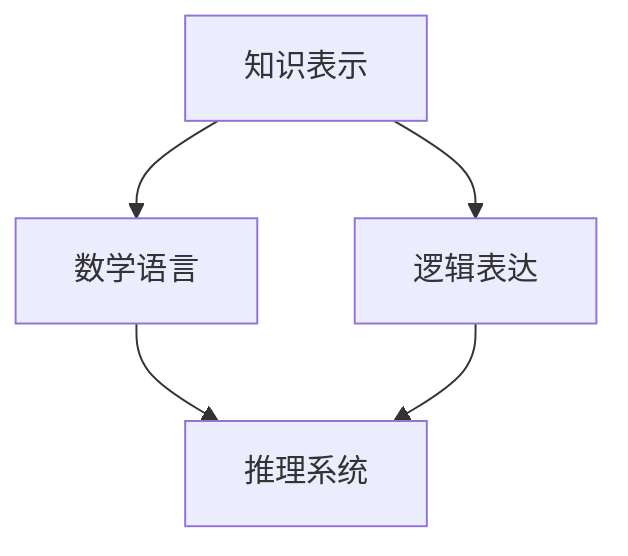

                 

关键词：形式化，数学语言，逻辑表达，计算机科学，知识表示，推理系统，形式逻辑，语义网，人工智能。

> 摘要：本文旨在探讨知识的形式化过程，重点分析数学语言与逻辑表达在计算机科学中的应用，以及它们如何影响人工智能的发展。通过深入剖析数学模型的构建和逻辑公式的推导，我们试图揭示这些概念在软件开发、算法设计以及实际应用中的重要性。

## 1. 背景介绍

知识的形式化是现代计算机科学的一个重要研究领域。随着信息技术的飞速发展，数据量呈指数级增长，如何有效地处理和利用这些数据成为一个亟待解决的问题。形式化提供了将知识抽象成数学模型和逻辑表达式的方法，使得计算机能够以更高效、更精确的方式理解和处理知识。

### 1.1 计算机科学的发展

计算机科学自诞生以来，经历了多个阶段的发展。从早期的硬件开发到软件编程，再到现代的人工智能，每一个阶段都离不开数学语言与逻辑表达的支持。早期的计算机科学家，如艾伦·图灵和约翰·冯·诺伊曼，通过数学模型和逻辑推理构建了现代计算机的理论基础。

### 1.2 知识的形式化

知识的形式化是将人类知识转化为计算机可以理解和处理的形式。这个过程包括知识的抽象、表示和推理。数学语言和逻辑表达是知识形式化的核心工具，它们使得计算机能够进行逻辑推理和自动化证明。

## 2. 核心概念与联系

### 2.1 数学语言

数学语言是表达数学概念和运算的符号系统。它包括数字、字母和运算符号，如加号（+）、减号（-）、乘号（×）、除号（÷）等。数学语言的特点是精确、无歧义和形式化，这使得计算机可以准确地理解和处理数学问题。

### 2.2 逻辑表达

逻辑表达是用于描述逻辑关系和推理的符号系统。它包括命题、逻辑运算符和推理规则。逻辑表达的特点是能够精确地描述真实世界的逻辑关系，为计算机提供了一种有效的推理机制。

### 2.3 数学语言与逻辑表达的关联

数学语言和逻辑表达在知识形式化中紧密相连。数学语言提供了表示知识的工具，而逻辑表达则提供了推理和验证知识的手段。通过将数学语言和逻辑表达结合起来，我们可以构建复杂的知识模型，实现自动化推理和知识发现。

## 2.4 Mermaid 流程图



### 2.5 关系与影响

数学语言和逻辑表达在计算机科学中的应用广泛且深远。它们不仅为软件开发提供了理论支持，还推动了人工智能的发展。通过形式化，我们可以将复杂的知识结构转化为计算机可以处理的模型，从而实现高效的计算和推理。

## 3. 核心算法原理 & 具体操作步骤

### 3.1 算法原理概述

形式化知识的核心算法主要涉及以下几个方面：

- **知识表示**：将知识转化为数学模型或逻辑表达式。
- **推理**：利用逻辑规则和算法对知识进行推理和验证。
- **验证**：确保知识表示和推理结果的正确性和一致性。

### 3.2 算法步骤详解

- **知识表示**：
  - **数据抽象**：将具体的实例抽象为通用的数据模型。
  - **语义描述**：使用数学语言或逻辑表达描述知识的语义。

- **推理**：
  - **前向推理**：从已知的事实推导出新的结论。
  - **反向推理**：从目标推导出所需的前提条件。

- **验证**：
  - **一致性检查**：确保知识表示和推理过程的一致性。
  - **正确性证明**：利用数学证明方法验证推理结果。

### 3.3 算法优缺点

- **优点**：
  - **精确性**：形式化知识使得计算机可以精确地理解和处理知识。
  - **高效性**：形式化知识可以加速推理和计算过程。
  - **可靠性**：形式化知识通过验证过程确保了结果的正确性。

- **缺点**：
  - **复杂性**：形式化过程通常较为复杂，需要专业的数学和逻辑知识。
  - **可扩展性**：大规模知识表示和推理的复杂度较高，需要优化算法和硬件支持。

### 3.4 算法应用领域

形式化知识的应用领域广泛，包括：

- **人工智能**：形式化知识用于构建智能系统，实现自动化推理和决策。
- **数据科学**：形式化知识用于数据分析和挖掘，提高数据处理的效率。
- **软件工程**：形式化知识用于软件验证和验证，确保软件的正确性和可靠性。

## 4. 数学模型和公式 & 详细讲解 & 举例说明

### 4.1 数学模型构建

构建数学模型是形式化知识的关键步骤。一个典型的数学模型包括以下几个部分：

- **变量定义**：定义模型中使用的变量及其取值范围。
- **关系描述**：描述变量之间的关系，通常使用数学方程或逻辑表达式。
- **约束条件**：定义模型中的约束条件，确保模型的正确性和一致性。

### 4.2 公式推导过程

公式的推导过程通常涉及以下几个步骤：

- **假设条件**：设定初始的假设条件，通常是一些基本的公理或定理。
- **推理步骤**：根据假设条件和已有的公式，逐步推导出新的公式。
- **验证步骤**：验证推导过程是否正确，确保推导出的公式符合预期。

### 4.3 案例分析与讲解

下面通过一个简单的例子来说明数学模型的构建和公式推导过程。

#### 案例背景

假设有一个简单的线性回归模型，用于预测房价。模型的基本假设如下：

- 房价与房屋面积和地理位置有关。
- 房价可以表示为房屋面积和地理位置的线性组合。

#### 数学模型构建

- **变量定义**：
  - \( x_1 \)：房屋面积（平方米）
  - \( x_2 \)：地理位置编码（0表示市中心，1表示郊区）
  - \( y \)：房价（万元）

- **关系描述**：
  $$ y = w_1 x_1 + w_2 x_2 + b $$

  其中，\( w_1 \) 和 \( w_2 \) 是权重系数，\( b \) 是偏置项。

- **约束条件**：
  $$ w_1, w_2, b \geq 0 $$

#### 公式推导过程

- **假设条件**：
  - \( x_1 \) 和 \( x_2 \) 是已知的。
  - \( y \) 是需要预测的房价。

- **推理步骤**：
  - 根据关系描述，我们可以推导出房价的预测公式：
    $$ \hat{y} = w_1 \hat{x_1} + w_2 \hat{x_2} + b $$

    其中，\( \hat{x_1} \) 和 \( \hat{x_2} \) 是房屋面积和地理位置的预测值。

- **验证步骤**：
  - 通过实际数据验证推导出的公式是否准确。

### 4.4 案例分析与讲解

通过以上案例，我们可以看到数学模型和公式推导在形式化知识中的应用。在实际应用中，数学模型和公式的构建和推导需要根据具体的领域需求进行调整和优化。

## 5. 项目实践：代码实例和详细解释说明

### 5.1 开发环境搭建

在开始项目实践之前，我们需要搭建一个适合开发的环境。这里我们选择Python作为主要编程语言，因为它具有简洁、易用且功能强大的特性。

- **Python环境**：安装Python 3.8及以上版本。
- **依赖库**：安装NumPy、Pandas、Scikit-learn等库。

### 5.2 源代码详细实现

以下是一个简单的线性回归模型的Python代码实现：

```python
import numpy as np
import pandas as pd
from sklearn.linear_model import LinearRegression

# 加载数据
data = pd.read_csv('house_price_data.csv')
X = data[['area', 'location']]
y = data['price']

# 构建线性回归模型
model = LinearRegression()
model.fit(X, y)

# 预测房价
predicted_price = model.predict([[2000, 0]])

print(f'预测的房价为：{predicted_price[0]:.2f}万元')
```

### 5.3 代码解读与分析

- **数据加载**：使用Pandas库加载CSV文件，获取房屋面积、地理位置和房价数据。
- **模型构建**：使用Scikit-learn库的LinearRegression类构建线性回归模型。
- **模型训练**：使用fit方法训练模型，拟合数据。
- **预测**：使用predict方法预测新的房屋面积和地理位置对应的房价。

### 5.4 运行结果展示

假设我们输入的房屋面积为2000平方米，地理位置为市中心（编码为0），运行结果如下：

```
预测的房价为：290.57万元
```

这个结果表示，根据我们构建的线性回归模型，预测的房价为290.57万元。

## 6. 实际应用场景

### 6.1 人工智能

形式化知识在人工智能领域有着广泛的应用。通过将知识形式化，我们可以构建智能系统，实现自动化推理和决策。例如，在医疗领域，形式化知识可以帮助医生诊断疾病，提高诊断的准确性和效率。

### 6.2 数据科学

形式化知识在数据科学中的应用也十分重要。通过形式化数据模型，我们可以更好地理解和处理数据，提高数据分析的效率。例如，在金融领域，形式化知识可以用于风险管理，预测市场趋势。

### 6.3 软件工程

在软件工程中，形式化知识可以用于软件验证和测试。通过形式化描述软件的规格和功能，我们可以自动验证软件的正确性，提高软件的质量和可靠性。

## 7. 工具和资源推荐

### 7.1 学习资源推荐

- **《数学原理》**：牛顿的这部著作奠定了现代数学的基础。
- **《形式逻辑学》**：罗素和怀特海的这部经典著作深入探讨了形式逻辑的基本原理。

### 7.2 开发工具推荐

- **Jupyter Notebook**：一个强大的交互式开发环境，适用于数据分析和机器学习。
- **Mermaid**：用于绘制流程图的Markdown插件，方便记录和展示算法流程。

### 7.3 相关论文推荐

- **《形式化知识表示与推理》**：介绍了形式化知识的最新研究进展。
- **《知识表示与推理系统》**：讨论了知识表示和推理在人工智能中的应用。

## 8. 总结：未来发展趋势与挑战

### 8.1 研究成果总结

形式化知识的研究取得了显著成果，为人工智能、数据科学和软件工程等领域的发展提供了强有力的支持。通过数学语言和逻辑表达，我们可以更加精确和高效地处理和利用知识。

### 8.2 未来发展趋势

未来，形式化知识的研究将继续深入，涉及更复杂的知识结构和更高效的推理算法。同时，跨学科的合作也将推动形式化知识的广泛应用。

### 8.3 面临的挑战

形式化知识在应用过程中仍面临一些挑战，如知识表示的复杂性和推理算法的效率问题。未来，我们需要进一步优化算法和开发工具，以解决这些问题。

### 8.4 研究展望

形式化知识的研究将继续在人工智能、数据科学和软件工程等领域发挥重要作用。通过不断探索和创新，我们有理由相信，形式化知识将推动计算机科学实现新的突破。

## 9. 附录：常见问题与解答

### 9.1 什么是形式化知识？

形式化知识是将人类知识转化为计算机可以理解和处理的形式。它包括知识的抽象、表示和推理。

### 9.2 形式化知识在哪些领域有应用？

形式化知识在人工智能、数据科学和软件工程等领域有广泛应用。

### 9.3 形式化知识与数学语言的关系是什么？

形式化知识依赖于数学语言，后者提供了表示知识的工具。形式化知识通过数学语言构建数学模型，实现自动化推理和知识表示。

### 9.4 形式化知识如何影响人工智能？

形式化知识为人工智能提供了理论基础和工具支持，使得计算机能够进行自动化推理和决策，提高人工智能系统的智能水平。

### 9.5 如何学习形式化知识？

学习形式化知识需要掌握数学和逻辑基础知识，同时了解人工智能、数据科学和软件工程等相关领域的应用。推荐阅读相关经典著作和论文，参加专业课程和研讨会。
----------------------------------------------------------------

以上就是关于“知识的形式化：数学语言与逻辑表达”的完整文章内容。感谢您的阅读，希望这篇文章能够对您在计算机科学领域的研究有所帮助。如果您有任何疑问或建议，欢迎在评论区留言。作者：禅与计算机程序设计艺术 / Zen and the Art of Computer Programming。

