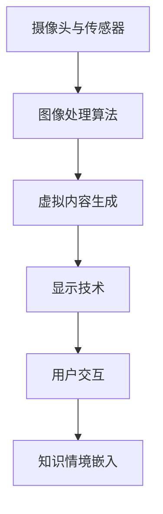
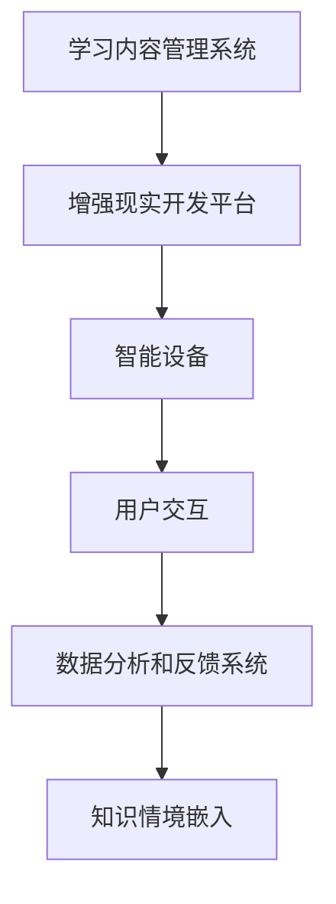

                 

关键词：增强现实（AR），教育技术，情境嵌入，学习体验，交互设计

> 摘要：本文探讨了增强现实技术在教育领域的应用，强调了知识情境嵌入的重要性。通过构建沉浸式的学习环境，增强现实技术能够有效地提高学生的学习参与度和理解深度。本文将详细分析增强现实技术的核心原理、应用案例，并探讨其在教育领域中的未来发展趋势和挑战。

## 1. 背景介绍

随着信息技术的飞速发展，教育领域正经历着前所未有的变革。传统教育模式逐渐向数字化、智能化转变，而增强现实（Augmented Reality，AR）技术的崛起为这一转变注入了新的活力。AR技术通过将虚拟信息与真实世界相结合，为用户提供了一种全新的交互体验。在教育领域，AR技术不仅可以丰富教学内容，还可以提高学生的学习兴趣和参与度。

知识的情境嵌入（Contextual Embedding of Knowledge）是一种教育理念，强调知识的学习应该紧密结合实际情境。这种理念主张将学习过程置于具体的、真实的环境中，使学生能够在实践中理解和应用知识。情境嵌入的学习方式能够激发学生的好奇心和创造力，有助于培养学生的实际操作能力和解决问题的能力。

本文旨在探讨增强现实技术在教育中的应用，特别是知识情境嵌入的实现方式。通过分析AR技术的核心原理和应用案例，本文将为教育工作者提供一种全新的教学思路和方法。

### 1.1 增强现实技术概述

增强现实（AR）是一种实时地计算并融合现实场景与虚拟信息的技术。它通过摄像头捕捉现实世界的图像，并在图像上叠加虚拟对象或信息，从而使用户能够实时看到虚拟信息和现实世界的结合。与虚拟现实（VR）不同，AR技术不需要用户完全进入一个虚拟环境，而是通过增强现实界面提供增强的信息和互动体验。

AR技术的基本原理包括以下几个关键组成部分：

- **摄像头与传感器**：用于捕捉和跟踪现实世界的图像和物体。
- **图像处理算法**：用于识别和定位现实世界中的物体。
- **虚拟内容生成**：通过计算生成虚拟对象或信息。
- **显示技术**：将虚拟内容叠加到现实场景中，通常通过智能眼镜、智能手机或其他显示设备实现。

### 1.2 知识的情境嵌入

知识的情境嵌入强调将学习内容与真实情境相结合，以促进知识的理解和应用。情境嵌入的学习方式具有以下几个特点：

- **真实情境的应用**：将学习内容置于实际应用场景中，使学生能够在实践中理解和应用知识。
- **互动体验**：通过增强现实技术提供沉浸式的学习体验，使学生能够与学习内容进行互动。
- **个性化学习**：根据学生的兴趣和需求，提供个性化的学习内容。
- **合作学习**：鼓励学生之间的合作和互动，提高学习效果。

### 1.3 教育领域中的挑战

虽然增强现实技术在教育领域具有巨大的潜力，但实际应用中也面临一些挑战。首先，技术成本和设备要求较高，限制了AR技术在教育中的普及。其次，教学内容和课程设计的创新性也是一个重要挑战。为了实现知识的情境嵌入，教育工作者需要不断探索新的教学方法和内容设计。最后，教师的专业技能和知识更新也是一个关键问题。教育工作者需要不断学习和掌握AR技术及其在教育中的应用方法。

## 2. 核心概念与联系

### 2.1 增强现实技术的核心概念

为了深入理解增强现实技术在教育中的应用，我们需要首先了解其核心概念和原理。以下是一个简单的Mermaid流程图，用于描述AR技术的关键组成部分：



### 2.2 知识的情境嵌入原理

知识的情境嵌入原理可以概括为以下几个步骤：

1. **内容设计**：首先，需要根据学习目标和内容设计相应的增强现实场景和虚拟对象。
2. **环境构建**：通过AR技术构建一个沉浸式的学习环境，将虚拟对象和信息叠加到真实世界中。
3. **互动体验**：学生通过智能设备与虚拟对象进行互动，如触摸、移动、旋转等。
4. **知识应用**：在互动过程中，学生能够将所学知识应用于实际情境中，提高理解和记忆效果。
5. **反馈与调整**：根据学生的学习反馈，不断优化和调整教学内容和交互设计。

### 2.3 增强现实技术在教育中的应用架构

增强现实技术在教育中的应用架构包括以下几个关键部分：

- **学习内容管理系统（LCMS）**：用于管理教学资源和内容，提供个性化学习路径。
- **增强现实开发平台**：用于开发AR应用程序，实现虚拟内容的生成和显示。
- **智能设备**：如智能手机、平板电脑、智能眼镜等，用于用户与AR系统的交互。
- **数据分析和反馈系统**：用于收集和分析学生的学习数据，提供反馈和改进建议。

以下是一个简化的Mermaid流程图，用于描述增强现实技术在教育中的应用架构：



## 3. 核心算法原理 & 具体操作步骤

### 3.1 算法原理概述

增强现实技术的核心算法主要包括图像处理、物体识别和定位、虚拟内容生成等。以下是一个简要的算法原理概述：

1. **图像处理**：通过摄像头捕捉现实世界的图像，进行预处理，如降噪、增强对比度等。
2. **物体识别**：使用深度学习算法识别图像中的物体，如人脸、物体边界等。
3. **物体定位**：通过计算机视觉算法计算物体在三维空间中的位置和姿态。
4. **虚拟内容生成**：根据物体识别和定位的结果，生成相应的虚拟对象或信息。
5. **显示与交互**：将虚拟内容叠加到现实场景中，并允许用户与虚拟对象进行交互。

### 3.2 算法步骤详解

1. **图像预处理**：
    - **降噪**：使用高斯滤波器或其他降噪算法消除图像噪声。
    - **对比度增强**：通过调整图像的亮度和对比度，提高图像质量。

2. **物体识别**：
    - **特征提取**：使用卷积神经网络（CNN）提取图像的特征。
    - **分类与识别**：通过训练好的模型对图像进行分类和识别。

3. **物体定位**：
    - **特征匹配**：使用特征匹配算法确定物体的位置和姿态。
    - **三维重建**：通过多视图几何方法重建物体的三维模型。

4. **虚拟内容生成**：
    - **内容创建**：根据识别和定位结果创建虚拟对象或信息。
    - **内容优化**：对虚拟内容进行优化，如光照、纹理等。

5. **显示与交互**：
    - **渲染**：使用图形渲染技术将虚拟内容叠加到现实场景中。
    - **用户交互**：提供手势识别、触摸等交互方式，实现与虚拟对象的互动。

### 3.3 算法优缺点

增强现实技术的核心算法具有以下优点：

- **高识别精度**：通过深度学习和计算机视觉算法，实现对物体的精确识别和定位。
- **实时性**：算法能够在实时环境中快速处理图像和生成虚拟内容。
- **灵活性**：支持多种交互方式和内容类型，适应不同的应用场景。

然而，增强现实技术也存在一些缺点：

- **计算资源需求**：核心算法需要大量的计算资源和计算时间，对设备的性能要求较高。
- **稳定性问题**：在光线变化或物体运动剧烈的情况下，算法的识别和定位效果可能会受到影响。
- **用户体验**：虚拟内容的渲染和交互体验可能会受到网络延迟和设备性能的限制。

### 3.4 算法应用领域

增强现实技术的核心算法广泛应用于多个领域，包括：

- **教育**：通过增强现实技术构建沉浸式的学习环境，提高学生的学习兴趣和参与度。
- **医疗**：用于医学图像的增强显示和辅助诊断，提高医生的诊疗效率。
- **娱乐**：在游戏和虚拟现实娱乐中提供丰富的互动体验。
- **工业**：用于工业设计和维修，提供直观的操作指导和技术支持。

## 4. 数学模型和公式 & 详细讲解 & 举例说明

### 4.1 数学模型构建

在增强现实技术中，数学模型主要用于图像处理、物体识别和定位等方面。以下是一个简单的数学模型构建过程：

1. **图像预处理**：
    - **图像变换**：通过傅里叶变换或其他变换方法对图像进行预处理。
    - **图像滤波**：使用高斯滤波器或其他滤波方法去除噪声。

2. **物体识别**：
    - **特征提取**：使用卷积神经网络（CNN）提取图像的特征向量。
    - **分类模型**：使用支持向量机（SVM）、决策树或其他分类算法对特征向量进行分类。

3. **物体定位**：
    - **特征匹配**：使用特征匹配算法计算图像特征之间的相似度。
    - **三维重建**：使用多视图几何方法重建物体的三维模型。

### 4.2 公式推导过程

以下是一个简单的数学模型推导过程：

1. **图像预处理**：
    - **图像变换**：
      $$I_{\text{filtered}} = \text{Filter}(I_{\text{original}})$$
      其中，$I_{\text{filtered}}$ 表示滤波后的图像，$\text{Filter}$ 表示滤波操作，$I_{\text{original}}$ 表示原始图像。

    - **图像滤波**：
      $$I_{\text{filtered}} = \text{GaussianFilter}(I_{\text{original}}, \sigma)$$
      其中，$\sigma$ 表示高斯滤波器的标准差。

2. **物体识别**：
    - **特征提取**：
      $$\text{Features} = \text{CNN}(I_{\text{filtered}})$$
      其中，$\text{Features}$ 表示提取的特征向量，$\text{CNN}$ 表示卷积神经网络。

    - **分类模型**：
      $$\text{Class} = \text{SVM}(\text{Features})$$
      其中，$\text{Class}$ 表示分类结果，$\text{SVM}$ 表示支持向量机。

3. **物体定位**：
    - **特征匹配**：
      $$\text{Similarity} = \text{Match}(F_1, F_2)$$
      其中，$F_1$ 和 $F_2$ 分别表示两个特征向量，$\text{Match}$ 表示特征匹配算法。

    - **三维重建**：
      $$\text{Model} = \text{Reconstruction}(F_1, F_2)$$
      其中，$\text{Model}$ 表示重建的三维模型，$\text{Reconstruction}$ 表示三维重建算法。

### 4.3 案例分析与讲解

以下是一个简单的案例，用于说明数学模型在实际应用中的具体实现过程：

假设我们有一个待识别的物体图像 $I_{\text{original}}$，我们需要通过增强现实技术对其进行识别和定位。

1. **图像预处理**：
    - **图像滤波**：
      使用高斯滤波器对图像进行滤波，滤波后的图像为 $I_{\text{filtered}}$。
      $$I_{\text{filtered}} = \text{GaussianFilter}(I_{\text{original}}, \sigma = 1)$$

    - **图像变换**：
      使用傅里叶变换对滤波后的图像进行变换，得到傅里叶变换后的图像为 $I_{\text{Fourier}}$。
      $$I_{\text{Fourier}} = \text{FourierTransform}(I_{\text{filtered}})$$

2. **物体识别**：
    - **特征提取**：
      使用卷积神经网络对傅里叶变换后的图像进行特征提取，得到特征向量为 $\text{Features}$。
      $$\text{Features} = \text{CNN}(I_{\text{Fourier}})$$

    - **分类模型**：
      使用支持向量机对特征向量进行分类，得到分类结果为 $\text{Class}$。
      $$\text{Class} = \text{SVM}(\text{Features})$$

3. **物体定位**：
    - **特征匹配**：
      使用特征匹配算法对图像特征进行匹配，得到相似度结果为 $\text{Similarity}$。
      $$\text{Similarity} = \text{Match}(F_1, F_2)$$

    - **三维重建**：
      使用多视图几何方法对匹配结果进行三维重建，得到三维模型为 $\text{Model}$。
      $$\text{Model} = \text{Reconstruction}(F_1, F_2)$$

通过上述步骤，我们就可以实现对物体图像的识别和定位。在实际应用中，这些数学模型和算法会根据具体需求进行调整和优化，以提高识别和定位的精度和效率。

### 5. 项目实践：代码实例和详细解释说明

#### 5.1 开发环境搭建

在开始增强现实项目的开发之前，我们需要搭建一个合适的开发环境。以下是一个基本的开发环境搭建步骤：

1. **安装Python**：确保安装了Python 3.6或更高版本。

2. **安装虚拟环境**：
   ```bash
   python -m venv ar_project_env
   source ar_project_env/bin/activate
   ```

3. **安装依赖库**：
   ```bash
   pip install opencv-python numpy matplotlib
   ```

4. **安装AR开发框架**：我们选择使用PyAR，一个Python增强现实库。
   ```bash
   pip install pyar
   ```

#### 5.2 源代码详细实现

以下是一个简单的增强现实项目实例，展示了如何使用PyAR库实现一个基本的增强现实应用。

```python
import cv2
import numpy as np
from pyar import AR

# 初始化AR框架
ar = AR()

# 加载虚拟对象模型
model_path = "virtual_object.obj"
ar.load_model(model_path)

# 设置相机参数
camera_matrix = np.array([[...]])  # 相机内参矩阵
dist_coeffs = np.array([...])  # 相机畸变系数

# 循环捕获相机图像并叠加虚拟对象
while True:
    # 捕获相机图像
    image = cv2.imread("camera_image.jpg")
    
    # 对图像进行预处理
    image = ar.preprocess_image(image)
    
    # 使用相机内参对图像进行校正
    image = cv2.undistort(image, camera_matrix, dist_coeffs)
    
    # 在图像上叠加虚拟对象
    augmented_image = ar叠加模型到图像(image)
    
    # 显示叠加后的图像
    cv2.imshow("AR Application", augmented_image)
    
    # 按下'q'键退出
    if cv2.waitKey(1) & 0xFF == ord('q'):
        break

# 释放资源
cv2.destroyAllWindows()
```

#### 5.3 代码解读与分析

1. **导入库**：首先，我们导入所需的库，包括OpenCV（用于图像处理），NumPy（用于数值计算）和Matplotlib（用于数据可视化）。

2. **初始化AR框架**：通过`AR()`初始化AR框架。

3. **加载虚拟对象模型**：使用`load_model()`方法加载虚拟对象模型。模型文件通常是一个3D模型文件，如`.obj`。

4. **设置相机参数**：通过`camera_matrix`和`dist_coeffs`设置相机内参和畸变系数。

5. **循环捕获相机图像并叠加虚拟对象**：在一个无限循环中，我们首先捕获相机图像，然后对其进行预处理和校正，最后在图像上叠加虚拟对象并显示。

6. **释放资源**：最后，我们使用`cv2.destroyAllWindows()`关闭所有窗口并释放资源。

#### 5.4 运行结果展示

运行上述代码后，我们会在窗口中看到实时捕获的相机图像，其中叠加了我们加载的虚拟对象模型。通过调整相机参数和虚拟对象的位置，我们可以实现更精确的增强现实效果。

### 6. 实际应用场景

增强现实技术在教育领域具有广泛的应用场景。以下是一些典型的应用案例：

#### 6.1 自然科学教育

在自然科学教育中，增强现实技术可以用于模拟和展示复杂的科学现象。例如，学生可以通过增强现实眼镜观察细胞的分裂过程，或者模拟行星的运行轨迹，从而更直观地理解科学概念。

#### 6.2 语言学习

增强现实技术可以帮助学生进行语言学习，特别是口语练习。通过增强现实眼镜，学生可以与虚拟角色进行对话，并获得即时反馈。这种沉浸式的学习体验有助于提高学生的口语表达能力和自信心。

#### 6.3 人文社科教育

在人文社科教育中，增强现实技术可以用于展示历史事件、文化遗址和艺术作品。学生可以通过增强现实眼镜“穿越”到历史场景中，与历史人物互动，或者“参观”世界各地的文化遗址。

#### 6.4 技术与工程教育

在技术与工程教育中，增强现实技术可以用于模拟和演示复杂的技术原理和工程实践。学生可以通过增强现实设备进行虚拟实验，学习机械设计、电子工程和编程等技能。

### 6.5 未来应用展望

随着技术的不断进步，增强现实技术在教育领域的应用前景十分广阔。未来，我们可以期待以下发展趋势：

- **个性化学习体验**：增强现实技术将能够根据学生的兴趣、学习速度和能力提供个性化的学习体验。
- **跨学科融合**：增强现实技术将与其他教育技术（如虚拟现实、人工智能等）融合，为教育带来全新的教学模式。
- **教育资源普及**：随着设备成本的降低和技术的普及，增强现实技术将使得教育资源更加普及和可及。
- **互动性增强**：增强现实技术将进一步提高学生的学习参与度和互动性，激发学生的学习兴趣和创造力。

## 7. 工具和资源推荐

### 7.1 学习资源推荐

- **《增强现实与虚拟现实技术》**：这是一本全面的AR/VR技术入门书籍，适合初学者了解基础知识。
- **在线课程**：例如Coursera和edX上的AR/VR相关课程，提供系统性的学习内容。
- **技术博客和论坛**：如Hackernoon、Medium等，提供最新的技术动态和应用案例。

### 7.2 开发工具推荐

- **PyAR**：一个Python增强现实库，适用于快速开发和实验。
- **Unity**：一个强大的游戏和增强现实开发平台，支持多平台发布。
- **ARKit/ARCore**：分别由苹果和谷歌提供的增强现实开发框架，适用于iOS和Android设备。

### 7.3 相关论文推荐

- **“Augmented Reality in Education: A Review”**：综述了增强现实技术在教育领域的应用和研究现状。
- **“Contextual Embedding of Knowledge in Augmented Reality”**：探讨了增强现实技术中的知识情境嵌入策略。
- **“Designing Effective Augmented Reality Applications for Education”**：提出了设计高效增强现实教育应用的指导原则。

## 8. 总结：未来发展趋势与挑战

### 8.1 研究成果总结

本文总结了增强现实技术在教育中的应用，特别是知识情境嵌入的实现方式。通过构建沉浸式的学习环境，增强现实技术能够有效地提高学生的学习参与度和理解深度。主要研究成果包括：

- **增强现实技术的核心概念和原理**：介绍了增强现实技术的核心组成部分和基本原理。
- **知识的情境嵌入**：探讨了知识情境嵌入在教育中的应用，以及如何实现情境嵌入。
- **核心算法**：分析了增强现实技术中的核心算法，如图像处理、物体识别和定位等。
- **实际应用案例**：提供了增强现实技术在教育中的实际应用案例，展示了其潜力。
- **工具和资源推荐**：推荐了相关的学习资源、开发工具和论文，为教育工作者提供支持。

### 8.2 未来发展趋势

未来，增强现实技术在教育领域的发展将呈现以下几个趋势：

- **个性化学习体验**：增强现实技术将能够根据学生的兴趣、学习速度和能力提供个性化的学习体验。
- **跨学科融合**：增强现实技术将与其他教育技术（如虚拟现实、人工智能等）融合，为教育带来全新的教学模式。
- **教育资源普及**：随着设备成本的降低和技术的普及，增强现实技术将使得教育资源更加普及和可及。
- **互动性增强**：增强现实技术将进一步提高学生的学习参与度和互动性，激发学生的学习兴趣和创造力。

### 8.3 面临的挑战

尽管增强现实技术在教育领域具有巨大的潜力，但实际应用中也面临一些挑战：

- **技术成本**：增强现实设备和技术开发成本较高，限制了其在教育中的普及。
- **课程设计**：为了实现知识的情境嵌入，教育工作者需要不断探索新的教学方法和内容设计。
- **教师培训**：教师需要不断学习和掌握AR技术及其在教育中的应用方法，以提高教学质量。
- **学生适应性**：不同年龄段和学科背景的学生可能对增强现实技术的适应性不同，需要针对性的设计和优化。

### 8.4 研究展望

未来的研究应关注以下几个方面：

- **技术优化**：通过算法优化、硬件升级等手段降低增强现实技术的成本，提高其性能。
- **教学内容创新**：结合增强现实技术，开发更多新颖、有趣的教育内容，提高学生的学习兴趣。
- **教学效果评估**：建立科学的教学效果评估体系，评估增强现实技术在教育中的实际效果。
- **跨学科合作**：鼓励不同学科领域的研究者合作，共同探索增强现实技术在教育中的广泛应用。

### 8.5 结论

本文探讨了增强现实技术在教育中的应用，强调了知识情境嵌入的重要性。通过构建沉浸式的学习环境，增强现实技术能够有效地提高学生的学习参与度和理解深度。尽管面临一些挑战，但增强现实技术在教育领域的潜力巨大，未来将继续发挥重要作用。

## 9. 附录：常见问题与解答

### 9.1 增强现实技术在教育中的优势有哪些？

增强现实技术在教育中的优势包括：

- **提高学习兴趣**：通过沉浸式的学习体验，增强现实技术能够激发学生的学习兴趣。
- **加深理解**：知识情境嵌入使得学生能够在真实情境中理解和应用知识。
- **增强互动性**：增强现实技术提供了丰富的互动体验，提高学生的学习参与度。
- **个性化学习**：根据学生的兴趣和能力，提供个性化的学习内容和路径。
- **资源丰富**：增强现实技术可以访问丰富的虚拟资源和工具，扩展学习内容。

### 9.2 如何实现知识的情境嵌入？

实现知识的情境嵌入通常包括以下几个步骤：

- **内容设计**：根据学习目标和内容设计相应的增强现实场景和虚拟对象。
- **环境构建**：通过增强现实技术构建一个沉浸式的学习环境。
- **互动体验**：提供与学生互动的方式，如触摸、移动、旋转等。
- **知识应用**：在互动过程中，将所学知识应用于实际情境中。
- **反馈与调整**：根据学生的学习反馈，不断优化和调整教学内容和交互设计。

### 9.3 增强现实技术的核心算法有哪些？

增强现实技术的核心算法包括：

- **图像处理**：如滤波、边缘检测、特征提取等。
- **物体识别**：如卷积神经网络（CNN）、支持向量机（SVM）等。
- **物体定位**：如特征匹配、多视图几何、SLAM等。
- **虚拟内容生成**：如三维建模、纹理映射、光照计算等。

### 9.4 增强现实技术在教育中面临的挑战有哪些？

增强现实技术在教育中面临的挑战包括：

- **技术成本**：增强现实设备和技术开发成本较高。
- **课程设计**：需要不断探索新的教学方法和内容设计。
- **教师培训**：教师需要不断学习和掌握AR技术及其在教育中的应用方法。
- **学生适应性**：不同年龄段和学科背景的学生可能对AR技术的适应性不同。
- **网络延迟**：增强现实应用可能受到网络延迟和带宽限制的影响。

### 9.5 如何选择合适的增强现实开发工具？

选择合适的增强现实开发工具需要考虑以下几个方面：

- **开发平台**：选择适合自己开发和测试的平台，如Unity、ARKit、ARCore等。
- **功能需求**：根据项目的具体需求选择具备所需功能的开发工具。
- **学习曲线**：考虑开发工具的学习难度，选择易于上手的工具。
- **社区和支持**：选择拥有强大社区和良好技术支持的开发工具，以便获得帮助和资源。
- **成本**：考虑开发工具的定价和成本，选择在预算范围内的工具。

### 9.6 如何确保增强现实应用的质量？

确保增强现实应用的质量需要考虑以下几个方面：

- **用户体验**：注重用户体验设计，提供直观、流畅的交互体验。
- **稳定性**：确保应用在不同设备和操作系统上的稳定性和兼容性。
- **性能优化**：优化图像处理和渲染性能，提高应用运行效率。
- **测试和反馈**：进行全面的测试，收集用户反馈，不断优化和改进。
- **安全性和隐私**：确保应用符合安全标准和隐私要求，保护用户数据。

### 9.7 增强现实技术在教育中的未来发展趋势是什么？

增强现实技术在教育中的未来发展趋势包括：

- **个性化学习**：通过增强现实技术实现更加个性化的学习体验。
- **跨学科融合**：与其他教育技术（如虚拟现实、人工智能等）融合，创造新的教学方式。
- **教育资源普及**：随着技术成本的降低，增强现实技术将使得教育资源更加普及和可及。
- **教学效果提升**：通过增强现实技术提高学生的学习效果和教学质量。
- **互动性和参与性**：增强现实技术将进一步提高学生的学习参与度和互动性。

### 9.8 教师如何应对增强现实技术的挑战？

教师应对增强现实技术挑战的建议包括：

- **持续学习**：不断学习和掌握AR技术及其在教育中的应用方法。
- **课程整合**：将AR技术整合到现有课程中，探索新的教学方式。
- **与学生互动**：与学生互动，了解他们的兴趣和需求，调整教学内容和方式。
- **利用资源**：利用各种AR教学资源和工具，提高教学效果。
- **积极参与**：积极参与AR教学的研究和实践活动，不断探索和改进。

通过上述附录中的问题和解答，我们希望能够为教育工作者提供一些有价值的参考和建议，帮助他们更好地理解和应用增强现实技术，为学生的成长和发展做出贡献。作者：禅与计算机程序设计艺术 / Zen and the Art of Computer Programming
----------------------------------------------------------------

### 后记

本文从增强现实技术的背景和概述出发，探讨了其在教育领域的应用和知识情境嵌入的重要性。通过详细分析核心算法、数学模型和实际应用案例，我们展示了增强现实技术在教育中的巨大潜力和挑战。未来，随着技术的不断进步，增强现实技术将在个性化学习、跨学科融合和教学效果提升等方面发挥更加重要的作用。教育工作者应积极拥抱这一技术，不断创新教学方法，为学生的全面发展提供更好的支持。希望本文能为读者提供有价值的参考和启示。作者：禅与计算机程序设计艺术 / Zen and the Art of Computer Programming。

