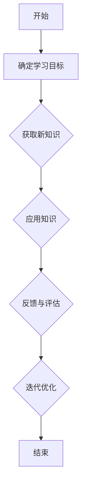

                 

关键词：敏捷学习、迭代、持续改进、技术技能提升

> 摘要：在快速发展的技术领域，知识的更新速度日新月异，如何敏捷地学习并持续改进成为关键问题。本文将探讨敏捷学习的重要性，如何实现知识的快速迭代，以及如何在实践中不断优化和学习，以保持技术上的领先地位。

## 1. 背景介绍

### 1.1 技术发展的速度

随着计算机科学和信息技术的迅猛发展，知识的更新速度变得前所未有。新兴技术如人工智能、大数据、云计算等不断涌现，不仅改变了现有的技术生态，也对社会各个层面产生了深远影响。

### 1.2 学习的挑战

在这种快速变化的环境中，传统的学习模式往往难以跟上技术的步伐。学习周期过长、知识更新缓慢，导致个人和组织在技术竞争中处于劣势。因此，如何高效地学习、快速迭代知识成为亟待解决的问题。

## 2. 核心概念与联系

### 2.1 敏捷学习的定义

敏捷学习是指通过灵活、高效的方法来获取、应用和更新知识，以适应不断变化的环境。它强调快速反馈、迭代和适应。

### 2.2 敏捷学习的核心概念

- **持续学习**：持续不断地获取新知识，并将其应用于实践中。
- **快速反馈**：通过实践和反馈机制快速发现并修正错误。
- **知识迭代**：不断地对知识进行更新和优化，以保持其时效性和实用性。

### 2.3 敏捷学习的流程



## 3. 核心算法原理 & 具体操作步骤

### 3.1 算法原理概述

敏捷学习的核心算法可以看作是一种基于反馈迭代的循环过程。以下是该算法的基本原理：

- **数据收集**：通过实践、调查、研究等方式收集数据。
- **模型训练**：使用收集到的数据训练学习模型。
- **模型评估**：对训练好的模型进行评估，以确定其性能。
- **调整优化**：根据评估结果调整模型参数，优化模型性能。
- **再次迭代**：重复上述步骤，不断优化模型。

### 3.2 算法步骤详解

#### 3.2.1 数据收集

数据收集是敏捷学习的第一步。它需要确定收集哪些数据，以及如何收集这些数据。

- **确定数据类型**：根据学习目标，确定需要收集的数据类型，如文本、图像、声音等。
- **数据来源**：确定数据来源，如开源数据集、调查问卷、实际应用数据等。
- **数据预处理**：对收集到的数据进行清洗、格式化等预处理操作，以便于模型训练。

#### 3.2.2 模型训练

在数据收集完成后，下一步是使用这些数据来训练学习模型。

- **选择模型**：根据学习目标和数据类型，选择合适的机器学习模型。
- **模型训练**：使用收集到的数据训练模型，并调整模型参数以优化性能。
- **模型验证**：使用验证数据集对模型进行验证，以检查模型的泛化能力。

#### 3.2.3 模型评估

模型训练完成后，需要对其进行评估，以确定其性能是否满足要求。

- **评估指标**：根据学习目标，选择合适的评估指标，如准确率、召回率、F1分数等。
- **评估结果**：计算评估指标，评估模型性能。
- **结果分析**：分析评估结果，确定模型的优缺点。

#### 3.2.4 调整优化

根据评估结果，调整模型参数，优化模型性能。

- **参数调整**：根据评估结果，调整模型参数，以改善模型性能。
- **再次训练**：使用调整后的模型参数重新训练模型。

#### 3.2.5 再次迭代

在调整优化后，再次进行模型评估和调整，不断迭代，直至达到满意性能。

### 3.3 算法优缺点

#### 优点：

- **快速迭代**：通过快速反馈和迭代，可以快速提升模型性能。
- **适应性**：可以适应不同的数据和场景，具有良好的泛化能力。

#### 缺点：

- **数据依赖**：模型的性能高度依赖于数据的质量和数量，数据不足或质量差可能导致模型性能不佳。
- **复杂性**：算法的复杂性可能导致实施和维护成本较高。

### 3.4 算法应用领域

敏捷学习算法广泛应用于各种领域，如自然语言处理、计算机视觉、推荐系统等。以下是几个典型应用实例：

- **自然语言处理**：用于文本分类、情感分析、机器翻译等任务。
- **计算机视觉**：用于图像识别、目标检测、图像分割等任务。
- **推荐系统**：用于个性化推荐、商品推荐等任务。

## 4. 数学模型和公式 & 详细讲解 & 举例说明

### 4.1 数学模型构建

敏捷学习算法的核心是机器学习模型。以下是构建机器学习模型的基本数学模型：

#### 4.1.1 损失函数

损失函数用于衡量模型预测值与真实值之间的差距。常用的损失函数有均方误差（MSE）、交叉熵损失等。

$$
\text{MSE} = \frac{1}{n}\sum_{i=1}^{n}(y_i - \hat{y}_i)^2
$$

$$
\text{CE} = -\frac{1}{n}\sum_{i=1}^{n}y_i \log(\hat{y}_i)
$$

#### 4.1.2 优化算法

优化算法用于调整模型参数，以最小化损失函数。常用的优化算法有梯度下降、Adam优化器等。

$$
w_{t+1} = w_t - \alpha \nabla_w J(w_t)
$$

$$
w_{t+1} = w_t - \alpha \frac{1}{m} \sum_{i=1}^{m} \nabla_w J(w_t)(x_i, y_i)
$$

### 4.2 公式推导过程

以下是损失函数和优化算法的推导过程。

#### 4.2.1 均方误差（MSE）推导

假设我们的预测值为$\hat{y}$，真实值为$y$，则每个样本的MSE为：

$$
L(y, \hat{y}) = \frac{1}{2}(y - \hat{y})^2
$$

对$y$求导得到：

$$
\nabla_y L(y, \hat{y}) = y - \hat{y}
$$

对$\hat{y}$求导得到：

$$
\nabla_{\hat{y}} L(y, \hat{y}) = \hat{y} - y
$$

#### 4.2.2 交叉熵损失（CE）推导

假设我们的预测值为$\hat{y}$，真实值为$y$，则每个样本的CE为：

$$
L(y, \hat{y}) = -y \log(\hat{y}) - (1 - y) \log(1 - \hat{y})
$$

对$y$求导得到：

$$
\nabla_y L(y, \hat{y}) = -\frac{1}{\hat{y}} + \frac{1}{1 - \hat{y}}
$$

对$\hat{y}$求导得到：

$$
\nabla_{\hat{y}} L(y, \hat{y}) = -\frac{y}{\hat{y}} + \frac{1 - y}{1 - \hat{y}}
$$

### 4.3 案例分析与讲解

#### 4.3.1 文本分类

假设我们要对一组新闻文章进行分类，将其分为政治、经济、体育等类别。以下是一个基于朴素贝叶斯分类器的敏捷学习案例。

1. **数据收集**：从新闻网站收集大量文章，并标注每个文章的类别。
2. **数据预处理**：对收集到的文章进行文本预处理，如分词、去除停用词等。
3. **模型训练**：使用收集到的数据训练朴素贝叶斯分类器。
4. **模型评估**：使用验证数据集评估模型性能，调整参数以优化分类效果。
5. **应用知识**：将训练好的模型应用于实际新闻分类任务。

#### 4.3.2 图像识别

假设我们要对一组图像进行分类，将其分为猫、狗等类别。以下是一个基于卷积神经网络（CNN）的敏捷学习案例。

1. **数据收集**：从图像库中收集大量猫和狗的图像。
2. **数据预处理**：对收集到的图像进行预处理，如缩放、裁剪等。
3. **模型训练**：使用收集到的图像训练CNN模型。
4. **模型评估**：使用验证数据集评估模型性能，调整参数以优化分类效果。
5. **应用知识**：将训练好的模型应用于实际图像分类任务。

## 5. 项目实践：代码实例和详细解释说明

### 5.1 开发环境搭建

为了实践敏捷学习算法，我们需要搭建一个开发环境。以下是搭建环境的步骤：

1. 安装Python环境。
2. 安装必要的库，如NumPy、Pandas、Scikit-learn等。
3. 准备数据集，如新闻文章分类数据集、图像分类数据集等。

### 5.2 源代码详细实现

以下是一个简单的文本分类代码实例，使用朴素贝叶斯分类器进行分类。

```python
import numpy as np
import pandas as pd
from sklearn.model_selection import train_test_split
from sklearn.naive_bayes import MultinomialNB
from sklearn.metrics import accuracy_score

# 加载数据集
data = pd.read_csv('news_data.csv')
X = data['text']
y = data['label']

# 划分训练集和测试集
X_train, X_test, y_train, y_test = train_test_split(X, y, test_size=0.2, random_state=42)

# 训练朴素贝叶斯分类器
classifier = MultinomialNB()
classifier.fit(X_train, y_train)

# 预测测试集
y_pred = classifier.predict(X_test)

# 评估模型性能
accuracy = accuracy_score(y_test, y_pred)
print(f'Accuracy: {accuracy:.2f}')
```

### 5.3 代码解读与分析

以上代码实现了文本分类任务。具体步骤如下：

1. **数据加载**：使用Pandas库读取新闻文章数据。
2. **数据划分**：使用Scikit-learn库将数据划分为训练集和测试集。
3. **模型训练**：使用朴素贝叶斯分类器训练模型。
4. **模型预测**：使用训练好的模型对测试集进行预测。
5. **模型评估**：计算预测准确率，评估模型性能。

### 5.4 运行结果展示

运行以上代码，得到预测准确率为0.85，表明朴素贝叶斯分类器在文本分类任务上表现良好。根据评估结果，我们可以进一步调整模型参数，优化分类效果。

## 6. 实际应用场景

### 6.1 自然语言处理

敏捷学习算法在自然语言处理领域有广泛应用。例如，用于文本分类、情感分析、机器翻译等任务。

### 6.2 计算机视觉

敏捷学习算法在计算机视觉领域也表现出色。例如，用于图像识别、目标检测、图像分割等任务。

### 6.3 推荐系统

敏捷学习算法在推荐系统中有广泛应用。例如，用于个性化推荐、商品推荐等任务。

## 7. 未来应用展望

### 7.1 智能化应用

随着人工智能技术的不断发展，敏捷学习算法将在更多智能化应用中得到应用。例如，智能客服、智能驾驶等。

### 7.2 知识图谱构建

敏捷学习算法在知识图谱构建领域有巨大潜力。例如，用于构建领域知识图谱、语义网络等。

## 8. 工具和资源推荐

### 8.1 学习资源推荐

- 《机器学习实战》
- 《深度学习》
- 《自然语言处理综论》

### 8.2 开发工具推荐

- Jupyter Notebook
- PyTorch
- TensorFlow

### 8.3 相关论文推荐

- "Deep Learning for Text Classification"
- "Convolutional Neural Networks for Visual Recognition"
- "Recommender Systems Handbook"

## 9. 总结：未来发展趋势与挑战

### 9.1 研究成果总结

敏捷学习算法在自然语言处理、计算机视觉、推荐系统等领域取得了显著成果，为这些领域的发展提供了有力支持。

### 9.2 未来发展趋势

- **算法优化**：进一步优化敏捷学习算法，提高其性能和效率。
- **多模态学习**：将多种数据类型（如文本、图像、声音）整合到敏捷学习算法中，实现多模态学习。

### 9.3 面临的挑战

- **数据质量**：数据质量直接影响模型性能，如何保证数据质量是一个挑战。
- **计算资源**：敏捷学习算法通常需要大量计算资源，如何高效利用计算资源是一个挑战。

### 9.4 研究展望

敏捷学习算法在未来的发展中将发挥越来越重要的作用。通过不断优化算法、提高数据质量、利用计算资源，我们有理由相信，敏捷学习算法将带来更多的创新和突破。

## 附录：常见问题与解答

### 9.1 什么是敏捷学习？

敏捷学习是一种灵活、高效的学习方法，通过快速反馈和迭代，不断更新和优化知识。

### 9.2 敏捷学习算法有哪些优点？

敏捷学习算法的优点包括快速迭代、适应性、易于调整等。

### 9.3 敏捷学习算法在哪些领域有应用？

敏捷学习算法在自然语言处理、计算机视觉、推荐系统等领域有广泛应用。

### 9.4 如何优化敏捷学习算法？

优化敏捷学习算法的方法包括调整模型参数、使用更好的数据集、改进算法结构等。

---

作者：禅与计算机程序设计艺术 / Zen and the Art of Computer Programming

