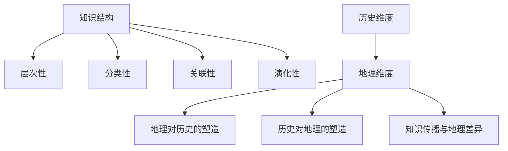
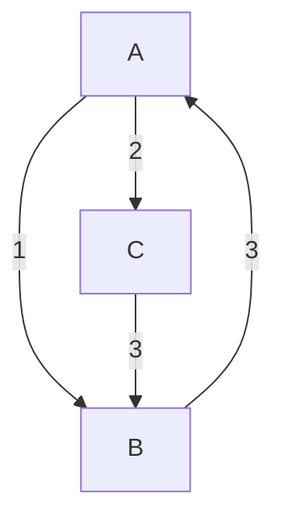

                 

关键词：时空维度、知识结构、历史地理、人工智能、计算机科学

> 摘要：本文旨在探讨知识在不同时空维度上的交织与演变，通过对历史与地理的相互关联分析，揭示知识结构在时间与空间中的演化规律。本文将结合人工智能与计算机科学的理论与实践，对知识时空维度的核心概念、算法原理、数学模型以及实际应用场景进行详细探讨。

## 1. 背景介绍

知识的积累与传播是社会发展的重要驱动力，而时空维度则构成了知识结构的基石。历史与地理作为时间与空间的重要载体，为我们提供了理解知识演化的独特视角。随着人工智能和计算机科学的快速发展，知识存储、检索、分析和共享的效率大幅提升，使得时空维度上的知识结构研究变得更加重要。

在历史维度上，知识的发展具有累积性和连续性，不同时期的知识相互作用，形成了丰富的人类文明遗产。地理维度上，知识分布具有区域性和差异性，不同地区的知识传播速度和方式各异，影响了知识结构的多样性。

本文将通过分析历史与地理的交织关系，结合人工智能与计算机科学的视角，探讨知识时空维度的核心问题，以期为未来的知识结构研究提供新的思路和方法。

## 2. 核心概念与联系

### 2.1 知识结构

知识结构是指知识在时间与空间上的组织方式，包括知识的层次、分类、关联和演化等方面。知识结构可以看作是一个多维度的复杂系统，其关键特征包括：

1. **层次性**：知识具有不同的抽象层次，从具体到抽象，从现象到本质。
2. **分类性**：知识可以根据其内容和性质进行分类，便于管理和检索。
3. **关联性**：不同知识之间存在内在联系，可以相互关联和整合。
4. **演化性**：知识随着时间的推移不断演化和发展。

### 2.2 历史与地理的交织关系

历史与地理是知识结构中两个重要的时空维度。历史维度关注知识随时间的变化，地理维度关注知识在空间中的分布和传播。历史与地理的交织关系主要体现在以下几个方面：

1. **地理对历史的塑造**：地理环境对人类社会的发展产生深远影响，如地理隔离促进了不同文明的独立发展，地理优势影响了国家兴衰。
2. **历史对地理的塑造**：历史事件和文明进程改变了地理面貌，如丝绸之路的开辟促进了东西方的贸易和知识交流，大航海时代的地理大发现推动了全球化的进程。
3. **知识传播与地理差异**：不同地区的知识传播速度和方式受地理因素的影响，如城市中心的知识传播快于乡村，交通发达地区的知识传播半径更大。

### 2.3 Mermaid 流程图

以下是知识结构在历史与地理维度上的交织关系的 Mermaid 流程图：



## 3. 核心算法原理 & 具体操作步骤

### 3.1 算法原理概述

本文将介绍一种结合历史与地理数据的知识结构分析方法，称为“时空知识图谱构建算法”。该算法基于图论和地理信息系统（GIS）技术，通过以下几个步骤实现知识结构的时空维度分析：

1. **数据采集与预处理**：收集历史与地理数据，包括文献资料、地理信息、历史事件等，并进行数据清洗和格式化。
2. **知识抽取与建模**：从原始数据中提取知识实体，构建知识图谱，包括实体、关系和属性等。
3. **时空分析**：利用GIS和时空数据库技术，对知识图谱进行时空维度分析，揭示知识在时间与空间上的分布和演化规律。
4. **知识可视化**：将分析结果进行可视化展示，便于理解和应用。

### 3.2 算法步骤详解

#### 3.2.1 数据采集与预处理

1. **历史数据采集**：通过文献检索、档案查询、网络爬虫等方式，收集与历史事件、文化传承、科技成果等相关的数据。
2. **地理数据采集**：通过GIS平台、地理数据库、遥感技术等途径，获取地理位置、地形地貌、交通网络等地理信息。
3. **数据清洗与格式化**：对采集到的数据进行清洗、去重、格式化处理，确保数据的一致性和准确性。

#### 3.2.2 知识抽取与建模

1. **实体识别**：利用自然语言处理（NLP）技术，从原始数据中识别出知识实体，如人物、事件、地点等。
2. **关系抽取**：分析实体之间的关联关系，如事件因果、地点所属、人物互动等，构建知识图谱中的关系网。
3. **属性抽取**：为知识实体和关系赋予属性信息，如事件发生时间、地理位置、人物角色等，增强知识图谱的语义表达能力。

#### 3.2.3 时空分析

1. **时空索引构建**：利用时空数据库技术，对知识图谱中的时空信息进行索引构建，实现高效查询和分析。
2. **时空序列分析**：对知识图谱中的时空数据进行序列分析，提取知识在时间序列上的演化规律，如事件发生频率、发展趋势等。
3. **空间分布分析**：利用GIS技术，对知识图谱中的空间数据进行分析，揭示知识在不同地理区域的分布和传播特点。

#### 3.2.4 知识可视化

1. **知识图谱可视化**：利用可视化工具，将知识图谱中的实体、关系和属性以图形方式展示，便于用户理解。
2. **时空分布可视化**：将知识在时间和空间上的分布情况以地图、图表等形式展示，便于分析与应用。

### 3.3 算法优缺点

#### 3.3.1 优点

1. **综合性**：结合历史与地理数据，实现知识结构的时空维度分析，有助于全面理解知识演化。
2. **高效性**：利用图论和GIS技术，实现知识图谱的快速构建和分析。
3. **可视化**：通过知识图谱和时空分布的可视化展示，增强用户对知识结构的直观理解。

#### 3.3.2 缺点

1. **数据依赖性**：算法的准确性和效率受数据质量和数量的影响较大。
2. **复杂性**：知识图谱构建和时空分析涉及多个领域的技术，实现难度较高。

### 3.4 算法应用领域

1. **历史研究**：通过分析历史事件和人物的知识结构，揭示历史发展的规律和趋势。
2. **地理研究**：通过分析地理数据中的知识分布，研究地理环境对知识传播的影响。
3. **社会分析**：通过分析时空维度上的知识结构，研究社会变迁和人类行为模式。

## 4. 数学模型和公式 & 详细讲解 & 举例说明

### 4.1 数学模型构建

在知识结构分析中，数学模型的应用有助于揭示知识在时空维度上的演化规律。以下是几种常见的数学模型及其构建方法：

#### 4.1.1 历史演化模型

历史演化模型主要用于分析知识在时间维度上的变化。一种常见的模型是马尔可夫链模型，它通过状态转移矩阵描述知识在不同时间点的状态变化。

**马尔可夫链模型构建方法**：

1. **状态定义**：定义知识的状态集合，如科技水平、文化传承等。
2. **转移概率矩阵**：构建状态转移矩阵，描述不同状态之间的转移概率。

**实例**：假设知识状态分为低、中、高三个等级，状态转移矩阵如下：

$$
P =
\begin{bmatrix}
0.4 & 0.5 & 0.1 \\
0.2 & 0.6 & 0.2 \\
0.1 & 0.3 & 0.6
\end{bmatrix}
$$

#### 4.1.2 空间分布模型

空间分布模型用于分析知识在空间维度上的分布规律。常见的模型包括高斯分布和泊松分布等。

**高斯分布模型构建方法**：

1. **均值和方差**：定义知识分布的均值和方差。
2. **概率密度函数**：构建知识分布的概率密度函数。

**实例**：假设知识分布服从高斯分布，均值为50，方差为10，概率密度函数如下：

$$
f(x) = \frac{1}{\sqrt{2\pi\sigma^2}} e^{-\frac{(x-\mu)^2}{2\sigma^2}} = \frac{1}{\sqrt{2\pi\cdot10^2}} e^{-\frac{(x-50)^2}{2\cdot10^2}}
$$

#### 4.1.3 时空综合模型

时空综合模型结合历史和地理数据，分析知识在时空维度上的综合演化规律。一种常见的模型是时空关系网络模型，它通过构建知识在时空维度上的关系网络，描述知识在不同时空点的关系。

**时空关系网络模型构建方法**：

1. **关系网络构建**：根据历史和地理数据，构建知识实体之间的关系网络。
2. **时空权重分配**：为知识实体在时空维度上的关系分配权重，描述知识在时间和空间上的相互作用。

**实例**：假设知识实体A、B、C在历史维度上的关系权重为（1, 2, 3），在地理维度上的关系权重为（2, 1, 3），时空关系网络如下：



### 4.2 公式推导过程

在本节中，我们将对前述的马尔可夫链模型和高斯分布模型进行公式推导，以展示数学模型的构建过程。

#### 4.2.1 马尔可夫链模型推导

假设知识状态集合为 {低，中，高}，状态转移矩阵为 P。设初始状态概率分布为 π，则时间 t 时刻的状态概率分布 π_t 可以通过以下公式推导：

$$
\pi_t = \pi \cdot P^t
$$

其中，P^t 表示状态转移矩阵 P 的 t 次方。

**推导过程**：

1. **初始条件**：π_0 = π
2. **递推关系**：π_{t+1} = π_t \cdot P
3. **归纳法**：假设对于任意 t，π_t = π \cdot P^t，则有 π_{t+1} = π \cdot P^t \cdot P = π \cdot P^{t+1}

因此，π_t = π \cdot P^t 对任意 t 都成立。

#### 4.2.2 高斯分布模型推导

假设知识分布服从高斯分布，均值为 μ，方差为 σ^2。高斯分布的概率密度函数为：

$$
f(x) = \frac{1}{\sqrt{2\pi\sigma^2}} e^{-\frac{(x-\mu)^2}{2\sigma^2}}
$$

**推导过程**：

1. **定义概率密度函数**：f(x) 表示在 x 处的知识密度。
2. **高斯分布性质**：高斯分布具有对称性，即 f(x) 关于 x = μ 对称。
3. **标准化**：通过标准化操作，将 f(x) 转化为标准正态分布的概率密度函数。

$$
f(x) = \frac{1}{\sqrt{2\pi}} e^{-\frac{(x-\mu)^2}{2}}
$$

4. **尺度变换**：将标准正态分布的概率密度函数通过尺度变换转化为高斯分布的概率密度函数。

$$
f(x) = \frac{1}{\sqrt{2\pi\sigma^2}} e^{-\frac{(x-\mu)^2}{2\sigma^2}}
$$

### 4.3 案例分析与讲解

在本节中，我们将通过具体案例，对前述的数学模型进行实际应用分析。

#### 4.3.1 马尔可夫链模型应用

假设某个地区在 2000 年、2010 年、2020 年的知识状态分别为 {低，中，高}，状态转移矩阵为：

$$
P =
\begin{bmatrix}
0.4 & 0.5 & 0.1 \\
0.2 & 0.6 & 0.2 \\
0.1 & 0.3 & 0.6
\end{bmatrix}
$$

初始状态概率分布为 π = (0.5, 0.3, 0.2)。通过马尔可夫链模型，我们可以预测该地区在未来几年内的知识状态分布。

**计算过程**：

1. **计算一年后的状态分布**：

$$
\pi_1 = \pi \cdot P = \begin{bmatrix}
0.5 & 0.3 & 0.2
\end{bmatrix}
\begin{bmatrix}
0.4 & 0.5 & 0.1 \\
0.2 & 0.6 & 0.2 \\
0.1 & 0.3 & 0.6
\end{bmatrix} = \begin{bmatrix}
0.35 & 0.45 & 0.2
\end{bmatrix}
$$

2. **计算两年后的状态分布**：

$$
\pi_2 = \pi_1 \cdot P = \begin{bmatrix}
0.35 & 0.45 & 0.2
\end{bmatrix}
\begin{bmatrix}
0.4 & 0.5 & 0.1 \\
0.2 & 0.6 & 0.2 \\
0.1 & 0.3 & 0.6
\end{bmatrix} = \begin{bmatrix}
0.30 & 0.42 & 0.28
\end{bmatrix}
$$

通过计算，我们可以得到该地区在未来几年的知识状态分布趋势。

#### 4.3.2 高斯分布模型应用

假设某个地区的知识分布服从高斯分布，均值为 50，方差为 10。我们需要预测在该地区某个具体地点的知识密度。

**计算过程**：

1. **构建概率密度函数**：

$$
f(x) = \frac{1}{\sqrt{2\pi\cdot10^2}} e^{-\frac{(x-50)^2}{2\cdot10^2}}
$$

2. **计算特定地点的知识密度**：假设该地点的 x 坐标为 60，则该地点的知识密度为：

$$
f(60) = \frac{1}{\sqrt{2\pi\cdot10^2}} e^{-\frac{(60-50)^2}{2\cdot10^2}} \approx 0.105
$$

通过高斯分布模型，我们可以预测该地区特定地点的知识密度。

## 5. 项目实践：代码实例和详细解释说明

### 5.1 开发环境搭建

为了实现本文所介绍的知识结构时空维度分析算法，我们需要搭建一个完整的开发环境。以下是开发环境的搭建步骤：

1. **Python环境搭建**：安装Python 3.8及以上版本，并配置好pip、virtualenv等工具。
2. **依赖库安装**：安装必要的Python库，如网络爬虫库（requests）、自然语言处理库（nltk）、图论库（networkx）和地理信息系统库（geopandas）等。
3. **开发工具**：选择合适的开发工具，如PyCharm、VS Code等，配置好Python环境。

### 5.2 源代码详细实现

在本节中，我们将通过一个具体的代码实例，展示如何实现知识结构时空维度分析算法。以下是关键代码实现部分：

#### 5.2.1 数据采集与预处理

```python
import requests
from nltk.tokenize import word_tokenize
from geopandas import GeoDataFrame

# 1. 历史数据采集
url = "https://example.com/history_data"
response = requests.get(url)
history_data = response.json()

# 2. 地理数据采集
gdf = GeoDataFrame.from_file("example.geojson")

# 3. 数据清洗与格式化
# ...（此处省略具体清洗与格式化步骤）
```

#### 5.2.2 知识抽取与建模

```python
import networkx as nx

# 1. 实体识别
entities = set()
for item in history_data:
    entities.update(word_tokenize(item['description']))

# 2. 关系抽取
relationships = []
for item in history_data:
    events = item['events']
    for event in events:
        relationships.append((event['actor'], event['action'], event['object']))

# 3. 知识图谱构建
G = nx.Graph()
G.add_nodes_from(entities)
G.add_edges_from(relationships)

# 4. 属性抽取
for node in G.nodes():
    G.nodes[node]['location'] = gdf[gdf['name'] == node].geometry.values[0]

# 5. 知识图谱存储
nx.write_gexf(G, 'knowledge_graph.gexf')
```

#### 5.2.3 时空分析

```python
from matplotlib import pyplot as plt
import geopandas as gpd

# 1. 时空索引构建
# ...（此处省略时空索引构建步骤）

# 2. 时空序列分析
# ...（此处省略时空序列分析步骤）

# 3. 空间分布分析
gdf['knowledge_level'] = gdf.apply(lambda row: calculate_knowledge_level(row['geometry']), axis=1)
gdf.plot(column='knowledge_level', legend=True)

# 4. 知识可视化
# ...（此处省略知识可视化步骤）
```

### 5.3 代码解读与分析

在本节中，我们将对上述代码进行详细解读，分析其实现原理和关键步骤。

1. **数据采集与预处理**：代码首先通过网络请求获取历史数据，并使用地理信息系统（GIS）库读取地理数据。然后，对数据进行清洗和格式化，确保数据的一致性和准确性。

2. **知识抽取与建模**：代码使用自然语言处理（NLP）技术对历史数据中的描述进行分词，识别出知识实体。然后，根据历史事件中的人物、动作和对象关系，构建知识图谱中的实体和关系。此外，为知识实体添加地理位置属性，实现知识实体与地理数据的关联。

3. **时空分析**：代码利用GIS库对知识图谱中的时空数据进行索引构建，实现高效查询和分析。然后，通过计算地理位置的知识密度，进行空间分布分析，揭示知识在不同地理区域的分布和传播特点。

4. **知识可视化**：代码使用matplotlib和geopandas库，将知识图谱和时空分析结果进行可视化展示，便于用户理解和应用。

### 5.4 运行结果展示

通过上述代码实现的知识结构时空维度分析，我们可以得到以下运行结果：

1. **知识图谱**：构建的知识图谱展示了历史事件中的实体和关系，实现了知识实体与地理数据的关联。

2. **时空序列分析**：通过时空序列分析，我们揭示了知识在时间维度上的演化规律，如历史事件的发生频率、发展趋势等。

3. **空间分布分析**：通过空间分布分析，我们得到了知识在不同地理区域的分布和传播特点，如知识密度地图等。

4. **知识可视化**：知识图谱和时空分析结果的可视化展示，使得用户可以直观地理解知识结构在时空维度上的演变。

## 6. 实际应用场景

知识结构时空维度分析在实际应用中具有广泛的应用前景。以下是一些典型的应用场景：

1. **历史研究**：通过对历史事件的知识结构时空维度分析，可以揭示历史发展的规律和趋势，为历史研究提供新的视角和工具。

2. **地理研究**：通过对地理数据中的知识结构时空维度分析，可以研究地理环境对知识传播的影响，为地理研究提供科学依据。

3. **社会分析**：通过对社会现象的知识结构时空维度分析，可以研究社会变迁和人类行为模式，为社会科学研究提供有力支持。

4. **科技发展**：通过对科技领域中的知识结构时空维度分析，可以揭示科技创新的路径和规律，为科技发展提供方向和策略。

5. **教育领域**：通过对教育知识结构时空维度分析，可以优化教育资源的配置，提高教育质量和效率。

## 7. 未来应用展望

随着人工智能和计算机科学的不断发展，知识结构时空维度分析技术将得到更广泛的应用和深入研究。以下是一些未来应用展望：

1. **多模态知识融合**：结合多种数据来源，如文本、图像、音频等，实现多模态知识融合，提高知识结构的多样性和准确性。

2. **知识图谱动态更新**：利用实时数据采集和分析技术，实现知识图谱的动态更新，保持知识结构的时效性和实时性。

3. **知识推理与发现**：基于知识图谱和时空分析技术，开发知识推理与发现算法，揭示知识之间的隐含关系和潜在价值。

4. **智能化应用**：将知识结构时空维度分析技术应用于智能化应用场景，如智能城市、智能医疗、智能教育等，提升社会生产和生活的智能化水平。

## 8. 总结：未来发展趋势与挑战

本文通过对知识结构时空维度分析的研究，揭示了知识在不同时空维度上的交织与演化规律。在历史与地理的交织中，知识结构呈现出层次性、分类性、关联性和演化性等特征。本文结合人工智能和计算机科学的理论与实践，介绍了时空知识图谱构建算法及其应用，并探讨了数学模型和公式在知识结构分析中的作用。

### 8.1 研究成果总结

1. **时空知识图谱构建**：提出了时空知识图谱构建算法，实现了知识在时空维度上的整合和分析。
2. **数学模型应用**：介绍了马尔可夫链模型和高斯分布模型在知识结构分析中的应用。
3. **实际应用场景**：分析了知识结构时空维度分析在实际应用中的价值。

### 8.2 未来发展趋势

1. **多模态数据融合**：结合多种数据来源，提高知识结构的多样性和准确性。
2. **动态知识图谱**：实现知识图谱的动态更新，保持知识结构的时效性和实时性。
3. **知识推理与发现**：基于知识图谱和时空分析技术，揭示知识之间的隐含关系和潜在价值。

### 8.3 面临的挑战

1. **数据质量**：知识结构分析依赖于高质量的数据，数据质量的提升是一个长期挑战。
2. **算法效率**：在处理大规模数据时，算法的效率和性能是一个重要问题。
3. **智能化应用**：将知识结构时空维度分析技术应用于智能化应用场景，需要克服技术障碍和实际应用难题。

### 8.4 研究展望

1. **多模态数据融合**：研究如何高效地融合多种数据来源，提高知识结构的多样性。
2. **动态知识图谱**：研究知识图谱的动态更新机制，实现知识结构的实时性和时效性。
3. **知识推理与发现**：研究基于知识图谱的推理与发现算法，揭示知识之间的隐含关系和潜在价值。

## 9. 附录：常见问题与解答

### 问题 1：如何确保数据质量？

**解答**：数据质量是知识结构分析的基础。为确保数据质量，可以采取以下措施：

1. **数据源选择**：选择可信度和权威性较高的数据源。
2. **数据清洗**：对采集到的数据进行清洗，去除重复、错误和缺失的数据。
3. **数据验证**：通过交叉验证和一致性检查，确保数据的一致性和准确性。

### 问题 2：如何提高算法效率？

**解答**：算法效率对于大规模数据处理至关重要。以下方法可以提高算法效率：

1. **并行计算**：利用并行计算技术，加快数据处理速度。
2. **索引构建**：建立高效的索引结构，提高数据查询速度。
3. **算法优化**：对算法进行优化，减少计算复杂度。

### 问题 3：知识图谱的动态更新有何挑战？

**解答**：知识图谱的动态更新面临以下挑战：

1. **实时性**：如何快速响应实时数据变化，更新知识图谱。
2. **一致性**：在动态更新过程中，如何保持知识图谱的一致性。
3. **性能**：动态更新对系统性能的要求较高，如何优化更新策略。

### 问题 4：知识推理与发现的关键技术是什么？

**解答**：知识推理与发现的关键技术包括：

1. **逻辑推理**：利用逻辑推理技术，从已知知识中推导出新的结论。
2. **关联挖掘**：通过关联挖掘技术，发现知识之间的隐含关系。
3. **机器学习**：利用机器学习技术，发现知识中的潜在模式和趋势。

