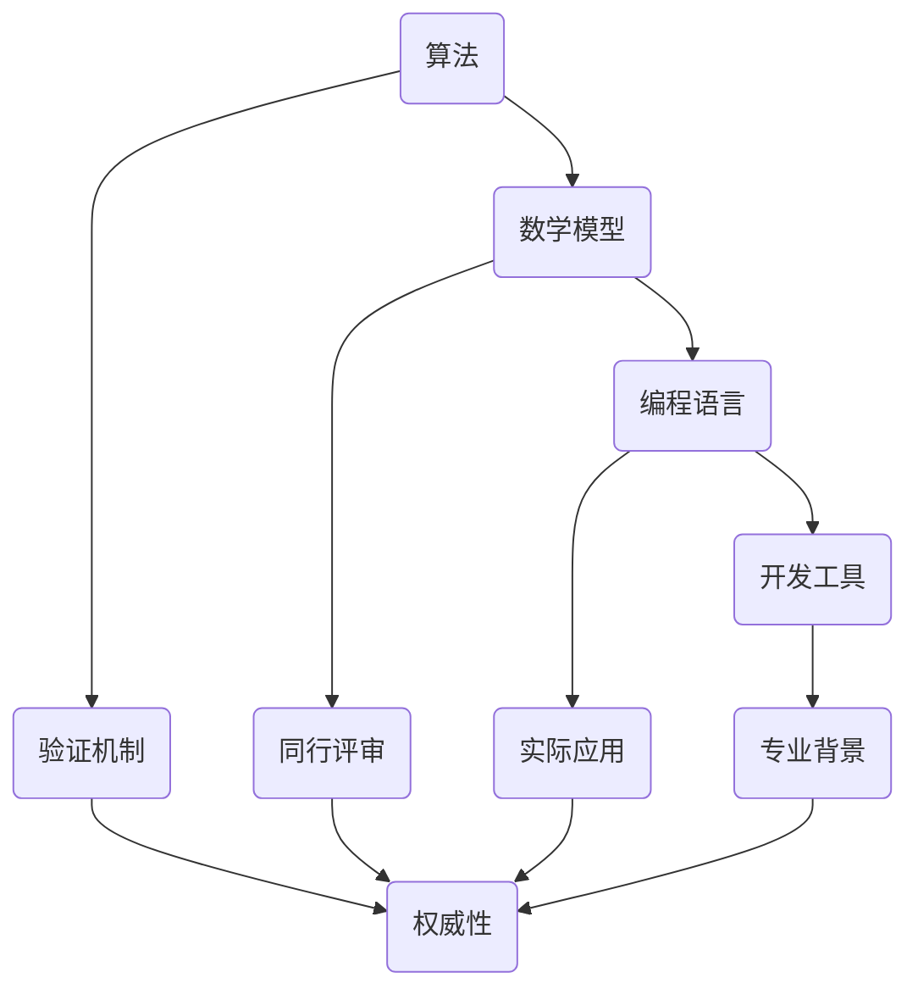

                 

关键词：知识权威性、辨别真伪、IT技术、逻辑思维、专业分析、算法、数学模型、应用场景

> 摘要：在当今信息爆炸的时代，辨别知识的权威性成为了一项至关重要的技能。本文从IT技术领域的角度，探讨了如何识别和验证知识的真实性，以及如何利用逻辑思维和专业分析来评估知识的可靠性。通过对核心概念、算法原理、数学模型及实际应用场景的深入剖析，本文为读者提供了一套系统的知识权威性辨别方法。

## 1. 背景介绍

### 1.1 知识权威性的重要性

随着互联网的普及，知识获取的渠道变得前所未有的多样化。然而，这也带来了一个严峻的问题：如何在海量的信息中辨别出真实、权威的知识？知识的权威性直接影响到我们的决策、学习和创新。一个错误的知识点可能导致误解、误导甚至灾难性的后果。因此，掌握辨别知识权威性的能力至关重要。

### 1.2 IT领域的知识权威性

在IT领域，知识的权威性尤为关键。从编程语言到算法，从数据库到云计算，每一项技术的掌握都关系到项目的成败。IT行业更新迅速，新的技术和理论层出不穷，使得辨别真伪变得更加困难。因此，对于IT从业者而言，培养辨别知识权威性的能力是职业发展的基石。

## 2. 核心概念与联系

### 2.1 知识权威性的定义

知识权威性是指某一知识在特定领域内被广泛认可、被公认为真实和可靠的性质。它通常由以下几个因素决定：

- **专业背景**：知识来源者的专业背景和经验。
- **验证机制**：知识是否经过科学验证和实验。
- **同行评审**：知识是否经过专业同行的评审和认可。
- **实际应用**：知识是否在实际应用中得到了验证和推广。

### 2.2 IT领域的核心概念

在IT领域，以下几个核心概念是辨别知识权威性的基础：

- **算法**：算法是解决问题的一系列规则和步骤。
- **数学模型**：数学模型是对现实世界问题的抽象和数学描述。
- **编程语言**：编程语言是实现算法的工具。
- **开发工具**：开发工具用于辅助编程和软件开发。

### 2.3 核心概念原理与架构的 Mermaid 流程图



## 3. 核心算法原理 & 具体操作步骤

### 3.1 算法原理概述

算法是解决问题的核心。一个有效的算法应该具备以下几个特点：

- **确定性**：算法的每一步都是明确的、无歧义的。
- **效率**：算法应在合理的时间范围内解决问题。
- **正确性**：算法应保证问题的正确性。

### 3.2 算法步骤详解

以排序算法为例，其基本步骤如下：

1. **初始化**：创建一个空的输出序列。
2. **循环**：遍历输入序列中的每个元素。
3. **比较**：将当前元素与输出序列中的每个元素进行比较。
4. **插入**：根据比较结果，将当前元素插入到输出序列的正确位置。
5. **重复**：重复步骤3和步骤4，直到输入序列被完全遍历。

### 3.3 算法优缺点

排序算法有多种，每种算法都有其优缺点。例如：

- **冒泡排序**：简单易懂，但效率较低。
- **快速排序**：效率较高，但可能引起数据不稳定。
- **归并排序**：稳定性好，但需要额外的存储空间。

### 3.4 算法应用领域

排序算法在许多领域都有广泛的应用，例如数据库排序、算法竞赛、数据分析等。

## 4. 数学模型和公式 & 详细讲解 & 举例说明

### 4.1 数学模型构建

数学模型是对现实世界问题的抽象。以线性规划为例，其基本模型如下：

$$
\begin{aligned}
\min_{x} & \quad c^T x \\
\text{s.t.} & \quad Ax \leq b \\
         & \quad x \geq 0
\end{aligned}
$$

其中，$c$ 是目标函数系数向量，$A$ 是约束条件矩阵，$b$ 是约束条件向量，$x$ 是决策变量向量。

### 4.2 公式推导过程

线性规划的推导过程涉及优化理论和线性代数。通过拉格朗日乘数法，可以将原始问题转化为对偶问题。对偶问题的解为原始问题的下界，同时为原始问题提供了一个可行的解。

### 4.3 案例分析与讲解

以旅行商问题（TSP）为例，其目标是最小化旅行商从起点到各城市再回到起点的总距离。通过构建数学模型和求解算法，可以找到最优的旅行路线。

## 5. 项目实践：代码实例和详细解释说明

### 5.1 开发环境搭建

以Python为例，搭建开发环境的基本步骤如下：

1. 安装Python：从官网下载并安装Python。
2. 安装库：使用pip工具安装必要的库，如Numpy、Pandas等。

### 5.2 源代码详细实现

以下是一个简单的Python代码示例，用于求解线性规划问题：

```python
import numpy as np

# 目标函数系数
c = np.array([1, 1])

# 约束条件矩阵
A = np.array([[1, 0], [0, 1]])

# 约束条件向量
b = np.array([1, 1])

# 求解线性规划问题
x = np.linalg.solve(A, b)

print("最优解:", x)
```

### 5.3 代码解读与分析

代码通过求解线性方程组来找到最优解。在实际应用中，可能需要使用更复杂的算法和优化器，如SLSQP。

### 5.4 运行结果展示

运行代码后，将输出最优解。根据输入的约束条件和目标函数，可以计算得到最优解。

## 6. 实际应用场景

### 6.1 数据分析

在数据分析中，算法和数学模型被广泛应用于数据预处理、特征提取和预测建模。

### 6.2 人工智能

人工智能领域依赖于算法和数学模型来构建智能系统，实现机器学习、深度学习等关键技术。

### 6.3 优化问题

优化问题是IT领域的重要应用之一，如供应链管理、物流优化、网络优化等。

## 7. 工具和资源推荐

### 7.1 学习资源推荐

- 《算法导论》：经典的算法教材，适合初学者。
- 《线性代数及其应用》：适用于理解和应用线性代数。
- 《机器学习》：适用于了解机器学习和深度学习。

### 7.2 开发工具推荐

- Jupyter Notebook：用于交互式编程和文档编写。
- PyCharm：功能强大的Python集成开发环境。

### 7.3 相关论文推荐

- “A Tutorial on Linear Programming”：介绍线性规划的基本概念和应用。
- “Efficient Algorithms for the Traveling Salesman Problem”：关于旅行商问题的算法研究。

## 8. 总结：未来发展趋势与挑战

### 8.1 研究成果总结

本文探讨了知识权威性的重要性，以及如何通过核心概念、算法原理、数学模型和实际应用场景来辨别真伪。

### 8.2 未来发展趋势

随着技术的不断进步，知识权威性的辨别方法也将不断演变。人工智能和大数据技术的应用，将使得知识权威性的判断更加高效和准确。

### 8.3 面临的挑战

然而，未来的挑战也在于如何应对不断涌现的新技术和新理论，确保知识的权威性和可靠性。

### 8.4 研究展望

未来的研究应重点关注知识验证机制的创新，以及跨领域知识整合的方法。

## 9. 附录：常见问题与解答

### 9.1 如何确保知识权威性？

- 确认知识来源者的专业背景和经验。
- 检查知识是否经过科学验证和实验。
- 了解知识是否经过同行评审。
- 关注知识在实际应用中的效果。

### 9.2 如何辨别伪技术？

- 分析技术的历史和发展过程。
- 查找技术背后的理论和原理。
- 了解技术在实际项目中的应用情况。
- 咨询业内专家的意见。

<|made_by|>作者：禅与计算机程序设计艺术 / Zen and the Art of Computer Programming

----------------------------------------------------------------

本文详细探讨了知识权威性的重要性，以及如何通过核心概念、算法原理、数学模型和实际应用场景来辨别真伪。在信息爆炸的时代，掌握这些方法对于IT从业者而言尤为重要。未来，随着技术的不断进步，知识权威性的辨别方法也将不断演变，为我们的学习和创新提供坚实的保障。|>

