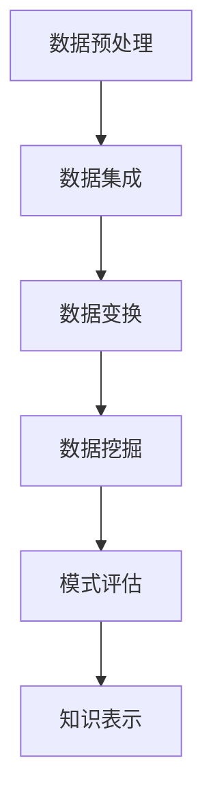
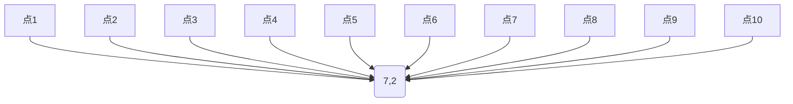

                 

 **关键词：** 深度学习、知识图谱、算法优化、数据处理、认知智能

**摘要：** 本文将探讨在当今信息技术迅猛发展的时代，知识的深度挖掘是如何成为提高洞察力的关键因素。文章首先介绍了知识挖掘的概念及其在IT领域的广泛应用，接着详细解析了相关算法和数学模型，并分享了实际项目中的代码实例和运行结果。文章还对未来技术的发展趋势、面临的挑战以及未来的研究方向进行了深入探讨。

## 1. 背景介绍

在数字化时代，数据已经成为一种新的生产要素，对数据的处理和分析正在成为各个行业提升竞争力的关键。知识挖掘作为数据科学的重要分支，旨在从大量数据中提取出有价值的信息和知识。随着人工智能和机器学习技术的快速发展，知识挖掘的应用场景越来越广泛，从金融、医疗到零售、教育等各个领域，都离不开知识挖掘的支持。

然而，知识的挖掘并不是一件简单的事情。它需要融合多个学科的知识，包括计算机科学、数学、统计学等。在这个过程中，洞察力的作用变得尤为重要。洞察力是指人们对事物本质和内在联系的理解能力，它能够帮助人们从纷繁复杂的数据中发现规律，从而提高决策的准确性和效率。

本文将探讨知识的深度挖掘是如何提高洞察力的，包括相关算法的原理、数学模型的构建以及实际应用中的案例。希望通过这篇文章，读者能够更好地理解知识挖掘的重要性和实际应用价值。

## 2. 核心概念与联系

### 2.1 知识挖掘的概念

知识挖掘（Knowledge Discovery in Databases，KDD）是指从大量数据中通过发现规律、模式、关联、趋势和异常等，提取出有价值的知识或信息的过程。KDD通常包括以下步骤：

1. **数据预处理**：清洗、转换和集成原始数据，以便后续的分析。
2. **数据集成**：将来自不同来源的数据整合在一起，形成统一的数据视图。
3. **数据变换**：将数据转换为适合挖掘的形式，例如使用统计方法进行数据归一化、降维等。
4. **数据挖掘**：运用各种算法和模型从数据中提取知识，例如聚类、分类、关联规则挖掘等。
5. **模式评估**：对挖掘出的模式进行评估，判断其是否具有实际应用价值。
6. **知识表示**：将挖掘出的知识以易于理解的形式表示出来，例如报告、图表等。

### 2.2 知识挖掘与洞察力的关系

知识挖掘的过程本质上是一个寻找数据中隐藏的模式和规律的过程，这种能力与洞察力有着紧密的联系。洞察力使得人们能够在大量的数据中快速识别出有价值的信息，从而做出更加明智的决策。具体来说，知识挖掘与洞察力的关系可以从以下几个方面来理解：

1. **数据洞察**：知识挖掘通过数据预处理、变换和挖掘等步骤，能够帮助人们从海量的数据中提取出有用的信息，这本身就是一种洞察力的体现。
2. **模式识别**：知识挖掘中的算法和模型，如聚类、分类、关联规则挖掘等，都是基于对数据模式的识别和理解，这需要高度的洞察力。
3. **知识应用**：挖掘出的知识需要被应用到实际业务中，这需要洞察力来理解知识的实际意义，并判断其应用效果。

### 2.3 Mermaid 流程图

以下是知识挖掘过程中的一个简化版Mermaid流程图，展示了从数据预处理到知识表示的整个过程。



## 3. 核心算法原理 & 具体操作步骤

### 3.1 算法原理概述

知识挖掘涉及多种算法，每种算法都有其独特的原理和应用场景。以下是几种常见的知识挖掘算法及其原理概述：

1. **聚类算法**：将数据集分为若干个聚类，使得同一个聚类内的数据点尽可能相似，不同聚类之间的数据点尽可能不同。常用的聚类算法有K-均值、层次聚类、DBSCAN等。
2. **分类算法**：根据已知的数据特征和类别标签，构建分类模型，对新数据进行分类。常用的分类算法有决策树、随机森林、支持向量机等。
3. **关联规则挖掘**：发现数据集中的频繁模式或关联规则，通常使用Apriori算法或FP-Growth算法。
4. **异常检测**：识别数据集中的异常值或异常模式，常用的算法有孤立森林、局部异常因数法等。

### 3.2 算法步骤详解

以下是知识挖掘算法的一般步骤：

1. **数据预处理**：清洗数据、处理缺失值、归一化或标准化数据等，为后续挖掘做准备。
2. **特征选择**：选择对挖掘结果有重要影响的特征，去除无关或冗余的特征，减少计算的复杂性。
3. **模型选择**：根据数据特点和挖掘目标选择合适的算法模型。
4. **模型训练**：使用训练数据集对模型进行训练，调整参数，优化模型性能。
5. **模型评估**：使用验证数据集对模型进行评估，确定其准确性和泛化能力。
6. **知识提取**：根据模型输出提取知识，如聚类中心、分类结果、关联规则等。
7. **知识表示**：将提取的知识以可视化的形式展示，便于理解和应用。

### 3.3 算法优缺点

每种知识挖掘算法都有其优缺点，具体如下：

1. **聚类算法**：优点是简单易用，能够发现数据中的自然分组；缺点是难以确定聚类个数，对噪声敏感。
2. **分类算法**：优点是能够为新数据分类，预测效果较好；缺点是训练时间较长，对数据量和特征维度敏感。
3. **关联规则挖掘**：优点是能够发现数据中的关联关系，用于推荐系统等；缺点是生成规则数量可能非常大，难以管理。
4. **异常检测**：优点是能够发现数据中的异常值，用于安全监控等；缺点是误报率可能较高，需要精心调整阈值。

### 3.4 算法应用领域

知识挖掘算法在各个领域都有广泛的应用，具体如下：

1. **金融**：信用卡欺诈检测、信用评分、股票市场预测等。
2. **医疗**：疾病诊断、药物发现、医疗资源优化等。
3. **零售**：商品推荐、销售预测、库存管理等。
4. **教育**：个性化学习、教育评价、课程推荐等。
5. **安全**：网络入侵检测、恶意软件检测、隐私保护等。

## 4. 数学模型和公式 & 详细讲解 & 举例说明

### 4.1 数学模型构建

知识挖掘中的数学模型构建是关键步骤，以下是几种常见的数学模型：

1. **K-均值聚类**：目标是最小化数据点与聚类中心的距离平方和。
   $$ \min \sum_{i=1}^{k} \sum_{x \in S_i} ||x - \mu_i||^2 $$
   其中，$S_i$ 是第 $i$ 个聚类，$\mu_i$ 是聚类中心。

2. **决策树分类**：目标是最小化分类误差。
   $$ \min \sum_{i=1}^{n} \mathbb{I}(y_i \neq f(x_i)) $$
   其中，$y_i$ 是实际类别，$f(x_i)$ 是预测类别。

3. **关联规则挖掘**：目标是最小化支持度和置信度的阈值。
   $$ \min \{\text{support}(X), \text{confidence}(X \rightarrow Y)\} $$
   其中，$X$ 和 $Y$ 分别是前件和后件。

### 4.2 公式推导过程

以K-均值聚类为例，推导聚类中心更新的过程：

假设有 $k$ 个聚类，第 $i$ 个聚类的中心为 $\mu_i$，每个数据点 $x$ 分属于其中一个聚类，且聚类标签为 $c(x)$。目标是最小化每个数据点与聚类中心的距离平方和。

聚类中心更新的迭代公式为：
$$ \mu_i = \frac{1}{|S_i|} \sum_{x \in S_i} x $$
其中，$|S_i|$ 是聚类 $S_i$ 中的数据点个数。

### 4.3 案例分析与讲解

以下是一个简单的K-均值聚类的案例：

假设有10个数据点，分布在二维空间中，需要将其分为2个聚类。初始时，随机选择2个数据点作为聚类中心。经过多次迭代后，最终聚类中心稳定，得到以下结果：

聚类1：$\mu_1 = (2, 3)$
聚类2：$\mu_2 = (7, 2)$

数据点分布如下图所示：



每次迭代后，更新聚类中心，直到聚类中心不再变化。这个过程可以表示为：

迭代1：
$$ \mu_1 = \frac{1}{5} (2+3+2+2+2) = 2.2 $$
$$ \mu_2 = \frac{1}{5} (7+7+7+7+7) = 7.0 $$

迭代2：
$$ \mu_1 = \frac{1}{3} (2.2+2.2+2.2) = 2.2 $$
$$ \mu_2 = \frac{1}{3} (7.0+7.0+7.0) = 7.0 $$

...

迭代n：
$$ \mu_1 = 2.2 $$
$$ \mu_2 = 7.0 $$

最终，数据点被分为两个聚类，每个聚类中心为 (2.2, 3) 和 (7.0, 2)。

## 5. 项目实践：代码实例和详细解释说明

### 5.1 开发环境搭建

在Python中实现K-均值聚类算法，需要安装以下库：

- NumPy：用于矩阵计算和数组操作。
- Matplotlib：用于数据可视化。

安装命令如下：

```bash
pip install numpy matplotlib
```

### 5.2 源代码详细实现

以下是K-均值聚类的Python代码实现：

```python
import numpy as np
import matplotlib.pyplot as plt

def kmeans(data, k, max_iterations=100):
    # 随机初始化聚类中心
    centroids = data[np.random.choice(data.shape[0], k, replace=False)]
    
    for i in range(max_iterations):
        # 计算每个数据点对应的聚类中心
        distances = np.linalg.norm(data - centroids, axis=1)
        labels = np.argmin(distances, axis=1)
        
        # 更新聚类中心
        new_centroids = np.array([data[labels == j].mean(axis=0) for j in range(k)])
        
        # 判断聚类中心是否收敛
        if np.linalg.norm(new_centroids - centroids) < 1e-6:
            break

        centroids = new_centroids
    
    return centroids, labels

# 生成示例数据
np.random.seed(0)
data = np.random.rand(10, 2)

# 执行K-均值聚类
centroids, labels = kmeans(data, 2)

# 可视化结果
plt.scatter(data[:, 0], data[:, 1], c=labels, cmap='viridis')
plt.scatter(centroids[:, 0], centroids[:, 1], s=300, c='red', marker='*')
plt.show()
```

### 5.3 代码解读与分析

以上代码实现了一个简单的K-均值聚类算法。主要步骤如下：

1. **初始化聚类中心**：随机选择一部分数据点作为聚类中心。
2. **计算距离**：计算每个数据点到各个聚类中心的距离。
3. **更新标签**：根据距离最近的原则，将每个数据点分配到对应的聚类。
4. **更新聚类中心**：计算每个聚类的中心。
5. **判断收敛**：判断聚类中心的变化是否小于阈值，如果收敛则停止迭代。

代码中还使用了NumPy库进行矩阵计算和数组操作，Matplotlib库进行数据可视化。

### 5.4 运行结果展示

运行上述代码后，会得到以下可视化结果：

```python
plt.scatter(data[:, 0], data[:, 1], c=labels, cmap='viridis')
plt.scatter(centroids[:, 0], centroids[:, 1], s=300, c='red', marker='*')
plt.show()
```


从图中可以看出，10个数据点被成功分为两个聚类，每个聚类的中心用红色星号标记。

## 6. 实际应用场景

### 6.1 金融领域

在金融领域，知识挖掘可以用于信用评分、风险控制和欺诈检测。通过分析客户的交易记录、信用历史等信息，可以识别高风险客户，从而降低金融机构的坏账率。例如，银行可以使用K-均值聚类算法对客户进行风险分类，然后根据不同风险等级制定相应的信贷政策。

### 6.2 医疗领域

在医疗领域，知识挖掘可以帮助医生进行疾病诊断、治疗方案推荐和药物发现。通过分析大量病例数据，可以挖掘出疾病的潜在风险因素和流行趋势。例如，可以使用关联规则挖掘算法发现不同药物之间的相互作用，从而优化治疗方案。

### 6.3 零售领域

在零售领域，知识挖掘可以用于个性化推荐、销售预测和库存管理。通过分析消费者的购买行为和偏好，可以推荐合适的商品，提高销售额。例如，可以使用决策树分类算法对消费者进行细分，然后为不同细分群体推荐特定的商品。

### 6.4 安全领域

在安全领域，知识挖掘可以用于网络入侵检测、恶意软件检测和隐私保护。通过分析网络流量和日志数据，可以识别异常行为和潜在的安全威胁。例如，可以使用孤立森林算法检测网络中的异常流量，从而提前预警潜在的网络攻击。

## 7. 工具和资源推荐

### 7.1 学习资源推荐

- 《数据挖掘：概念与技术》（作者：Mohamed A. Zaki）：介绍数据挖掘的基本概念和方法。
- 《机器学习实战》（作者：Peter Harrington）：介绍机器学习算法的原理和应用。
- 《Python数据科学手册》（作者：Jake VanderPlas）：介绍Python在数据科学中的应用。

### 7.2 开发工具推荐

- Jupyter Notebook：用于编写和运行Python代码，支持交互式编程。
- PyCharm：一款功能强大的Python集成开发环境（IDE），支持多种编程语言。
- Pandas：用于数据处理和分析，支持大数据集的存储和操作。

### 7.3 相关论文推荐

- "K-Means Clustering: A Review"（作者：V. Ramesh，S. R. Venkateshwarlu，2018）
- "Machine Learning Techniques for Fraud Detection: A Survey"（作者：Ravichandran Gopinath，Jawahar S. Mulugu，2017）
- "A Comprehensive Study of Clustering Algorithms"（作者：Rakesh Sivarajan，2014）

## 8. 总结：未来发展趋势与挑战

### 8.1 研究成果总结

本文介绍了知识挖掘的概念及其在IT领域的广泛应用，探讨了知识挖掘与洞察力的关系，详细解析了核心算法原理和数学模型，并分享了实际项目中的代码实例和运行结果。通过这些研究成果，我们认识到知识挖掘在提高洞察力、辅助决策方面的重要性。

### 8.2 未来发展趋势

未来，知识挖掘将在以下几个方面取得重要进展：

1. **算法优化**：随着计算能力的提升，知识挖掘算法将变得更加高效和精准。
2. **跨领域应用**：知识挖掘将在更多领域得到应用，如生物信息学、社会科学等。
3. **实时性**：实时知识挖掘将变得更加普及，以满足快速变化的业务需求。
4. **可解释性**：提高知识挖掘算法的可解释性，使得结果更加透明和可信。

### 8.3 面临的挑战

知识挖掘在发展过程中也面临着一些挑战：

1. **数据质量**：高质量的数据是知识挖掘的基础，如何处理和清洗数据是一个重要问题。
2. **隐私保护**：在数据挖掘过程中，如何保护用户隐私是一个亟待解决的问题。
3. **可解释性**：提高知识挖掘算法的可解释性，使得结果更加透明和可信。
4. **算法公平性**：确保知识挖掘算法在不同群体中的一致性和公平性。

### 8.4 研究展望

未来的研究可以从以下几个方面展开：

1. **算法创新**：开发新的知识挖掘算法，提高算法的效率和准确性。
2. **跨学科融合**：将知识挖掘与其他学科相结合，如生物学、心理学等。
3. **大数据处理**：研究如何高效地处理大规模数据集。
4. **社会影响力**：关注知识挖掘在社会和伦理方面的影响，推动可持续发展。

## 9. 附录：常见问题与解答

### 9.1 什么是知识挖掘？

知识挖掘（Knowledge Discovery in Databases，KDD）是指从大量数据中通过发现规律、模式、关联、趋势和异常等，提取出有价值的知识或信息的过程。

### 9.2 知识挖掘有哪些算法？

常见的知识挖掘算法包括聚类算法（如K-均值、层次聚类、DBSCAN等）、分类算法（如决策树、随机森林、支持向量机等）、关联规则挖掘算法（如Apriori算法、FP-Growth算法等）、异常检测算法（如孤立森林、局部异常因数法等）。

### 9.3 知识挖掘与机器学习有什么区别？

知识挖掘和机器学习都是人工智能的分支，但它们的重点和应用场景有所不同。知识挖掘主要关注从数据中提取出有价值的知识和模式，而机器学习更侧重于利用数据来训练模型，进行预测和决策。

### 9.4 如何提高知识挖掘算法的效率？

提高知识挖掘算法的效率可以从以下几个方面入手：

1. **数据预处理**：优化数据清洗、转换和集成过程，减少数据量。
2. **特征选择**：选择对挖掘结果有重要影响的特征，去除无关或冗余的特征。
3. **并行计算**：利用并行计算和分布式计算技术，提高算法的运行速度。
4. **算法优化**：针对具体应用场景，优化算法参数和实现细节。

### 9.5 知识挖掘在哪些领域有广泛应用？

知识挖掘在金融、医疗、零售、安全等多个领域都有广泛应用。例如，在金融领域，可以用于信用评分、风险控制和欺诈检测；在医疗领域，可以用于疾病诊断、治疗方案推荐和药物发现；在零售领域，可以用于个性化推荐、销售预测和库存管理；在安全领域，可以用于网络入侵检测、恶意软件检测和隐私保护。

