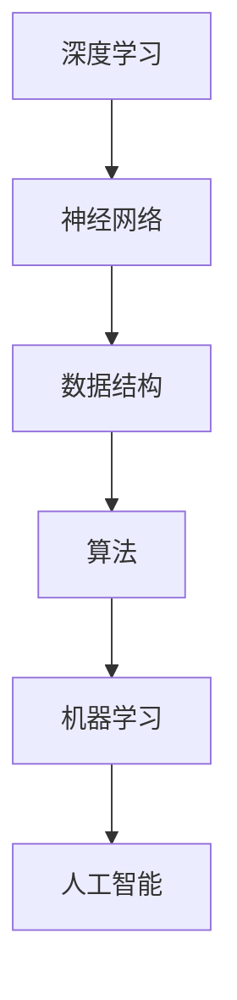

                 

关键词：深度学习、算法原理、数学模型、实践应用、未来展望

> 摘要：本文旨在深入探讨IT领域中知识的深度探索。我们将从表象深入本质，通过介绍核心概念、算法原理、数学模型、实践应用等方面，揭示知识背后的逻辑和规律，为读者提供一种全新的理解和思考方式。

## 1. 背景介绍

在信息技术飞速发展的今天，知识的深度探索成为了推动技术进步和创新的关键。然而，在实际学习和应用过程中，许多人往往只停留在表面，缺乏对知识本质的深入理解和探索。本文将通过对核心概念、算法原理、数学模型和实践应用的深入探讨，帮助读者从表象深入本质，理解知识的内在逻辑和规律。

## 2. 核心概念与联系

在IT领域中，核心概念是理解和应用知识的基础。以下是一个关于深度学习、神经网络、数据结构和算法等核心概念的 Mermaid 流程图。



### 2.1 深度学习

深度学习是机器学习的一个分支，它通过模拟人脑中的神经网络结构，实现对复杂数据的自动特征提取和模式识别。深度学习已经在图像识别、语音识别、自然语言处理等领域取得了显著成果。

### 2.2 神经网络

神经网络是深度学习的基础，它由多个神经元组成，通过层层叠加，形成深度神经网络。神经网络通过调整神经元之间的权重，实现对输入数据的分类、回归等操作。

### 2.3 数据结构

数据结构是IT领域中必不可少的一部分，它决定了数据在计算机中的存储和操作方式。常见的有数组、链表、树、图等。

### 2.4 算法

算法是解决特定问题的步骤集合。在IT领域中，算法广泛应用于排序、查找、图论、动态规划等领域。

### 2.5 机器学习和人工智能

机器学习和人工智能是IT领域的前沿方向，它们通过模拟人类思维过程，实现对数据的自动分析和决策。

## 3. 核心算法原理 & 具体操作步骤

### 3.1 算法原理概述

在IT领域中，核心算法是解决特定问题的核心。以下是一个关于排序算法的原理概述。

排序算法是一种将一组数据按照特定顺序排列的算法。常见的排序算法有冒泡排序、选择排序、插入排序、快速排序等。

### 3.2 算法步骤详解

以冒泡排序为例，其基本步骤如下：

1. 比较相邻的元素。
2. 如果第一个比第二个大（假设是升序排序），就交换它们两个。
3. 对每一对相邻元素做同样的工作，从开始第一对到结尾的最后一对。
4. 针对所有的元素重复以上的步骤，除了最后一个。
5. 重复步骤1~4，直到排序完成。

### 3.3 算法优缺点

冒泡排序的优点是简单易懂，易于实现。缺点是时间复杂度为O(n^2)，对于大数据集效率较低。

### 3.4 算法应用领域

冒泡排序广泛应用于各种数据处理和排序场景，如数据库排序、文本排序等。

## 4. 数学模型和公式 & 详细讲解 & 举例说明

在IT领域中，数学模型是描述和解决问题的有力工具。以下是一个关于线性回归的数学模型。

### 4.1 数学模型构建

线性回归模型表示为：

$$ y = wx + b $$

其中，$y$ 为因变量，$x$ 为自变量，$w$ 为权重，$b$ 为偏置。

### 4.2 公式推导过程

线性回归模型通过最小二乘法进行推导，目标是找到最佳拟合直线，使预测值与实际值之间的误差最小。

### 4.3 案例分析与讲解

假设我们要预测一个学生的成绩，已知自变量为学习时长和考试频率，因变量为成绩。通过线性回归模型，我们可以得到以下预测公式：

$$ 成绩 = 学习时长 \times 权重 + 考试频率 \times 权重 + 偏置 $$

通过训练数据集，我们可以计算出权重和偏置，从而实现对成绩的预测。

## 5. 项目实践：代码实例和详细解释说明

为了更好地理解线性回归模型，以下是一个简单的Python代码实例。

```python
import numpy as np

# 模拟训练数据
X = np.array([[1, 2], [2, 3], [3, 4]])
y = np.array([1, 2, 3])

# 梯度下降法求解权重和偏置
def gradient_descent(X, y, w, b, epochs, learning_rate):
    for epoch in range(epochs):
        predictions = X.dot(w) + b
        error = predictions - y
        w -= learning_rate * X.T.dot(error)
        b -= learning_rate * np.sum(error)
        print(f"Epoch {epoch + 1}: w = {w}, b = {b}")

# 初始化权重和偏置
w = np.random.rand(2, 1)
b = np.random.rand(1)

# 训练模型
gradient_descent(X, y, w, b, 1000, 0.01)

# 测试模型
test_data = np.array([[4, 5]])
predicted_score = test_data.dot(w) + b
print(f"Predicted score: {predicted_score}")
```

通过这个实例，我们可以看到如何使用Python实现线性回归模型，并通过梯度下降法求解权重和偏置。最后，我们可以使用训练好的模型对新的数据进行预测。

## 6. 实际应用场景

线性回归模型在实际应用中非常广泛，如：

- 经济预测：预测股票价格、通货膨胀率等。
- 医疗诊断：预测疾病发生的风险。
- 机器学习：作为特征提取和分类的基础模型。

## 7. 工具和资源推荐

### 7.1 学习资源推荐

- 《深度学习》（Ian Goodfellow、Yoshua Bengio、Aaron Courville 著）
- 《统计学习方法》（李航 著）
- 《Python机器学习》（Scikit-Learn、Matplotlib、Pandas、Numpy等库）

### 7.2 开发工具推荐

- Jupyter Notebook：用于编写和运行Python代码。
- PyCharm：一款强大的Python集成开发环境。

### 7.3 相关论文推荐

- 《深度学习：人类级别的视觉系统》（Yoshua Bengio、Yann LeCun、Geoffrey Hinton 著）
- 《深度学习综述》（Geoffrey Hinton、Yoshua Bengio、Yann LeCun 著）
- 《统计学习方法》（李航 著）

## 8. 总结：未来发展趋势与挑战

在未来，深度学习和人工智能将继续推动IT领域的发展。然而，我们也面临着一些挑战，如算法的透明性、可解释性、数据隐私保护等。为了应对这些挑战，我们需要持续学习和创新，以推动技术的进步。

## 9. 附录：常见问题与解答

### 9.1 如何理解深度学习？

深度学习是一种基于神经网络的学习方法，通过多层神经元的堆叠，实现对复杂数据的自动特征提取和模式识别。

### 9.2 如何选择合适的排序算法？

根据具体的应用场景和数据规模，选择适合的排序算法。例如，对于大数据集，可以选择快速排序或归并排序；对于小数据集，可以选择冒泡排序或插入排序。

### 9.3 如何实现线性回归模型？

可以使用Python等编程语言实现线性回归模型。常用的方法有梯度下降法、随机梯度下降法等。

----------------------------------------------------------------

以上是文章的完整内容，希望对您有所帮助。如果您有任何问题或需要进一步讨论，请随时告诉我。作者：禅与计算机程序设计艺术 / Zen and the Art of Computer Programming。

