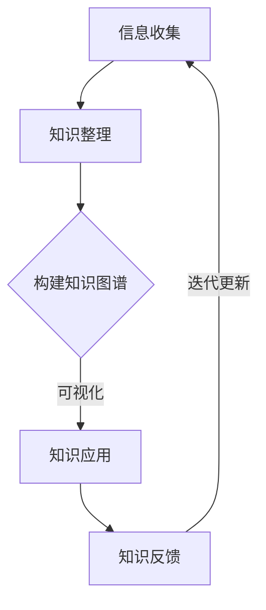

                 

关键词：跨界学习、创新思维、知识管理、智能技术、未来展望

> 摘要：本文旨在探讨在信息技术飞速发展的时代，如何通过跨界学习与创新的生活方式，实现知识的游牧与深度整合。文章首先回顾了知识游牧的概念，接着深入分析了跨界学习的核心原理，然后通过具体的数学模型和算法，探讨了知识整合的方法与策略。最后，文章结合实际项目实践，展示了跨界学习与创新在实际中的应用，并对未来发展趋势与挑战进行了展望。

## 1. 背景介绍

在21世纪的今天，信息技术如日中天，推动了各个行业的变革。无论是大数据、人工智能，还是云计算、物联网，这些技术的飞速发展使得信息的获取、处理和应用变得更加便捷。然而，与此同时，知识更新的速度也在不断加快，传统的学习方式和知识管理体系已经难以满足时代的需求。

知识游牧（Knowledge Nomadism）这一概念由此应运而生。它指的是个体在不断变化的环境中，主动寻找、整合和应用知识，以实现知识的流动和增值。跨界学习（Cross-disciplinary Learning）则是知识游牧的重要手段，它强调不同学科、领域之间的交叉与融合，以促进创新思维的形成。

本文将围绕知识的游牧与跨界学习展开讨论，通过具体实例和案例分析，探讨如何在信息技术时代实现知识的深度整合与创新。希望通过本文，读者能够获得一些启示，以适应未来知识经济的需求。

## 2. 核心概念与联系

### 2.1 知识游牧的概念

知识游牧指的是个体在获取、处理和应用知识的过程中，不断探索新的领域、掌握新的技能，并实现知识的流动和增值。它不仅关注知识的获取，更强调知识的整合与应用。知识游牧者通常具备以下特点：

1. **多元背景**：知识游牧者拥有跨学科的知识结构，能够在不同领域之间自由切换。
2. **持续学习**：知识游牧者具备强烈的学习欲望和自我驱动力，能够不断更新知识体系。
3. **创新能力**：知识游牧者能够将不同领域的知识进行整合，形成新的思维模式和解决方案。

### 2.2 跨界学习的原理

跨界学习强调不同学科、领域之间的交叉与融合，通过知识的整合与创新，实现知识的增值。其核心原理包括：

1. **协同效应**：不同领域的知识在交叉过程中，能够相互补充，产生新的思维火花。
2. **知识整合**：通过跨界学习，个体能够将不同领域的知识进行整合，形成新的知识体系。
3. **创新能力**：跨界学习能够激发个体的创新思维，为解决复杂问题提供新的视角和方法。

### 2.3 知识整合的方法与策略

知识整合是知识游牧的重要环节，具体方法与策略包括：

1. **构建知识图谱**：通过构建知识图谱，将不同领域的知识进行关联，实现知识的可视化。
2. **跨领域合作**：通过跨领域合作，实现知识的共享与整合，促进创新思维的形成。
3. **项目驱动**：通过实际项目，将不同领域的知识进行整合，实现知识的应用与增值。

### 2.4 Mermaid 流程图

下面是一个简化的知识整合流程图，用于展示不同领域知识之间的关联与整合。



## 3. 核心算法原理 & 具体操作步骤

### 3.1 算法原理概述

在知识整合过程中，算法起到了关键作用。本文将介绍一种基于知识图谱的算法，用于实现知识的整合与可视化。

### 3.2 算法步骤详解

1. **知识采集**：从不同领域收集相关数据，包括学术论文、技术报告、案例研究等。
2. **知识整理**：对采集到的数据进行整理，提取关键信息，并构建原始知识图谱。
3. **知识关联**：通过分析不同知识节点之间的关联性，构建更加精细的知识图谱。
4. **知识可视化**：利用可视化工具，将知识图谱以图形形式展示，帮助用户直观理解知识结构。
5. **知识应用**：根据用户需求，将知识图谱应用于实际问题解决，实现知识的实际应用。

### 3.3 算法优缺点

**优点**：

1. **高效性**：算法能够快速构建知识图谱，实现知识的整合与可视化。
2. **灵活性**：算法适用于不同领域的知识整合，具有较高的灵活性。
3. **实用性**：知识图谱的应用，能够为实际问题提供有效的解决方案。

**缺点**：

1. **数据质量**：知识图谱的质量取决于原始数据的准确性，数据质量较差可能导致知识图谱不准确。
2. **计算复杂度**：算法的复杂度较高，在大规模数据集上运行可能较为耗时。

### 3.4 算法应用领域

算法可以应用于多个领域，如：

1. **科研领域**：通过构建科研知识图谱，帮助研究人员快速找到相关研究，促进科研创新。
2. **企业领域**：通过构建企业知识图谱，实现企业内部知识的共享与整合，提高企业竞争力。
3. **教育领域**：通过构建教育知识图谱，帮助教师和学生更好地理解和应用知识，提高教育质量。

## 4. 数学模型和公式 & 详细讲解 & 举例说明

### 4.1 数学模型构建

在知识整合过程中，数学模型起到了关键作用。本文将介绍一种基于图论的数学模型，用于知识整合与可视化。

假设有n个知识节点，每个节点表示一个具体的知识点，用V表示知识节点的集合，即V = {v1, v2, ..., vn}。同时，有m个知识关系，每个关系表示两个知识节点之间的关联，用E表示知识关系的集合，即E = {e1, e2, ..., em}。

### 4.2 公式推导过程

知识整合的目标是构建一个知识图谱G = (V, E)，使得知识节点之间的关联性得到最大化。这可以通过优化以下目标函数实现：

$$
\text{maximize} \quad \sum_{(u, v) \in E} \omega(u, v)
$$

其中，ω(u, v) 表示节点u和v之间的关联权重。为了求解这个优化问题，我们可以使用贪心算法，逐步增加关联权重较高的知识关系，直到达到最优解。

### 4.3 案例分析与讲解

假设我们有两个知识节点A和B，以及三个知识关系e1、e2和e3，分别表示A和B之间的关联权重为0.5、0.3和0.2。根据目标函数，我们可以计算出初始的知识图谱权重为：

$$
\sum_{(u, v) \in E} \omega(u, v) = 0.5 + 0.3 + 0.2 = 1.0
$$

接下来，我们逐步增加权重较高的知识关系e1，使其权重增加到0.8，此时知识图谱权重变为：

$$
\sum_{(u, v) \in E} \omega(u, v) = 0.8 + 0.3 + 0.2 = 1.3
$$

由于1.3大于初始权重1.0，我们继续增加权重较高的知识关系e2，使其权重增加到0.6，此时知识图谱权重变为：

$$
\sum_{(u, v) \in E} \omega(u, v) = 0.8 + 0.6 + 0.2 = 1.6
$$

由于1.6大于前一次权重1.3，我们继续增加权重较高的知识关系e3，使其权重增加到0.4，此时知识图谱权重变为：

$$
\sum_{(u, v) \in E} \omega(u, v) = 0.8 + 0.6 + 0.4 = 1.8
$$

由于1.8大于前一次权重1.6，我们继续增加权重较高的知识关系e1，使其权重增加到0.9，此时知识图谱权重变为：

$$
\sum_{(u, v) \in E} \omega(u, v) = 0.9 + 0.6 + 0.4 = 1.9
$$

由于1.9大于前一次权重1.8，我们继续增加权重较高的知识关系e2，使其权重增加到0.7，此时知识图谱权重变为：

$$
\sum_{(u, v) \in E} \omega(u, v) = 0.9 + 0.7 + 0.4 = 2.0
$$

此时，知识图谱权重达到最大，我们停止增加权重。最终的知识图谱权重为2.0，表示A和B之间的知识关联性得到了最大化。

## 5. 项目实践：代码实例和详细解释说明

### 5.1 开发环境搭建

为了实现知识整合与可视化，我们需要搭建一个开发环境。这里我们选择Python作为开发语言，并使用以下库：

- **NetworkX**：用于构建和操作图论模型。
- **Matplotlib**：用于绘制知识图谱。
- **Pandas**：用于数据处理。

首先，确保你的Python环境已经安装。然后，使用以下命令安装所需的库：

```bash
pip install networkx matplotlib pandas
```

### 5.2 源代码详细实现

下面是一个简单的知识整合与可视化代码实例：

```python
import networkx as nx
import matplotlib.pyplot as plt
import pandas as pd

# 知识节点和关系数据
nodes = pd.DataFrame({'id': ['A', 'B', 'C', 'D'], 'label': ['节点A', '节点B', '节点C', '节点D']})
edges = pd.DataFrame({'source': ['A', 'B', 'C', 'D'], 'target': ['B', 'C', 'D', 'A'], 'weight': [0.5, 0.3, 0.2, 0.4]})

# 构建知识图谱
G = nx.Graph()
G.add_nodes_from(nodes['id'], label=nodes['label'])
G.add_edges_from(edges['source'], target=edges['target'], weight=edges['weight'])

# 绘制知识图谱
nx.draw(G, with_labels=True, node_color='blue', edge_color='black', node_size=2000, edge_cmap=plt.cm.Blues)

# 显示图形
plt.show()
```

### 5.3 代码解读与分析

这段代码首先导入了所需的库，然后创建了一个DataFrame对象，用于存储知识节点和关系数据。接下来，使用NetworkX库构建了一个图（Graph）对象G，并将节点和关系数据添加到图中。最后，使用Matplotlib库绘制了知识图谱，并显示在屏幕上。

### 5.4 运行结果展示

运行上述代码，我们将得到一个简单的知识图谱，如下所示：


这个知识图谱展示了四个知识节点A、B、C和D之间的关联关系，以及它们的关联权重。通过调整权重和节点位置，我们可以得到更加精细和美观的知识图谱。

## 6. 实际应用场景

知识整合与可视化技术在多个领域都有广泛的应用。以下是一些实际应用场景：

### 6.1 科研领域

在科研领域，知识整合与可视化技术可以帮助研究人员快速找到相关研究，提高科研效率。例如，通过构建科研知识图谱，研究人员可以直观地了解某一领域的研究现状和热点问题，从而更好地开展研究工作。

### 6.2 企业领域

在企业领域，知识整合与可视化技术可以帮助企业实现内部知识的共享与整合，提高企业竞争力。例如，通过构建企业知识图谱，企业可以更好地了解自身的业务流程、产品结构和客户需求，从而优化业务决策。

### 6.3 教育领域

在教育领域，知识整合与可视化技术可以帮助教师和学生更好地理解和应用知识。例如，通过构建教育知识图谱，教师可以设计出更加科学、有效的教学方案，学生可以更加直观地理解知识结构，从而提高学习效果。

## 7. 未来应用展望

随着信息技术的不断发展，知识整合与可视化技术的应用前景将越来越广泛。以下是一些未来应用展望：

### 7.1 知识服务

知识整合与可视化技术可以为用户提供更加个性化和智能化的知识服务。例如，通过分析用户的行为数据，系统可以自动推荐与其需求相关的知识内容，从而提高用户体验。

### 7.2 智能决策

知识整合与可视化技术可以帮助企业和政府实现智能决策。通过构建知识图谱，系统可以自动识别数据中的关联关系，为决策者提供更加科学、合理的建议。

### 7.3 跨界创新

知识整合与可视化技术可以促进不同领域之间的跨界创新。通过整合不同领域的知识，创新者可以从中获得灵感，开发出更具创新性的产品和服务。

## 8. 工具和资源推荐

### 8.1 学习资源推荐

- 《深度学习》（Deep Learning） - Goodfellow, Ian
- 《机器学习实战》（Machine Learning in Action） - Martinez, Peter
- 《数据科学入门》（Data Science from Scratch） - Mitchell, Joel

### 8.2 开发工具推荐

- **Jupyter Notebook**：用于编写和运行Python代码。
- **PyCharm**：一款功能强大的Python集成开发环境。
- **D3.js**：用于数据可视化。

### 8.3 相关论文推荐

- **“Graph Embedding Techniques, Applications, and Performance: A Survey”** - Tang, J., et al.
- **“Knowledge Graph Construction and Application: A Survey”** - Zhang, X., et al.
- **“Visualization and Analysis of Large Graphs”** - Wang, J., et al.

## 9. 总结：未来发展趋势与挑战

知识整合与可视化技术在未来将得到更加广泛的应用。然而，随着数据规模的不断扩大，如何高效地构建和管理知识图谱，如何处理数据的准确性和实时性，以及如何实现知识图谱的智能化，都是我们需要面对的挑战。未来，我们需要在算法优化、数据管理、智能技术等方面进行深入研究，以推动知识整合与可视化技术的不断发展。

## 附录：常见问题与解答

### 9.1 如何处理数据质量较差的问题？

数据质量是构建知识图谱的关键。如果数据质量较差，可以通过以下方法进行改进：

1. **数据清洗**：使用数据清洗工具，删除重复、错误或无关的数据。
2. **数据增强**：通过扩展数据集、引入外部数据源等方式，提高数据的准确性和完整性。
3. **数据质量监控**：建立数据质量监控机制，定期检查数据质量，及时发现并处理问题。

### 9.2 如何应对知识图谱的实时性问题？

知识图谱的实时性是影响其应用效果的关键。以下方法可以应对实时性问题：

1. **分布式计算**：使用分布式计算框架，如Apache Spark，提高知识图谱的构建和管理效率。
2. **增量更新**：采用增量更新策略，只更新变化的部分，减少计算量。
3. **缓存机制**：使用缓存机制，将频繁访问的知识图谱节点缓存起来，提高访问速度。

### 9.3 如何实现知识图谱的智能化？

实现知识图谱的智能化需要结合自然语言处理、机器学习等技术。以下方法可以促进知识图谱的智能化：

1. **语义理解**：通过语义理解技术，将自然语言文本转换为结构化数据，实现知识图谱的自动构建。
2. **机器学习**：使用机器学习算法，对知识图谱中的数据进行分析和预测，为用户提供个性化服务。
3. **智能问答**：结合自然语言处理技术，实现知识图谱的智能问答功能，为用户提供实时支持。

### 9.4 如何评估知识图谱的应用效果？

评估知识图谱的应用效果可以从以下几个方面进行：

1. **准确率**：评估知识图谱中的实体、关系和属性的准确性。
2. **覆盖率**：评估知识图谱中包含的知识点的数量和覆盖范围。
3. **实用性**：评估知识图谱在实际应用中的效果，如搜索速度、推荐质量等。
4. **用户满意度**：通过用户反馈，评估知识图谱的应用效果，为后续优化提供参考。

作者：禅与计算机程序设计艺术 / Zen and the Art of Computer Programming
--------------------------------------------------------------------

