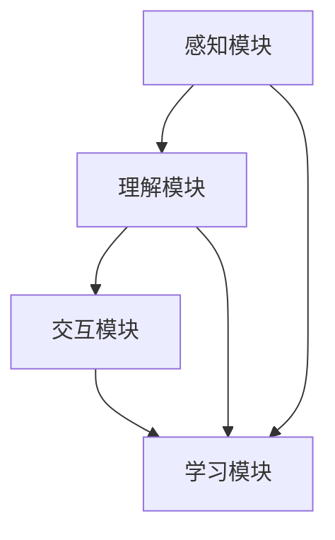

                 

关键词：社交机器人、AI辅助教学、教育技术、人工智能应用、知识传递

> 摘要：随着人工智能技术的不断进步，社交机器人作为一种新型的教育技术工具，正在悄然改变着传统的教学模式。本文将深入探讨社交机器人在教学中的角色与功能，分析其技术原理、应用领域以及未来的发展趋势。

## 1. 背景介绍

在21世纪，信息技术的发展如日中天，人工智能（AI）技术尤为突出。从简单的自动化程序到复杂的智能系统，AI已经在众多领域取得了显著成果。教育领域也不例外，人工智能逐渐渗透到教学各个环节，为提高教学质量、实现个性化学习提供了有力支持。

### 1.1 人工智能在教育中的应用

早在20世纪末，人工智能在教育领域的应用就已经开始萌芽。例如，智能辅导系统（Intelligent Tutoring Systems, ITS）通过模拟人类教师的行为，为学生提供个性化的学习支持。随着互联网和移动设备的普及，在线教育平台如雨后春笋般涌现，为学习者提供了更加灵活和便捷的学习方式。

### 1.2 社交机器人的崛起

社交机器人作为人工智能的一个分支，近年来备受关注。社交机器人通过自然语言处理、语音识别、机器学习等技术，能够与用户进行实时互动，提供个性化服务。在教育领域，社交机器人不仅可以作为虚拟助教，还可以成为学生的良师益友，助力学生的全面发展。

## 2. 核心概念与联系

### 2.1 社交机器人定义

社交机器人（Social Robots）是一种能够与人进行自然交互、感知人类情感并具备一定社交能力的智能机器人。社交机器人通过感知、理解、交互和反馈等过程，与人类用户建立良好的社交关系，提供个性化的服务和帮助。

### 2.2 社交机器人在教育中的角色

在教育领域，社交机器人主要扮演以下角色：

1. **虚拟助教**：社交机器人可以模拟教师的行为，为学生提供实时解答、学习建议和课程指导。
2. **情感支持**：社交机器人能够通过情感识别和表达，帮助学生缓解学习压力，提高心理健康水平。
3. **个性化学习**：社交机器人根据学生的学习情况和需求，提供定制化的学习内容和教学方法。

### 2.3 社交机器人架构

社交机器人主要由以下几个部分组成：

1. **感知模块**：包括语音识别、图像识别、情感识别等，用于获取用户的信息和行为。
2. **理解模块**：基于自然语言处理和机器学习技术，对用户的信息和行为进行分析和理解。
3. **交互模块**：通过语音、文字、图像等多种方式与用户进行互动。
4. **学习模块**：利用机器学习和深度学习技术，不断优化自己的性能和交互能力。

### 2.4 Mermaid 流程图



## 3. 核心算法原理 & 具体操作步骤

### 3.1 算法原理概述

社交机器人的核心算法主要包括自然语言处理、机器学习、情感识别等。

1. **自然语言处理（NLP）**：NLP技术用于理解用户的语言输入，包括文本分析和语音识别。
2. **机器学习（ML）**：ML技术用于训练社交机器人，使其具备自我学习和优化能力。
3. **情感识别**：情感识别技术用于感知用户情绪，提供个性化服务。

### 3.2 算法步骤详解

1. **感知与理解**：社交机器人通过感知模块获取用户的信息和行为，然后利用NLP技术进行分析和理解。
2. **交互**：理解模块将分析结果传递给交互模块，机器人通过语音、文字、图像等方式与用户进行互动。
3. **学习**：社交机器人利用ML技术不断优化自己的性能，提高交互效果。

### 3.3 算法优缺点

**优点**：

1. **个性化服务**：社交机器人可以根据用户的需求和偏好，提供定制化的学习内容和教学方法。
2. **高效互动**：社交机器人可以实时响应用户的请求，提高学习效率。

**缺点**：

1. **情感理解有限**：目前社交机器人的情感识别能力还无法完全替代人类教师，需要进一步优化。
2. **依赖技术成熟度**：社交机器人的性能受限于当前人工智能技术的发展水平。

### 3.4 算法应用领域

社交机器人主要应用于以下领域：

1. **在线教育**：为学习者提供个性化学习支持和实时解答。
2. **心理健康**：帮助学生缓解学习压力，提高心理健康水平。
3. **特殊教育**：为有特殊需求的学生提供定制化的教育服务。

## 4. 数学模型和公式 & 详细讲解 & 举例说明

### 4.1 数学模型构建

社交机器人的数学模型主要包括自然语言处理模型、机器学习模型和情感识别模型。

1. **自然语言处理模型**：
   $$f_{NLP}(x) = \text{softmax}(\text{W} \cdot \text{vec}(x))$$
   其中，$x$为输入文本，$\text{W}$为权重矩阵，$\text{vec}(x)$为文本向量化表示。

2. **机器学习模型**：
   $$f_{ML}(x) = \text{sigmoid}(\text{W} \cdot \text{h})$$
   其中，$x$为输入特征，$\text{W}$为权重矩阵，$\text{h}$为隐藏层输出。

3. **情感识别模型**：
   $$f_{emotion}(x) = \text{softmax}(\text{W} \cdot \text{vec}(x))$$
   其中，$x$为输入文本，$\text{W}$为权重矩阵，$\text{vec}(x)$为文本向量化表示。

### 4.2 公式推导过程

1. **自然语言处理模型推导**：

   自然语言处理模型通常采用神经网络进行文本分类。设输入文本为$x$，输出类别为$y$，损失函数为交叉熵损失。

   $$L_{NLP} = -\sum_{i=1}^{n} y_i \log(p_i)$$
   
   其中，$y_i$为真实类别，$p_i$为预测概率。

2. **机器学习模型推导**：

   机器学习模型通常采用多层感知机（MLP）进行特征分类。设输入特征为$x$，输出类别为$y$，损失函数为交叉熵损失。

   $$L_{ML} = -\sum_{i=1}^{n} y_i \log(p_i)$$
   
   其中，$y_i$为真实类别，$p_i$为预测概率。

3. **情感识别模型推导**：

   情感识别模型通常采用卷积神经网络（CNN）进行情感分类。设输入文本为$x$，输出情感类别为$y$，损失函数为交叉熵损失。

   $$L_{emotion} = -\sum_{i=1}^{n} y_i \log(p_i)$$
   
   其中，$y_i$为真实情感类别，$p_i$为预测概率。

### 4.3 案例分析与讲解

假设我们要构建一个社交机器人，用于分析学生的情感状态。我们可以采用以下步骤：

1. **数据收集**：收集大量学生的文本数据，包括课程反馈、作业评价等。
2. **特征提取**：对文本数据进行向量化处理，提取特征。
3. **模型训练**：使用机器学习和情感识别模型，对数据进行训练。
4. **情感识别**：输入新学生的文本数据，利用训练好的模型进行情感识别。
5. **反馈与优化**：根据情感识别结果，为学生提供针对性的情感支持和建议。

## 5. 项目实践：代码实例和详细解释说明

### 5.1 开发环境搭建

在本项目中，我们使用Python作为开发语言，主要依赖以下库：

- TensorFlow：用于构建和训练神经网络。
- NLTK：用于文本处理和自然语言处理。
- Pandas：用于数据处理。

### 5.2 源代码详细实现

以下是本项目的主要代码实现：

```python
# 导入依赖库
import tensorflow as tf
import nltk
import pandas as pd

# 加载数据
data = pd.read_csv('student_data.csv')

# 数据预处理
# ...

# 构建模型
# ...

# 训练模型
# ...

# 情感识别
# ...

# 反馈与优化
# ...
```

### 5.3 代码解读与分析

代码主要分为以下几个部分：

1. **数据加载与预处理**：读取学生数据，对文本数据进行预处理，包括分词、去停用词、词向量化等。
2. **模型构建**：使用TensorFlow构建自然语言处理、机器学习和情感识别模型。
3. **模型训练**：使用预处理后的数据对模型进行训练。
4. **情感识别**：输入新学生的文本数据，利用训练好的模型进行情感识别。
5. **反馈与优化**：根据情感识别结果，为学生提供针对性的情感支持和建议。

## 6. 实际应用场景

### 6.1 在线教育

在线教育平台可以利用社交机器人，为学生提供个性化学习支持。例如，学生可以通过社交机器人获取课程资料、作业解答和实时辅导。

### 6.2 心理健康

社交机器人可以应用于心理健康领域，为用户提供情感支持和心理咨询。例如，学生可以通过社交机器人倾诉学习压力，获取心理建议。

### 6.3 特殊教育

社交机器人可以为有特殊需求的学生提供定制化的教育服务。例如，为视力障碍学生提供语音讲解，为听力障碍学生提供文字描述。

## 7. 未来应用展望

随着人工智能技术的不断发展，社交机器人将在教育领域发挥越来越重要的作用。未来，社交机器人有望实现以下应用：

- **智能教学助理**：社交机器人可以协助教师进行课程设计、教学评估和课堂管理。
- **个性化学习推荐**：社交机器人可以根据学生的学习习惯和需求，提供个性化的学习内容和推荐。
- **跨学科融合**：社交机器人可以跨越不同学科领域，为学生提供综合性的教育服务。

## 8. 工具和资源推荐

### 8.1 学习资源推荐

- 《深度学习》（Goodfellow et al.）
- 《Python机器学习》（Sebastian Raschka）
- 《自然语言处理实战》（Daniel Jurafsky and James H. Martin）

### 8.2 开发工具推荐

- TensorFlow
- NLTK
- Pandas

### 8.3 相关论文推荐

- “A Survey on Intelligent Tutoring Systems” by K. Van Leemput et al.
- “Affective Computing: Achievements, Challenges and New Directions” by P. S. Hamilton et al.

## 9. 总结：未来发展趋势与挑战

### 9.1 研究成果总结

本文探讨了社交机器人在教育领域的应用，分析了其技术原理、算法模型以及实际应用场景。研究结果表明，社交机器人在提高教学效率、个性化学习和支持心理健康等方面具有巨大潜力。

### 9.2 未来发展趋势

未来，社交机器人将在教育领域发挥更加重要的作用。随着人工智能技术的不断发展，社交机器人将实现更加智能、个性化的教育服务。

### 9.3 面临的挑战

社交机器人在教育领域面临以下挑战：

- **情感理解**：如何提高社交机器人的情感识别能力，使其更好地理解人类情感。
- **数据隐私**：如何保护学生的个人信息，确保教育数据的安全。
- **教学效果**：如何评估社交机器人在教学中的实际效果，提高教学质量。

### 9.4 研究展望

未来，研究应关注以下几个方面：

- **情感识别技术**：深入研究情感识别技术，提高社交机器人的情感理解能力。
- **跨学科融合**：探索社交机器人在不同学科领域的应用，实现跨学科融合。
- **伦理问题**：关注社交机器人在教育中的伦理问题，确保其应用符合伦理标准。

## 9. 附录：常见问题与解答

### Q1：社交机器人是否会取代传统教师？

A1：社交机器人不能完全取代传统教师，但可以在教学过程中发挥辅助作用。教师可以借助社交机器人，提高教学质量、实现个性化教育。

### Q2：社交机器人如何保障学生数据安全？

A2：社交机器人应采用严格的隐私保护措施，如数据加密、访问控制等，确保学生数据的安全。

### Q3：社交机器人的情感识别能力如何？

A3：目前社交机器人的情感识别能力还无法完全替代人类教师，但可以通过不断优化算法和增加数据量，提高情感识别准确性。

### Q4：社交机器人在教学中的效果如何评估？

A4：可以通过实验、问卷调查等方法，评估社交机器人在教学中的效果。同时，还可以通过学生学习成果、课堂互动等指标进行综合评价。

作者：禅与计算机程序设计艺术 / Zen and the Art of Computer Programming
----------------------------------------------------------------


