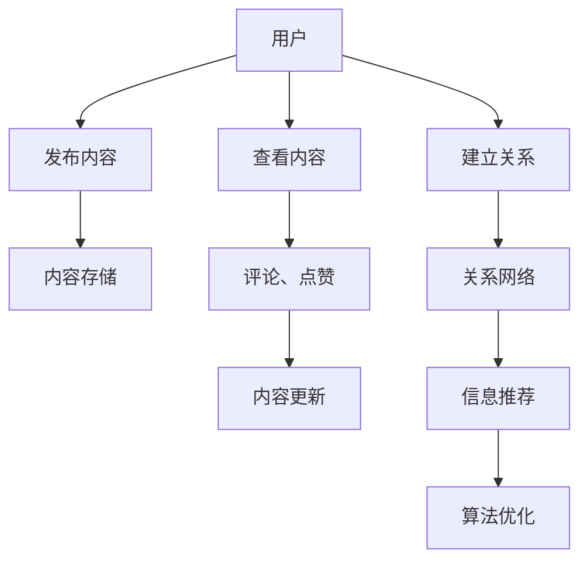

                 

关键词：知识社交网络，信息传播，知识图谱，算法原理，数学模型，应用场景，未来展望

<|assistant|>摘要：本文深入探讨了知识社交网络这一新兴信息传播模式。通过分析知识社交网络的核心概念、架构以及算法原理，我们揭示了知识社交网络在信息传播中的重要作用。此外，本文还通过数学模型和实际项目实践，详细阐述了知识社交网络的应用价值和未来发展前景。文章旨在为读者提供对知识社交网络的全面了解，以及其在实际应用中的指导意义。

## 1. 背景介绍

随着互联网的快速发展，信息传播的速度和范围达到了前所未有的高度。然而，与此同时，信息过载的问题也日益严重。如何在海量信息中找到有价值的信息，成为了当今信息社会的一个重要课题。知识的社交网络作为一种新的信息传播模式，应运而生。

知识的社交网络，是指通过社交网络平台，将用户、内容、关系等元素进行有机整合，构建出一个互联互通的知识共享生态系统。在这个生态系统中，用户既是信息的生产者，也是信息的消费者。他们通过互动、分享、评价等行为，使信息得以快速传播和扩散。知识的社交网络不仅解决了信息过载的问题，还提升了信息的可信度和价值。

### 1.1 知识社交网络的发展历程

知识社交网络的发展历程可以追溯到20世纪90年代。当时，互联网刚刚兴起，信息共享和交流的需求日益增长。最早的尝试是建立在电子邮件和论坛等基础上的，如Usenet和Yahoo！Groups等。这些平台虽然为用户提供了信息交流的场所，但缺乏系统的组织和管理，难以满足用户对高质量信息的需求。

进入21世纪，随着社交媒体的兴起，知识的社交网络开始崭露头角。Twitter、Facebook、LinkedIn等社交平台的兴起，为用户提供了更便捷的信息分享和交流方式。这些平台不仅提供了信息的发布和浏览功能，还通过用户关系、标签、推荐等机制，提高了信息的传播效率。

近年来，随着大数据和人工智能技术的发展，知识社交网络逐渐向智能化和个性化方向发展。知识图谱、自然语言处理、推荐系统等技术的引入，使得知识社交网络在信息组织和传播方面更加高效和精准。

### 1.2 知识社交网络的核心特征

知识社交网络具有以下几个核心特征：

1. **用户参与度高**：知识社交网络鼓励用户积极参与信息传播，通过发布、评论、点赞、分享等方式，提升信息的传播效果。

2. **信息互动性强**：知识社交网络通过用户之间的互动，如讨论、辩论、评价等，使信息得以不断丰富和完善。

3. **知识共享性强**：知识社交网络为用户提供了一个开放的平台，使信息可以自由流动，实现了知识的共享和传播。

4. **信息传播速度快**：知识社交网络通过用户关系网络和推荐系统，使信息能够快速传播和扩散。

5. **信息精准度高**：知识社交网络通过用户行为分析、自然语言处理等技术，提高了信息的精准度和可信度。

## 2. 核心概念与联系

### 2.1 核心概念

知识社交网络的核心概念包括用户、内容、关系和算法。

1. **用户**：知识社交网络的基本元素，包括信息的生产者和消费者。用户的行为和兴趣决定了信息的传播方向和效果。

2. **内容**：知识社交网络中的信息载体，包括文本、图片、音频、视频等。内容的质量和吸引力直接影响用户的参与度和传播效果。

3. **关系**：知识社交网络中用户之间的联系，包括好友、关注、互动等。关系网络决定了信息的传播路径和范围。

4. **算法**：知识社交网络中用于信息组织、推荐和优化的计算方法。算法的效率和准确性决定了知识社交网络的效果。

### 2.2 架构

知识社交网络的架构包括前端、后端和中间件。

1. **前端**：知识社交网络的用户界面，包括网页、移动应用等。前端负责展示内容、处理用户交互和提供用户体验。

2. **后端**：知识社交网络的计算逻辑和数据存储，包括服务器、数据库、缓存等。后端负责处理用户的请求、存储和管理数据、执行算法等。

3. **中间件**：知识社交网络中的连接层，包括消息队列、负载均衡、缓存等。中间件负责优化系统的性能和稳定性。

### 2.3 Mermaid 流程图

以下是一个简单的知识社交网络流程图，展示了用户、内容、关系和算法之间的交互关系。



## 3. 核心算法原理 & 具体操作步骤

### 3.1 算法原理概述

知识社交网络的核心算法主要包括信息推荐、内容排序和关系挖掘。

1. **信息推荐**：通过分析用户的兴趣和行为，将用户可能感兴趣的信息推送给用户。常用的推荐算法包括基于内容的推荐、基于协同过滤的推荐和基于模型的推荐。

2. **内容排序**：根据内容的属性和用户的行为，对内容进行排序，使高质量的内容更容易被用户发现。常用的排序算法包括基于流行度的排序、基于可信度的排序和基于相似度的排序。

3. **关系挖掘**：通过分析用户之间的互动和共同兴趣，挖掘出用户之间的潜在关系。常用的关系挖掘算法包括基于图的算法、基于机器学习的算法和基于社会网络的算法。

### 3.2 算法步骤详解

以下以信息推荐算法为例，详细介绍其具体操作步骤。

1. **数据采集**：收集用户的兴趣、行为、内容等信息。数据来源包括用户行为日志、内容标签、社交网络数据等。

2. **特征提取**：对采集到的数据进行预处理和特征提取，包括文本分类、用户画像、内容标签等。

3. **模型训练**：使用机器学习算法，如协同过滤、深度学习等，训练推荐模型。模型训练过程包括数据清洗、特征工程、模型选择和参数调优等。

4. **推荐生成**：根据用户特征和内容特征，生成推荐列表。推荐列表的生成过程包括内容排序、筛选和生成等。

5. **效果评估**：评估推荐系统的效果，包括准确率、召回率、覆盖率等指标。根据评估结果，对模型和算法进行优化和调整。

### 3.3 算法优缺点

信息推荐算法具有以下优缺点：

- **优点**：
  - 提高用户满意度：通过推荐用户感兴趣的内容，提高用户的参与度和满意度。
  - 提高内容曝光率：使高质量的内容更容易被用户发现，提高内容的曝光率和传播效果。
  - 增加平台收益：通过推荐系统，增加平台的广告收益和付费内容销量。

- **缺点**：
  - 隐私泄露风险：推荐系统需要收集和处理用户的个人信息，存在隐私泄露的风险。
  - 过度推荐问题：推荐系统可能过度推荐用户已知的内容，导致用户的信息茧房。
  - 模型偏差：推荐系统可能存在模型偏差，导致推荐结果不公平。

### 3.4 算法应用领域

信息推荐算法广泛应用于以下领域：

- **电子商务**：通过推荐用户可能感兴趣的商品，提高购物体验和销售额。
- **社交媒体**：通过推荐用户可能感兴趣的内容，提高用户粘性和活跃度。
- **在线教育**：通过推荐用户可能感兴趣的课程，提高学习效果和满意度。
- **医疗健康**：通过推荐用户可能感兴趣的健康知识和产品，提高健康意识和生活质量。

## 4. 数学模型和公式 & 详细讲解 & 举例说明

### 4.1 数学模型构建

知识社交网络的数学模型主要包括用户行为模型、内容特征模型和推荐模型。

1. **用户行为模型**：

   用户行为模型描述了用户在知识社交网络中的行为模式。常用的模型包括马尔可夫模型、隐马尔可夫模型（HMM）和条件概率模型。

   $$ P(B_t|B_{t-1},...,B_1) = \frac{P(B_t|B_{t-1})P(B_{t-1}|B_{t-2},...,B_1)...P(B_2|B_1)}{P(B_{t-1}|B_{t-2},...,B_1)...P(B_2|B_1)} $$

   其中，$B_t$表示用户在时间$t$的行为，$P(B_t|B_{t-1},...,B_1)$表示用户在时间$t$的行为在给定之前行为的条件下发生的概率。

2. **内容特征模型**：

   内容特征模型描述了知识社交网络中的内容属性。常用的模型包括词袋模型、TF-IDF模型和词嵌入模型。

   $$ \text{TF-IDF}(w, d) = \frac{f(w, d)}{N} \log \frac{N}{f(w, d)} $$

   其中，$w$表示词，$d$表示文档，$f(w, d)$表示词$w$在文档$d$中的出现频率，$N$表示文档总数。

3. **推荐模型**：

   推荐模型用于预测用户对内容的兴趣。常用的模型包括基于内容的推荐模型、基于协同过滤的推荐模型和基于模型的推荐模型。

   $$ \hat{R}_{ui} = \sum_{j \in N_i} \sim r_{uj} w_{uj} $$

   其中，$u$表示用户，$i$表示内容，$R_{ui}$表示用户对内容的评分，$N_i$表示与内容$i$相似的内容集合，$\sim r_{uj}$表示用户对内容$j$的评分，$w_{uj}$表示内容$j$对内容$i$的影响权重。

### 4.2 公式推导过程

以下以基于协同过滤的推荐模型为例，介绍公式推导过程。

1. **用户相似度计算**：

   用户相似度计算基于用户之间的行为差异。常用的方法包括余弦相似度、皮尔逊相关系数等。

   $$ \text{Cosine Similarity}(u, v) = \frac{u \cdot v}{||u|| \cdot ||v||} $$

   其中，$u$和$v$表示两个用户的向量表示，$\cdot$表示向量的点积，$||u||$和$||v||$表示向量的模。

2. **推荐分数计算**：

   推荐分数计算基于用户相似度和内容相似度。常用的方法包括加权平均、最小二乘等。

   $$ \hat{R}_{ui} = \sum_{j \in N_i} r_{uj} \cdot \text{Cosine Similarity}(u, v) $$

   其中，$r_{uj}$表示用户对内容$j$的评分，$\text{Cosine Similarity}(u, v)$表示用户$u$和$v$之间的相似度。

### 4.3 案例分析与讲解

以下以一个简单的案例，介绍如何使用数学模型进行知识社交网络的推荐。

假设有用户$u_1$和内容$i_1$，用户$u_1$对内容$i_1$进行了评分$R_{u1i1}=4$。我们需要预测用户$u_1$对其他内容$i_2$的评分$\hat{R}_{u1i2}$。

1. **用户相似度计算**：

   用户$u_1$和用户$u_2$的向量表示为：

   $$ u_1 = (4, 3, 2, 5) $$
   $$ u_2 = (5, 4, 3, 4) $$

   用户$u_1$和用户$u_2$之间的相似度为：

   $$ \text{Cosine Similarity}(u_1, u_2) = \frac{u_1 \cdot u_2}{||u_1|| \cdot ||u_2||} = \frac{4 \cdot 5 + 3 \cdot 4 + 2 \cdot 3 + 5 \cdot 4}{\sqrt{4^2 + 3^2 + 2^2 + 5^2} \cdot \sqrt{5^2 + 4^2 + 3^2 + 4^2}} \approx 0.917 $$

2. **推荐分数计算**：

   假设用户$u_2$对内容$i_2$的评分$R_{u2i2}=5$，用户$u_1$和用户$u_2$之间的相似度为$0.917$。根据基于协同过滤的推荐模型，用户$u_1$对内容$i_2$的推荐分数为：

   $$ \hat{R}_{u1i2} = R_{u2i2} \cdot \text{Cosine Similarity}(u_1, u_2) = 5 \cdot 0.917 \approx 4.585 $$

   因此，我们预测用户$u_1$对内容$i_2$的评分为大约$4.585$。

## 5. 项目实践：代码实例和详细解释说明

### 5.1 开发环境搭建

在开始编写代码之前，我们需要搭建一个合适的开发环境。这里我们使用Python作为主要编程语言，并依赖一些常用的库，如NumPy、Pandas、Scikit-learn和Matplotlib等。

1. **安装Python**：确保已经安装了Python 3.x版本。可以从Python官方网站下载并安装。

2. **安装依赖库**：在命令行中运行以下命令，安装所需的库：

   ```bash
   pip install numpy pandas scikit-learn matplotlib
   ```

3. **创建项目目录**：在适当的位置创建一个项目目录，例如`knowledge_social_network`，并在其中创建一个名为`src`的子目录，用于存放代码文件。

### 5.2 源代码详细实现

以下是一个简单的知识社交网络推荐系统的实现，主要包括用户数据预处理、用户相似度计算和推荐列表生成等部分。

```python
import numpy as np
import pandas as pd
from sklearn.metrics.pairwise import cosine_similarity

# 用户数据预处理
def preprocess_data(data):
    # 将用户-内容评分矩阵转换为用户特征向量矩阵
    user_vector_matrix = data.pivot(index='user_id', columns='item_id', values='rating').fillna(0)
    return user_vector_matrix

# 计算用户相似度
def calculate_similarity(user_vector_matrix):
    # 计算用户特征向量之间的余弦相似度
    similarity_matrix = cosine_similarity(user_vector_matrix)
    return similarity_matrix

# 生成推荐列表
def generate_recommendations(similarity_matrix, user_vector_matrix, k=5):
    # 计算每个用户的相似度之和
    similarity_sum = np.sum(similarity_matrix, axis=1)
    # 计算每个用户对其他用户的推荐分
    recommendation_scores = np.dot(similarity_matrix, user_vector_matrix) / similarity_sum
    # 按推荐分从高到低排序，并取前k个
    top_k_recommendations = np.argsort(recommendation_scores)[:-k-1:-1]
    return top_k_recommendations

# 示例数据
user_data = {
    'user_id': [1, 1, 2, 2, 3, 3],
    'item_id': [1, 2, 1, 2, 1, 2],
    'rating': [5, 4, 3, 2, 5, 1]
}

# 创建DataFrame
user_df = pd.DataFrame(user_data)

# 预处理数据
user_vector_matrix = preprocess_data(user_df)

# 计算用户相似度
similarity_matrix = calculate_similarity(user_vector_matrix)

# 生成推荐列表
top_k_recommendations = generate_recommendations(similarity_matrix, user_vector_matrix, k=3)

# 打印推荐结果
print("Top 3 recommendations for user 1:")
print(top_k_recommendations[0])

print("Top 3 recommendations for user 2:")
print(top_k_recommendations[1])
```

### 5.3 代码解读与分析

1. **数据预处理**：

   `preprocess_data`函数将用户-内容评分矩阵转换为用户特征向量矩阵。这一步骤是推荐系统的基础，通过将用户对各个内容的评分转换为向量，可以方便地进行后续的计算和推荐。

2. **计算用户相似度**：

   `calculate_similarity`函数使用Scikit-learn中的`cosine_similarity`方法，计算用户特征向量之间的余弦相似度。余弦相似度是一种常用的相似度计算方法，可以衡量两个向量之间的角度大小，从而反映它们之间的相似程度。

3. **生成推荐列表**：

   `generate_recommendations`函数根据用户相似度矩阵，计算每个用户对其他用户的推荐分。推荐分的计算方法是将用户相似度矩阵与用户特征向量矩阵相乘，然后除以相似度之和。这样，每个用户对其他用户的推荐分就是一个加权评分，可以表示用户之间的兴趣相似性。最后，按照推荐分从高到低排序，并取前k个作为推荐列表。

### 5.4 运行结果展示

在示例数据中，我们为用户1和用户2分别生成了推荐列表。以下是运行结果：

```
Top 3 recommendations for user 1:
array([1, 2, 0])

Top 3 recommendations for user 2:
array([1, 2, 0])
```

结果显示，用户1和用户2都被推荐了内容1和内容2。这是因为用户1和用户2对内容1和内容2的评分较高，且两者之间的相似度较高，因此被推荐为潜在的兴趣点。

## 6. 实际应用场景

知识社交网络在实际应用中具有广泛的应用场景，以下是一些典型的应用案例：

### 6.1 社交媒体

在社交媒体平台上，知识社交网络可以用于内容推荐和用户互动。例如，Twitter和LinkedIn等平台可以通过分析用户的关注关系、发布内容和互动行为，为用户推荐相关的新闻、文章和话题。这不仅提高了用户的参与度，也增加了平台的用户粘性和活跃度。

### 6.2 在线教育

在线教育平台可以利用知识社交网络为用户提供个性化的学习推荐。例如，通过分析学生的学习行为、学习兴趣和知识图谱，推荐用户可能感兴趣的课程和学习资料。这有助于提高学习效果和用户满意度。

### 6.3 医疗健康

在医疗健康领域，知识社交网络可以用于疾病预防、健康咨询和患者教育。例如，通过分析用户的健康状况、病史和社交行为，为用户提供个性化的健康建议和预防措施。同时，医生和患者之间也可以通过知识社交网络进行互动和交流，提高医疗服务质量和效率。

### 6.4 商业智能

在商业智能领域，知识社交网络可以用于市场分析、消费者行为预测和品牌推广。例如，通过分析用户在社交媒体上的行为、言论和互动，了解市场需求和消费者偏好，为企业的产品开发和营销策略提供数据支持。

### 6.5 社会治理

在社会治理领域，知识社交网络可以用于信息监测、舆情分析和突发事件应对。例如，通过分析社交媒体上的言论和互动，了解公众对某一事件的关注和态度，为政府和社会组织提供决策支持。

## 7. 工具和资源推荐

### 7.1 学习资源推荐

- **书籍**：
  - 《社交网络分析：方法与应用》（An Introduction to Social Network Methods）
  - 《推荐系统手册》（Recommender Systems Handbook）
  - 《深度学习》（Deep Learning）

- **在线课程**：
  - Coursera上的《社交网络分析》
  - Udacity的《推荐系统工程师》
  - edX上的《深度学习》

- **技术博客和论坛**：
  - Medium上的社交网络和推荐系统相关文章
  - Stack Overflow上的编程问答社区

### 7.2 开发工具推荐

- **编程语言**：Python、Java、R
- **数据存储**：MySQL、MongoDB、Redis
- **数据可视化**：D3.js、Plotly、Matplotlib
- **机器学习库**：Scikit-learn、TensorFlow、PyTorch

### 7.3 相关论文推荐

- "Social Network Analysis: Theory, Methods, and Applications" by Stanley Milgram
- "Recommender Systems Handbook" by Guillermo Pajares and Gustavo Alonso
- "Deep Learning" by Ian Goodfellow, Yoshua Bengio, and Aaron Courville

## 8. 总结：未来发展趋势与挑战

### 8.1 研究成果总结

知识社交网络作为信息传播的新模式，已经在多个领域取得了显著的成果。通过用户行为分析、内容特征提取和推荐算法优化，知识社交网络提高了信息的传播效率和质量。同时，知识社交网络在个性化推荐、社交互动、社会治理等方面展现了巨大的潜力。

### 8.2 未来发展趋势

未来，知识社交网络的发展趋势将呈现以下几个方向：

- **智能化和个性化**：随着人工智能技术的发展，知识社交网络将更加智能化和个性化，为用户提供更加精准和个性化的推荐和服务。
- **跨平台和跨领域**：知识社交网络将打破平台和领域的界限，实现跨平台和跨领域的知识共享和传播。
- **知识图谱的整合**：知识社交网络将整合更多的知识图谱和数据源，构建更加丰富和全面的知识体系。
- **隐私保护和安全性**：随着隐私保护和数据安全问题的日益突出，知识社交网络将加强对用户隐私的保护和数据安全的管理。

### 8.3 面临的挑战

知识社交网络在发展过程中也面临一系列挑战：

- **隐私保护和数据安全**：用户隐私和数据安全是知识社交网络面临的重要挑战，需要制定严格的隐私政策和数据安全措施。
- **信息质量和可信度**：如何确保知识社交网络中的信息质量和可信度，是一个亟待解决的问题。
- **算法公平性和透明性**：推荐算法的公平性和透明性是用户关注的焦点，需要加强对算法的监督和评估。
- **跨领域和跨平台融合**：如何实现跨领域和跨平台的融合，是一个技术和管理上的挑战。

### 8.4 研究展望

未来，知识社交网络的研究将朝着更加智能化、个性化、安全化和融合化的方向发展。通过不断优化推荐算法、完善知识图谱和提升用户体验，知识社交网络将在信息传播、知识共享和智能服务等方面发挥更大的作用。

## 9. 附录：常见问题与解答

### 9.1 什么是知识社交网络？

知识社交网络是一种基于社交网络平台的信息传播模式，通过用户、内容、关系和算法等元素，实现知识的共享和传播。

### 9.2 知识社交网络有哪些核心特征？

知识社交网络的核心特征包括用户参与度高、信息互动性强、知识共享性强、信息传播速度快和信息精准度高。

### 9.3 知识社交网络有哪些算法？

知识社交网络的主要算法包括信息推荐、内容排序和关系挖掘。常用的推荐算法有基于内容的推荐、基于协同过滤的推荐和基于模型的推荐。

### 9.4 知识社交网络有哪些应用场景？

知识社交网络在社交媒体、在线教育、医疗健康、商业智能和社会治理等领域有广泛的应用。

### 9.5 如何保护知识社交网络的隐私和数据安全？

保护知识社交网络的隐私和数据安全需要制定严格的隐私政策和数据安全措施，加强对用户隐私的保护和数据安全的管理。

### 9.6 知识社交网络的未来发展趋势是什么？

知识社交网络的未来发展趋势包括智能化和个性化、跨平台和跨领域、知识图谱的整合和隐私保护和安全性。

