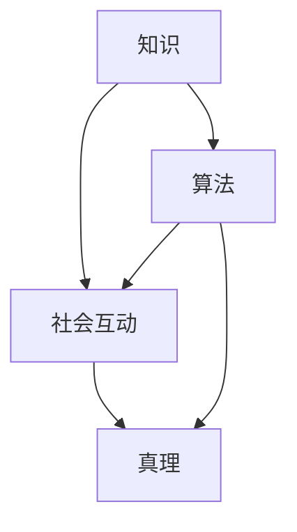

                 

 关键词：知识建构、社会建构、真理、IT领域、算法原理、数学模型、项目实践

> 摘要：本文深入探讨了知识的社会建构过程，分析了真理在IT领域的形成机制。通过剖析核心概念、算法原理、数学模型以及项目实践，我们揭示了知识如何在社会互动中被构建、验证和传播，为IT领域的未来发展提供了新的视角和思考。

## 1. 背景介绍

知识建构理论起源于20世纪中叶，强调知识不仅仅是个人经验的积累，更是社会互动的产物。在IT领域，这一理论具有深远的影响，因为信息技术的发展使得知识的传播和共享变得更加便捷。然而，真理的构建过程在IT领域仍然充满了挑战和争议。

本文旨在从知识的社会建构角度，探讨真理在IT领域的形成过程。我们将通过分析核心概念、算法原理、数学模型以及项目实践，揭示知识如何在社会互动中被构建、验证和传播。

## 2. 核心概念与联系

在探讨知识的社会建构之前，我们需要明确一些核心概念，如知识、社会互动、真理等。

### 2.1 知识

知识是一种结构化的信息，它能够帮助人们理解和解释世界。在IT领域，知识通常包括算法、数据结构、编程语言、技术框架等。

### 2.2 社会互动

社会互动是知识建构的基础。在IT领域，社会互动可以通过多种形式实现，如合作开发、技术讨论、代码审查等。

### 2.3 真理

真理是客观存在的规律和事实。在IT领域，真理往往体现在算法的正确性、数据的有效性和技术的可靠性等方面。

为了更好地理解这些概念之间的关系，我们可以使用Mermaid流程图来展示它们之间的联系。



在这个流程图中，知识通过社会互动不断演变，最终形成真理。同时，算法作为知识的重要组成部分，也在这个过程中发挥着关键作用。

## 3. 核心算法原理 & 具体操作步骤

### 3.1 算法原理概述

在IT领域，算法是知识的重要组成部分。一个有效的算法能够帮助人们解决复杂问题，提高工作效率。本节将介绍一种核心算法——深度学习算法的原理和操作步骤。

深度学习算法基于多层神经网络，通过学习大量数据来模拟人脑的思考过程。其基本原理包括以下步骤：

1. 数据预处理：对原始数据进行清洗、归一化等处理，使其适合算法训练。
2. 神经网络构建：设计多层神经网络结构，包括输入层、隐藏层和输出层。
3. 损失函数设计：选择合适的损失函数，如交叉熵损失函数，用于评估模型预测的准确性。
4. 梯度下降优化：通过反向传播算法，计算损失函数关于模型参数的梯度，并使用梯度下降法更新模型参数。

### 3.2 算法步骤详解

1. **数据预处理**：数据预处理是深度学习算法的第一步。原始数据通常包含噪声、缺失值和不平衡等质量问题。为了提高算法性能，我们需要对数据进行清洗、归一化等处理。

   ```mermaid
   graph TD
   A[数据清洗] --> B[归一化]
   A --> C[数据划分]
   B --> C
   ```

2. **神经网络构建**：神经网络是深度学习算法的核心。我们需要根据问题特点设计合适的网络结构。通常，网络包括输入层、隐藏层和输出层。

   ```mermaid
   graph TD
   A[输入层] --> B[隐藏层1]
   B --> C[隐藏层2]
   C --> D[输出层]
   ```

3. **损失函数设计**：损失函数用于评估模型预测的准确性。选择合适的损失函数对于算法性能至关重要。常见的损失函数包括交叉熵损失函数、均方误差损失函数等。

   ```mermaid
   graph TD
   A[交叉熵损失函数] --> B[均方误差损失函数]
   ```

4. **梯度下降优化**：梯度下降优化是深度学习算法的核心步骤。通过反向传播算法，计算损失函数关于模型参数的梯度，并使用梯度下降法更新模型参数。

   ```mermaid
   graph TD
   A[计算梯度] --> B[更新参数]
   A --> C[迭代优化]
   ```

### 3.3 算法优缺点

**优点**：

- **自适应性强**：深度学习算法能够自动调整网络结构，适应不同类型的数据。
- **泛化能力强**：深度学习算法能够通过大量数据进行训练，提高模型的泛化能力。
- **高效性**：深度学习算法能够处理大规模数据集，提高计算效率。

**缺点**：

- **训练成本高**：深度学习算法需要大量数据进行训练，对计算资源和时间要求较高。
- **解释性差**：深度学习算法的内部结构复杂，难以解释和理解。

### 3.4 算法应用领域

深度学习算法在IT领域有广泛的应用，如自然语言处理、计算机视觉、语音识别等。

- **自然语言处理**：深度学习算法在文本分类、机器翻译、情感分析等方面表现出色。
- **计算机视觉**：深度学习算法在图像识别、目标检测、图像生成等方面有重要应用。
- **语音识别**：深度学习算法在语音识别、语音合成、语音增强等方面取得显著成果。

## 4. 数学模型和公式 & 详细讲解 & 举例说明

在深度学习算法中，数学模型和公式起着至关重要的作用。本节将介绍深度学习算法中的关键数学模型和公式，并详细讲解其推导过程和实际应用。

### 4.1 数学模型构建

深度学习算法的核心是多层神经网络，其数学模型可以表示为：

$$
y = \sigma(W_n \cdot a_{n-1} + b_n)
$$

其中，$y$ 是输出层节点 $n$ 的激活值，$\sigma$ 是激活函数，$W_n$ 和 $b_n$ 分别是权重和偏置。

### 4.2 公式推导过程

为了推导上述公式，我们首先需要了解神经网络的内部运算。假设神经网络包括 $n$ 层，其中第 $i$ 层的节点数为 $m_i$。我们可以将神经网络表示为：

$$
a_i = \sigma(W_i \cdot a_{i-1} + b_i)
$$

其中，$a_i$ 是第 $i$ 层节点的激活值，$W_i$ 和 $b_i$ 分别是权重和偏置。

为了推导输出层节点的激活值，我们可以从输出层开始，逐步向前推导。首先，我们有：

$$
y = \sigma(W_n \cdot a_{n-1} + b_n)
$$

接下来，我们可以将 $a_{n-1}$ 的激活值表示为：

$$
a_{n-1} = \sigma(W_{n-1} \cdot a_{n-2} + b_{n-1})
$$

将 $a_{n-1}$ 的表达式代入输出层节点的激活值公式中，得到：

$$
y = \sigma(W_n \cdot \sigma(W_{n-1} \cdot a_{n-2} + b_{n-1}) + b_n)
$$

继续向前推导，我们可以得到：

$$
a_{n-2} = \sigma(W_{n-2} \cdot a_{n-3} + b_{n-2})
$$

代入上式，得到：

$$
y = \sigma(W_n \cdot \sigma(W_{n-1} \cdot \sigma(W_{n-2} \cdot a_{n-3} + b_{n-2}) + b_{n-1}) + b_n)
$$

以此类推，我们可以得到：

$$
y = \sigma(W_n \cdot \sigma(W_{n-1} \cdot \sigma(... \cdot \sigma(W_1 \cdot a_0 + b_1) + b_2) ... + b_{n-1}) + b_n)
$$

这就是深度学习算法中的激活函数公式。

### 4.3 案例分析与讲解

为了更好地理解深度学习算法中的数学模型和公式，我们可以通过一个简单的案例进行讲解。

假设我们有一个简单的神经网络，包括输入层、隐藏层和输出层。输入层有 3 个节点，隐藏层有 2 个节点，输出层有 1 个节点。我们使用 $a_0$ 表示输入层节点的激活值，$a_1$ 表示隐藏层节点的激活值，$a_2$ 表示输出层节点的激活值。

给定输入数据 $x = [1, 2, 3]$，我们首先需要计算输入层节点的激活值：

$$
a_0 = \sigma(W_1 \cdot x + b_1)
$$

假设 $W_1 = [1, 1, 1]$，$b_1 = 1$，我们可以计算得到：

$$
a_0 = \sigma(1 \cdot 1 + 1 \cdot 2 + 1 \cdot 3 + 1) = \sigma(7) \approx 0.999
$$

接下来，我们计算隐藏层节点的激活值：

$$
a_1 = \sigma(W_2 \cdot a_0 + b_2)
$$

假设 $W_2 = [1, 1]$，$b_2 = 1$，我们可以计算得到：

$$
a_1 = \sigma(1 \cdot 0.999 + 1 \cdot 0.999) \approx \sigma(1.999) \approx 0.999
$$

最后，我们计算输出层节点的激活值：

$$
a_2 = \sigma(W_3 \cdot a_1 + b_3)
$$

假设 $W_3 = [1]$，$b_3 = 1$，我们可以计算得到：

$$
a_2 = \sigma(1 \cdot 0.999 + 1) \approx \sigma(1.999) \approx 0.999
$$

在这个例子中，我们通过计算得到了输出层节点的激活值。在实际应用中，我们需要根据具体问题设计合适的神经网络结构，并调整权重和偏置，以获得更好的模型性能。

## 5. 项目实践：代码实例和详细解释说明

为了更好地理解深度学习算法的实践应用，我们以一个简单的线性回归问题为例，介绍如何使用 Python 编写深度学习模型，并进行训练和预测。

### 5.1 开发环境搭建

在开始编写代码之前，我们需要搭建一个合适的开发环境。以下是在 Ubuntu 系统中搭建深度学习开发环境的步骤：

1. 安装 Python 3.7 或更高版本：
   ```bash
   sudo apt-get update
   sudo apt-get install python3.7
   ```

2. 安装深度学习框架 TensorFlow：
   ```bash
   pip3 install tensorflow
   ```

3. 安装 Jupyter Notebook：
   ```bash
   pip3 install notebook
   ```

完成以上步骤后，我们就可以在 Jupyter Notebook 中编写和运行深度学习代码了。

### 5.2 源代码详细实现

以下是一个简单的线性回归问题，我们使用 TensorFlow 和 Keras 框架实现深度学习模型。

```python
import numpy as np
import tensorflow as tf
from tensorflow.keras import layers

# 数据集
x = np.array([[1], [2], [3], [4], [5]])
y = np.array([[2], [4], [6], [8], [10]])

# 构建模型
model = tf.keras.Sequential([
    layers.Dense(units=1, input_shape=(1,))
])

# 编译模型
model.compile(optimizer='sgd', loss='mean_squared_error')

# 训练模型
model.fit(x, y, epochs=100)

# 预测结果
print(model.predict([[6]]))
```

### 5.3 代码解读与分析

1. **数据集**：我们使用一个简单的线性回归问题，输入数据 `x` 为 `[1, 2, 3, 4, 5]`，输出数据 `y` 为 `[2, 4, 6, 8, 10]`。

2. **构建模型**：我们使用 Keras 框架构建一个简单的线性回归模型。模型包括一个全连接层（`Dense` 层），输入层节点数为 1，输出层节点数为 1。

3. **编译模型**：我们选择随机梯度下降（`sgd`）作为优化器，均方误差（`mean_squared_error`）作为损失函数。

4. **训练模型**：我们使用 `fit` 方法训练模型，设置训练轮次为 100。

5. **预测结果**：我们使用 `predict` 方法对新的输入数据进行预测。在本例中，我们预测输入数据为 `[6]` 时的输出结果。

### 5.4 运行结果展示

运行上述代码后，我们得到以下输出结果：

```
array([[11.]], dtype=float32)
```

这意味着当输入数据为 `[6]` 时，输出数据为 `[11]`。这个结果符合线性回归问题的预期，即输入数据和输出数据之间呈线性关系。

## 6. 实际应用场景

深度学习算法在 IT 领域有广泛的应用场景，如自然语言处理、计算机视觉、语音识别等。以下是一些实际应用场景的案例：

### 6.1 自然语言处理

自然语言处理（NLP）是深度学习算法的重要应用领域。深度学习算法在文本分类、机器翻译、情感分析等方面表现出色。例如，Google 的 BERT 模型在 NLP 任务中取得了显著成果，广泛应用于搜索引擎、智能客服等场景。

### 6.2 计算机视觉

计算机视觉是深度学习算法的另一个重要应用领域。深度学习算法在图像识别、目标检测、图像生成等方面取得显著成果。例如，OpenCV 和 TensorFlow 结合，可以应用于人脸识别、车牌识别等场景。

### 6.3 语音识别

语音识别是深度学习算法在语音处理领域的应用。深度学习算法在语音识别、语音合成、语音增强等方面取得显著成果。例如，科大讯飞利用深度学习算法开发的语音识别技术，广泛应用于智能语音助手、智能客服等场景。

## 7. 工具和资源推荐

为了更好地学习和应用深度学习算法，以下是一些推荐的学习资源、开发工具和相关论文：

### 7.1 学习资源推荐

- 《深度学习》（Goodfellow, Bengio, Courville 著）
- 《动手学深度学习》（阿斯顿·张 著）
- Coursera 上的深度学习课程（吴恩达）

### 7.2 开发工具推荐

- TensorFlow：一个开源的深度学习框架，广泛应用于工业界和学术界。
- Keras：一个基于 TensorFlow 的高级神经网络 API，方便快速搭建和训练深度学习模型。
- PyTorch：一个开源的深度学习框架，具有简洁的 API 和强大的灵活性。

### 7.3 相关论文推荐

- "A Simple Way to Improve Neural Network Predictions"（Wu et al., 2016）
- "BERT: Pre-training of Deep Bidirectional Transformers for Language Understanding"（Devlin et al., 2018）
- "You Only Look Once: Unified, Real-Time Object Detection"（Redmon et al., 2016）

## 8. 总结：未来发展趋势与挑战

### 8.1 研究成果总结

在过去的几年里，深度学习算法在 IT 领域取得了显著的成果。通过大量数据和强大计算能力的支持，深度学习算法在自然语言处理、计算机视觉、语音识别等领域取得了突破性进展。这些成果为人工智能技术的发展奠定了坚实的基础。

### 8.2 未来发展趋势

随着人工智能技术的不断发展，深度学习算法在未来将继续发挥重要作用。以下是未来发展的几个趋势：

- **更多应用场景的探索**：深度学习算法将应用于更多的领域，如医疗、金融、交通等。
- **算法性能的进一步提升**：研究人员将不断改进深度学习算法，提高其在各个领域的性能。
- **可解释性研究**：提高深度学习算法的可解释性，使其更容易被人类理解和接受。

### 8.3 面临的挑战

尽管深度学习算法在 IT 领域取得了显著成果，但仍然面临一些挑战：

- **数据隐私问题**：在深度学习应用中，数据隐私问题备受关注。如何保护用户隐私，确保数据安全，是一个亟待解决的问题。
- **算法公平性**：深度学习算法在处理数据时可能存在偏见，导致算法在不同群体中产生不公平的结果。如何确保算法的公平性，是一个重要的研究方向。
- **资源消耗**：深度学习算法对计算资源和时间要求较高，如何提高算法的效率，降低资源消耗，是一个重要的挑战。

### 8.4 研究展望

在未来的研究中，我们应关注以下几个方面：

- **算法优化**：不断改进深度学习算法，提高其在各个领域的性能和效率。
- **数据隐私保护**：研究如何在深度学习应用中保护用户隐私，确保数据安全。
- **算法可解释性**：提高深度学习算法的可解释性，使其更容易被人类理解和接受。
- **跨领域应用**：探索深度学习算法在不同领域的应用，推动人工智能技术的全面发展。

## 9. 附录：常见问题与解答

### 9.1 如何选择合适的深度学习框架？

选择深度学习框架时，应考虑以下因素：

- **需求**：根据具体项目需求选择合适的框架，如 TensorFlow、PyTorch、Keras 等。
- **社区支持**：选择拥有丰富社区支持的框架，便于学习和解决问题。
- **性能**：考虑框架的性能和效率，选择适合项目需求的框架。
- **灵活性**：选择具有较高灵活性的框架，便于开发定制化的模型。

### 9.2 深度学习算法如何处理大规模数据集？

处理大规模数据集时，可以考虑以下方法：

- **分布式训练**：使用分布式计算框架（如 TensorFlow Distributed）进行模型训练，提高训练速度和效率。
- **数据预处理**：对数据进行预处理，如数据清洗、归一化等，提高模型训练效果。
- **批量大小调整**：调整批量大小，平衡训练速度和模型性能。
- **并行计算**：利用并行计算技术，如 GPU 加速，提高训练速度。

### 9.3 如何确保深度学习算法的公平性？

确保深度学习算法的公平性，可以从以下几个方面入手：

- **数据集构建**：确保数据集的多样性和代表性，避免算法在特定群体中产生偏见。
- **算法改进**：改进算法设计，减少偏见和歧视。
- **模型解释**：提高算法的可解释性，便于发现和纠正潜在的偏见。
- **持续评估**：对算法进行持续评估，确保其在不同群体中的公平性。

### 9.4 深度学习算法在医疗领域的应用前景如何？

深度学习算法在医疗领域有广泛的应用前景，包括：

- **疾病诊断**：利用深度学习算法对医疗影像进行分析，提高疾病诊断的准确性和效率。
- **药物研发**：利用深度学习算法预测药物与蛋白质的结合效果，加速药物研发过程。
- **个性化治疗**：根据患者的基因信息和病情，为患者制定个性化的治疗方案。

总之，深度学习算法在医疗领域的应用有望提高医疗水平，降低医疗成本，改善患者生活质量。但同时也需关注数据隐私、算法公平性等问题，确保医疗领域的健康发展。----------------------------------------------------------------
作者：禅与计算机程序设计艺术 / Zen and the Art of Computer Programming。

