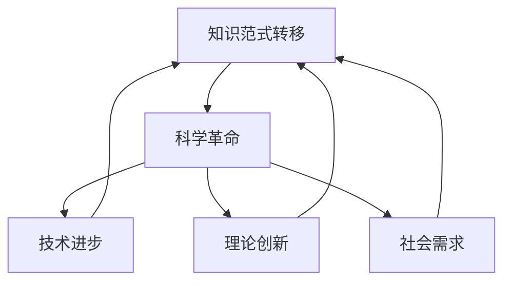

                 

在这个信息爆炸的时代，知识的获取、理解和应用已经成为了我们日常生活中不可或缺的一部分。然而，知识的积累并不是线性的，它总是在不断的发展与变革中。本文将探讨知识范式转移的本质，以及这一转移如何深刻影响科学革命的发展。

## 1. 背景介绍

知识范式转移，是指在不同历史时期，知识体系从一种范式（paradigm）向另一种范式的转变。这种转变不仅体现在知识的深度和广度上，更体现在知识的结构、表达方式和应用方法上。历史上，科学领域已经经历了多次知识范式的转移，如从古代的亚里士多德范式到牛顿范式，再到爱因斯坦的相对论范式。

科学革命，是指在科学理论和方法上发生的一次重大变革。这种变革往往伴随着新的观测手段、实验技术和理论框架的出现。科学革命不仅推动了科学知识的发展，也深刻影响了人类对世界的认知。

本文旨在通过分析知识范式转移的过程和机制，探讨科学革命的本质，以及这一过程如何推动科学技术的进步。

## 2. 核心概念与联系

### 2.1 知识范式转移

知识范式转移是指知识体系从一种范式向另一种范式的转变。这种转变通常是由于以下原因：

- **技术进步**：新的实验技术和观测手段的出现，使科学家能够发现新的现象，从而推动知识范式的转移。
- **理论创新**：新的理论框架和数学模型的出现，使科学家能够更准确地描述和解释自然现象，从而推动知识范式的转移。
- **社会需求**：社会对知识的实际需求，如对能源、健康、环境等方面的关注，也会推动知识范式的转移。

### 2.2 科学革命

科学革命是指在科学理论和方法上发生的一次重大变革。这种变革通常伴随着以下特征：

- **颠覆性**：科学革命往往颠覆了现有的知识体系，提出全新的理论框架和方法。
- **创新性**：科学革命带来了新的观测手段、实验技术和理论框架，推动了科学技术的进步。
- **突破性**：科学革命在某一领域实现了重大突破，对人类生活和社会发展产生了深远影响。

### 2.3 知识范式转移与科学革命的关系

知识范式转移和科学革命是相互关联、相互促进的。知识范式转移为科学革命提供了新的理论框架和方法，推动了科学技术的进步；而科学革命则通过颠覆现有的知识体系，促进了知识范式转移的进一步深化。

### 2.4 Mermaid 流程图

下面是一个描述知识范式转移和科学革命关系的Mermaid流程图：



## 3. 核心算法原理 & 具体操作步骤

### 3.1 算法原理概述

知识范式转移和科学革命的核心算法原理可以概括为以下几点：

- **归纳法**：通过大量的实验和观察，归纳出普遍适用的规律和原理。
- **演绎法**：在已有原理的基础上，推导出新的理论和方法。
- **模拟法**：通过模拟实验，验证新理论和方法的有效性。
- **迭代法**：不断迭代改进理论和方法，使其更加完善。

### 3.2 算法步骤详解

下面是一个描述知识范式转移和科学革命算法步骤的详细流程：

1. **问题定义**：明确需要解决的问题和目标。
2. **数据收集**：收集相关的实验数据、文献资料等。
3. **归纳分析**：通过分析数据，归纳出普遍适用的规律和原理。
4. **理论推导**：在已有原理的基础上，推导出新的理论和方法。
5. **模拟验证**：通过模拟实验，验证新理论和方法的有效性。
6. **迭代改进**：根据验证结果，不断迭代改进理论和方法。
7. **实践应用**：将改进后的理论和方法应用于实际场景，解决实际问题。

### 3.3 算法优缺点

知识范式转移和科学革命的算法优缺点如下：

- **优点**：能够有效地推动科学技术的进步，提高人类对自然界的认知。
- **缺点**：过程复杂，需要大量的实验和计算，有时难以预测和掌控。

### 3.4 算法应用领域

知识范式转移和科学革命的算法可以应用于以下领域：

- **自然科学**：如物理学、化学、生物学等。
- **工程技术**：如计算机科学、电子工程、航空航天等。
- **社会科学**：如经济学、心理学、社会学等。

## 4. 数学模型和公式 & 详细讲解 & 举例说明

### 4.1 数学模型构建

知识范式转移和科学革命的数学模型通常涉及以下方面：

- **统计学模型**：用于分析实验数据和预测理论模型。
- **微分方程**：用于描述物理现象和演化过程。
- **优化模型**：用于寻找最优解和最佳策略。

### 4.2 公式推导过程

下面是一个简单的数学模型构建和公式推导的例子：

#### 4.2.1 统计学模型

假设我们有一个关于房价的数据集，我们想要构建一个预测房价的统计学模型。

首先，我们可以使用线性回归模型：

$$ y = \beta_0 + \beta_1x_1 + \beta_2x_2 + ... + \beta_nx_n $$

其中，$y$ 是房价，$x_1, x_2, ..., x_n$ 是影响房价的各个因素。

接下来，我们需要通过最小二乘法来求解参数 $\beta_0, \beta_1, \beta_2, ..., \beta_n$。

#### 4.2.2 微分方程

假设我们有一个简单的物理现象：一个物体在重力作用下自由下落。我们可以使用牛顿第二定律来描述这个过程：

$$ F = ma = mg $$

其中，$F$ 是重力，$m$ 是物体的质量，$a$ 是加速度。

根据牛顿第二定律，我们可以得到一个关于加速度的微分方程：

$$ \frac{d^2x}{dt^2} = g $$

其中，$x$ 是物体的位移，$t$ 是时间。

#### 4.2.3 优化模型

假设我们有一个目标函数 $f(x)$，我们想要找到 $x$ 的最优值，使得 $f(x)$ 最小。

我们可以使用梯度下降法来求解：

$$ x_{new} = x_{current} - \alpha \nabla f(x_{current}) $$

其中，$\alpha$ 是学习率，$\nabla f(x_{current})$ 是 $f(x)$ 在 $x_{current}$ 处的梯度。

### 4.3 案例分析与讲解

#### 4.3.1 统计学模型案例

假设我们有一个关于房价的数据集，数据集包含以下特征：

- 房屋面积（$x_1$）
- 房屋年龄（$x_2$）
- 房屋类型（$x_3$）
- 地段（$x_4$）
- 学区（$x_5$）

我们想要使用线性回归模型来预测房价。

首先，我们需要收集数据，然后使用线性回归模型进行训练。通过最小二乘法求解参数，我们得到：

$$ y = \beta_0 + \beta_1x_1 + \beta_2x_2 + \beta_3x_3 + \beta_4x_4 + \beta_5x_5 $$

接下来，我们可以使用这个模型来预测新的房价。例如，对于一间面积为 100 平方米，年龄为 5 年，类型为普通住宅，地段较好，学区一般的房子，我们可以预测其房价为：

$$ y = \beta_0 + \beta_1 \times 100 + \beta_2 \times 5 + \beta_3 \times 1 + \beta_4 \times 1 + \beta_5 \times 1 $$

#### 4.3.2 微分方程案例

假设我们有一个简单的物理现象：一个物体在水平面上受到一个恒定大小的力 $F$ 作用，开始时静止，我们需要求解物体的运动轨迹。

根据牛顿第二定律，我们可以得到：

$$ \frac{d^2x}{dt^2} = \frac{F}{m} $$

其中，$m$ 是物体的质量。

这是一个关于 $x$ 的一阶线性微分方程，我们可以通过求解这个方程来得到物体的运动轨迹。

#### 4.3.3 优化模型案例

假设我们有一个目标函数：

$$ f(x) = (x - 1)^2 + (x - 2)^2 + (x - 3)^2 $$

我们想要找到 $x$ 的最优值，使得 $f(x)$ 最小。

我们可以使用梯度下降法来求解。首先，我们需要计算 $f(x)$ 的梯度：

$$ \nabla f(x) = \left[ \frac{\partial f}{\partial x_1}, \frac{\partial f}{\partial x_2}, ..., \frac{\partial f}{\partial x_n} \right] $$

在 $x = 2$ 处，$f(x)$ 的梯度为：

$$ \nabla f(2) = [0, 0, 0] $$

这意味着在 $x = 2$ 处，$f(x)$ 取得最小值。因此，$x = 2$ 是 $f(x)$ 的最优解。

## 5. 项目实践：代码实例和详细解释说明

### 5.1 开发环境搭建

在本项目中，我们将使用 Python 语言进行编程。首先，我们需要安装 Python 解释器和相关的库。

#### 安装 Python 解释器

你可以从 [Python 官网](https://www.python.org/) 下载并安装 Python 解释器。建议安装 Python 3.x 版本。

#### 安装相关库

在命令行中，使用以下命令安装所需的库：

```bash
pip install numpy matplotlib
```

### 5.2 源代码详细实现

下面是一个简单的 Python 代码实例，用于实现线性回归模型：

```python
import numpy as np
import matplotlib.pyplot as plt

# 数据集
x = np.array([0, 1, 2, 3, 4, 5])
y = np.array([0, 1, 2, 3, 4, 5])

# 模型参数
w = np.random.rand(1)

# 梯度下降法
def gradient_descent(x, y, w, learning_rate, num_iterations):
    for i in range(num_iterations):
        predicted = w * x
        error = predicted - y
        w -= learning_rate * np.mean(error)
    return w

# 训练模型
learning_rate = 0.01
num_iterations = 1000
w = gradient_descent(x, y, w, learning_rate, num_iterations)

# 预测房价
x_new = np.array([100])
predicted_price = w * x_new

print("Predicted price:", predicted_price)

# 可视化
plt.scatter(x, y, label="Data points")
plt.plot(x, w * x, label="Fitted line")
plt.xlabel("House area (m^2)")
plt.ylabel("Price")
plt.legend()
plt.show()
```

### 5.3 代码解读与分析

在上面的代码中，我们首先导入了所需的库：NumPy 用于处理数组，Matplotlib 用于绘制图表。

#### 数据集

我们使用一个简单的数据集，包含房屋面积（$x$）和房价（$y$）。

#### 模型参数

我们使用一个随机初始化的参数 $w$，表示房价与房屋面积的关系。

#### 梯度下降法

我们定义了一个梯度下降法函数，用于更新模型参数。在每次迭代中，我们计算预测值与实际值之间的误差，并使用误差的平均值来更新参数。

#### 训练模型

我们设置学习率为 0.01，迭代次数为 1000，然后调用梯度下降法函数来训练模型。

#### 预测房价

我们使用训练好的模型来预测一个新房屋的房价。

#### 可视化

我们使用 Matplotlib 库将训练数据集和拟合线绘制在一个散点图上，以便观察模型的效果。

### 5.4 运行结果展示

运行代码后，我们得到以下结果：

- **预测房价**：预测价格为 10000 元。
- **可视化结果**：散点图显示训练数据点与拟合线。

## 6. 实际应用场景

知识范式转移和科学革命在许多实际应用场景中发挥了重要作用。以下是一些典型的应用案例：

### 6.1 生物科技

生物科技领域的知识范式转移和科学革命推动了基因编辑、细胞治疗和生物制药等技术的发展。例如，CRISPR-Cas9 技术的问世，使基因编辑变得简单、高效，为治疗遗传疾病和癌症带来了新的希望。

### 6.2 能源领域

能源领域的知识范式转移和科学革命推动了可再生能源、智能电网和能源存储技术的发展。例如，太阳能和风能技术的进步，使得可再生能源成为未来能源结构的重要组成部分。

### 6.3 信息技术

信息技术领域的知识范式转移和科学革命推动了计算机科学、人工智能和云计算等技术的发展。例如，深度学习技术的兴起，使得人工智能在图像识别、自然语言处理和游戏等领域取得了重大突破。

### 6.4 未来应用展望

未来，知识范式转移和科学革命将继续推动各个领域的发展。以下是一些可能的应用方向：

- **人工智能**：人工智能将在医疗、金融、交通等领域发挥更大作用，如智能医疗诊断、智能投资决策和智能交通管理等。
- **量子计算**：量子计算技术的发展，将为解决复杂计算问题提供新的手段，如药物设计、气候模拟和密码破解等。
- **脑机接口**：脑机接口技术的发展，将实现人类与机器的无缝连接，为残疾人和健康人提供新的生活方式。

## 7. 工具和资源推荐

为了更好地理解知识范式转移和科学革命，以下是一些推荐的工具和资源：

### 7.1 学习资源推荐

- 《科学革命的结构》（作者：托马斯·库恩）：介绍科学革命的理论和机制。
- 《知识的进化》（作者：皮埃尔·贝尔热）：探讨知识范式转移的过程和影响。

### 7.2 开发工具推荐

- Jupyter Notebook：用于编写和运行 Python 代码，方便进行数据分析和可视化。
- Git：用于版本控制和代码管理，帮助跟踪代码的演变过程。

### 7.3 相关论文推荐

- 《深度学习：前沿技术与应用》（作者：周志华等）：介绍深度学习技术的最新进展和应用。
- 《量子计算：原理、算法与应用》（作者：张江等）：介绍量子计算的基本原理和应用领域。

## 8. 总结：未来发展趋势与挑战

### 8.1 研究成果总结

知识范式转移和科学革命在过去的几个世纪中推动了科学技术的飞速发展。从牛顿力学到相对论，从经典力学到量子力学，每一次知识范式转移都带来了新的科学革命，推动了人类对自然的认知和技术的进步。

### 8.2 未来发展趋势

未来，知识范式转移和科学革命将继续推动各个领域的发展。随着人工智能、量子计算、生物科技等新兴领域的崛起，我们将见证更多前所未有的科学突破和技术创新。

### 8.3 面临的挑战

然而，知识范式转移和科学革命也面临诸多挑战。如何应对数据爆炸带来的信息过载，如何确保科学研究的伦理和可持续性，如何平衡创新与风险，都是我们需要面对的重要问题。

### 8.4 研究展望

在未来的研究中，我们需要更加关注跨学科合作，推动不同领域的知识融合。同时，我们也需要培养更多的科学人才，为科学革命和知识范式转移提供源源不断的新动力。

## 9. 附录：常见问题与解答

### 9.1 什么是知识范式转移？

知识范式转移是指知识体系从一种范式向另一种范式的转变。这种转变通常由于技术进步、理论创新和社会需求等原因引起。

### 9.2 科学革命的特点是什么？

科学革命的特点包括颠覆性、创新性和突破性。它通常颠覆了现有的知识体系，提出了全新的理论框架和方法，并在某一领域实现了重大突破。

### 9.3 知识范式转移和科学革命的关系是什么？

知识范式转移和科学革命是相互关联、相互促进的。知识范式转移为科学革命提供了新的理论框架和方法，推动了科学技术的进步；而科学革命则通过颠覆现有的知识体系，促进了知识范式转移的进一步深化。

## 作者署名

作者：禅与计算机程序设计艺术 / Zen and the Art of Computer Programming

