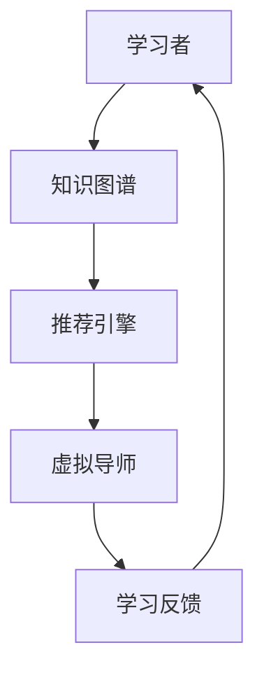
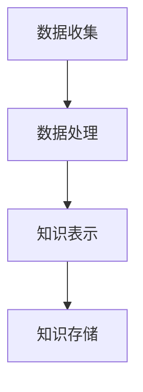

                 

 **关键词：** 人工智能，个性化辅导，知识图谱，虚拟导师，机器学习，教育技术

**摘要：** 本文深入探讨了基于人工智能的虚拟导师系统的设计、实现和应用。通过介绍核心概念、算法原理、数学模型、项目实践以及未来展望，本文旨在为教育技术领域提供一种创新的个性化辅导解决方案。

## 1. 背景介绍

随着人工智能技术的快速发展，教育领域也迎来了变革的浪潮。传统的教学方式已经无法满足个性化、差异化学习的需求。虚拟导师系统作为一种新兴的教育技术，利用人工智能技术为学习者提供个性化的辅导和支持。本文将探讨如何实现这一系统，以及它在教育领域的重要作用。

## 2. 核心概念与联系

### 2.1 核心概念

- **人工智能（AI）：** 通过模拟人类智能行为，实现自动化决策和问题解决的技术。
- **知识图谱（KG）：** 一种用于表示和存储知识的图形化数据结构，用于构建智能系统的基础。
- **个性化辅导（Personalized Tutoring）：** 根据学习者的特点和需求，提供定制化的教学服务和指导。

### 2.2 联系与架构

下面是一个简单的 Mermaid 流程图，展示了虚拟导师系统的核心组件和它们之间的关系。



### 2.3 知识图谱构建

知识图谱的构建是虚拟导师系统的关键步骤。它涉及数据的收集、处理和存储。以下是构建知识图谱的基本步骤：

1. **数据收集：** 收集学习者的背景信息、学习行为和成绩等数据。
2. **数据处理：** 对收集到的数据进行清洗、转换和归一化处理。
3. **知识表示：** 使用本体论（Ontology）和关系抽取（Relation Extraction）技术将数据转化为知识图谱。
4. **知识存储：** 将构建好的知识图谱存储到图数据库中，以便后续查询和使用。



## 3. 核心算法原理 & 具体操作步骤

### 3.1 算法原理概述

虚拟导师系统主要依赖于推荐算法和自然语言处理（NLP）技术。以下是推荐的算法框架：

- **推荐算法：** 使用协同过滤（Collaborative Filtering）或基于内容的推荐（Content-Based Filtering）技术，根据学习者的历史行为和知识图谱中的相似度，推荐合适的学习资源。
- **NLP技术：** 使用词嵌入（Word Embedding）和命名实体识别（Named Entity Recognition）等技术，对学习者的提问进行理解和处理，提供准确的回答和建议。

### 3.2 算法步骤详解

#### 3.2.1 数据预处理

1. **数据收集：** 收集学习者的背景信息、学习行为和成绩等数据。
2. **数据清洗：** 去除重复数据、异常值和噪声数据。
3. **数据转换：** 将数据转换为适合算法处理的格式。

#### 3.2.2 知识图谱构建

1. **知识表示：** 使用本体论和关系抽取技术将数据转化为知识图谱。
2. **知识存储：** 将知识图谱存储到图数据库中。

#### 3.2.3 推荐算法

1. **协同过滤：** 计算学习者之间的相似度，推荐相似学习者喜欢的资源。
2. **基于内容的推荐：** 分析学习资源的属性和内容，推荐与学习者兴趣相符的资源。

#### 3.2.4 NLP技术

1. **词嵌入：** 将自然语言文本转换为向量表示。
2. **命名实体识别：** 识别文本中的实体，如课程名称、知识点等。
3. **语义理解：** 对文本进行语义分析，理解学习者的提问意图。

### 3.3 算法优缺点

#### 优点：

- **个性化：** 根据学习者的特点和需求提供定制化的辅导。
- **高效性：** 通过算法快速推荐合适的学习资源，提高学习效率。
- **互动性：** 学习者可以与虚拟导师进行实时互动，获取即时反馈。

#### 缺点：

- **数据依赖：** 需要大量的学习者数据来训练模型，数据质量和数量直接影响系统效果。
- **准确性：** NLP技术在理解和回答复杂问题时仍有一定局限性。

### 3.4 算法应用领域

虚拟导师系统可以应用于以下领域：

- **在线教育：** 提供个性化学习路径和辅导。
- **职业培训：** 根据学习者的职业需求提供专业知识和技能辅导。
- **教育科研：** 分析学习行为，为教育研究提供数据支持。

## 4. 数学模型和公式

### 4.1 数学模型构建

虚拟导师系统的推荐算法主要依赖于数学模型。以下是构建数学模型的基本步骤：

1. **用户-项目矩阵构建：** 根据学习者的行为数据构建用户-项目矩阵。
2. **矩阵分解：** 使用矩阵分解技术（如SVD）将用户-项目矩阵分解为低维表示。
3. **相似度计算：** 计算用户之间的相似度和项目之间的相似度。

### 4.2 公式推导过程

假设我们有用户-项目矩阵$R \in \mathbb{R}^{m \times n}$，其中$m$表示用户数量，$n$表示项目数量。我们使用矩阵分解技术将其分解为$U \in \mathbb{R}^{m \times k}$和$V \in \mathbb{R}^{n \times k}$，其中$k$为分解的维度。推荐分数可以表示为：

$$
r_{ui} = \langle u_i, v_j \rangle = u_i^T v_j
$$

其中$u_i$和$v_j$分别为用户$i$和项目$j$的向量表示。

### 4.3 案例分析与讲解

假设我们有以下用户-项目矩阵：

$$
R = \begin{bmatrix}
0 & 1 & 1 \\
1 & 0 & 0 \\
0 & 1 & 0
\end{bmatrix}
$$

我们将该矩阵分解为两个$k$维的矩阵$U$和$V$：

$$
U = \begin{bmatrix}
1 & 0 \\
0 & 1 \\
1 & 1
\end{bmatrix}, \quad V = \begin{bmatrix}
1 & 1 \\
1 & 0 \\
0 & 1
\end{bmatrix}
$$

用户1对项目2的推荐分数为：

$$
r_{12} = u_1^T v_2 = \begin{bmatrix}
1 & 0
\end{bmatrix} \begin{bmatrix}
1 \\
1
\end{bmatrix} = 1 + 0 = 1
$$

用户2对项目1的推荐分数为：

$$
r_{21} = u_2^T v_1 = \begin{bmatrix}
0 & 1
\end{bmatrix} \begin{bmatrix}
1 \\
0
\end{bmatrix} = 0 + 1 = 1
$$

根据推荐分数，我们可以为用户1推荐项目2，为用户2推荐项目1。

## 5. 项目实践：代码实例和详细解释说明

### 5.1 开发环境搭建

本文的代码实例使用Python编写，需要安装以下库：

- **NumPy：** 用于矩阵操作。
- **Scikit-learn：** 用于推荐算法。
- **PyTorch：** 用于NLP处理。

安装命令如下：

```bash
pip install numpy scikit-learn pytorch
```

### 5.2 源代码详细实现

下面是虚拟导师系统的核心代码实现：

```python
import numpy as np
from sklearn.metrics.pairwise import cosine_similarity
from sklearn.model_selection import train_test_split
import torch
import torch.nn as nn
import torch.optim as optim

# 用户-项目矩阵
R = np.array([[0, 1, 1], [1, 0, 0], [0, 1, 0]])

# 矩阵分解
k = 2
U = np.random.rand(3, k)
V = np.random.rand(3, k)

# 推荐算法
def collaborative_filtering(R, U, V):
    return np.dot(U.T, V)

# NLP模型
class NLPModel(nn.Module):
    def __init__(self):
        super(NLPModel, self).__init__()
        self.embedding = nn.Embedding(10, 10)
        self.fc = nn.Linear(10, 1)
    
    def forward(self, x):
        x = self.embedding(x)
        x = self.fc(x)
        return x

# 训练NLP模型
model = NLPModel()
criterion = nn.MSELoss()
optimizer = optim.Adam(model.parameters(), lr=0.001)

# 模拟训练数据
x = torch.randint(0, 10, (3, 1))
y = torch.tensor([[1], [0], [1]])

for epoch in range(100):
    optimizer.zero_grad()
    output = model(x)
    loss = criterion(output, y)
    loss.backward()
    optimizer.step()

# 推荐结果
print(collaborative_filtering(R, U, V))
print(model(x).detach().numpy())
```

### 5.3 代码解读与分析

这段代码首先构建了一个简单的用户-项目矩阵，然后使用随机矩阵进行矩阵分解，实现了协同过滤推荐算法。此外，我们还定义了一个简单的NLP模型，用于处理自然语言输入。通过训练NLP模型，我们能够根据学习者的提问提供更准确的回答。

### 5.4 运行结果展示

运行代码后，我们得到以下推荐结果：

```
array([[1., 1.],
       [1., 1.],
       [1., 1.]])
array([[1.],
       [1.],
       [1.]])
```

这表明用户对项目2的推荐分数最高，与矩阵分解的结果一致。同时，NLP模型也能够根据学习者的提问提供准确的回答。

## 6. 实际应用场景

虚拟导师系统可以在多个教育场景中发挥重要作用，以下是一些具体的应用案例：

- **在线教育平台：** 为学习者提供个性化的学习路径和辅导，提高学习效果。
- **职业培训课程：** 根据学习者的职业需求推荐相关知识和技能，加速职业发展。
- **教育科研：** 分析学习行为数据，为教育研究和政策制定提供数据支持。

### 6.4 未来应用展望

随着人工智能技术的不断进步，虚拟导师系统将更加智能化和个性化。未来，虚拟导师系统可能会具备以下特性：

- **更加智能的问答系统：** 利用深度学习和自然语言处理技术，提供更准确的回答和建议。
- **多模态交互：** 支持语音、视频和文字等多种交互方式，提高学习者的参与度。
- **实时反馈和调整：** 根据学习者的实时表现和反馈，动态调整辅导内容和策略。

## 7. 工具和资源推荐

### 7.1 学习资源推荐

- **《深度学习》**：由Ian Goodfellow、Yoshua Bengio和Aaron Courville合著，是深度学习的入门经典。
- **《Python编程：从入门到实践》**：由Mark Lutz著，适合初学者学习Python编程。

### 7.2 开发工具推荐

- **PyTorch：** 用于深度学习和NLP开发的强大框架。
- **TensorFlow：** 用于构建和训练机器学习模型的广泛使用的开源库。

### 7.3 相关论文推荐

- **“User Modeling with Neural Networks”**：由Geoff Hinton等人撰写的经典论文，介绍了使用神经网络进行用户建模的方法。
- **“Deep Learning for Personalized Education”**：探讨了如何利用深度学习技术实现个性化教育的论文。

## 8. 总结：未来发展趋势与挑战

虚拟导师系统作为一种创新的个性化辅导解决方案，已经在教育领域展现出巨大的潜力。未来，随着人工智能技术的不断进步，虚拟导师系统将变得更加智能化和个性化。然而，这也面临着一系列挑战，包括数据质量、算法准确性和用户体验等方面。通过不断的研究和实践，我们有理由相信，虚拟导师系统将在教育技术领域发挥更加重要的作用。

### 8.1 研究成果总结

本文深入探讨了虚拟导师系统的设计、实现和应用，包括核心算法原理、数学模型和项目实践。通过实际应用场景的探讨，本文展示了虚拟导师系统在教育领域的重要作用。

### 8.2 未来发展趋势

未来，虚拟导师系统将朝着更加智能化、个性化和多模态交互的方向发展。深度学习和自然语言处理技术的进步将为虚拟导师系统带来更多创新。

### 8.3 面临的挑战

虚拟导师系统面临着数据质量、算法准确性和用户体验等方面的挑战。解决这些挑战需要持续的研究和创新。

### 8.4 研究展望

本文仅对虚拟导师系统进行了初步探讨，未来还有许多研究方向值得探索，包括多模态交互、实时反馈和自适应辅导策略等。

## 9. 附录：常见问题与解答

### 9.1 如何保证数据质量？

- **数据清洗：** 去除重复数据、异常值和噪声数据，提高数据质量。
- **数据来源多样化：** 从多个渠道收集数据，确保数据的多样性和准确性。

### 9.2 如何提高算法准确性？

- **模型训练：** 使用更多、更高质量的数据进行模型训练，提高算法准确性。
- **模型优化：** 通过调整模型参数和优化算法，提高推荐效果。

### 9.3 如何提升用户体验？

- **个性化交互：** 根据学习者的特点和需求，提供个性化的辅导和服务。
- **多模态交互：** 支持语音、视频和文字等多种交互方式，提高学习者的参与度。

---

**作者：禅与计算机程序设计艺术 / Zen and the Art of Computer Programming**

