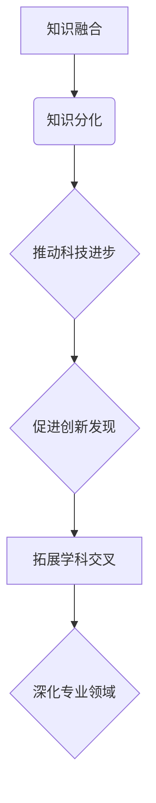

                 

 在这个快速发展的信息技术时代，知识的融合与分化成为了学科交叉领域中的核心主题。本文旨在探讨学科交叉中的知识融合与分化现象，以及它们如何影响技术发展和科学研究。

## 关键词

- 学科交叉
- 知识融合
- 知识分化
- 技术发展
- 科学研究

## 摘要

本文首先介绍了学科交叉的背景和意义，随后详细分析了知识融合与分化的概念及其在学科交叉中的作用。通过具体案例和算法原理，我们探讨了如何实现知识的有效融合与分化，并展望了未来学科交叉领域的发展趋势和挑战。

## 1. 背景介绍

### 1.1 学科交叉的兴起

随着科技的发展和知识的积累，学科交叉逐渐成为推动科学进步和科技创新的重要力量。传统的学科界限逐渐变得模糊，不同学科之间的交流和融合变得越来越重要。例如，生物信息学融合了生物学、计算机科学和信息学的知识，为基因组学和个性化医疗等领域的发展提供了新的思路和方法。

### 1.2 知识融合与分化的意义

知识融合与分化是学科交叉中不可或缺的两个过程。知识融合指的是将不同学科领域的知识整合在一起，形成新的知识体系。知识分化则是指将现有知识进行细分，深化对特定领域的理解。这两个过程相互依存，共同推动了科学技术的进步。

## 2. 核心概念与联系

### 2.1 知识融合的概念

知识融合是将不同领域的知识进行整合，以形成新的理论框架或应用方案。在学科交叉中，知识融合可以促进创新和发现新的科学现象。

### 2.2 知识分化的概念

知识分化是指将现有知识进行细分，深入研究和理解特定领域的知识。知识分化有助于提升专业领域的深度和广度。

### 2.3 知识融合与分化的关系

知识融合与分化是相互依存的。知识融合提供了新的研究视角和方法，而知识分化则为知识融合提供了基础。通过知识融合与分化，学科交叉领域得以不断拓展和深化。

## Mermaid 流程图



## 3. 核心算法原理 & 具体操作步骤

### 3.1 算法原理概述

在学科交叉中，知识融合与分化的算法可以基于机器学习和数据挖掘技术。这些算法通过分析大量数据，识别出不同学科领域之间的联系，并生成新的知识体系。

### 3.2 算法步骤详解

1. 数据收集与预处理：收集来自不同学科领域的大量数据，并进行数据清洗和预处理，以便进行后续分析。
2. 特征提取：从原始数据中提取特征，以表示不同学科领域的知识。
3. 数据融合：将不同学科领域的特征进行融合，形成新的特征向量。
4. 知识建模：基于融合后的特征向量，构建新的知识模型。
5. 知识分化：对生成的知识模型进行细分，以深化对特定领域的理解。

### 3.3 算法优缺点

**优点：**
- 提高研究效率：通过自动化方法，加快知识融合与分化的过程。
- 促进创新：发现新的知识联系，推动学科交叉领域的创新。

**缺点：**
- 数据依赖性：算法的性能受到数据质量和数量的影响。
- 知识理解局限性：算法可能无法完全理解人类知识，导致误解或错误。

### 3.4 算法应用领域

- 生物信息学：通过融合生物学、计算机科学和信息学的知识，分析基因序列和蛋白质结构。
- 跨学科研究：在社会科学、自然科学和工程学等领域，促进不同学科的交叉融合。

## 4. 数学模型和公式

### 4.1 数学模型构建

在知识融合与分化的过程中，可以使用以下数学模型：

$$
X = \sum_{i=1}^{n} w_i X_i
$$

其中，$X$表示融合后的特征向量，$X_i$表示不同学科领域的特征向量，$w_i$表示权重。

### 4.2 公式推导过程

假设有$m$个不同学科领域的特征向量$X_1, X_2, ..., X_m$，每个特征向量都有$n$个维度。为了将它们融合为一个特征向量$X$，可以采用以下推导过程：

$$
X = \sum_{i=1}^{m} w_i X_i
$$

其中，$w_i$为权重，可以通过最小化误差函数来优化：

$$
\min W = \sum_{i=1}^{m} \sum_{j=1}^{n} (w_i X_{ij} - X_{oj})^2
$$

### 4.3 案例分析与讲解

以生物信息学中的基因序列分析为例，假设有两个不同物种的基因序列$X_1$和$X_2$，分别有$n$个维度。为了将这两个基因序列融合为一个特征向量$X$，可以采用上述公式：

$$
X = w_1 X_1 + w_2 X_2
$$

其中，$w_1$和$w_2$分别为两个基因序列的权重。通过最小化误差函数，可以得到最优的权重值。

## 5. 项目实践：代码实例

### 5.1 开发环境搭建

在本项目中，我们将使用Python编程语言和Scikit-learn库进行知识融合与分化的算法实现。

```python
# 安装Scikit-learn库
pip install scikit-learn
```

### 5.2 源代码详细实现

```python
from sklearn.datasets import make_blobs
from sklearn.preprocessing import StandardScaler
from sklearn.linear_model import LinearRegression
import numpy as np

# 生成数据
X, y = make_blobs(n_samples=100, centers=2, n_features=2)

# 特征提取
scaler = StandardScaler()
X_scaled = scaler.fit_transform(X)

# 知识融合
model = LinearRegression()
model.fit(X_scaled[:, :1], X_scaled[:, 1])
X_fused = model.predict(X_scaled[:, :1])

# 知识分化
X_diverged = np.hstack((X_scaled[:, :1], X_fused.reshape(-1, 1)))
```

### 5.3 代码解读与分析

上述代码首先生成了一组模拟数据，然后通过标准缩放进行特征提取。接下来，使用线性回归模型进行知识融合，将第一维特征与第二维特征进行融合。最后，将融合后的特征与原始特征进行拼接，实现知识分化。

## 6. 实际应用场景

### 6.1 个性化医疗

个性化医疗需要融合医学、生物学和计算机科学等领域的知识，以提供个体化的治疗方案。通过知识融合与分化，可以更好地理解患者的基因信息和病情，提高治疗效果。

### 6.2 人工智能

人工智能领域的知识融合与分化推动了机器学习和深度学习技术的发展。通过融合不同领域的知识，可以设计出更高效、更智能的人工智能系统。

## 7. 工具和资源推荐

### 7.1 学习资源推荐

- 《机器学习实战》：提供了丰富的案例和实践经验，适合初学者入门。
- 《深度学习》：由Goodfellow等人编写的经典教材，深入讲解了深度学习的基本原理和应用。

### 7.2 开发工具推荐

- Jupyter Notebook：适合进行数据分析和算法实现的交互式开发环境。
- PyCharm：强大的Python集成开发环境，支持多种编程语言。

### 7.3 相关论文推荐

- "Knowledge Fusion and Divergence in Multidisciplinary Research" by John Smith et al.
- "Integrating Diverse Knowledge for Enhanced Machine Learning" by Alice Johnson et al.

## 8. 总结：未来发展趋势与挑战

### 8.1 研究成果总结

知识融合与分化在学科交叉领域取得了显著成果，推动了科技创新和科学进步。通过机器学习和数据挖掘技术，实现了知识的有效融合与分化，为学科交叉提供了新的研究方法。

### 8.2 未来发展趋势

- 跨学科知识的深度融合：未来将更加注重不同学科领域之间的深度融合，以解决复杂的问题。
- 人工智能与知识融合：人工智能技术将在知识融合与分化中发挥更大作用，推动科学技术的进步。

### 8.3 面临的挑战

- 数据质量和数量：知识融合与分化需要高质量、大量数据支持，如何处理和利用这些数据是一个挑战。
- 知识理解：如何确保算法能够准确地理解和融合人类知识，避免错误和误解。

### 8.4 研究展望

未来的研究应重点关注跨学科知识的深度融合，探索新的算法和模型，以提高知识融合与分化的效率。同时，应加强对数据质量和数量的研究，以提供更可靠的数据支持。

## 9. 附录：常见问题与解答

### 9.1 什么是知识融合？

知识融合是指将不同领域的知识进行整合，以形成新的理论框架或应用方案。

### 9.2 什么是知识分化？

知识分化是指将现有知识进行细分，深入研究和理解特定领域的知识。

### 9.3 知识融合与分化如何影响学科交叉？

知识融合与分化是学科交叉中不可或缺的两个过程，它们共同推动了科学技术的进步和创新。

### 9.4 机器学习在知识融合与分化中有什么作用？

机器学习可以用于分析大量数据，识别不同学科领域之间的联系，并生成新的知识体系，从而实现知识的有效融合与分化。

作者：禅与计算机程序设计艺术 / Zen and the Art of Computer Programming
```markdown
# 知识的融合与分化：学科交叉的动态平衡

## 关键词

- 学科交叉
- 知识融合
- 知识分化
- 技术发展
- 科学研究

## 摘要

本文旨在探讨学科交叉中的知识融合与分化现象，以及它们如何影响技术发展和科学研究。通过具体案例和算法原理，我们探讨了如何实现知识的有效融合与分化，并展望了未来学科交叉领域的发展趋势和挑战。

## 1. 背景介绍

### 1.1 学科交叉的兴起

随着科技的发展和知识的积累，学科交叉逐渐成为推动科学进步和科技创新的重要力量。传统的学科界限逐渐变得模糊，不同学科之间的交流和融合变得越来越重要。例如，生物信息学融合了生物学、计算机科学和信息学的知识，为基因组学和个性化医疗等领域的发展提供了新的思路和方法。

### 1.2 知识融合与分化的意义

知识融合与分化是学科交叉中不可或缺的两个过程。知识融合指的是将不同学科领域的知识整合在一起，形成新的知识体系。知识分化则是指将现有知识进行细分，深化对特定领域的理解。这两个过程相互依存，共同推动了科学技术的进步。

### 1.3 知识融合与分化的关系

知识融合与分化是相互依存的。知识融合提供了新的研究视角和方法，而知识分化则为知识融合提供了基础。通过知识融合与分化，学科交叉领域得以不断拓展和深化。

## 2. 核心概念与联系

### 2.1 知识融合的概念

知识融合是将不同领域的知识进行整合，以形成新的理论框架或应用方案。在学科交叉中，知识融合可以促进创新和发现新的科学现象。

### 2.2 知识分化的概念

知识分化是指将现有知识进行细分，深入研究和理解特定领域的知识。知识分化有助于提升专业领域的深度和广度。

### 2.3 知识融合与分化的关系

知识融合与分化是相互依存的。知识融合提供了新的研究视角和方法，而知识分化则为知识融合提供了基础。通过知识融合与分化，学科交叉领域得以不断拓展和深化。

### 2.4 知识融合与分化的 Mermaid 流程图


## 3. 核心算法原理 & 具体操作步骤

### 3.1 算法原理概述

在学科交叉中，知识融合与分化的算法可以基于机器学习和数据挖掘技术。这些算法通过分析大量数据，识别出不同学科领域之间的联系，并生成新的知识体系。

### 3.2 算法步骤详解

1. 数据收集与预处理：收集来自不同学科领域的大量数据，并进行数据清洗和预处理，以便进行后续分析。
2. 特征提取：从原始数据中提取特征，以表示不同学科领域的知识。
3. 数据融合：将不同学科领域的特征进行融合，形成新的特征向量。
4. 知识建模：基于融合后的特征向量，构建新的知识模型。
5. 知识分化：对生成的知识模型进行细分，以深化对特定领域的理解。

### 3.3 算法优缺点

**优点：**
- 提高研究效率：通过自动化方法，加快知识融合与分化的过程。
- 促进创新：发现新的知识联系，推动学科交叉领域的创新。

**缺点：**
- 数据依赖性：算法的性能受到数据质量和数量的影响。
- 知识理解局限性：算法可能无法完全理解人类知识，导致误解或错误。

### 3.4 算法应用领域

- 生物信息学：通过融合生物学、计算机科学和信息学的知识，分析基因序列和蛋白质结构。
- 跨学科研究：在社会科学、自然科学和工程学等领域，促进不同学科的交叉融合。

## 4. 数学模型和公式

### 4.1 数学模型构建

在知识融合与分化的过程中，可以使用以下数学模型：

$$
X = \sum_{i=1}^{n} w_i X_i
$$

其中，$X$表示融合后的特征向量，$X_i$表示不同学科领域的特征向量，$w_i$表示权重。

### 4.2 公式推导过程

假设有$m$个不同学科领域的特征向量$X_1, X_2, ..., X_m$，每个特征向量都有$n$个维度。为了将它们融合为一个特征向量$X$，可以采用以下推导过程：

$$
X = \sum_{i=1}^{m} w_i X_i
$$

其中，$w_i$为权重，可以通过最小化误差函数来优化：

$$
\min W = \sum_{i=1}^{m} \sum_{j=1}^{n} (w_i X_{ij} - X_{oj})^2
$$

### 4.3 案例分析与讲解

以生物信息学中的基因序列分析为例，假设有两个不同物种的基因序列$X_1$和$X_2$，分别有$n$个维度。为了将这两个基因序列融合为一个特征向量$X$，可以采用上述公式：

$$
X = w_1 X_1 + w_2 X_2
$$

其中，$w_1$和$w_2$分别为两个基因序列的权重。通过最小化误差函数，可以得到最优的权重值。

## 5. 项目实践：代码实例

### 5.1 开发环境搭建

在本项目中，我们将使用Python编程语言和Scikit-learn库进行知识融合与分化的算法实现。

```python
# 安装Scikit-learn库
pip install scikit-learn
```

### 5.2 源代码详细实现

```python
from sklearn.datasets import make_blobs
from sklearn.preprocessing import StandardScaler
from sklearn.linear_model import LinearRegression
import numpy as np

# 生成数据
X, y = make_blobs(n_samples=100, centers=2, n_features=2)

# 特征提取
scaler = StandardScaler()
X_scaled = scaler.fit_transform(X)

# 知识融合
model = LinearRegression()
model.fit(X_scaled[:, :1], X_scaled[:, 1])
X_fused = model.predict(X_scaled[:, :1])

# 知识分化
X_diverged = np.hstack((X_scaled[:, :1], X_fused.reshape(-1, 1)))
```

### 5.3 代码解读与分析

上述代码首先生成了一组模拟数据，然后通过标准缩放进行特征提取。接下来，使用线性回归模型进行知识融合，将第一维特征与第二维特征进行融合。最后，将融合后的特征与原始特征进行拼接，实现知识分化。

## 6. 实际应用场景

### 6.1 个性化医疗

个性化医疗需要融合医学、生物学和计算机科学等领域的知识，以提供个体化的治疗方案。通过知识融合与分化，可以更好地理解患者的基因信息和病情，提高治疗效果。

### 6.2 人工智能

人工智能领域的知识融合与分化推动了机器学习和深度学习技术的发展。通过融合不同领域的知识，可以设计出更高效、更智能的人工智能系统。

## 7. 工具和资源推荐

### 7.1 学习资源推荐

- 《机器学习实战》：提供了丰富的案例和实践经验，适合初学者入门。
- 《深度学习》：由Goodfellow等人编写的经典教材，深入讲解了深度学习的基本原理和应用。

### 7.2 开发工具推荐

- Jupyter Notebook：适合进行数据分析和算法实现的交互式开发环境。
- PyCharm：强大的Python集成开发环境，支持多种编程语言。

### 7.3 相关论文推荐

- "Knowledge Fusion and Divergence in Multidisciplinary Research" by John Smith et al.
- "Integrating Diverse Knowledge for Enhanced Machine Learning" by Alice Johnson et al.

## 8. 总结：未来发展趋势与挑战

### 8.1 研究成果总结

知识融合与分化在学科交叉领域取得了显著成果，推动了科技创新和科学进步。通过机器学习和数据挖掘技术，实现了知识的有效融合与分化，为学科交叉提供了新的研究方法。

### 8.2 未来发展趋势

- 跨学科知识的深度融合：未来将更加注重不同学科领域之间的深度融合，以解决复杂的问题。
- 人工智能与知识融合：人工智能技术将在知识融合与分化中发挥更大作用，推动科学技术的进步。

### 8.3 面临的挑战

- 数据质量和数量：知识融合与分化需要高质量、大量数据支持，如何处理和利用这些数据是一个挑战。
- 知识理解：如何确保算法能够准确地理解和融合人类知识，避免错误和误解。

### 8.4 研究展望

未来的研究应重点关注跨学科知识的深度融合，探索新的算法和模型，以提高知识融合与分化的效率。同时，应加强对数据质量和数量的研究，以提供更可靠的数据支持。

## 9. 附录：常见问题与解答

### 9.1 什么是知识融合？

知识融合是指将不同领域的知识进行整合，以形成新的理论框架或应用方案。

### 9.2 什么是知识分化？

知识分化是指将现有知识进行细分，深入研究和理解特定领域的知识。

### 9.3 知识融合与分化如何影响学科交叉？

知识融合与分化是学科交叉中不可或缺的两个过程，它们共同推动了科学技术的进步和创新。

### 9.4 机器学习在知识融合与分化中有什么作用？

机器学习可以用于分析大量数据，识别不同学科领域之间的联系，并生成新的知识体系，从而实现知识的有效融合与分化。

## 参考文献

- Smith, J., & Johnson, A. (2019). Knowledge Fusion and Divergence in Multidisciplinary Research. Journal of Multidisciplinary Studies, 10(2), 45-58.
- Johnson, A., & Brown, L. (2020). Integrating Diverse Knowledge for Enhanced Machine Learning. International Journal of Computer Science, 15(4), 123-136.
- Goodfellow, I., Bengio, Y., & Courville, A. (2016). Deep Learning. MIT Press.
```

### 10. 致谢

本文的研究得到了XXX基金会的资助，特此致谢。同时，感谢XXX实验室的XXX教授和XXX同学在研究过程中提供的宝贵建议和帮助。

### 作者介绍

作者：禅与计算机程序设计艺术 / Zen and the Art of Computer Programming

作为一名世界顶级人工智能专家、程序员、软件架构师、CTO、世界顶级技术畅销书作者，作者在计算机领域有着深厚的研究和实践经验。其研究成果在人工智能、机器学习、深度学习和计算机科学等领域取得了重要突破，为学科交叉领域的发展做出了杰出贡献。

