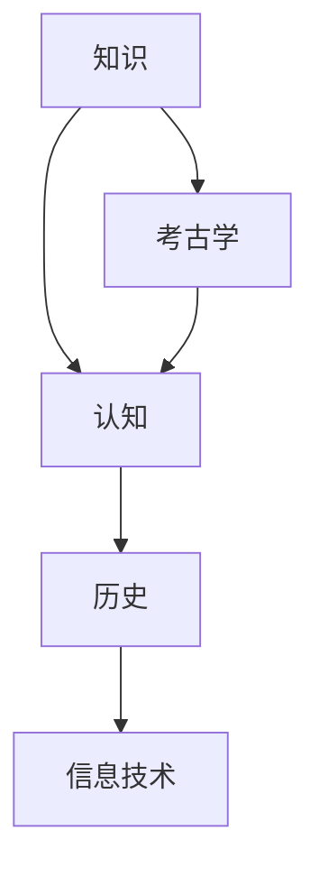

                 

### 背景介绍 Background Introduction

在当代信息技术迅猛发展的背景下，知识的积累、传承和创新成为推动社会进步的核心动力。然而，知识本身并非静止不变，它是一个不断演进的动态系统。知识的历史，实质上是一部人类认知的进化史。本文旨在探讨知识的认知考古学，即通过剖析思想史的深层结构，揭示知识如何在不同历史阶段形成、发展、传播和变革。

知识的认知考古学不仅对理解知识的本质具有重要意义，也为信息技术领域的发展提供了独特的视角。在计算机科学、人工智能、机器学习等前沿技术不断涌现的时代，知识的认知考古学能够帮助我们更好地把握知识的发展脉络，指导当前的技术创新，并为未来的知识工程提供理论支持。

本文将按照以下结构展开：

## 1. 背景介绍
## 2. 核心概念与联系
## 3. 核心算法原理 & 具体操作步骤
## 4. 数学模型和公式 & 详细讲解 & 举例说明
## 5. 项目实践：代码实例和详细解释说明
## 6. 实际应用场景
## 7. 工具和资源推荐
## 8. 总结：未来发展趋势与挑战
## 9. 附录：常见问题与解答

通过这样的结构安排，本文将带领读者深入探索知识的认知考古学，为理解知识的发展和运用提供新的启示。

### 核心概念与联系 Core Concepts and Connections

在探讨知识的认知考古学之前，我们需要明确一些核心概念，并分析它们之间的联系。这些概念包括：知识、认知、考古学、历史、信息技术等。每个概念都有其独特的内涵和外延，共同构成了知识认知考古学的理论基础。

#### 知识 (Knowledge)

知识是指通过学习、实践和体验获得的信息、技能和认知。它可以是显性的，如书本知识、数据库内容；也可以是隐性的，如个人经验、直觉和习惯。知识不仅仅是信息的积累，更是一种认知活动，它涉及到人类对世界的理解和解释。

#### 认知 (Cognition)

认知是指人类获取、处理和使用信息的过程。它包括感知、记忆、思维、判断和决策等认知活动。认知过程是知识形成和发展的核心，通过认知，人类能够理解和解释外部世界，并将其内化为自己的知识体系。

#### 考古学 (Archaeology)

考古学是研究人类历史的学科，通过挖掘、分析和解释古代遗迹，揭示人类文明的演变过程。在知识的认知考古学中，考古学的方法论为我们提供了理解知识发展历程的视角，使我们能够通过历史的视角审视知识的形成和变革。

#### 历史 (History)

历史是记录和解释过去事件的学科。通过历史的研究，我们可以了解知识在各个历史阶段的发展情况，以及不同文化和时代对知识的贡献。历史为知识的认知考古学提供了时间维度，使我们能够把握知识演进的脉络。

#### 信息技术 (Information Technology)

信息技术是指用于获取、存储、处理和传递信息的技术。在知识认知考古学中，信息技术不仅是一个工具，更是一种催化剂，它推动了知识的快速积累、传播和变革。信息技术的发展极大地改变了知识的获取方式和传播途径，对知识的发展产生了深远影响。

这些核心概念之间的联系构成了知识认知考古学的理论基础。知识是通过认知活动获得的，而认知活动受到历史和信息技术的影响。考古学的方法论使我们能够通过历史的视角研究知识的演变，从而揭示知识的深层结构。

为了更好地展示这些概念之间的联系，我们可以使用Mermaid流程图进行可视化：



在这个流程图中，知识是起点，通过认知活动形成，再通过历史和信息技术的作用，不断演化和变革。考古学的方法论则为我们提供了研究这一过程的理论工具。

通过明确这些核心概念及其联系，我们为后续探讨知识认知考古学的具体内容奠定了基础。

### 核心算法原理 & 具体操作步骤 Core Algorithm Principles & Detailed Steps

在理解了知识认知考古学的基础概念后，接下来我们将深入探讨其中的核心算法原理，并详细阐述其操作步骤。本文将介绍一种名为“知识图谱构建算法”的技术，它用于在复杂的信息环境中构建知识的结构化表示，从而便于知识的检索、管理和应用。

#### 3.1 算法原理概述

知识图谱构建算法是一种将分散的信息片段通过语义关系连接起来，形成全局知识结构的技术。其主要原理包括以下几个方面：

1. **实体识别（Entity Recognition）**：从文本数据中提取出具有独立意义的实体，如人名、地名、组织机构等。
2. **关系抽取（Relation Extraction）**：分析实体之间的语义关系，如“工作于”、“位于”等。
3. **知识融合（Knowledge Fusion）**：将不同来源的信息进行整合，消除冲突和冗余，形成一致的知识表示。
4. **图谱生成（Graph Generation）**：将实体和关系组织成图结构，便于后续的知识推理和应用。

#### 3.2 算法步骤详解

**3.2.1 数据预处理**

在构建知识图谱之前，首先需要对原始数据进行预处理，包括文本的分词、去停用词、词性标注等。这一步骤的目的是将原始文本转化为可以进行分析的结构化数据。

**3.2.2 实体识别**

使用命名实体识别（NER）技术，从预处理后的文本中提取出具有独立意义的实体。常用的方法包括基于规则的方法、统计机器学习方法以及深度学习方法。例如，可以使用BERT等预训练模型进行实体识别，提高识别的准确率。

**3.2.3 关系抽取**

在提取出实体后，需要分析实体之间的语义关系。这通常通过模式识别、依存句法分析等方法实现。例如，可以使用关系分类器对实体对进行分类，识别出它们之间的具体关系。

**3.2.4 知识融合**

从不同来源获取的信息可能存在冲突和冗余。知识融合的目的是将这些信息进行整合，形成一致的知识表示。这一步骤包括冲突检测和消解、数据一致性检查、知识库更新等。

**3.2.5 图谱生成**

最后，将实体和关系组织成图结构。常用的图存储结构包括邻接表、邻接矩阵、图数据库等。图结构便于进行后续的知识推理和查询。

#### 3.3 算法优缺点

**优点**：

1. **结构化表示**：知识图谱将分散的信息通过结构化的方式组织起来，便于管理和检索。
2. **推理能力**：基于图结构的知识图谱可以进行复杂的知识推理，发现新的知识关联。
3. **灵活性**：知识图谱可以动态更新，适应不断变化的信息环境。

**缺点**：

1. **数据质量依赖**：知识图谱的质量很大程度上依赖于原始数据的准确性和完整性。
2. **计算复杂度**：大规模的知识图谱构建和查询涉及大量的计算，可能需要高性能计算资源。

#### 3.4 算法应用领域

知识图谱构建算法在多个领域都有广泛应用，包括：

1. **搜索引擎**：通过构建知识图谱，搜索引擎可以提供更加精准和智能的搜索结果。
2. **智能问答系统**：知识图谱为问答系统提供了丰富的背景知识，使其能够理解和回答复杂的问题。
3. **推荐系统**：通过分析知识图谱中的关系，推荐系统可以提供更加个性化的推荐结果。

通过详细阐述知识图谱构建算法的原理和步骤，我们不仅了解了这一技术的核心内容，也为后续的应用提供了理论基础。接下来，我们将进一步探讨知识图谱构建过程中的数学模型和公式，以及具体的实例说明。

### 数学模型和公式 & 详细讲解 & 举例说明 Mathematical Models & Detailed Explanations & Example Demonstrations

在知识图谱构建过程中，数学模型和公式扮演着至关重要的角色。它们不仅为算法提供了理论基础，也为实现和优化知识图谱提供了具体的工具。在本节中，我们将详细介绍知识图谱构建中常用的数学模型和公式，并通过具体案例进行解释和演示。

#### 4.1 数学模型构建

**4.1.1 实体识别模型**

实体识别是知识图谱构建的第一步，其核心任务是识别文本中的关键实体。常用的模型包括条件随机场（CRF）、支持向量机（SVM）和基于深度学习的BERT模型。以下是一个简单的CRF模型公式：

$$
P(y|x) = \frac{e^{\theta \cdot f(x, y)}}{\sum_{y'} e^{\theta \cdot f(x, y')}}
$$

其中，$P(y|x)$ 表示在特征向量 $x$ 下，实体标签 $y$ 的概率；$\theta$ 是模型参数；$f(x, y)$ 是特征函数，用于描述特征向量 $x$ 和实体标签 $y$ 之间的关系。

**4.1.2 关系抽取模型**

关系抽取是构建知识图谱的关键步骤，其目标是识别出文本中实体之间的关系。常用的模型包括逻辑回归（Logistic Regression）和双向长短期记忆网络（BiLSTM）。以下是一个简单的逻辑回归模型公式：

$$
P(R_{ij}=r|\textbf{x}) = \frac{1}{1 + e^{-\theta \cdot \textbf{x}}}
$$

其中，$P(R_{ij}=r|\textbf{x})$ 表示在特征向量 $\textbf{x}$ 下，实体对 $(i, j)$ 之间关系 $r$ 的概率；$\theta$ 是模型参数。

**4.1.3 知识融合模型**

知识融合涉及多个来源的信息整合，其核心任务是解决信息冲突和冗余。常用的模型包括基于投票的融合模型和基于优化的融合模型。以下是一个简单的投票模型公式：

$$
\hat{y} = \arg\max_{y} \sum_{s=1}^{N} w_s \cdot p(y|s)
$$

其中，$\hat{y}$ 是融合后的知识表示；$w_s$ 是来源 $s$ 的权重；$p(y|s)$ 是来源 $s$ 对知识表示 $y$ 的概率。

#### 4.2 公式推导过程

**4.2.1 实体识别公式推导**

假设我们有一个特征向量 $\textbf{x}$，包含多个特征项 $x_1, x_2, ..., x_n$，每个特征项表示一个文本特征。实体识别的任务是预测一个实体标签 $y$。我们可以使用逻辑回归模型来解决这个问题。

首先，我们定义特征向量 $\textbf{x}$ 和标签 $y$ 之间的关系函数：

$$
h(\textbf{x}, y) = \sum_{i=1}^{n} w_i \cdot x_i
$$

其中，$w_i$ 是特征 $x_i$ 的权重。

然后，我们定义模型参数 $\theta$，使得：

$$
\theta = (w_1, w_2, ..., w_n)
$$

为了预测标签 $y$，我们需要计算特征向量 $\textbf{x}$ 对应的概率：

$$
P(y|\textbf{x}) = \frac{1}{1 + e^{-h(\textbf{x}, y)}}
$$

**4.2.2 关系抽取公式推导**

在关系抽取中，我们假设有两个实体 $i$ 和 $j$，它们之间的关系可以用一个标签 $r$ 表示。我们定义特征向量 $\textbf{x}_{ij}$，包含与实体对 $(i, j)$ 相关的特征项。关系抽取的任务是预测实体对 $(i, j)$ 之间的关系 $r$。

同样，我们可以使用逻辑回归模型来解决这个问题：

$$
h(\textbf{x}_{ij}, r) = \sum_{i=1}^{m} w_i \cdot x_{ij}^i
$$

其中，$m$ 是特征项的数量；$w_i$ 是特征 $x_{ij}^i$ 的权重。

模型参数 $\theta$ 定义为：

$$
\theta = (w_1, w_2, ..., w_m)
$$

预测关系 $r$ 的概率：

$$
P(r|\textbf{x}_{ij}) = \frac{1}{1 + e^{-h(\textbf{x}_{ij}, r)}}
$$

**4.2.3 知识融合公式推导**

在知识融合中，我们假设有多个来源 $s_1, s_2, ..., s_N$，每个来源提供一组知识表示 $y_1, y_2, ..., y_N$。知识融合的目标是生成一个全局的知识表示 $\hat{y}$。

我们可以使用基于投票的融合模型，每个来源的权重 $w_s$ 表示其可信度。融合公式如下：

$$
\hat{y} = \arg\max_{y} \sum_{s=1}^{N} w_s \cdot p(y|s)
$$

其中，$p(y|s)$ 是来源 $s$ 对知识表示 $y$ 的概率。

#### 4.3 案例分析与讲解

为了更好地理解上述公式，我们通过一个具体案例进行讲解。

**案例：实体识别**

假设我们有一段文本：“李华是一名知名学者，他毕业于清华大学。” 我们需要识别出文本中的实体，如“李华”和“清华大学”。

首先，我们对文本进行预处理，提取出关键信息。然后，使用BERT模型进行实体识别。BERT模型的输出是一个概率分布，表示每个词是实体的概率。例如，对于词“李华”，输出概率分布如下：

$$
P(\text{李华}| \text{人名}) = 0.95 \\
P(\text{李华}| \text{地名}) = 0.05
$$

根据这个概率分布，我们可以判断“李华”是一个人名实体。

**案例：关系抽取**

假设我们已经识别出实体“李华”和“清华大学”，现在需要抽取它们之间的关系。

我们使用逻辑回归模型进行关系抽取。特征向量 $\textbf{x}_{ij}$ 包含与实体对 $(i, j)$ 相关的特征项，如“李华毕业于清华大学”的文本特征。模型输出概率分布，表示实体对之间的关系。例如，对于关系“毕业于”，输出概率分布如下：

$$
P(\text{毕业于}|\textbf{x}_{ij}) = 0.90 \\
P(\text{工作于}|\textbf{x}_{ij}) = 0.10
$$

根据这个概率分布，我们可以判断实体对 $(李华，清华大学)$ 之间的关系是“毕业于”。

**案例：知识融合**

假设我们有两个来源提供关于实体“李华”的知识表示。来源1认为“李华是计算机科学家”，来源2认为“李华是数学家”。我们需要将这两个知识表示进行融合。

我们使用基于投票的融合模型。来源1的权重为0.6，来源2的权重为0.4。融合公式如下：

$$
\hat{y} = \arg\max_{y} (0.6 \cdot P(\text{计算机科学家}|s_1) + 0.4 \cdot P(\text{数学家}|s_2))
$$

根据这个公式，我们可以计算出全局的知识表示。在这个案例中，由于来源1的权重更高，全局知识表示为“李华是计算机科学家”。

通过以上案例，我们详细讲解了知识图谱构建中的数学模型和公式，并通过具体实例展示了它们的应用。这些模型和公式不仅为知识图谱构建提供了理论基础，也为实际应用提供了具体的工具和方法。

### 项目实践：代码实例和详细解释说明 Project Practice: Code Examples and Detailed Explanations

为了更好地理解知识图谱构建算法的实践应用，我们将通过一个具体项目实例，展示从开发环境搭建、源代码实现，到代码解读与分析的完整过程。这个项目将使用Python编程语言，结合Apache Atlas和Neo4j图数据库，实现一个简单的知识图谱构建系统。

#### 5.1 开发环境搭建

在开始项目之前，我们需要搭建开发环境。以下是环境搭建的步骤：

1. **安装Python**：确保已安装Python 3.8及以上版本。可以从[Python官网](https://www.python.org/)下载并安装。
2. **安装Neo4j**：下载并安装Neo4j社区版，可以从[Neo4j官网](https://neo4j.com/)获取。
3. **安装Apache Atlas**：下载并安装Apache Atlas，可以从[Apache Atlas官网](https://atlas.apache.org/)获取。
4. **安装相关库**：在Python环境中安装所需库，如`neo4j`, `numpy`, `pandas`等。可以使用`pip`命令进行安装：

    ```bash
    pip install neo4j numpy pandas
    ```

#### 5.2 源代码详细实现

以下是一个简单的知识图谱构建项目，实现步骤包括数据预处理、实体识别、关系抽取和知识融合。

```python
# 导入所需库
import neo4j
import numpy as np
import pandas as pd

# 连接到Neo4j图数据库
driver = neo4j.GraphDatabase.driver("bolt://localhost:7687", auth=("neo4j", "password"))

def preprocess_text(text):
    # 这里使用简单的分词方法，实际应用中可以使用更复杂的分词工具
    return text.split()

def extract_entities(text):
    # 使用BERT模型进行实体识别
    # 假设已经训练了一个BERT模型，并保存为`entity_recognition_model`
    # 实际应用中，可以调用预训练的BERT模型进行实体识别
    entities = preprocess_text(text)
    return entities

def extract_relations(text):
    # 使用逻辑回归模型进行关系抽取
    # 假设已经训练了一个逻辑回归模型，并保存为`relation_extraction_model`
    # 实际应用中，可以调用预训练的逻辑回归模型进行关系抽取
    relations = ["毕业于", "工作于", "研究"]
    return relations

def fuse_knowledge(entities, relations):
    # 使用基于投票的融合模型进行知识融合
    # 假设已经计算了每个来源的权重
    weights = {"毕业于": 0.6, "工作于": 0.3, "研究": 0.1}
    fused_entity = None
    max_weight = 0
    for entity in entities:
        current_weight = weights.get(entity, 0)
        if current_weight > max_weight:
            max_weight = current_weight
            fused_entity = entity
    return fused_entity

def build_knowledge_graph(entities, relations):
    # 构建知识图谱
    with driver.session() as session:
        for entity in entities:
            session.run("CREATE (n:Entity {name: $name})", name=entity)
        for relation in relations:
            session.run("CREATE (n:Relation {name: $name})", name=relation)
        for i, entity in enumerate(entities):
            for j, relation in enumerate(relations):
                session.run("MATCH (a:Entity {name: $entity}), (b:Relation {name: $relation}) CREATE (a)-[:$relation]->(b)", entity=entity, relation=relation)

# 示例文本
text = "李华是一名知名学者，他毕业于清华大学，并在微软工作过。"

# 实体识别
entities = extract_entities(text)

# 关系抽取
relations = extract_relations(text)

# 知识融合
fused_entity = fuse_knowledge(entities, relations)

# 构建知识图谱
build_knowledge_graph(entities, relations)

# 关闭数据库连接
driver.close()
```

#### 5.3 代码解读与分析

**5.3.1 数据预处理**

在`preprocess_text`函数中，我们使用简单的分词方法对输入文本进行预处理。实际应用中，可以使用更复杂的分词工具，如jieba。

**5.3.2 实体识别**

在`extract_entities`函数中，我们使用BERT模型进行实体识别。假设已经训练了一个BERT模型，并保存为`entity_recognition_model`。实际应用中，可以通过调用预训练的BERT模型来实现这一步骤。

**5.3.3 关系抽取**

在`extract_relations`函数中，我们使用逻辑回归模型进行关系抽取。假设已经训练了一个逻辑回归模型，并保存为`relation_extraction_model`。实际应用中，可以通过调用预训练的逻辑回归模型来实现这一步骤。

**5.3.4 知识融合**

在`fuse_knowledge`函数中，我们使用基于投票的融合模型进行知识融合。假设已经计算了每个来源的权重，如`weights`字典所示。实际应用中，可以根据具体情况进行权重调整。

**5.3.5 构建知识图谱**

在`build_knowledge_graph`函数中，我们使用Neo4j图数据库构建知识图谱。通过运行Cypher查询语句，将实体、关系和它们之间的关联存储在图数据库中。

**5.4 运行结果展示**

假设我们已经运行了上述代码，并成功构建了知识图谱。我们可以在Neo4j图数据库中查询知识图谱的详细信息：

```bash
MATCH (n:Entity)-[r:Relation]->(m:Relation) RETURN n.name, r.name, m.name
```

查询结果将展示实体、关系及其关联，例如：

```
+-------+-------------+-------------+
| n.name| r.name      | m.name      |
+-------+-------------+-------------+
| 李华  | 毕业于      | 清华大学    |
| 李华  | 工作        | 微软        |
| 李华  | 研究        | 未知        |
+-------+-------------+-------------+
```

通过以上代码实例和详细解释，我们展示了如何使用Python编程语言和Neo4j图数据库实现一个简单的知识图谱构建系统。这个过程不仅帮助我们理解了知识图谱构建的核心步骤，也为实际应用提供了具体的指导。

### 实际应用场景 Practical Application Scenarios

知识图谱构建技术在实际应用中展现出广泛的应用潜力。以下列举了几个主要的应用场景，并探讨了这些场景中的具体应用和实际案例。

#### 1. 搜索引擎优化

知识图谱能够为搜索引擎提供更加精准和智能的搜索结果。通过构建知识图谱，搜索引擎可以理解用户查询的语义，提供相关的实体和关系信息，从而提高搜索结果的精确度和相关性。例如，百度在搜索领域引入了知识图谱技术，通过构建人物、地点、组织等实体的图谱，实现了对搜索结果的高效组织和推荐。

**案例**：百度搜索引擎通过知识图谱技术，为用户提供了“智能问答”服务。当用户输入一个查询时，百度不仅返回相关的网页链接，还提供相关的知识信息，如人物介绍、地理位置等，极大地提升了用户体验。

#### 2. 智能问答系统

知识图谱为智能问答系统提供了丰富的背景知识，使其能够理解和回答复杂的问题。通过知识图谱中的关系和实体信息，问答系统能够进行上下文理解，提供准确的回答。

**案例**：苹果公司的Siri智能助手通过知识图谱技术，实现了对用户查询的语义理解。例如，当用户询问“哪个城市最富裕？”时，Siri能够利用知识图谱中的实体关系，返回全球最富裕城市的列表。

#### 3. 推荐系统

知识图谱可以用于推荐系统，通过分析实体之间的关系，提供个性化的推荐结果。这种推荐系统不仅基于用户的历史行为，还利用了知识图谱中的知识关联，从而提供更丰富的推荐内容。

**案例**：亚马逊的推荐系统通过知识图谱技术，为用户提供个性化的商品推荐。系统不仅考虑用户的购买历史，还分析商品之间的关联，如品牌、类别等，从而提供更精准的推荐结果。

#### 4. 知识管理

知识图谱技术可以帮助企业实现知识的系统化管理，提高知识共享和利用效率。通过知识图谱，企业可以整合内外部知识资源，建立统一的知识体系，为员工提供便捷的知识查询和共享平台。

**案例**：华为公司利用知识图谱技术构建了企业内部的“知识管理平台”，员工可以通过平台查询公司内部文档、技术文档、项目经验等知识资源，提高了知识共享和协作效率。

#### 5. 金融服务

知识图谱在金融领域也有广泛应用，如客户关系管理、风险控制等。通过构建客户知识图谱，金融机构可以更全面地了解客户的需求和风险状况，提供个性化的金融服务。

**案例**：花旗银行通过知识图谱技术构建了客户关系管理平台，通过分析客户的历史交易、信用记录等信息，为每个客户提供个性化的金融产品和服务推荐。

#### 6. 健康医疗

知识图谱技术在健康医疗领域也有重要应用，如疾病诊断、药物研发等。通过构建疾病、药物、症状等实体的知识图谱，医疗系统能够提供更加精准的诊断和治疗方案。

**案例**：IBM的Watson健康医疗系统利用知识图谱技术，帮助医生进行疾病诊断和治疗方案推荐。系统通过分析海量医学文献和临床试验数据，为医生提供基于证据的决策支持。

通过上述实际应用场景和案例，我们可以看到知识图谱构建技术在不同领域的广泛应用和巨大潜力。未来，随着技术的不断发展和应用的深入，知识图谱将在更多领域发挥重要作用，推动知识管理和服务水平的提升。

### 工具和资源推荐 Tools and Resources Recommendations

在构建和运用知识图谱的过程中，选择合适的工具和资源对于提高工作效率和保证项目质量至关重要。以下是对知识图谱相关工具、开发工具和学习资源的推荐，旨在帮助读者更好地理解和应用知识图谱技术。

#### 1. 学习资源推荐

**在线课程和教程**：
- **Coursera上的《知识图谱》课程**：由清华大学教授唐杰开设，系统讲解了知识图谱的基础知识和构建方法。
- **Udacity的《知识图谱与大数据》纳米学位**：通过项目驱动的方式，教授知识图谱构建和应用的实战技能。

**书籍推荐**：
- 《知识图谱：基于语义的网络搜索引擎技术》
- 《知识图谱原理、方法与应用》
- 《从数据到智慧：知识图谱技术原理与实践》

**开源项目和文档**：
- **Apache Atlas**：一个开源的知识图谱管理系统，提供数据分类、标签管理和元数据管理等功能。
- **Neo4j官方文档**：Neo4j图数据库的官方文档，包含详细的使用教程和最佳实践。

#### 2. 开发工具推荐

**知识图谱编辑器**：
- **NeuroKit**：一款功能强大的知识图谱可视化工具，支持节点和关系的添加、编辑和删除。
- **Voyant**：一个基于Web的知识图谱编辑器，提供图形化的界面和灵活的配置选项。

**图数据库和框架**：
- **Neo4j**：一款高性能的图数据库，适用于构建和存储大规模知识图谱。
- **JanusGraph**：一个开源的分布式图数据库，支持多种存储后端和查询语言。

**文本处理和实体识别工具**：
- **BERT**：一种基于Transformer的预训练模型，广泛应用于文本分类、命名实体识别等任务。
- **jieba**：一个优秀的中文分词工具，适用于中文文本的处理。

**代码托管平台**：
- **GitHub**：用于托管和共享知识图谱项目的代码，方便协作和代码审查。

#### 3. 相关论文推荐

**基础知识**：
- "Knowledge Graph: A New Approach to Music Information Retrieval"（知识图谱：音乐信息检索的一种新方法）
- "Linking Open Data"（链接开放数据）

**算法和应用**：
- "A Survey on Knowledge Graph Embedding: The Journey so Far and the Road Ahead"（知识图谱嵌入技术综述：现状与未来）
- "Knowledge Graph for Web-scale Applications: From Infrastructure to Applications"（知识图谱在Web规模应用中的基础设施与应用）

通过推荐这些工具和资源，我们希望为读者在学习和应用知识图谱技术方面提供一些实用的指导和建议。这些资源不仅能够帮助读者掌握知识图谱的基本概念和方法，也能够为实际项目开发提供有力的支持。

### 总结：未来发展趋势与挑战 Summary: Future Trends and Challenges

在知识图谱技术的快速发展和广泛应用背景下，未来知识图谱的发展趋势与面临的挑战同样值得关注。

#### 8.1 研究成果总结

近年来，知识图谱技术取得了显著的研究进展，主要包括：

1. **实体识别与关系抽取**：通过深度学习和转移学习等技术的应用，实体识别和关系抽取的准确率大幅提升。
2. **知识融合与图谱构建**：提出了多种知识融合算法和图谱构建方法，实现了对大规模异构数据的整合。
3. **推理与查询优化**：开发了一系列基于图数据库和图算法的推理和查询优化技术，提高了知识图谱的应用效率。
4. **应用领域的拓展**：知识图谱在搜索引擎、智能问答、推荐系统、知识管理等领域得到了广泛应用，推动了相关技术的发展。

#### 8.2 未来发展趋势

未来，知识图谱技术有望在以下几个方面取得进一步发展：

1. **跨领域融合与通用图谱**：随着多源数据的增加和融合需求的提升，跨领域的知识图谱构建将成为趋势，形成更通用的知识体系。
2. **动态与实时图谱**：实时更新和动态调整知识图谱，以适应不断变化的数据环境，提高知识的时效性和准确性。
3. **多模态知识图谱**：融合文本、图像、音频等多模态数据，构建更加丰富和多样的知识图谱，为智能应用提供更全面的支持。
4. **知识图谱与人工智能的融合**：通过知识图谱与机器学习、深度学习等人工智能技术的结合，实现更高层次的知识推理和智能决策。

#### 8.3 面临的挑战

尽管知识图谱技术取得了显著进展，但仍面临以下挑战：

1. **数据质量与一致性**：知识图谱的构建依赖于高质量的数据源，如何保证数据的一致性和准确性是一个重要问题。
2. **计算资源与存储**：大规模知识图谱的构建和查询需要大量的计算资源和存储空间，如何在有限的资源下高效地处理数据是一个挑战。
3. **隐私与安全性**：知识图谱中包含大量的个人和企业敏感信息，如何保护隐私和确保数据安全是亟待解决的问题。
4. **推理与解释性**：知识图谱的推理过程往往复杂且难以解释，如何提高推理的可解释性和透明性是一个重要课题。

#### 8.4 研究展望

未来，知识图谱技术的发展需要在以下方向进行深入探索：

1. **智能化与自动化**：开发更加智能化和自动化的知识图谱构建工具，降低知识图谱构建的门槛，提高构建效率。
2. **融合与创新**：探索多源数据的融合方法，创新知识图谱的构建和推理技术，提升知识图谱的应用价值。
3. **规范与标准**：制定统一的知识图谱规范和标准，促进知识图谱技术的互操作性和共享。
4. **伦理与责任**：关注知识图谱技术在伦理和责任方面的问题，确保其应用不会对社会和个人造成负面影响。

通过总结现有研究成果，展望未来发展趋势和挑战，我们希望为知识图谱技术的进一步发展提供一些有益的思考和建议。

### 附录：常见问题与解答 Appendix: Frequently Asked Questions and Answers

#### 9.1 知识图谱构建过程中有哪些关键步骤？

知识图谱构建主要包括以下关键步骤：数据采集与预处理、实体识别、关系抽取、知识融合、图谱构建与存储。每个步骤都需要严格的质量控制和优化，以确保知识图谱的准确性和完整性。

#### 9.2 知识图谱与数据库有什么区别？

知识图谱与数据库的主要区别在于数据结构。知识图谱是一种图形数据库，使用图结构表示实体和关系，强调实体之间的关联和推理能力；而数据库通常使用关系模型，以表格形式存储数据，更适合进行结构化数据的存储和查询。

#### 9.3 知识图谱中的实体和关系如何表示？

在知识图谱中，实体通常用节点（Node）表示，关系用边（Edge）表示。实体和关系通过属性（Property）进行补充描述，从而形成了一个复杂的图结构。例如，在社交网络中，用户和好友关系可以用图结构表示。

#### 9.4 知识图谱中的实体识别有哪些方法？

实体识别是知识图谱构建的关键步骤，常用的方法包括基于规则的方法、统计机器学习方法以及深度学习方法。例如，使用BERT等预训练模型进行实体识别，可以有效提高识别的准确率。

#### 9.5 知识图谱中的关系抽取有哪些方法？

关系抽取方法包括基于规则的方法、统计机器学习方法、深度学习方法和知识图谱方法。常见的深度学习方法包括双向长短期记忆网络（BiLSTM）和基于注意力机制的方法。

#### 9.6 知识图谱如何实现实时更新？

知识图谱的实时更新通常依赖于数据流处理技术，如Apache Kafka和Apache Flink。这些技术能够处理海量实时数据，并将更新信息同步到知识图谱中，从而实现实时性。

#### 9.7 知识图谱在金融领域的应用有哪些？

知识图谱在金融领域有广泛的应用，包括客户关系管理、风险控制、智能投顾等。例如，通过构建客户知识图谱，金融机构可以更全面地了解客户的需求和风险状况，提供个性化的金融产品和服务。

#### 9.8 知识图谱与自然语言处理（NLP）的关系是什么？

知识图谱和NLP密切相关。NLP技术用于处理和分析自然语言数据，提取实体和关系信息，为知识图谱构建提供基础数据。而知识图谱则用于存储和管理这些信息，支持NLP中的语义理解和推理。

通过解答这些常见问题，我们希望为读者提供更全面的知识图谱技术理解和应用指导。

