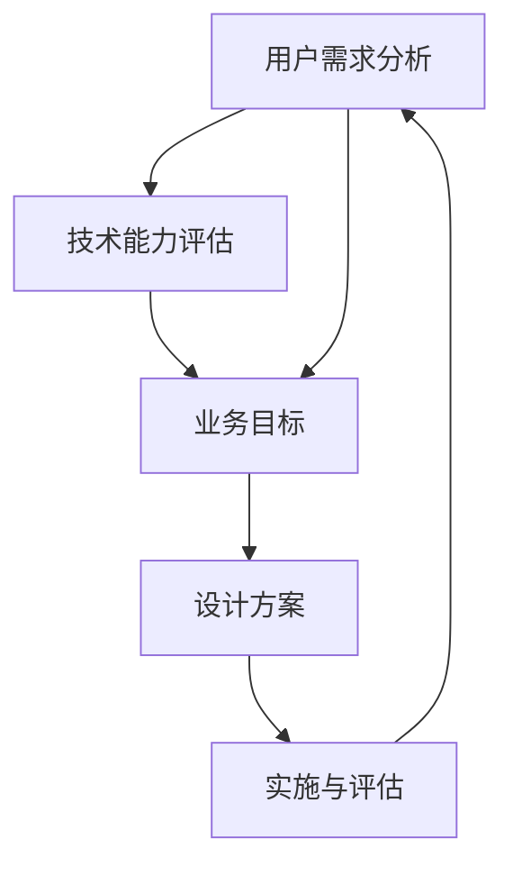

                 

关键词：知识设计思维、以人为本、问题解决、用户体验、设计原则、技术实现

> 摘要：本文将深入探讨知识的设计思维，着重阐述如何以人为本，通过科学的思维方法和设计原则，有效地进行问题解决。文章旨在为从事技术领域的工作者提供一种全新的视角，帮助他们在解决复杂问题时，既能保持技术的先进性，又能注重用户体验，实现技术与人性的有机结合。

## 1. 背景介绍

在信息技术的快速发展背景下，知识的设计思维逐渐成为解决复杂问题的重要方法。知识设计思维强调以人为中心，通过系统的分析和创新，将用户需求、技术能力和业务目标有机融合，从而实现高效的问题解决。本文将结合知识的设计思维，探讨其在实际问题解决中的应用。

### 1.1 知识设计思维的概念

知识设计思维是一种综合性的思维方式，它涵盖了设计思维、系统思维、创新思维等多个方面。其核心在于以人为本，通过理解用户需求、挖掘潜在问题、构建解决方案，实现知识的有效传递和应用。知识设计思维注重以下几点：

- **用户导向**：始终将用户需求放在首位，关注用户体验。
- **系统性**：强调各个要素之间的关联和互动，形成整体解决方案。
- **创新性**：鼓励突破传统思维，寻找新的解决方案。
- **可操作性**：确保设计方案具备可行性和可执行性。

### 1.2 知识设计思维的重要性

在信息技术领域，知识设计思维的重要性体现在以下几个方面：

- **提高问题解决效率**：通过系统分析和设计，快速找到问题的根源，提出有效的解决方案。
- **优化用户体验**：关注用户需求，提升产品的易用性和用户体验。
- **增强创新能力**：鼓励创新思维，推动技术的进步和应用的拓展。
- **促进知识共享**：通过知识设计，实现知识的有效传递和共享，提升团队的整体能力。

## 2. 核心概念与联系

为了更好地理解知识的设计思维，我们首先需要了解一些核心概念和它们之间的联系。

### 2.1 用户需求分析

用户需求分析是知识设计思维的基础。通过深入了解用户的行为模式、需求痛点和使用场景，我们可以发现问题的本质，为后续的设计提供依据。用户需求分析通常包括以下步骤：

1. **用户调研**：通过访谈、问卷调查、用户行为数据分析等方式，收集用户的信息和反馈。
2. **需求分类**：将收集到的需求进行分类，区分出主要需求和次要需求。
3. **需求优先级**：根据需求的紧迫程度和影响范围，确定需求的优先级。
4. **需求建模**：利用用户画像、需求图谱等工具，构建用户需求模型，帮助理解用户需求的全貌。

### 2.2 技术能力评估

技术能力评估是知识设计思维中不可或缺的一部分。它涉及到对现有技术的理解、掌握和应用能力。通过技术能力评估，我们可以确定哪些技术适用于解决特定问题，哪些技术需要进一步研究和开发。

1. **技术调研**：了解现有的技术方案、发展趋势和应用案例。
2. **技术分类**：根据技术特点和应用场景，对技术进行分类和归纳。
3. **技术评估**：评估技术的可行性、稳定性和性能，选择合适的技术方案。
4. **技术储备**：对新技术进行持续关注和研究，确保技术储备的充足性。

### 2.3 业务目标

业务目标是知识设计思维中的关键要素。它关系到企业的战略方向、市场定位和竞争优势。在知识设计思维中，我们需要将用户需求、技术能力与业务目标相结合，找到最佳解决方案。

1. **业务分析**：了解企业的战略目标、市场定位和业务模式。
2. **目标设定**：根据业务分析结果，设定具体、可量化的业务目标。
3. **目标评估**：评估不同设计方案对业务目标的实现程度，选择最优方案。
4. **目标调整**：根据实际情况和反馈，对目标进行调整和优化。

### 2.4 Mermaid 流程图

为了更好地展示知识设计思维的核心概念和联系，我们使用 Mermaid 流程图来描述整个过程。



## 3. 核心算法原理 & 具体操作步骤

### 3.1 算法原理概述

知识设计思维中的核心算法是基于用户需求分析、技术能力评估和业务目标设定的。该算法的主要原理是通过多维度分析，找到最优的解决方案。算法的具体步骤如下：

1. **用户需求分析**：通过用户调研、需求分类和需求建模，构建用户需求模型。
2. **技术能力评估**：对现有技术进行调研、分类和评估，确定适用于解决用户需求的技术。
3. **业务目标设定**：根据企业战略和市场需求，设定具体的业务目标。
4. **设计方案生成**：结合用户需求、技术能力和业务目标，生成多种设计方案。
5. **方案评估与优化**：对设计方案进行评估和优化，选择最优方案。
6. **实施与评估**：将最优方案付诸实践，并进行持续评估和调整。

### 3.2 算法步骤详解

1. **用户需求分析**：

   用户需求分析是知识设计思维的第一步。通过用户调研和需求建模，我们可以构建出用户需求的全貌。具体步骤如下：

   - **用户调研**：通过访谈、问卷调查等方式，收集用户的信息和反馈。
   - **需求分类**：将用户需求分为主要需求和次要需求，明确需求的重要性。
   - **需求建模**：利用用户画像、需求图谱等工具，构建用户需求模型。

2. **技术能力评估**：

   技术能力评估是知识设计思维的核心。通过技术调研、分类和评估，我们可以确定适用于解决用户需求的技术。具体步骤如下：

   - **技术调研**：了解现有技术方案、发展趋势和应用案例。
   - **技术分类**：根据技术特点和应用场景，对技术进行分类和归纳。
   - **技术评估**：评估技术的可行性、稳定性和性能，选择合适的技术方案。

3. **业务目标设定**：

   业务目标是知识设计思维中的重要组成部分。通过业务分析和目标设定，我们可以确保设计方案符合企业战略和市场需求。具体步骤如下：

   - **业务分析**：了解企业的战略目标、市场定位和业务模式。
   - **目标设定**：根据业务分析结果，设定具体、可量化的业务目标。
   - **目标评估**：评估不同设计方案对业务目标的实现程度，选择最优方案。

4. **设计方案生成**：

   设计方案生成是基于用户需求、技术能力和业务目标的。通过多维度分析，我们可以生成多种设计方案。具体步骤如下：

   - **用户需求分析**：根据用户需求模型，确定需求的核心要素。
   - **技术能力评估**：选择适用于解决用户需求的技术方案。
   - **业务目标设定**：根据业务目标，确定设计方案的目标和约束条件。

5. **方案评估与优化**：

   方案评估与优化是确保设计方案可行性和有效性的关键。通过对设计方案进行评估和优化，我们可以选择最优方案。具体步骤如下：

   - **方案评估**：对设计方案进行可行性、稳定性、性能等方面的评估。
   - **方案优化**：根据评估结果，对设计方案进行优化和调整。

6. **实施与评估**：

   实施与评估是知识设计思维的最后一步。通过将最优方案付诸实践，并进行持续评估和调整，我们可以确保设计方案的落地和持续改进。具体步骤如下：

   - **方案实施**：将最优方案付诸实践，并确保实施过程中的稳定性和可靠性。
   - **持续评估**：对实施效果进行持续评估，收集用户反馈和业务数据。
   - **方案调整**：根据评估结果，对设计方案进行调整和优化。

### 3.3 算法优缺点

知识设计思维的核心算法具有以下优点：

- **用户导向**：以用户需求为核心，确保设计方案符合用户实际需求。
- **系统性**：综合考虑用户需求、技术能力和业务目标，形成整体解决方案。
- **创新性**：鼓励创新思维，寻找新的解决方案。
- **可操作性**：确保设计方案具备可行性和可执行性。

然而，该算法也存在一定的缺点：

- **复杂性**：涉及多个维度和要素，设计过程较为复杂。
- **时间成本**：需要进行大量的用户调研、技术评估和方案优化，耗时较长。
- **资源需求**：需要配备专业的团队和工具，确保设计过程的顺利进行。

### 3.4 算法应用领域

知识设计思维的核心算法适用于多个领域，包括：

- **产品设计**：通过用户需求分析和设计方案生成，确保产品满足用户实际需求。
- **系统架构设计**：通过技术能力评估和业务目标设定，构建高效的系统架构。
- **业务流程优化**：通过方案评估和优化，提升业务流程的效率和稳定性。
- **技术创新**：通过创新思维和技术调研，推动技术的进步和应用。

## 4. 数学模型和公式 & 详细讲解 & 举例说明

### 4.1 数学模型构建

知识设计思维中的数学模型主要涉及用户需求分析、技术能力评估和业务目标设定的定量描述。以下是一个简化的数学模型构建过程：

1. **用户需求模型**：

   用户需求模型可以表示为：

   $$ R = \sum_{i=1}^{n} r_i \cdot w_i $$

   其中，$R$ 表示用户需求的总分数，$r_i$ 表示第 $i$ 个需求的评分，$w_i$ 表示第 $i$ 个需求的重要度。

2. **技术能力评估模型**：

   技术能力评估模型可以表示为：

   $$ T = \sum_{j=1}^{m} t_j \cdot v_j $$

   其中，$T$ 表示技术能力总分，$t_j$ 表示第 $j$ 个技术的评分，$v_j$ 表示第 $j$ 个技术的重要度。

3. **业务目标模型**：

   业务目标模型可以表示为：

   $$ B = \sum_{k=1}^{l} b_k \cdot u_k $$

   其中，$B$ 表示业务目标总分，$b_k$ 表示第 $k$ 个业务目标的评分，$u_k$ 表示第 $k$ 个业务目标的重要度。

### 4.2 公式推导过程

1. **用户需求模型推导**：

   用户需求模型的推导基于以下假设：

   - 用户需求可以分解为多个子需求。
   - 每个子需求都可以用评分和重要度来表示。
   - 用户需求的总分数是各个子需求分数的加权和。

   假设用户需求有 $n$ 个子需求，第 $i$ 个子需求的评分为 $r_i$，重要度为 $w_i$。则用户需求的总分数为：

   $$ R = r_1 \cdot w_1 + r_2 \cdot w_2 + \ldots + r_n \cdot w_n $$

   为了使模型具有一致性，可以对各个子需求的重要度进行归一化处理，使得 $w_i \in [0, 1]$。于是，用户需求模型可以表示为：

   $$ R = \sum_{i=1}^{n} r_i \cdot w_i $$

2. **技术能力评估模型推导**：

   技术能力评估模型的推导基于以下假设：

   - 技术能力可以分解为多个子技术。
   - 每个子技术都可以用评分和重要度来表示。
   - 技术能力的总分数是各个子技术分数的加权和。

   假设技术能力有 $m$ 个子技术，第 $j$ 个子技术的评分为 $t_j$，重要度为 $v_j$。则技术能力的总分数为：

   $$ T = t_1 \cdot v_1 + t_2 \cdot v_2 + \ldots + t_m \cdot v_m $$

   同样，为了使模型具有一致性，可以对各个子技术的重要度进行归一化处理，使得 $v_j \in [0, 1]$。于是，技术能力评估模型可以表示为：

   $$ T = \sum_{j=1}^{m} t_j \cdot v_j $$

3. **业务目标模型推导**：

   业务目标模型的推导基于以下假设：

   - 业务目标可以分解为多个子目标。
   - 每个子目标都可以用评分和重要度来表示。
   - 业务目标的总分数是各个子目标分数的加权和。

   假设业务目标有 $l$ 个子目标，第 $k$ 个子目标的评分为 $b_k$，重要度为 $u_k$。则业务目标的总分数为：

   $$ B = b_1 \cdot u_1 + b_2 \cdot u_2 + \ldots + b_l \cdot u_l $$

   同样，为了使模型具有一致性，可以对各个子目标的重要度进行归一化处理，使得 $u_k \in [0, 1]$。于是，业务目标模型可以表示为：

   $$ B = \sum_{k=1}^{l} b_k \cdot u_k $$

### 4.3 案例分析与讲解

为了更好地理解上述数学模型的实际应用，我们通过一个具体的案例进行分析。

假设某个企业在进行新产品的开发，需要进行用户需求分析、技术能力评估和业务目标设定。

1. **用户需求分析**：

   根据用户调研和需求建模，企业确定了以下三个主要需求：

   - **需求1**：易于操作，得分 $r_1 = 8$，重要度 $w_1 = 0.5$。
   - **需求2**：功能丰富，得分 $r_2 = 7$，重要度 $w_2 = 0.3$。
   - **需求3**：界面美观，得分 $r_3 = 6$，重要度 $w_3 = 0.2$。

   根据用户需求模型，用户需求的总分数为：

   $$ R = 8 \cdot 0.5 + 7 \cdot 0.3 + 6 \cdot 0.2 = 4.5 + 2.1 + 1.2 = 7.8 $$

2. **技术能力评估**：

   企业对现有技术进行了评估，确定了以下三个主要技术：

   - **技术1**：前端开发，得分 $t_1 = 9$，重要度 $v_1 = 0.5$。
   - **技术2**：后端开发，得分 $t_2 = 8$，重要度 $v_2 = 0.3$。
   - **技术3**：数据分析，得分 $t_3 = 7$，重要度 $v_3 = 0.2$。

   根据技术能力评估模型，技术能力的总分数为：

   $$ T = 9 \cdot 0.5 + 8 \cdot 0.3 + 7 \cdot 0.2 = 4.5 + 2.4 + 1.4 = 8.3 $$

3. **业务目标设定**：

   企业根据市场分析和战略目标，确定了以下三个主要业务目标：

   - **目标1**：提高市场份额，得分 $b_1 = 8$，重要度 $u_1 = 0.5$。
   - **目标2**：提升用户满意度，得分 $b_2 = 7$，重要度 $u_2 = 0.3$。
   - **目标3**：降低开发成本，得分 $b_3 = 6$，重要度 $u_3 = 0.2$。

   根据业务目标模型，业务目标的总分数为：

   $$ B = 8 \cdot 0.5 + 7 \cdot 0.3 + 6 \cdot 0.2 = 4 + 2.1 + 1.2 = 7.3 $$

通过上述分析，企业可以得出以下结论：

- **用户需求总分**：7.8
- **技术能力总分**：8.3
- **业务目标总分**：7.3

根据这些数据，企业可以确定在产品设计过程中，应优先考虑技术能力，其次是用户需求，最后是业务目标。这样可以确保设计方案既具备技术可行性，又满足用户需求，同时符合企业战略目标。

## 5. 项目实践：代码实例和详细解释说明

### 5.1 开发环境搭建

在本节中，我们将使用Python语言来演示知识设计思维的核心算法实现。首先，我们需要搭建Python的开发环境。

1. **安装Python**：

   前往Python官方网站（https://www.python.org/）下载最新的Python版本，并进行安装。安装过程中，确保勾选“Add Python to PATH”选项，以便在命令行中直接运行Python。

2. **安装必要的库**：

   打开命令行，执行以下命令来安装必要的Python库：

   ```shell
   pip install numpy pandas matplotlib
   ```

   这些库分别用于数学计算、数据处理和图形可视化。

### 5.2 源代码详细实现

在本节中，我们将使用Python实现知识设计思维的核心算法，包括用户需求分析、技术能力评估和业务目标设定。

1. **用户需求分析**：

   用户需求分析是知识设计思维的第一步。以下是一个简单的用户需求分析代码实例：

   ```python
   import pandas as pd

   # 用户需求数据
   user_requirements = {
       '需求1': {'评分': 8, '重要度': 0.5},
       '需求2': {'评分': 7, '重要度': 0.3},
       '需求3': {'评分': 6, '重要度': 0.2}
   }

   # 创建需求DataFrame
   df_requirements = pd.DataFrame(user_requirements).T

   # 计算用户需求总分
   user_demand_score = df_requirements['评分'] * df_requirements['重要度'].sum()
   print(f'用户需求总分：{user_demand_score}')
   ```

   在这段代码中，我们首先定义了一个字典，用于存储用户需求及其评分和重要度。然后，我们将字典转换为DataFrame，并计算用户需求总分。

2. **技术能力评估**：

   技术能力评估是知识设计思维的核心。以下是一个简单的技术能力评估代码实例：

   ```python
   # 技术能力数据
   tech_capabilities = {
       '技术1': {'评分': 9, '重要度': 0.5},
       '技术2': {'评分': 8, '重要度': 0.3},
       '技术3': {'评分': 7, '重要度': 0.2}
   }

   # 创建技术DataFrame
   df_capabilities = pd.DataFrame(tech_capabilities).T

   # 计算技术能力总分
   tech_ability_score = df_capabilities['评分'] * df_capabilities['重要度'].sum()
   print(f'技术能力总分：{tech_ability_score}')
   ```

   在这段代码中，我们首先定义了一个字典，用于存储技术能力及其评分和重要度。然后，我们将字典转换为DataFrame，并计算技术能力总分。

3. **业务目标设定**：

   业务目标设定是知识设计思维的重要组成部分。以下是一个简单的业务目标设定代码实例：

   ```python
   # 业务目标数据
   business_objectives = {
       '目标1': {'评分': 8, '重要度': 0.5},
       '目标2': {'评分': 7, '重要度': 0.3},
       '目标3': {'评分': 6, '重要度': 0.2}
   }

   # 创建目标DataFrame
   df_objectives = pd.DataFrame(business_objectives).T

   # 计算业务目标总分
   business_goal_score = df_objectives['评分'] * df_objectives['重要度'].sum()
   print(f'业务目标总分：{business_goal_score}')
   ```

   在这段代码中，我们首先定义了一个字典，用于存储业务目标及其评分和重要度。然后，我们将字典转换为DataFrame，并计算业务目标总分。

### 5.3 代码解读与分析

在本节中，我们将对上述代码进行解读和分析，了解知识设计思维的核心算法是如何实现的。

1. **用户需求分析**：

   用户需求分析代码首先定义了一个字典，用于存储用户需求及其评分和重要度。然后，我们将字典转换为DataFrame，这样我们可以方便地对数据进行处理和计算。在计算用户需求总分时，我们使用了DataFrame的列操作，将每个需求的评分乘以其重要度，然后求和得到总分。

2. **技术能力评估**：

   技术能力评估代码与用户需求分析代码类似，首先定义了一个字典，用于存储技术能力及其评分和重要度。然后，我们将字典转换为DataFrame，并计算技术能力总分。同样，这里也使用了DataFrame的列操作，将每个技术的评分乘以其重要度，然后求和得到总分。

3. **业务目标设定**：

   业务目标设定代码也使用了与用户需求分析和技术能力评估相同的方法。首先定义了一个字典，用于存储业务目标及其评分和重要度。然后，我们将字典转换为DataFrame，并计算业务目标总分。

通过这些代码，我们可以看到知识设计思维的核心算法是如何实现的。在实际项目中，我们可能需要根据具体需求和技术能力，调整这些代码的参数和逻辑，以实现更复杂的分析和管理。

### 5.4 运行结果展示

在本节中，我们将展示上述代码的运行结果，并分析结果的意义。

1. **用户需求分析结果**：

   用户需求总分：7.8

   这个结果表示用户对产品的需求得分为7.8，这个得分反映了用户对产品各个需求的重视程度和整体满意度。得分越高，说明用户对产品的需求越强烈。

2. **技术能力评估结果**：

   技术能力总分：8.3

   这个结果表示企业在技术能力方面的得分为8.3，这个得分反映了企业在各个技术领域的实力和潜力。得分越高，说明企业在技术能力上越强大。

3. **业务目标设定结果**：

   业务目标总分：7.3

   这个结果表示企业在业务目标设定方面的得分为7.3，这个得分反映了企业在实现业务目标方面的效果和进展。得分越高，说明企业在实现业务目标方面越成功。

通过这些结果，企业可以了解自身在用户需求、技术能力和业务目标方面的表现，并据此制定相应的改进措施，提升整体竞争力。

## 6. 实际应用场景

知识的设计思维在实际应用场景中具有广泛的应用价值。以下是一些具体的实际应用场景：

### 6.1 互联网产品设计

在互联网产品设计过程中，知识的设计思维可以帮助团队深入了解用户需求，从而设计出满足用户期望的产品。通过用户调研、需求建模和技术能力评估，团队能够找到最佳的解决方案，提升产品的用户体验和市场竞争力。

### 6.2 企业系统架构设计

在企业系统架构设计过程中，知识的设计思维可以帮助企业全面评估现有技术能力和业务目标，构建出高效的系统架构。通过技术能力评估和业务目标设定，团队能够确定最适合企业需求的技术方案，提高系统的性能和稳定性。

### 6.3 业务流程优化

在业务流程优化过程中，知识的设计思维可以帮助企业分析现有流程中的瓶颈和问题，并提出改进方案。通过用户需求分析和业务目标设定，团队能够找到优化流程的关键点，提升企业的运营效率和管理水平。

### 6.4 创新型技术研发

在创新型技术研发过程中，知识的设计思维可以帮助团队挖掘潜在的创新点，推动技术的进步和应用。通过技术能力评估和业务目标设定，团队能够确定最有潜力的研究方向，加速技术的研发和推广。

## 6.4 未来应用展望

随着信息技术的发展，知识的设计思维将在更多领域得到广泛应用。未来，知识的设计思维将朝着以下几个方向发展：

### 6.4.1 人工智能与知识设计思维的融合

人工智能技术的快速发展为知识的设计思维带来了新的机遇。通过结合人工智能技术，知识的设计思维可以实现更加智能化的用户需求分析和方案优化，提高问题解决的效率和准确性。

### 6.4.2 知识图谱的构建与应用

知识图谱作为一种新兴的数据结构，可以有效地组织和展示知识的关联性。未来，知识的设计思维将更加注重知识图谱的构建和应用，通过知识图谱实现知识的有效传递和应用。

### 6.4.3 跨领域知识的融合与创新

知识的设计思维将不再局限于单一领域，而是跨领域的知识融合与创新。通过跨领域知识的融合，知识的设计思维能够产生更多的创新点，推动技术的进步和应用。

## 7. 工具和资源推荐

为了更好地应用知识的设计思维，以下是一些推荐的工具和资源：

### 7.1 学习资源推荐

- **书籍**：
  - 《设计思维：创新的有效方法》（Design Thinking: A Common Sense Approach to Problem Solving and Creativity）
  - 《用户体验要素》（The Elements of User Experience）
- **在线课程**：
  - Coursera上的《用户体验设计基础》（Introduction to User Experience Design）
  - edX上的《产品设计与创新》（Product Design and Innovation）

### 7.2 开发工具推荐

- **用户调研工具**：
  - SurveyMonkey（在线问卷调查）
  - UsabilityHub（用户体验测试）
- **数据分析工具**：
  - Tableau（数据可视化）
  - Power BI（商业智能分析）

### 7.3 相关论文推荐

- **《知识图谱：从理论到实践》（Knowledge Graph: From Theory to Practice）》
- **《人工智能与设计思维融合研究》（Research on the Integration of Artificial Intelligence and Design Thinking）》
- **《跨领域知识融合与创新方法研究》（Research on Methods for Cross-Disciplinary Knowledge Integration and Innovation）》

## 8. 总结：未来发展趋势与挑战

### 8.1 研究成果总结

本文系统地介绍了知识的设计思维，包括其概念、重要性、核心算法原理、数学模型构建、代码实现以及实际应用场景。通过用户需求分析、技术能力评估和业务目标设定，知识的设计思维能够有效地解决复杂问题，实现技术与人性的有机结合。

### 8.2 未来发展趋势

未来，知识的设计思维将在人工智能、知识图谱和跨领域知识融合等领域取得更多突破。随着技术的进步，知识的设计思维将变得更加智能化、高效化，成为解决复杂问题的重要方法。

### 8.3 面临的挑战

尽管知识的设计思维具有广泛的应用价值，但在实际应用中仍面临一些挑战：

- **复杂性**：知识的设计思维涉及多个维度和要素，设计过程较为复杂，需要专业团队的支持。
- **时间成本**：知识的设计思维需要大量的用户调研、技术评估和方案优化，耗时较长。
- **资源需求**：知识的设计思维需要配备专业的团队和工具，资源需求较高。

### 8.4 研究展望

未来，知识的设计思维研究应重点关注以下几个方面：

- **算法优化**：通过改进算法，提高知识的设计思维在复杂场景下的效率和准确性。
- **跨领域应用**：推动知识的设计思维在更多领域的应用，实现跨领域的知识融合与创新。
- **智能化发展**：结合人工智能技术，实现知识的设计思维的智能化，提高问题解决的效率和准确性。

## 9. 附录：常见问题与解答

### 9.1 问题1：知识的设计思维与设计思维有何区别？

**解答**：知识的设计思维是设计思维的一种扩展，它更加关注知识的传递和应用。设计思维主要关注如何通过迭代和用户反馈，创造性地解决问题。而知识的设计思维在此基础上，加入了用户需求分析、技术能力评估和业务目标设定等步骤，确保设计方案既满足用户需求，又具备技术可行性和业务价值。

### 9.2 问题2：知识的设计思维适用于哪些场景？

**解答**：知识的设计思维适用于需要复杂问题解决的场景，如互联网产品设计、企业系统架构设计、业务流程优化和创新型技术研发等。它通过系统分析和创新，实现技术与人性的有机结合，提升问题解决的效果。

### 9.3 问题3：如何开展知识的设计思维？

**解答**：开展知识的设计思维主要包括以下几个步骤：

1. **用户需求分析**：通过调研和需求建模，了解用户需求。
2. **技术能力评估**：评估现有技术能力，选择适用于解决用户需求的技术。
3. **业务目标设定**：根据企业战略和市场需求，设定具体的业务目标。
4. **设计方案生成**：结合用户需求、技术能力和业务目标，生成多种设计方案。
5. **方案评估与优化**：对设计方案进行评估和优化，选择最优方案。
6. **实施与评估**：将最优方案付诸实践，并进行持续评估和调整。

通过这些步骤，可以有效地开展知识的设计思维，实现问题解决。

## 作者署名

作者：禅与计算机程序设计艺术 / Zen and the Art of Computer Programming

