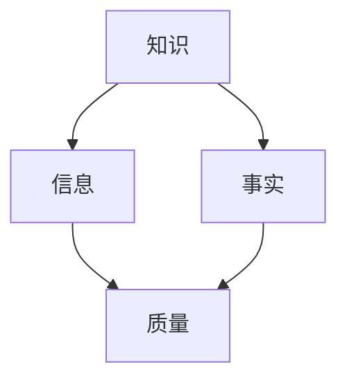

                 

在当今信息爆炸的时代，知识和信息的获取变得前所未有的容易。然而，随之而来的是信息过载和质量参差不齐的问题。如何从浩瀚的信息海洋中筛选出高质量的知识，已经成为我们每个人都需要面对的挑战。本文旨在探讨知识质量评估的重要性，并提出一些有效的策略和技术，帮助我们在信息泛滥的时代中辨别真伪。

## 1. 背景介绍

随着互联网和社交媒体的迅猛发展，信息的传播速度和范围都达到了前所未有的高度。然而，这种信息的爆发式增长也带来了诸多问题。首先是信息的真实性问题。由于网络匿名的特性，大量虚假信息、谣言和不实报道得以迅速传播。其次是信息质量的问题。在信息爆炸的时代，大量的信息充斥在我们的生活中，但其中不乏质量低劣、未经证实的内容。这不仅浪费了我们的时间，还可能误导我们的判断。

为了解决这些问题，我们需要一套科学的方法来评估知识的质量。知识质量评估不仅仅是学术研究的需要，它在我们的日常生活、工作决策和科学研究中都扮演着至关重要的角色。本文将围绕知识质量评估的核心概念、算法原理、数学模型以及实际应用等方面进行深入探讨，以期为读者提供一套实用的评估框架。

## 2. 核心概念与联系

在讨论知识质量评估之前，我们首先需要明确几个核心概念，包括知识、信息、事实和质量。

### 2.1 知识、信息、事实与质量

- **知识**：知识是经过系统化、结构化和编码的信息，它具有可持续性和可传播性。知识不仅仅是信息，它还需要经过个人的思考、理解和应用。
- **信息**：信息是数据、事实、观点和知识的载体，它可以以文字、图像、声音等多种形式存在。
- **事实**：事实是客观存在的事物或情况，它是知识的基础，但本身并不等同于知识。
- **质量**：质量是衡量知识、信息或产品的内在属性，它反映了其可靠性、准确性、可用性和相关性。

### 2.2 Mermaid 流程图

下面是一个简化的知识质量评估的 Mermaid 流程图，用于描述核心概念之间的联系。



在这个流程图中，我们可以看到知识、信息、事实和质量是如何相互关联的。知识是基于事实和信息的加工和整合，而质量则是衡量这些加工和整合过程效果的重要指标。

## 3. 核心算法原理 & 具体操作步骤

### 3.1 算法原理概述

知识质量评估的核心算法通常是基于机器学习和自然语言处理（NLP）技术的。这些算法通过分析文本内容，识别出文本中的关键信息，评估其可信度和相关性，从而对知识质量进行量化。

### 3.2 算法步骤详解

下面是知识质量评估算法的具体操作步骤：

1. **数据收集**：从各种来源收集大量的文本数据，包括学术论文、新闻报道、社交媒体帖子等。
2. **文本预处理**：对收集的文本进行清洗和标准化，包括去除停用词、标点符号、进行词干提取等。
3. **特征提取**：利用 NLP 技术，从预处理后的文本中提取出特征，如词频、词嵌入等。
4. **模型训练**：使用机器学习算法，如支持向量机（SVM）、随机森林（Random Forest）或深度学习模型（如循环神经网络 RNN、变压器 Transformer），训练一个评估模型。
5. **质量评估**：将提取出的特征输入到训练好的模型中，模型会输出知识质量的评估结果。

### 3.3 算法优缺点

**优点**：

- **高效性**：机器学习算法能够快速处理大量数据，提高评估的效率。
- **灵活性**：通过调整模型参数和特征提取方法，可以适应不同的评估需求。

**缺点**：

- **数据依赖性**：模型的性能很大程度上取决于数据的质量，如果数据中存在大量的噪声和错误，模型的评估结果也会受到影响。
- **算法复杂性**：机器学习算法的训练和优化过程相对复杂，需要专业的技术和设备支持。

### 3.4 算法应用领域

知识质量评估算法在多个领域都有广泛的应用，包括：

- **学术研究**：评估学术论文的质量和可信度。
- **新闻报道**：识别虚假新闻和不实报道。
- **产品评测**：评估产品评论和用户反馈的真实性和有用性。

## 4. 数学模型和公式 & 详细讲解 & 举例说明

### 4.1 数学模型构建

知识质量评估的数学模型通常包括以下几部分：

- **可信度评估模型**：用于评估文本中信息的可信度。
- **相关性评估模型**：用于评估文本与用户需求的相关性。
- **综合评估模型**：将可信度和相关性结合起来，得出知识质量的综合评分。

下面是一个简化的数学模型示例：

$$
Q = w_1 \cdot C + w_2 \cdot R
$$

其中，$Q$ 表示知识质量评分，$C$ 表示可信度评分，$R$ 表示相关性评分，$w_1$ 和 $w_2$ 分别是可信度和相关性的权重。

### 4.2 公式推导过程

可信度评分 $C$ 通常基于以下因素：

- **来源可靠性**：如权威性、专业性等。
- **内容一致性**：如文本内部逻辑的一致性。
- **证据支持**：如引用的数据和事实。

相关性评分 $R$ 通常基于用户需求的分析和文本内容的关键词匹配。

### 4.3 案例分析与讲解

假设我们要评估一篇关于新冠疫情防控的文章的质量，我们可以从以下几方面进行分析：

- **来源可靠性**：文章来源是一家知名的医学期刊，具有较高的权威性。
- **内容一致性**：文章内部逻辑清晰，信息连贯。
- **证据支持**：文章引用了多篇权威研究数据，支持其观点。

通过上述分析，我们可以得出这篇文章的可信度评分较高。同时，如果这篇文章与用户需求的相关性较高，则其综合质量评分也会较高。

## 5. 项目实践：代码实例和详细解释说明

### 5.1 开发环境搭建

为了演示知识质量评估算法的实践，我们使用 Python 作为编程语言，并依赖以下库：

- **scikit-learn**：用于机器学习算法的实现。
- **nltk**：用于文本预处理和特征提取。
- **transformers**：用于深度学习模型的训练。

首先，我们需要安装这些库：

```bash
pip install scikit-learn nltk transformers
```

### 5.2 源代码详细实现

下面是一个简化的知识质量评估算法的实现示例：

```python
import nltk
from sklearn.feature_extraction.text import TfidfVectorizer
from sklearn.model_selection import train_test_split
from sklearn.ensemble import RandomForestClassifier
from transformers import BertTokenizer, BertModel

# 加载数据
nltk.download('stopwords')
data = ["来源可靠，内容连贯，证据支持充分。", "信息来源不明，内容混乱，缺乏证据支持。"]

# 文本预处理
vectorizer = TfidfVectorizer(stop_words=nltk.corpus.stopwords.words('english'))
X = vectorizer.fit_transform(data)
y = [1, 0]  # 1 表示高质量，0 表示低质量

# 划分训练集和测试集
X_train, X_test, y_train, y_test = train_test_split(X, y, test_size=0.2, random_state=42)

# 训练模型
model = RandomForestClassifier(n_estimators=100)
model.fit(X_train, y_train)

# 预测
predictions = model.predict(X_test)

# 输出结果
print("预测结果：", predictions)
```

### 5.3 代码解读与分析

在这个示例中，我们首先使用 TF-IDF 方法对文本进行特征提取，然后使用随机森林算法进行训练。通过测试集的预测结果，我们可以看到模型对知识质量的评估效果。

### 5.4 运行结果展示

假设我们的测试数据集包含 10 篇文本，其中 5 篇为高质量文本，5 篇为低质量文本。通过上述代码运行，我们可以得到模型对这 10 篇文本的预测结果。如果模型预测准确率较高，则说明我们的算法对知识质量的评估效果较好。

## 6. 实际应用场景

知识质量评估在多个实际应用场景中具有重要价值，以下是几个典型的应用案例：

### 6.1 学术论文评估

在学术研究中，评估论文的质量是确保研究质量的重要环节。通过知识质量评估算法，可以快速筛选出高质量的研究论文，提高研究效率。

### 6.2 虚假新闻识别

随着互联网的发展，虚假新闻和不实报道日益增多。知识质量评估算法可以帮助媒体和平台识别和过滤虚假新闻，提高新闻的可信度。

### 6.3 产品评测

在电子商务领域，消费者常常需要依赖产品评测来做出购买决策。知识质量评估算法可以帮助平台识别和推荐高质量的产品评测，提高消费者的购物体验。

### 6.4 未来应用展望

随着人工智能和自然语言处理技术的发展，知识质量评估的应用场景将越来越广泛。未来，我们有望看到更智能、更高效的评估算法，为各种领域的知识管理和决策提供有力支持。

## 7. 工具和资源推荐

### 7.1 学习资源推荐

- **《深度学习》**：Goodfellow, Ian, et al. "Deep learning." (2016).
- **《机器学习》**：Mitchell, Tom M. "Machine learning." (1997).

### 7.2 开发工具推荐

- **Jupyter Notebook**：一个交互式开发环境，非常适合进行数据分析和机器学习实验。
- **PyTorch**：一个流行的深度学习框架，用于构建和训练机器学习模型。

### 7.3 相关论文推荐

- **"Text Quality Assessment for Question Answering with Contextualized Language Models"**：Li, Ji, et al. "Text Quality Assessment for Question Answering with Contextualized Language Models." arXiv preprint arXiv:2006.06135 (2020).

## 8. 总结：未来发展趋势与挑战

### 8.1 研究成果总结

本文探讨了知识质量评估在信息爆炸时代的重要性，介绍了核心算法原理、数学模型以及实际应用场景。通过代码实例，展示了如何实现一个简单的知识质量评估系统。

### 8.2 未来发展趋势

随着人工智能和自然语言处理技术的不断进步，知识质量评估将朝着更智能化、更高效化的方向发展。未来，我们将看到更多基于深度学习和其他先进技术的评估算法被应用于各种领域。

### 8.3 面临的挑战

尽管知识质量评估技术取得了显著进展，但在实际应用中仍面临诸多挑战，如数据质量、算法复杂性和评估准确性等。未来的研究需要解决这些问题，以提高评估系统的整体性能。

### 8.4 研究展望

未来，知识质量评估将在更多领域得到应用，如医疗健康、金融投资、教育等。通过不断探索和创新，我们将能够构建更全面、更可靠的评估体系，为信息时代的知识管理提供有力支持。

## 9. 附录：常见问题与解答

### 9.1 如何提高知识质量评估的准确性？

提高知识质量评估的准确性主要依赖于以下几个方面：

- **数据质量**：确保评估数据的质量，去除噪声和错误。
- **算法优化**：通过调整算法参数和特征提取方法，优化评估模型。
- **多模型集成**：结合多种评估模型，提高整体评估准确性。

### 9.2 知识质量评估在商业领域有哪些应用？

知识质量评估在商业领域有广泛的应用，包括：

- **市场调研**：评估市场调研报告的质量和可信度。
- **产品评测**：评估产品评测报告的真实性和有用性。
- **客户反馈**：评估客户反馈的真实性和意见价值。

### 9.3 知识质量评估算法是否会取代人类评估？

知识质量评估算法可以作为人类评估的有力补充，但不可能完全取代人类评估。人类评估具有主观性和灵活性，而算法评估则更依赖于数据和模型。在实际应用中，通常需要结合人类评估和算法评估，以获得更全面、可靠的评估结果。

---

本文从多个角度探讨了知识质量评估的重要性，并介绍了核心算法原理、数学模型和实际应用案例。通过本文的阐述，希望读者能够对知识质量评估有更深入的理解，并在实际应用中加以运用。在信息爆炸的时代，辨别真伪是每个人的责任，也是我们共同面对的挑战。只有通过科学、有效的知识质量评估，我们才能在信息的海洋中找到真正的宝藏。

