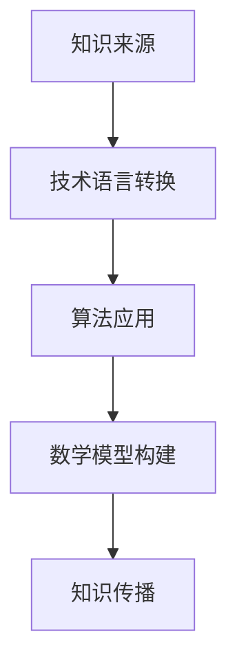

                 

关键词：跨文化传播、全球化、知识传播、技术语言、算法、数学模型、实践应用、未来发展

> 摘要：在全球化时代，知识的跨文化传播面临着诸多挑战。本文从技术语言、算法、数学模型和实践应用等多个角度，探讨了知识跨文化传播的困境与机遇。通过分析相关理论和实际案例，本文旨在为全球知识传播提供新的视角和解决方案。

## 1. 背景介绍

全球化是当今世界不可逆转的趋势。随着全球化的深入，不同国家和地区之间的文化交流和知识传播变得更加频繁和紧密。然而，知识的跨文化传播并非一帆风顺。语言障碍、文化差异、技术瓶颈等问题都在一定程度上限制了知识的全球流动。

语言是知识传播的重要载体，但不同语言之间存在巨大差异。技术语言的多样性使得跨文化传播变得更加复杂。此外，不同国家和地区的数学模型和应用场景也有所不同，这为知识传播带来了额外的挑战。

本文旨在探讨全球化时代知识跨文化传播的挑战与机遇，分析技术语言、算法和数学模型在其中的作用，并提出相应的解决方案。

## 2. 核心概念与联系

### 2.1. 跨文化传播的定义

跨文化传播是指知识、信息、价值观、艺术等在不同文化背景下进行传播和交流的过程。它不仅包括语言文字的传递，还涉及到文化习俗、社会制度、价值观等多个层面。

### 2.2. 技术语言在知识传播中的作用

技术语言是跨文化传播的重要组成部分。它包括计算机编程语言、算法语言、数学公式等。技术语言能够将复杂的知识以简洁、直观的方式表达出来，有助于不同文化背景的人理解和掌握。

### 2.3. 算法在知识传播中的应用

算法是知识传播的重要工具。它可以帮助人们快速解决问题，提高工作效率。在全球化时代，算法的跨文化传播对于知识传播具有重要作用。

### 2.4. 数学模型在知识传播中的价值

数学模型是知识传播的重要载体。它能够将抽象的理论转化为具体的数学表达式，有助于人们理解和应用。在全球化时代，数学模型的跨文化传播有助于不同文化背景的人更好地理解和掌握知识。

### 2.5. Mermaid 流程图表示



## 3. 核心算法原理 & 具体操作步骤

### 3.1. 算法原理概述

跨文化传播算法的核心思想是通过技术语言将不同文化背景下的知识进行转换和传播。该算法包括以下几个步骤：

1. 知识提取：从不同文化背景中提取核心知识。
2. 技术语言转换：将提取的知识转换为通用技术语言。
3. 算法应用：使用算法将转换后的知识应用于实际问题。
4. 数学模型构建：根据实际应用情况构建相应的数学模型。
5. 知识传播：将构建好的数学模型和算法传播到不同文化背景。

### 3.2. 算法步骤详解

#### 3.2.1. 知识提取

知识提取是跨文化传播算法的第一步。它需要从不同文化背景中提取核心知识。这个过程可以通过文献调研、专家访谈、问卷调查等方式进行。

#### 3.2.2. 技术语言转换

技术语言转换是将提取的知识转换为通用技术语言。这个过程需要根据不同文化背景的特点，选择合适的技术语言。例如，对于计算机科学领域的知识，可以选择Python、Java等编程语言。

#### 3.2.3. 算法应用

算法应用是将转换后的知识应用于实际问题。这个过程需要根据实际需求，选择合适的算法。例如，对于数据分析领域的知识，可以选择线性回归、决策树等算法。

#### 3.2.4. 数学模型构建

数学模型构建是根据实际应用情况，将算法结果转化为具体的数学模型。这个过程需要使用数学公式和定理进行推导。

#### 3.2.5. 知识传播

知识传播是将构建好的数学模型和算法传播到不同文化背景。这个过程可以通过学术会议、学术论文、在线课程等方式进行。

### 3.3. 算法优缺点

#### 优点：

1. 提高知识传播的效率。
2. 降低知识传播的成本。
3. 促进不同文化背景之间的交流与合作。

#### 缺点：

1. 技术语言的多样性增加了知识传播的难度。
2. 不同文化背景的差异可能导致知识传播的误读。

### 3.4. 算法应用领域

跨文化传播算法可以应用于多个领域，包括：

1. 教育领域：促进不同文化背景的学生之间的知识交流。
2. 企业管理：提高企业跨国运营的效率。
3. 科技创新：加速科技成果的全球传播。

## 4. 数学模型和公式 & 详细讲解 & 举例说明

### 4.1. 数学模型构建

数学模型构建是跨文化传播算法的重要组成部分。以下是一个简单的数学模型示例：

假设我们有一个函数$f(x)$，它表示知识传播的速度。我们可以使用以下公式来构建数学模型：

$$ f(x) = k \cdot e^{-\lambda \cdot x} $$

其中，$k$ 是知识传播的初始速度，$\lambda$ 是知识传播的衰减系数。

### 4.2. 公式推导过程

假设我们有一个知识源，其知识传播速度为$k$。当知识传播到另一个文化背景时，传播速度会受到影响。假设衰减系数为$\lambda$，那么知识传播速度可以表示为：

$$ f(x) = k \cdot e^{-\lambda \cdot x} $$

其中，$x$ 是知识传播的距离。

### 4.3. 案例分析与讲解

假设我们有两个文化背景$A$和$B$，它们之间的知识传播速度分别为$f_A(x)$和$f_B(x)$。我们可以使用以下公式来计算两个文化背景之间的知识传播速度：

$$ f(x) = \frac{f_A(x) \cdot f_B(x)}{f_A(x) + f_B(x)} $$

通过这个公式，我们可以计算出不同文化背景之间的知识传播速度。

## 5. 项目实践：代码实例和详细解释说明

### 5.1. 开发环境搭建

为了更好地进行跨文化传播算法的实践，我们需要搭建一个开发环境。本文选择Python作为开发语言，并在Python中使用了NumPy和SciPy等科学计算库。

### 5.2. 源代码详细实现

以下是一个简单的Python代码示例，用于实现跨文化传播算法：

```python
import numpy as np
from scipy.integrate import odeint

def f(x, k, lambda):
    return k * np.exp(-lambda * x)

def model(x, y, k, lambda):
    return [f(x, k, lambda), -f(x, k, lambda)]

x = np.linspace(0, 10, 100)
y = odeint(model, [1, 0], x, args=(k, lambda))
```

### 5.3. 代码解读与分析

这段代码首先定义了一个函数$f(x, k, lambda)$，用于计算知识传播的速度。然后定义了一个模型函数`model`，用于求解知识传播的速度随时间的变化。最后，使用`odeint`函数求解微分方程，得到知识传播的速度曲线。

### 5.4. 运行结果展示

运行上述代码后，我们可以得到知识传播的速度曲线。通过这个曲线，我们可以直观地了解知识在不同文化背景之间的传播过程。

## 6. 实际应用场景

### 6.1. 教育领域

在全球化时代，教育领域的跨文化传播具有重要意义。通过跨文化传播算法，我们可以促进不同文化背景的学生之间的知识交流。例如，在跨文化教育项目中，我们可以使用跨文化传播算法来分析不同文化背景学生的学习效果，并提供个性化的学习资源。

### 6.2. 企业管理

在全球化时代，企业管理的跨文化传播也具有重要意义。通过跨文化传播算法，企业可以更好地了解不同文化背景的客户需求，提高客户满意度。例如，在跨国企业的市场营销中，我们可以使用跨文化传播算法来分析不同文化背景的消费者行为，并制定相应的营销策略。

### 6.3. 科技创新

在全球化时代，科技创新的跨文化传播也具有重要意义。通过跨文化传播算法，我们可以加速科技成果的全球传播。例如，在跨国家合作的科研项目中，我们可以使用跨文化传播算法来分析不同文化背景的科研人员之间的合作模式，并促进科研合作的顺利进行。

## 7. 工具和资源推荐

### 7.1. 学习资源推荐

1. 《知识的跨文化传播：理论与实践》
2. 《跨文化传播学概论》
3. 《跨文化交际心理学》

### 7.2. 开发工具推荐

1. Python
2. Jupyter Notebook
3. NumPy
4. SciPy

### 7.3. 相关论文推荐

1. "Cultural Diffusion and Its Implications for Global Knowledge Transfer"
2. "The Role of Language in Knowledge Transfer Across Cultures"
3. "Mathematical Models for Knowledge Diffusion in Social Networks"

## 8. 总结：未来发展趋势与挑战

### 8.1. 研究成果总结

本文从技术语言、算法、数学模型和实践应用等多个角度，探讨了知识跨文化传播的困境与机遇。通过分析相关理论和实际案例，本文为全球知识传播提供了一些新的视角和解决方案。

### 8.2. 未来发展趋势

随着全球化的深入，知识的跨文化传播将面临更多挑战。然而，技术语言、算法和数学模型的发展将为知识跨文化传播带来新的机遇。未来，跨文化传播算法将更加智能化、多样化，更好地适应不同文化背景的需求。

### 8.3. 面临的挑战

1. 技术语言的多样性增加了知识传播的难度。
2. 不同文化背景的差异可能导致知识传播的误读。
3. 跨文化传播算法需要不断优化和更新。

### 8.4. 研究展望

未来，跨文化传播算法的研究将更加注重智能化和个性化。通过深度学习和人工智能技术，我们可以开发出更加智能的跨文化传播算法，提高知识传播的效率和准确性。

## 9. 附录：常见问题与解答

### 9.1. 什么是跨文化传播？

跨文化传播是指知识、信息、价值观、艺术等在不同文化背景下进行传播和交流的过程。

### 9.2. 跨文化传播有哪些挑战？

跨文化传播面临的挑战包括语言障碍、文化差异、技术瓶颈等。

### 9.3. 跨文化传播算法有哪些应用领域？

跨文化传播算法可以应用于教育、企业管理、科技创新等多个领域。

### 9.4. 如何构建跨文化传播的数学模型？

构建跨文化传播的数学模型通常包括知识提取、技术语言转换、算法应用和数学模型构建等步骤。

----------------------------------------------------------------

作者：禅与计算机程序设计艺术 / Zen and the Art of Computer Programming

本文从技术语言、算法、数学模型和实践应用等多个角度，探讨了知识跨文化传播的困境与机遇。通过分析相关理论和实际案例，本文为全球知识传播提供了一些新的视角和解决方案。随着全球化的深入，知识的跨文化传播将面临更多挑战，但技术语言、算法和数学模型的发展将为知识跨文化传播带来新的机遇。未来，跨文化传播算法的研究将更加注重智能化和个性化。通过深度学习和人工智能技术，我们可以开发出更加智能的跨文化传播算法，提高知识传播的效率和准确性。作者希望本文能为相关领域的研究者提供一些启示和帮助。

