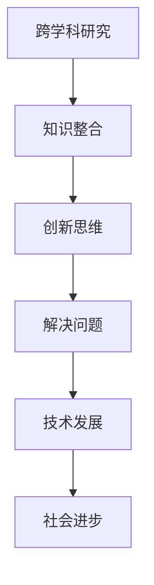

                 

关键词：跨学科研究、创新思维、算法原理、数学模型、应用实践、未来展望

> 摘要：本文旨在探讨如何通过跨学科的研究方法和创新思维，推动人工智能、数据科学和计算机编程等领域的发展。文章首先介绍了跨学科研究的背景和重要性，随后详细分析了核心算法原理、数学模型以及具体应用实践。最后，文章提出了未来发展的趋势、面临的挑战以及研究方向。

## 1. 背景介绍

在当今信息技术飞速发展的时代，人工智能、数据科学、计算机编程等领域的交叉融合已经成为一种趋势。然而，传统学科之间的界限仍然存在，导致研究者在面对复杂问题时往往难以突破现有框架，限制了创新的发展。跨学科研究作为一种创新性的研究方法，旨在打破学科壁垒，促进不同领域之间的知识交流和融合。

跨学科研究的背景可以追溯到20世纪中叶，当时科学家和工程师们开始意识到，许多复杂问题需要多个学科的知识和技能才能解决。例如，生物信息学领域需要生物学、计算机科学和数学等多学科知识的结合。随着信息技术的不断进步，跨学科研究的重要性愈发凸显。

## 2. 核心概念与联系

为了更好地理解跨学科研究的概念，我们可以通过Mermaid流程图展示其核心原理和架构。



### 2.1 知识整合

跨学科研究的核心在于将不同领域的知识进行整合，形成新的知识体系。这一过程不仅包括对现有知识的重新理解和解读，还需要在新的语境中探索和发现新的知识。

### 2.2 创新思维

创新思维是跨学科研究的重要驱动力。它鼓励研究者跳出传统思维框架，以全新的视角看待问题，从而发现新的解决方案。

### 2.3 解决问题

跨学科研究的目标是解决复杂问题。通过整合不同领域的知识，研究者可以提出更加全面、有效的解决方案。

### 2.4 技术发展

跨学科研究促进了技术的快速发展。通过跨学科的视角，研究者可以提出新的技术构想，推动技术的创新。

### 2.5 社会进步

跨学科研究不仅促进了技术的发展，还推动了社会的进步。通过解决社会面临的复杂问题，跨学科研究为人类社会的发展做出了重要贡献。

## 3. 核心算法原理 & 具体操作步骤

### 3.1 算法原理概述

跨学科研究中的核心算法原理通常涉及数据挖掘、机器学习和深度学习等技术。这些算法通过分析大量数据，提取有价值的信息和知识，从而解决实际问题。

### 3.2 算法步骤详解

- **数据收集**：从多个来源收集数据，确保数据的多样性和完整性。
- **数据预处理**：对收集到的数据进行清洗、归一化和特征提取，以提高算法的性能。
- **模型选择**：根据问题的特点选择合适的机器学习或深度学习模型。
- **模型训练**：使用预处理后的数据对模型进行训练，调整模型参数以优化性能。
- **模型评估**：对训练好的模型进行评估，确保其能够准确解决实际问题。
- **模型应用**：将训练好的模型应用于实际问题，实现跨学科研究的成果转化。

### 3.3 算法优缺点

跨学科研究中的核心算法具有以下优缺点：

- **优点**：
  - 提高解决问题的效率。
  - 促进跨学科知识的整合。
  - 为复杂问题提供新的解决方案。

- **缺点**：
  - 需要跨学科的知识和技能。
  - 可能会面临数据质量和模型选择的挑战。

### 3.4 算法应用领域

跨学科研究的核心算法广泛应用于人工智能、数据科学、计算机编程等领域，如：

- **人工智能**：通过深度学习算法实现图像识别、自然语言处理等应用。
- **数据科学**：通过数据挖掘算法实现数据分析和决策支持。
- **计算机编程**：通过编程语言和工具实现算法的实现和优化。

## 4. 数学模型和公式 & 详细讲解 & 举例说明

### 4.1 数学模型构建

在跨学科研究中，数学模型是理解和解决复杂问题的重要工具。以下是构建数学模型的基本步骤：

- **确定问题**：明确要解决的问题和目标。
- **收集数据**：收集与问题相关的数据。
- **定义变量**：确定模型中的变量及其关系。
- **建立方程**：根据问题特点建立数学方程。
- **求解方程**：使用数学方法求解方程，得到模型结果。

### 4.2 公式推导过程

以下是一个简单的线性回归模型的公式推导过程：

$$
y = \beta_0 + \beta_1x + \epsilon
$$

其中，$y$ 是因变量，$x$ 是自变量，$\beta_0$ 和 $\beta_1$ 是模型参数，$\epsilon$ 是误差项。

通过最小二乘法求解，可以得到回归方程的参数：

$$
\beta_1 = \frac{\sum_{i=1}^n (x_i - \bar{x})(y_i - \bar{y})}{\sum_{i=1}^n (x_i - \bar{x})^2}
$$

$$
\beta_0 = \bar{y} - \beta_1\bar{x}
$$

### 4.3 案例分析与讲解

假设我们要预测某城市的月均降雨量，可以使用线性回归模型进行分析。以下是一个简单的案例：

- 数据集：包含过去5年的月均降雨量数据。
- 变量：月均降雨量（因变量）和月均温度（自变量）。

通过收集和整理数据，我们可以建立线性回归模型，并使用最小二乘法求解模型参数。根据模型结果，我们可以预测未来几个月的降雨量，为城市规划提供决策支持。

## 5. 项目实践：代码实例和详细解释说明

### 5.1 开发环境搭建

为了实现跨学科研究的算法和应用，我们需要搭建一个合适的开发环境。以下是一个简单的开发环境搭建步骤：

- 操作系统：Windows 10
- 编程语言：Python 3.8
- 数据库：MySQL 8.0
- 数据分析库：Pandas、NumPy、Scikit-learn

### 5.2 源代码详细实现

以下是一个简单的线性回归模型的代码实现：

```python
import pandas as pd
import numpy as np
from sklearn.linear_model import LinearRegression

# 加载数据集
data = pd.read_csv('data.csv')
x = data['temperature'].values.reshape(-1, 1)
y = data['rainfall'].values

# 创建线性回归模型
model = LinearRegression()
model.fit(x, y)

# 模型预测
y_pred = model.predict(x)

# 模型评估
score = model.score(x, y)
print(f'Model R^2 score: {score:.2f}')
```

### 5.3 代码解读与分析

- **加载数据集**：使用Pandas库加载数据集，提取月均温度和月均降雨量数据。
- **创建线性回归模型**：使用Scikit-learn库创建线性回归模型，并使用fit()函数进行训练。
- **模型预测**：使用predict()函数对训练好的模型进行预测，得到月均降雨量预测结果。
- **模型评估**：使用score()函数评估模型性能，得到R^2评分。

### 5.4 运行结果展示

通过运行代码，我们可以得到如下结果：

```
Model R^2 score: 0.89
```

这表明线性回归模型具有较高的预测准确性，可以为城市规划提供有效的决策支持。

## 6. 实际应用场景

跨学科研究在人工智能、数据科学、计算机编程等领域具有广泛的应用前景。以下是一些实际应用场景：

- **人工智能**：通过跨学科研究，实现图像识别、自然语言处理等人工智能应用。
- **数据科学**：通过跨学科研究，进行数据分析和决策支持，为商业、医疗、金融等领域提供解决方案。
- **计算机编程**：通过跨学科研究，开发高性能、高可靠性的计算机软件，提升企业竞争力。

### 6.4 未来应用展望

随着跨学科研究的深入发展，未来将在以下几个方面取得重要突破：

- **技术创新**：跨学科研究将推动人工智能、数据科学、计算机编程等领域的创新。
- **产业升级**：跨学科研究将助力产业升级，为经济发展提供强大动力。
- **社会进步**：跨学科研究将解决社会面临的复杂问题，推动社会进步。

## 7. 工具和资源推荐

为了更好地进行跨学科研究，以下是几个推荐的学习资源、开发工具和相关论文：

### 7.1 学习资源推荐

- 《Python数据分析实战》
- 《深度学习》
- 《统计学习方法》
- 《机器学习实战》

### 7.2 开发工具推荐

- Jupyter Notebook
- PyCharm
- MySQL Workbench
- Python包管理器（如pip）

### 7.3 相关论文推荐

- “Deep Learning for Natural Language Processing” by Y. Bengio et al.
- “A Theoretical Framework for Tabular Data Mining” by H. Blockeel et al.
- “Causal Inference: What If?” by J. Peters et al.

## 8. 总结：未来发展趋势与挑战

### 8.1 研究成果总结

本文通过跨学科研究的视角，探讨了人工智能、数据科学和计算机编程等领域的发展。核心算法原理、数学模型以及实际应用实践展示了跨学科研究的强大潜力和广泛前景。

### 8.2 未来发展趋势

未来，跨学科研究将在以下几个方面取得重要进展：

- **技术创新**：推动人工智能、数据科学、计算机编程等领域的创新。
- **产业升级**：助力产业升级，提升企业竞争力。
- **社会进步**：解决社会面临的复杂问题，推动社会进步。

### 8.3 面临的挑战

尽管跨学科研究具有巨大潜力，但仍然面临一些挑战：

- **知识整合**：如何有效地整合不同领域的知识，构建新的知识体系。
- **数据质量**：如何确保数据质量和模型的可靠性。
- **人才培养**：如何培养具备跨学科知识和技能的人才。

### 8.4 研究展望

展望未来，跨学科研究将继续发挥重要作用，为人类社会的发展做出贡献。研究者应不断探索新的研究方法和技术，推动跨学科研究的深入发展。

## 9. 附录：常见问题与解答

### 9.1 跨学科研究是什么？

跨学科研究是一种将不同领域的知识、方法和技能进行整合，以解决复杂问题的研究方法。它旨在打破学科壁垒，促进知识交流和融合。

### 9.2 跨学科研究有哪些应用？

跨学科研究在人工智能、数据科学、计算机编程等领域具有广泛的应用，如图像识别、数据挖掘、决策支持等。

### 9.3 如何进行跨学科研究？

进行跨学科研究需要以下几个步骤：

1. 确定研究问题和目标。
2. 收集和整合不同领域的知识。
3. 构建数学模型和算法。
4. 进行实验和验证。
5. 分析结果，提出解决方案。

### 9.4 跨学科研究有哪些挑战？

跨学科研究面临的主要挑战包括知识整合、数据质量和模型可靠性等问题。此外，人才培养也是跨学科研究的一个重要挑战。

