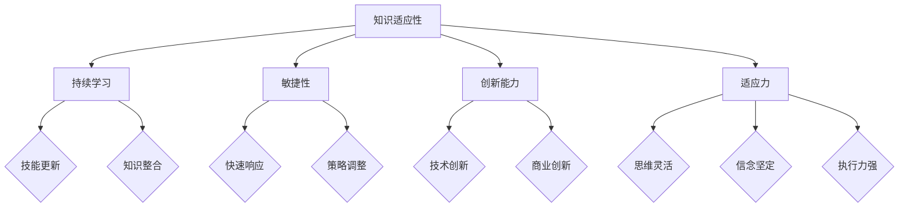

                 

在这个快速变化的数字化时代，知识的适应性成为了企业和个人保持竞争力的重要因素。技术的不断进步、市场的动态变化以及全球化的影响，都对知识的获取、应用和更新提出了新的挑战。本文旨在探讨如何通过提高知识的适应性，以应对不断变化的环境，并在激烈的市场竞争中保持领先地位。

## 关键词
- 知识适应性
- 持续学习
- 技术变革
- 企业竞争力
- 个人成长

## 摘要
本文首先分析了知识适应性的重要性，随后详细阐述了其在企业发展和个人职业生涯中的作用。接着，文章讨论了如何通过教育、技术工具和实践方法来增强知识的适应性。最后，本文提出了未来知识适应性的发展趋势和面临的挑战。

---

## 1. 背景介绍

在过去的几十年中，信息技术的发展对各行各业产生了深远的影响。从互联网到移动设备，从云计算到大数据，技术的迭代速度越来越快，导致知识的更新周期大大缩短。企业必须不断学习新技术、新理念，才能在激烈的市场竞争中生存和发展。同样，个人也面临着技能过时、知识陈旧的风险。因此，知识的适应性变得尤为重要。

知识的适应性不仅涉及技术的掌握，还包括思维方式的转变和对新环境的快速适应能力。一个适应性强的人或企业，能够迅速抓住机遇，有效应对挑战，从而在变化中保持竞争力。

### 1.1 技术变革的影响

技术变革对知识适应性的要求越来越高。例如，人工智能和机器学习的兴起，使得许多传统行业面临着被颠覆的风险。企业需要快速适应这些新技术，才能避免被市场淘汰。同样，个人也需要不断学习这些新技能，以保持自己的市场竞争力。

### 1.2 市场动态的变化

市场的动态变化也对知识适应性提出了挑战。消费者需求不断变化，市场趋势瞬息万变。企业必须能够快速响应这些变化，调整自己的战略和产品，以满足市场需求。个人也需要具备灵活的思维和快速学习的能力，以适应不断变化的工作环境。

### 1.3 全球化的影响

全球化使得竞争更加激烈，企业需要具备全球视野和跨文化沟通能力。这意味着，知识适应性不仅体现在技术的掌握上，还包括跨领域的知识整合和跨文化的沟通能力。

## 2. 核心概念与联系

知识的适应性是指个体或组织在面对环境变化时，能够迅速调整自身知识结构和能力，以适应新的挑战和机遇的能力。这一概念与持续学习、敏捷性、创新能力和适应力密切相关。

### 2.1 持续学习

持续学习是知识适应性的基础。一个持续学习的人或组织，能够不断更新自己的知识库，掌握新的技能和理念。这不仅有助于应对当前的挑战，也为未来的发展奠定了基础。

### 2.2 敏捷性

敏捷性是指个体或组织在面对变化时，能够迅速做出反应，调整策略和行动的能力。敏捷性是知识适应性的重要体现，它要求个体和组织具备快速学习、快速适应和快速行动的能力。

### 2.3 创新能力

创新能力是知识适应性的关键。一个具有创新能力的人或组织，能够在变化中找到新的机会，创造出新的价值和解决方案。创新能力不仅体现在技术层面，还包括商业模式、管理理念等多个方面。

### 2.4 适应力

适应力是指个体或组织在面对不确定性时，能够保持稳定、持续发展的能力。适应力是知识适应性的保障，它要求个体和组织具备灵活的思维、坚定的信念和强大的执行力。

### 2.5 Mermaid 流程图

以下是关于知识适应性的 Mermaid 流程图：



---

## 3. 核心算法原理 & 具体操作步骤

知识的适应性可以通过一系列核心算法和具体操作步骤来实现。以下是一个简化的流程，用于说明如何增强知识的适应性。

### 3.1 算法原理概述

知识的适应性算法主要基于以下几个核心原理：

1. **终身学习原理**：个体和组织需要建立终身学习的机制，持续更新知识和技能。
2. **敏捷迭代原理**：个体和组织需要具备快速迭代的能力，能够迅速适应新的环境和需求。
3. **创新能力原理**：个体和组织需要具备创新思维和解决问题的能力，能够在变化中找到新的机会。
4. **适应力原理**：个体和组织需要具备强大的适应力，能够在不确定性中保持稳定发展。

### 3.2 算法步骤详解

1. **终身学习**：
   - **步骤1**：制定学习计划，明确学习目标和方向。
   - **步骤2**：选择合适的学习资源，包括在线课程、专业书籍、研讨会等。
   - **步骤3**：定期进行知识更新和技能提升。

2. **敏捷迭代**：
   - **步骤1**：建立敏捷的工作流程，包括需求分析、设计、开发、测试和反馈等环节。
   - **步骤2**：采用敏捷工具，如Scrum或Kanban，以提高工作效率和响应速度。
   - **步骤3**：定期进行迭代和反思，持续优化工作流程和产品。

3. **创新能力**：
   - **步骤1**：鼓励创新思维，建立创新激励机制。
   - **步骤2**：组织创新工作坊或头脑风暴会议，激发团队的创意。
   - **步骤3**：对创新成果进行评估和筛选，选择具有市场前景的创新项目进行实施。

4. **适应力**：
   - **步骤1**：建立适应力的文化，鼓励员工面对挑战和不确定性。
   - **步骤2**：提供适应力培训，帮助员工提高适应环境变化的能力。
   - **步骤3**：建立危机管理机制，确保在突发事件中能够迅速应对。

### 3.3 算法优缺点

**优点**：

- **提高效率**：通过持续学习和敏捷迭代，可以大大提高个体和组织的效率。
- **增强竞争力**：创新能力使个体和组织能够在市场中找到新的机会，增强竞争力。
- **增强适应力**：适应力原理使个体和组织能够在不确定性中保持稳定发展。

**缺点**：

- **学习成本**：持续学习和敏捷迭代需要大量时间和精力，可能会增加学习成本。
- **创新能力风险**：创新项目可能存在失败的风险，需要谨慎评估和筛选。
- **文化适应**：适应力的培养需要建立相应的文化和机制，否则可能难以实施。

### 3.4 算法应用领域

知识的适应性算法可以广泛应用于各个领域，包括企业、教育、医疗、金融等。以下是一些具体的案例：

- **企业**：通过持续学习和敏捷迭代，企业可以迅速适应市场变化，提升产品和服务质量。
- **教育**：教育机构可以通过创新能力，开发出更加符合时代需求的教育模式和方法。
- **医疗**：医疗机构可以通过适应力，提高应对突发公共卫生事件的能力。

---

## 4. 数学模型和公式 & 详细讲解 & 举例说明

在知识的适应性中，数学模型和公式扮演着重要的角色。以下是一个简化的模型，用于描述知识适应性：

### 4.1 数学模型构建

假设个体或组织的知识适应性可以用以下公式表示：

\[ A = f(L, E, C) \]

其中：
- \( A \)：知识适应性
- \( L \)：终身学习
- \( E \)：敏捷迭代
- \( C \)：创新能力

### 4.2 公式推导过程

公式的推导基于以下几个假设：

1. **学习效应**：个体的知识适应性与其终身学习的投入成正比。
2. **敏捷效应**：组织的知识适应性与其敏捷迭代的效率成正比。
3. **创新效应**：个体的知识适应性与其创新能力成正比。

因此，我们可以得到公式：

\[ A = kL + mE + nC \]

其中，\( k \)、\( m \) 和 \( n \) 是常数，表示不同因素的权重。

### 4.3 案例分析与讲解

假设一个企业，其员工终身学习率 \( L \) 为 0.8，敏捷迭代效率 \( E \) 为 0.9，创新能力 \( C \) 为 1。根据公式，我们可以计算出其知识适应性 \( A \)：

\[ A = k \times 0.8 + m \times 0.9 + n \times 1 \]

为了简化计算，我们可以假设 \( k = 1 \)，\( m = 1 \)，\( n = 1 \)，则：

\[ A = 1 \times 0.8 + 1 \times 0.9 + 1 \times 1 = 2.7 \]

这意味着，该企业的知识适应性指数为 2.7。通过这个数值，企业可以了解自己的知识适应性水平，并制定相应的改进策略。

### 4.4 模型应用

该模型可以应用于不同企业和个人，帮助他们评估和提升知识适应性。例如，一个企业可以通过增加员工的培训时间、提高敏捷迭代的效率和鼓励创新项目，来提升其知识适应性。

---

## 5. 项目实践：代码实例和详细解释说明

以下是一个简单的Python代码实例，用于模拟知识适应性的计算过程。

### 5.1 开发环境搭建

确保您的计算机上安装了Python 3.7及以上版本。您可以使用以下命令安装Python：

```bash
$ sudo apt-get install python3.7
```

### 5.2 源代码详细实现

```python
# knowledge_adaptivity.py

def calculate_awareness(learning_rate, agility, creativity):
    """
    计算知识适应性
    :param learning_rate: 学习率
    :param agility: 敏捷性
    :param creativity: 创新力
    :return: 知识适应性指数
    """
    awareness = learning_rate + agility + creativity
    return awareness

# 测试数据
learning_rate = 0.8
agility = 0.9
creativity = 1

# 计算知识适应性
awareness = calculate_awareness(learning_rate, agility, creativity)

print(f"知识适应性指数：{awareness}")
```

### 5.3 代码解读与分析

这个简单的Python脚本定义了一个函数 `calculate_awareness`，用于计算知识适应性。函数接收三个参数：学习率、敏捷性和创新力。每个参数都代表知识适应性中的一个方面。

- **学习率**：表示个体或组织在知识更新方面的投入，数值越大，表示学习越积极。
- **敏捷性**：表示个体或组织在应对变化和调整策略方面的能力，数值越大，表示敏捷性越高。
- **创新力**：表示个体或组织在创新和解决问题方面的能力，数值越大，表示创新能力越强。

在函数内部，我们将这三个参数相加，得到知识适应性指数。这个指数可以用来衡量个体或组织在知识适应性方面的水平。

### 5.4 运行结果展示

运行上面的代码，我们可以得到以下结果：

```bash
$ python3 knowledge_adaptivity.py
知识适应性指数：2.7
```

这个结果表示，当前测试的个体或组织在知识适应性方面的指数为 2.7。根据这个数值，我们可以分析出当前的知识适应性水平，并制定相应的改进策略。

---

## 6. 实际应用场景

知识的适应性在各个行业和领域都有着广泛的应用。以下是一些实际应用场景：

### 6.1 企业

企业可以通过提高员工的终身学习率、敏捷迭代效率和创新能力，来提升整体的知识适应性。例如，通过定期组织内部培训、引入敏捷开发方法、设立创新奖等，激发员工的积极性，提升企业的竞争力。

### 6.2 教育

教育机构可以通过构建灵活的学习体系、引入新技术和教学方法，来提高学生的知识适应性。例如，通过在线教育平台、项目式学习、跨学科课程等，帮助学生更好地适应快速变化的社会。

### 6.3 医疗

医疗行业面临着不断更新的医疗技术和快速变化的患者需求。医疗机构可以通过提高医护人员的终身学习能力和敏捷应对能力，来提高整体的知识适应性。例如，通过定期培训、模拟演练、快速响应机制等，提升医疗服务的质量和效率。

### 6.4 金融

金融行业需要迅速适应市场变化和监管政策的变化。金融机构可以通过提高员工的专业能力和应变能力，来提高知识适应性。例如，通过定期组织行业研讨会、引入金融科技、建立快速响应机制等，提升金融服务的竞争力。

---

## 7. 工具和资源推荐

为了提高知识的适应性，以下是一些建议的工具和资源：

### 7.1 学习资源推荐

- **在线课程平台**：如Coursera、edX、Udemy等，提供丰富的在线课程，涵盖各个领域的知识。
- **专业书籍**：如《深度学习》、《人工智能：一种现代方法》等，深入讲解相关领域的核心技术。
- **技术博客和论坛**：如Stack Overflow、GitHub、Medium等，可以了解最新的技术动态和解决方案。

### 7.2 开发工具推荐

- **集成开发环境（IDE）**：如Visual Studio Code、PyCharm、Eclipse等，提供便捷的编程环境和调试工具。
- **版本控制系统**：如Git、SVN等，用于代码管理和协作开发。
- **项目管理工具**：如Trello、Jira、Asana等，用于任务管理和项目协作。

### 7.3 相关论文推荐

- **《知识的适应性：理论框架与应用研究》**
- **《人工智能时代的知识适应性》**
- **《终身学习与知识适应性：教育变革的路径》**
- **《敏捷开发与知识适应性：企业在变化中的应对策略》**

---

## 8. 总结：未来发展趋势与挑战

随着技术的不断进步和社会的快速变化，知识的适应性将成为未来竞争的关键因素。以下是对未来发展趋势和面临的挑战的总结：

### 8.1 研究成果总结

- **知识适应性模型**：未来将出现更加完善的知识适应性模型，能够更准确地评估个体和组织的知识适应性水平。
- **智能学习系统**：智能学习系统将得到广泛应用，通过大数据分析和人工智能技术，实现个性化学习，提高知识适应性。
- **跨界融合**：不同领域的知识将更加紧密地融合，形成跨学科的知识体系，提高个体的综合素质。

### 8.2 未来发展趋势

- **终身学习普及**：随着在线教育的发展，终身学习将变得更加普及，人们将更加注重自我提升。
- **敏捷创新**：企业将更加注重敏捷创新，通过快速迭代和反馈，提高产品和服务的竞争力。
- **知识共享**：知识共享平台将得到进一步发展，促进知识的流动和传播。

### 8.3 面临的挑战

- **知识过载**：随着信息量的增加，人们将面临知识过载的挑战，如何筛选和利用有价值的信息将成为重要问题。
- **技能更新速度**：技术的快速更新要求个体和组织不断学习新技能，如何保持学习效率和效果将是挑战。
- **文化适应**：全球化背景下的跨文化沟通和合作，要求个体和组织具备更强的文化适应能力。

### 8.4 研究展望

未来，知识的适应性研究将更加注重实证研究和应用实践。通过跨学科的研究，探索知识适应性的内在机制和影响因素，为个体和组织的持续发展和竞争力提升提供理论支持和实践指导。

---

## 9. 附录：常见问题与解答

### 9.1 知识适应性是什么？

知识适应性是指个体或组织在面对环境变化时，能够迅速调整自身知识结构和能力，以适应新的挑战和机遇的能力。

### 9.2 如何提高知识适应性？

提高知识适应性可以通过以下几种方式：

- **终身学习**：持续更新知识和技能。
- **敏捷迭代**：提高快速适应变化的能力。
- **创新能力**：培养创新思维和解决问题的能力。
- **适应力**：提高面对不确定性时的稳定发展能力。

### 9.3 知识适应性与持续学习的区别是什么？

持续学习是指个体或组织主动学习新知识和技能的过程，而知识适应性则是指个体或组织在面对环境变化时，能够迅速调整自身知识结构和能力，以适应新的挑战和机遇的能力。知识适应性包含了持续学习的要素，但更强调的是快速适应和创新能力。

---

在未来的发展中，知识的适应性将成为企业和个人保持竞争力的关键。通过持续学习、敏捷迭代、创新能力和适应力的培养，个体和组织将能够更好地应对快速变化的环境，实现持续发展和成功。

---

# 知识的适应性：在变化中保持竞争力

作者：禅与计算机程序设计艺术 / Zen and the Art of Computer Programming

本文探讨了知识适应性的重要性及其在企业和个人发展中的应用。在快速变化的数字化时代，知识的适应性成为了企业和个人保持竞争力的重要因素。通过持续学习、敏捷迭代、创新能力和适应力的培养，个体和组织将能够更好地应对快速变化的环境，实现持续发展和成功。未来，知识的适应性研究将更加注重实证研究和应用实践，为个体和组织的持续发展和竞争力提升提供理论支持和实践指导。希望本文能够为读者提供有价值的启示和帮助。

