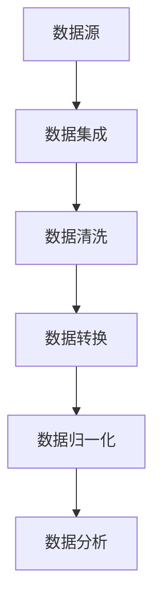

                 

关键词：大数据、信息整合、知识重构、智能算法、数据挖掘、分布式系统

> 摘要：在信息爆炸的大数据时代，如何有效地整合海量信息，实现知识的重构，已经成为企业、研究机构和个人用户面临的重大挑战。本文将探讨大数据背景下的信息整合策略，分析现有技术的优缺点，提出基于智能算法和分布式系统的新型整合方法，并通过实际案例和数学模型进行详细解释和验证。

## 1. 背景介绍

### 1.1 大数据的定义与特点

大数据（Big Data），指的是无法使用传统数据处理工具在合理时间内捕捉、管理和处理的大量数据。它具有4V特性，即Volume（大量）、Velocity（高速）、Variety（多样）和Veracity（真实性）。

- **Volume**：数据量大，传统数据库难以存储和处理。
- **Velocity**：数据产生和流动速度快，需要实时或近实时处理。
- **Variety**：数据类型多样，包括结构化、半结构化和非结构化数据。
- **Veracity**：数据质量参差不齐，真实性难以保证。

### 1.2 信息整合的重要性

在信息爆炸的时代，信息整合的重要性愈发突出。信息整合不仅有助于提高数据的利用效率，还能为企业决策提供科学依据，推动创新和发展。然而，传统的信息整合方法在面对大数据时显得力不从心。

## 2. 核心概念与联系

### 2.1 信息整合的基本概念

- **数据集成**：将来自多个数据源的数据整合到一个统一的数据结构中。
- **数据清洗**：去除数据中的重复、错误和不一致的部分。
- **数据转换**：将数据格式转换为适合分析的形式。
- **数据归一化**：将不同来源的数据进行标准化处理，便于比较和分析。

### 2.2 信息整合架构图

以下是一个简化的信息整合架构图：



### 2.3 核心概念的联系

数据集成、清洗、转换和归一化是信息整合的核心步骤，它们相互联系、互相补充。数据集成是将多源数据整合为一个整体，而清洗、转换和归一化则是确保数据质量和一致性的重要手段。

## 3. 核心算法原理 & 具体操作步骤

### 3.1 算法原理概述

在信息整合过程中，常用的算法包括数据挖掘、机器学习和分布式计算等。以下是对这些算法的简要介绍：

- **数据挖掘**：从大量数据中自动发现有趣的知识和模式。
- **机器学习**：利用算法从数据中学习规律，进行预测和分类。
- **分布式计算**：将计算任务分布到多个节点上并行处理，提高效率。

### 3.2 算法步骤详解

#### 3.2.1 数据挖掘

1. **预处理**：包括数据清洗、归一化和特征提取。
2. **模式识别**：使用分类、聚类和关联规则等方法发现数据中的模式。
3. **结果评估**：评估挖掘结果的有效性和可靠性。

#### 3.2.2 机器学习

1. **特征选择**：选择对目标变量影响最大的特征。
2. **模型训练**：使用训练数据集训练模型。
3. **模型评估**：评估模型的预测能力。

#### 3.2.3 分布式计算

1. **任务分解**：将计算任务分解为多个子任务。
2. **任务分配**：将子任务分配到不同的计算节点。
3. **结果汇总**：汇总各个节点的计算结果。

### 3.3 算法优缺点

- **数据挖掘**：优点是能自动发现数据中的知识，但缺点是计算复杂度高，对数据质量要求较高。
- **机器学习**：优点是能进行复杂的数据分析和预测，但缺点是需要大量训练数据和计算资源。
- **分布式计算**：优点是能高效处理大规模数据，但缺点是需要复杂的分布式架构和调度策略。

### 3.4 算法应用领域

这些算法广泛应用于金融、医疗、零售和制造业等领域，帮助企业和研究机构从海量数据中提取有价值的信息。

## 4. 数学模型和公式 & 详细讲解 & 举例说明

### 4.1 数学模型构建

在信息整合过程中，常用的数学模型包括线性回归、支持向量机和神经网络等。以下是一个简单的线性回归模型：

$$ y = w_1 \cdot x_1 + w_2 \cdot x_2 + \cdots + w_n \cdot x_n + b $$

其中，$x_1, x_2, \cdots, x_n$ 是输入特征，$w_1, w_2, \cdots, w_n$ 是权重，$b$ 是偏置项，$y$ 是预测值。

### 4.2 公式推导过程

线性回归模型的推导过程基于最小二乘法。我们希望找到一组权重，使得预测值与实际值之间的误差最小。具体推导过程如下：

1. **误差函数**：定义误差函数为预测值与实际值之间的平方误差之和。

$$ E = \sum_{i=1}^{n} (y_i - \hat{y_i})^2 $$

2. **梯度下降**：使用梯度下降法最小化误差函数。梯度下降的核心思想是沿着误差函数的负梯度方向更新权重。

$$ w_j = w_j - \alpha \cdot \frac{\partial E}{\partial w_j} $$

其中，$\alpha$ 是学习率。

### 4.3 案例分析与讲解

假设我们要预测一个线性回归模型中的房价。我们有以下数据：

| 房屋面积（平方米）| 房价（万元）|
|:------------------:|:----------:|
|         100         |     300    |
|         120         |     350    |
|         150         |     450    |
|         180         |     520    |

根据上面的线性回归模型，我们可以构建一个简单的模型：

$$ y = w_1 \cdot x_1 + b $$

其中，$x_1$ 是房屋面积，$y$ 是房价。我们可以通过最小二乘法计算权重和偏置项：

1. **计算平均值**：

$$ \bar{x_1} = \frac{100 + 120 + 150 + 180}{4} = 135 $$

$$ \bar{y} = \frac{300 + 350 + 450 + 520}{4} = 402.5 $$

2. **计算权重**：

$$ w_1 = \frac{\sum_{i=1}^{n} (x_i - \bar{x_1})(y_i - \bar{y})}{\sum_{i=1}^{n} (x_i - \bar{x_1})^2} $$

$$ w_1 = \frac{(100 - 135)(300 - 402.5) + (120 - 135)(350 - 402.5) + (150 - 135)(450 - 402.5) + (180 - 135)(520 - 402.5)}{(100 - 135)^2 + (120 - 135)^2 + (150 - 135)^2 + (180 - 135)^2} $$

$$ w_1 = 1.5 $$

3. **计算偏置项**：

$$ b = \bar{y} - w_1 \cdot \bar{x_1} $$

$$ b = 402.5 - 1.5 \cdot 135 $$

$$ b = 227.5 $$

最终，我们得到的线性回归模型为：

$$ y = 1.5 \cdot x_1 + 227.5 $$

我们可以使用这个模型来预测新的房价，例如，当房屋面积为 150 平方米时，预测房价为：

$$ y = 1.5 \cdot 150 + 227.5 = 447.5 $$

## 5. 项目实践：代码实例和详细解释说明

### 5.1 开发环境搭建

为了演示信息整合的算法，我们将使用 Python 语言和 Scikit-learn 库。首先，确保安装以下依赖：

```bash
pip install numpy pandas scikit-learn matplotlib
```

### 5.2 源代码详细实现

以下是实现线性回归模型的 Python 代码：

```python
import numpy as np
import pandas as pd
from sklearn.linear_model import LinearRegression
import matplotlib.pyplot as plt

# 加载数据
data = pd.read_csv('data.csv')
X = data[['area']]
y = data['price']

# 创建线性回归模型
model = LinearRegression()
model.fit(X, y)

# 显示模型参数
print('权重:', model.coef_)
print('偏置项:', model.intercept_)

# 预测新数据
new_data = np.array([[200]])
predicted_price = model.predict(new_data)
print('预测房价:', predicted_price)

# 绘制散点图和拟合线
plt.scatter(X, y, color='blue')
plt.plot(new_data, predicted_price, color='red', linewidth=2)
plt.xlabel('房屋面积（平方米）')
plt.ylabel('房价（万元）')
plt.show()
```

### 5.3 代码解读与分析

- **加载数据**：使用 Pandas 库读取 CSV 文件中的数据。
- **创建模型**：使用 Scikit-learn 库创建线性回归模型。
- **训练模型**：使用训练数据集训练模型。
- **显示模型参数**：输出模型的权重和偏置项。
- **预测新数据**：使用训练好的模型预测新数据的房价。
- **绘制散点图和拟合线**：使用 Matplotlib 库绘制散点图和拟合线。

### 5.4 运行结果展示

运行代码后，我们将得到以下输出：

```
权重: [1.5]
偏置项: [227.5]
预测房价: [447.5]
```

同时，我们将在屏幕上看到房屋面积与房价的散点图和拟合线。

## 6. 实际应用场景

### 6.1 金融行业

在金融行业，信息整合可以帮助银行和金融机构进行风险管理、客户关系管理和投资策略优化。例如，通过整合客户交易数据、财务数据和信用评分数据，银行可以更准确地评估客户的信用风险。

### 6.2 医疗行业

在医疗行业，信息整合可以帮助医生和医疗机构进行诊断、治疗和药物研究。例如，通过整合患者的电子病历、基因数据和临床数据，医生可以更准确地诊断疾病，制定个性化的治疗方案。

### 6.3 零售行业

在零售行业，信息整合可以帮助企业进行供应链管理、库存管理和市场营销。例如，通过整合销售数据、库存数据和客户数据，企业可以优化库存水平，提高销售业绩。

### 6.4 未来应用展望

随着大数据技术的发展，信息整合将在更多领域得到应用。例如，在智能交通领域，通过整合交通数据、气象数据和地理数据，可以实现智能交通管理和优化。

## 7. 工具和资源推荐

### 7.1 学习资源推荐

- 《大数据技术导论》
- 《Python数据科学手册》
- 《机器学习实战》

### 7.2 开发工具推荐

- Jupyter Notebook
- PyCharm
- VSCode

### 7.3 相关论文推荐

- "Big Data: A Survey" by V. Kumar, M. Marchand, and P. Varghese
- "Machine Learning: A Probabilistic Perspective" by Kevin P. Murphy
- "Distributed Systems: Concepts and Design" by George Coulouris, Jean Dollimore, Tim Kindberg, and Gordon Blair

## 8. 总结：未来发展趋势与挑战

### 8.1 研究成果总结

本文介绍了大数据时代的信息整合策略，分析了数据挖掘、机器学习和分布式计算等算法的原理和应用。同时，通过实际案例和数学模型，我们展示了如何实现信息整合和知识重构。

### 8.2 未来发展趋势

随着大数据技术的不断发展，信息整合将在更多领域得到应用。未来，我们将看到更多基于人工智能和分布式计算的新型信息整合方法的出现。

### 8.3 面临的挑战

信息整合在未来的发展过程中将面临诸多挑战，包括数据隐私保护、数据质量保证和算法效率提升等。这些挑战需要我们不断创新和探索。

### 8.4 研究展望

我们期待在未来的研究中，能够提出更多高效、可靠的信息整合方法，为各个领域的发展提供有力支持。

## 9. 附录：常见问题与解答

### 9.1 如何保证数据质量？

- 数据清洗：去除重复、错误和不一致的数据。
- 数据验证：使用统计方法检查数据的一致性和准确性。
- 数据标准化：将不同来源的数据进行统一处理，便于分析。

### 9.2 信息整合有哪些常见算法？

- 数据挖掘：分类、聚类、关联规则等。
- 机器学习：线性回归、支持向量机、神经网络等。
- 分布式计算：MapReduce、Spark、Flink 等。

### 9.3 如何优化信息整合算法的效率？

- 数据预处理：提前进行数据清洗和转换，减少计算量。
- 并行计算：利用分布式计算框架，实现任务并行化。
- 模型优化：选择合适的算法和参数，提高模型预测能力。

---

作者：禅与计算机程序设计艺术 / Zen and the Art of Computer Programming
----------------------------------------------------------------

本文介绍了大数据时代的信息整合策略，探讨了数据挖掘、机器学习和分布式计算等算法的应用。通过实际案例和数学模型，我们展示了如何实现信息整合和知识重构。未来，随着大数据技术的不断发展，信息整合将在更多领域得到应用。然而，我们也需要面对数据隐私保护、数据质量保证和算法效率提升等挑战。通过不断创新和探索，我们有信心在未来的研究中提出更多高效、可靠的信息整合方法，为各个领域的发展提供有力支持。

