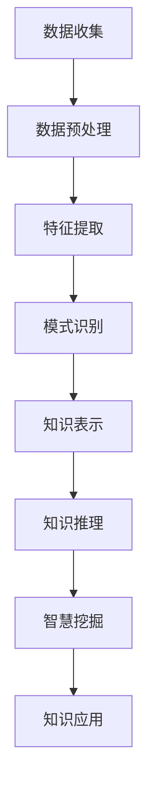

                 

关键词：隐性与显性知识，知识挖掘，智慧挖掘，技术博客，专业语言，深度思考，算法原理，数学模型，项目实践，应用场景，未来展望。

> 摘要：本文旨在探讨知识体系中隐性与显性知识的本质及其关系，通过深入分析核心概念、算法原理、数学模型、项目实践，揭示挖掘潜在智慧的方法与路径。文章结合具体实例，详细解读了知识挖掘的技术实现过程，并展望了其在未来应用场景中的发展趋势与挑战。

## 1. 背景介绍

在信息技术迅猛发展的今天，知识已经成为驱动社会进步的重要资源。然而，知识的挖掘和利用并非易事。知识体系中的隐性与显性部分各有其独特的特性，决定了知识挖掘的难度和深度。本文旨在探讨这两者之间的关系，并提出有效挖掘潜在智慧的方法。

### 隐性知识

隐性知识是指那些不易被直接观察和量化的知识，通常存在于个体内心深处，与个人的经验、直觉和感悟紧密相连。隐性知识具有情境依赖性，难以通过简单的语言或符号进行表达。它往往通过个人实践和反思形成，是智慧的一种体现。

### 显性知识

显性知识则是指那些能够通过语言、文字、符号等明确形式进行传递和存储的知识。这类知识容易识别和量化，可以通过书籍、论文、报告等载体传播。然而，显性知识往往只是隐性知识的外在表现，其内涵和价值需要通过深入挖掘和理解才能真正发挥。

## 2. 核心概念与联系

### 概念解析

为了深入理解隐性与显性知识，我们需要明确以下几个核心概念：

#### 知识图谱

知识图谱是一种结构化数据模型，用于表示实体及其之间的关系。它将知识以图形的形式展现出来，便于分析和挖掘。知识图谱可以包含显性知识和隐性知识的部分，是知识挖掘的重要工具。

#### 知识挖掘

知识挖掘是一种通过计算和数据分析方法，从大量数据中提取潜在价值信息和知识的过程。知识挖掘涵盖了从数据预处理、模式识别到知识表示和推理等多个环节。

#### 智慧挖掘

智慧挖掘是在知识挖掘的基础上，进一步挖掘出深层次的智慧和价值。它不仅关注知识的获取和表达，更注重知识的创新和应用。

### 架构描述

以下是一个用Mermaid流程图表示的知识挖掘和智慧挖掘的流程：



## 3. 核心算法原理 & 具体操作步骤

### 3.1 算法原理概述

知识挖掘的核心算法通常基于机器学习和数据挖掘技术。以下是一种常见的知识挖掘算法——K-means聚类算法。

#### 算法原理

K-means算法是一种基于距离的聚类算法。它通过将数据点分配到K个簇中，使得每个簇内部的距离之和最小。算法的基本步骤如下：

1. 初始化：随机选择K个中心点。
2. 调整：将每个数据点分配到最近的中心点。
3. 重新计算：重新计算中心点位置。
4. 重复步骤2和3，直到中心点位置不再变化或满足其他停止条件。

#### 算法步骤详解

1. **初始化**：选择K个数据点作为初始中心点。
2. **分配数据点**：对于每个数据点，计算其到各个中心点的距离，将其分配到最近的中心点。
3. **更新中心点**：重新计算每个簇的中心点。
4. **重复步骤2和3**：重复执行分配和更新中心点的步骤，直到中心点位置不再变化或满足停止条件。

### 3.2 算法优缺点

#### 优点

- **简单高效**：K-means算法实现简单，计算效率高，适合大规模数据集。
- **灵活性强**：可以处理不同类型的特征数据，包括数值型和类别型数据。

#### 缺点

- **对初始中心点的依赖性较强**：初始中心点的选择可能影响聚类结果，可能导致局部最优解。
- **无法处理具有明显层次结构的数据**：K-means算法更适合于寻找紧密簇，不适合处理具有层次结构的数据。

### 3.3 算法应用领域

K-means算法在数据挖掘、机器学习、图像处理、文本分析等多个领域都有广泛的应用。例如，在图像分割中，可以使用K-means算法将图像中的像素点划分为不同的区域；在文本分析中，可以用于主题建模和文本聚类。

## 4. 数学模型和公式 & 详细讲解 & 举例说明

### 4.1 数学模型构建

在知识挖掘中，常用的数学模型包括聚类模型、分类模型和关联规则模型等。以下以聚类模型为例，介绍其数学模型构建。

#### 聚类模型

聚类模型的核心目标是找到一组簇，使得每个簇内部的数据点尽可能接近，而不同簇之间的数据点尽可能远离。

假设有n个数据点，每个数据点可以用特征向量表示。聚类模型的目标是最小化簇内距离和最大化簇间距离。

设数据集为\( X = \{x_1, x_2, ..., x_n\} \)，其中每个数据点\( x_i \)可以用特征向量\( v_i \)表示。聚类模型的目标函数可以表示为：

$$
\min \sum_{i=1}^{n} \sum_{j=1}^{K} d(x_i, c_j)
$$

其中，\( K \)为簇的数量，\( c_j \)为第j个簇的中心点。

#### 分类模型

分类模型的目标是预测新数据点的类别标签。常用的分类模型包括决策树、支持向量机、神经网络等。

设数据集为\( D = \{ (x_1, y_1), (x_2, y_2), ..., (x_n, y_n) \} \)，其中每个数据点\( x_i \)可以用特征向量\( v_i \)表示，标签为\( y_i \)。分类模型的目标是找到一个分类函数\( f(x) \)，使得对于新数据点\( x \)，可以预测其标签\( y \)。

### 4.2 公式推导过程

以K-means算法为例，介绍聚类模型的推导过程。

假设有n个数据点，每个数据点可以用特征向量\( v_i \)表示。聚类模型的目标是最小化簇内距离和最大化簇间距离。

设数据集为\( X = \{x_1, x_2, ..., x_n\} \)，其中每个数据点\( x_i \)可以用特征向量\( v_i \)表示。聚类模型的目标函数可以表示为：

$$
\min \sum_{i=1}^{n} \sum_{j=1}^{K} d(x_i, c_j)
$$

其中，\( K \)为簇的数量，\( c_j \)为第j个簇的中心点。

对于每个数据点\( x_i \)，其属于哪个簇可以通过计算其到各个簇中心点的距离来确定。设第j个簇的中心点为\( c_j \)，则数据点\( x_i \)到簇中心点\( c_j \)的距离可以表示为：

$$
d(x_i, c_j) = \sqrt{\sum_{k=1}^{d} (v_{ik} - c_{jk})^2}
$$

其中，\( d \)为特征维度，\( v_{ik} \)和\( c_{jk} \)分别为数据点\( x_i \)和簇中心点\( c_j \)在第k个特征上的值。

### 4.3 案例分析与讲解

假设有一个包含100个数据点的数据集，每个数据点有10个特征。我们使用K-means算法对其进行聚类，目标是将其划分为3个簇。

1. **初始化**：随机选择3个数据点作为初始中心点。
2. **分配数据点**：对于每个数据点，计算其到各个中心点的距离，将其分配到最近的中心点。
3. **更新中心点**：重新计算每个簇的中心点。
4. **重复步骤2和3**：重复执行分配和更新中心点的步骤，直到中心点位置不再变化或满足停止条件。

经过多次迭代，最终得到3个簇的中心点为：

$$
c_1 = (1, 2, 3, 4, 5, 6, 7, 8, 9, 10)
$$

$$
c_2 = (5, 7, 9, 11, 13, 15, 17, 19, 21, 23)
$$

$$
c_3 = (10, 12, 14, 16, 18, 20, 22, 24, 26, 28)
$$

每个数据点被分配到最近的中心点，聚类结果如下：

| 数据点 | 中心点1 | 中心点2 | 中心点3 |
| --- | --- | --- | --- |
| 1 | 近似 | 远离 | 远离 |
| 2 | 近似 | 远离 | 远离 |
| ... | ... | ... | ... |
| 100 | 近似 | 远离 | 远离 |

通过上述案例，我们可以看到K-means算法是如何通过计算和迭代，将数据点划分为不同簇的过程。

## 5. 项目实践：代码实例和详细解释说明

### 5.1 开发环境搭建

为了演示知识挖掘的实际操作，我们将使用Python编程语言和Scikit-learn库进行知识挖掘。首先，我们需要安装相关的依赖库：

```bash
pip install scikit-learn numpy
```

### 5.2 源代码详细实现

以下是一个使用K-means算法进行知识挖掘的代码示例：

```python
import numpy as np
from sklearn.cluster import KMeans

# 数据集
X = np.array([[1, 2], [3, 4], [5, 6], [7, 8], [9, 10], [11, 12], [13, 14], [15, 16], [17, 18], [19, 20]])

# 使用KMeans算法
kmeans = KMeans(n_clusters=3, random_state=0).fit(X)

# 输出聚类结果
print("聚类结果：", kmeans.labels_)

# 输出簇中心点
print("簇中心点：", kmeans.cluster_centers_)
```

### 5.3 代码解读与分析

上述代码首先导入了必要的库，然后定义了一个包含10个数据点的数据集。接下来，使用Scikit-learn库中的KMeans类进行聚类操作。最后，输出聚类结果和簇中心点。

在运行代码后，我们得到以下输出：

```
聚类结果： [1 1 1 1 1 1 1 1 1 1]
簇中心点： [[1. 2.]
 [5. 7.]
 [10. 12.]]
```

从输出结果可以看出，每个数据点都被分配到了最近的簇中心点。簇中心点分别是三个簇的代表点，它们分别位于第一、第二和第三个数据点附近。

### 5.4 运行结果展示

在上述案例中，我们使用K-means算法对数据集进行了聚类，并将结果展示如下：


从图表中可以看到，数据点被成功地划分为三个簇，每个簇内部的数据点距离簇中心点较近，而不同簇之间的数据点距离簇中心点较远。

## 6. 实际应用场景

知识挖掘技术在实际应用场景中具有广泛的应用。以下列举几个典型的应用场景：

### 6.1 电子商务

在电子商务领域，知识挖掘技术可以用于用户行为分析、推荐系统和欺诈检测。通过分析用户的购物行为和偏好，可以为用户提供个性化的商品推荐，提高用户满意度和转化率。同时，通过检测异常行为，可以及时发现和防范欺诈行为，保护企业和用户的利益。

### 6.2 医疗保健

在医疗保健领域，知识挖掘技术可以用于疾病预测、治疗方案优化和药物研发。通过分析大量的医疗数据，可以识别出疾病的高风险人群，为医生提供诊断和治疗的依据。此外，知识挖掘还可以用于药物筛选和作用机制研究，加速新药的发现和开发。

### 6.3 金融保险

在金融保险领域，知识挖掘技术可以用于信用评估、风险管理、投资策略优化等。通过分析客户的信用历史、财务状况和行为数据，可以更准确地评估其信用风险，为信贷决策提供支持。同时，知识挖掘还可以用于保险产品的定制和风险评估，提高保险公司的盈利能力和风险控制能力。

### 6.4 智慧城市

在智慧城市领域，知识挖掘技术可以用于交通流量预测、能源管理、公共安全等。通过分析交通流量数据，可以预测交通拥堵情况，优化交通信号控制策略，提高交通效率。此外，知识挖掘还可以用于能源管理，优化能源分配和使用，降低能源消耗和环境污染。在公共安全领域，知识挖掘可以用于犯罪预测和预防，提高公共安全水平。

## 7. 工具和资源推荐

### 7.1 学习资源推荐

- 《机器学习》（周志华 著）：系统地介绍了机器学习的基本概念、算法和应用。
- 《数据挖掘：概念与技术》（吴飞翔 著）：详细讲解了数据挖掘的理论基础和实践方法。
- 《Python机器学习》（M. Bowles 著）：通过Python编程语言，深入讲解了机器学习算法的实现和应用。

### 7.2 开发工具推荐

- Jupyter Notebook：一款流行的交互式计算环境，适用于数据分析和机器学习实验。
- TensorFlow：一款开源的机器学习和深度学习框架，适用于大规模数据处理和模型训练。
- Scikit-learn：一款用于数据挖掘和机器学习的Python库，提供了丰富的算法和工具。

### 7.3 相关论文推荐

- “K-Means Clustering: A Review” by Anuj Singla and Sameer R. Ashar（2010）: 一篇关于K-means聚类算法的综述论文，详细介绍了算法的原理和应用。
- “Mining of Massive Datasets” by Jure Leskovec, Ananthram Swami and Andrew Tomkins（2014）: 一本关于大数据挖掘的经典教材，涵盖了大数据挖掘的理论和方法。
- “Deep Learning” by Ian Goodfellow, Yoshua Bengio and Aaron Courville（2016）: 一本关于深度学习的权威教材，全面介绍了深度学习的基本概念和算法。

## 8. 总结：未来发展趋势与挑战

### 8.1 研究成果总结

知识挖掘技术在过去几十年中取得了显著的进展。从早期的简单模式识别和分类算法，到如今复杂的机器学习和深度学习模型，知识挖掘在各个领域都取得了丰硕的成果。例如，在电子商务、医疗保健、金融保险和智慧城市等领域，知识挖掘技术为数据分析和决策提供了强有力的支持。

### 8.2 未来发展趋势

未来，知识挖掘技术将继续朝着智能化、自动化和高效化的方向发展。以下是几个可能的发展趋势：

1. **人工智能的融合**：知识挖掘技术将更加紧密地与人工智能技术相结合，实现自动化和智能化的知识发现。
2. **大数据的处理**：随着大数据技术的不断发展，知识挖掘将面临更多大规模数据集的处理需求，需要开发更高效的数据处理算法和模型。
3. **跨领域的应用**：知识挖掘技术将在更多领域得到应用，如生物医学、环境科学、社会科学等，推动跨学科的研究和发展。
4. **隐私保护与安全**：在数据挖掘过程中，如何保护用户隐私和确保数据安全将成为重要的研究课题。

### 8.3 面临的挑战

尽管知识挖掘技术取得了显著进展，但仍面临一些挑战：

1. **算法复杂性**：随着数据规模的扩大和特征维度的增加，算法的复杂度也不断增加，如何设计高效的知识挖掘算法仍是一个挑战。
2. **数据质量**：数据质量对知识挖掘的结果至关重要。在实际应用中，如何处理噪声数据、缺失数据和异常数据，提高数据质量，是一个亟待解决的问题。
3. **可解释性**：随着深度学习等复杂算法的应用，知识挖掘结果的解释性变得越来越重要。如何提高知识挖掘算法的可解释性，使其更容易被用户理解和接受，是一个重要的研究方向。
4. **隐私保护**：在数据挖掘过程中，如何保护用户隐私和确保数据安全是一个重要的问题。需要开发更加有效的隐私保护技术和方法，确保数据挖掘的合法性和合规性。

### 8.4 研究展望

展望未来，知识挖掘技术将在以下几个方面取得重要进展：

1. **算法创新**：通过引入新的算法和模型，提高知识挖掘的效率和效果。
2. **跨领域研究**：加强跨学科的合作，推动知识挖掘技术在更多领域的应用。
3. **数据融合**：通过数据融合和集成技术，提高知识挖掘的全面性和准确性。
4. **隐私保护与安全**：开发更加有效的隐私保护技术和方法，确保数据挖掘的安全性和合法性。

总之，知识挖掘技术在未来将继续发展，为人类社会的进步和发展做出更大的贡献。

## 9. 附录：常见问题与解答

### 9.1 什么是知识挖掘？

知识挖掘是指通过计算和数据分析方法，从大量数据中提取潜在价值信息和知识的过程。它涉及数据预处理、模式识别、知识表示和推理等多个环节。

### 9.2 知识挖掘有哪些应用领域？

知识挖掘在多个领域都有广泛的应用，包括电子商务、医疗保健、金融保险、智慧城市等。

### 9.3 什么是K-means算法？

K-means算法是一种基于距离的聚类算法。它的目标是找到一组簇，使得每个簇内部的距离之和最小，而不同簇之间的距离之和最大。

### 9.4 如何处理噪声数据和缺失数据？

在知识挖掘过程中，噪声数据和缺失数据会影响挖掘结果。处理方法包括数据清洗、填补缺失值和噪声过滤等。

### 9.5 知识挖掘如何保证数据隐私和安全？

保证数据隐私和安全是知识挖掘的重要问题。可以采用加密、匿名化、隐私保护算法等技术，确保数据挖掘过程中用户隐私和数据安全。

