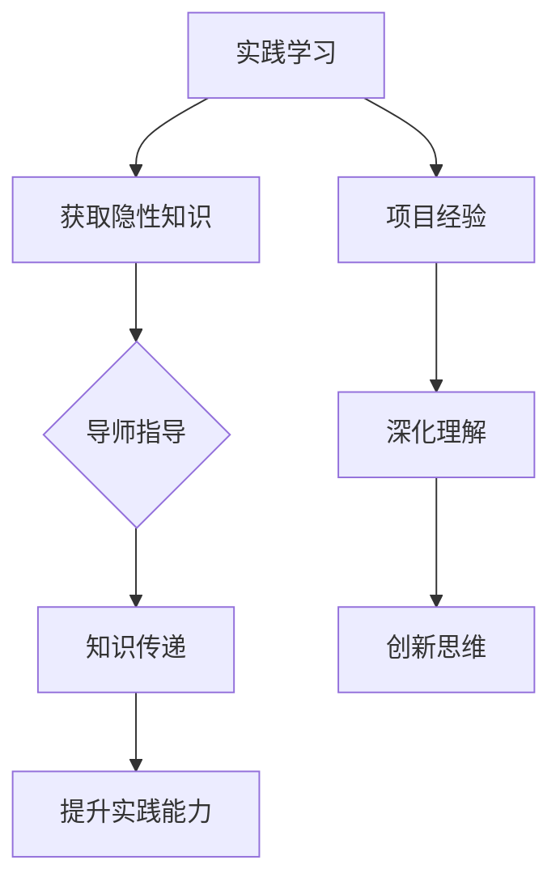

                 

关键词：知识的隐性传递、导师制、实践学习、信息技术、人工智能、学习模式

摘要：本文探讨了一种重要的知识传递方式——导师制，以及其在信息技术和人工智能领域中的应用。文章首先介绍了导师制的背景和基本概念，随后详细分析了其在实践学习中的重要性，并结合具体案例探讨了导师制在知识隐性传递中的作用。文章最后提出了未来导师制在信息技术和人工智能领域的发展趋势和面临的挑战。

## 1. 背景介绍

在信息技术和人工智能领域，知识的获取和传递一直是研究的重点。传统的知识传递方式主要通过教育机构和教材来实现，但这些方式往往局限于显性知识的传递，即那些可以用语言、文字、公式等明确表达的知识。然而，信息技术和人工智能领域的发展离不开大量隐性知识的运用，如编程经验、系统设计理念、调试技巧等。这些隐性知识往往难以通过传统方式传授，而导师制则提供了一种有效的知识传递方式。

导师制是一种基于个人经验传授的学习模式，通过导师的引导和示范，学生能够逐步掌握隐性知识。在信息技术和人工智能领域，导师制的重要性尤为突出，因为这两个领域的发展离不开创新和实践，而这些往往需要丰富的经验和直觉。因此，导师制不仅有助于知识的传递，还能激发学生的创新思维和问题解决能力。

## 2. 核心概念与联系

### 2.1 导师制的定义

导师制（Mentorship）是一种基于个人经验传授的学习模式，由一名经验丰富的导师（Mentor）指导一名或多名学生（Mentee）。导师通过示范、指导、反馈等方式，帮助学生掌握知识和技能，尤其是那些难以通过书本和课堂传授的隐性知识。

### 2.2 导师制的特点

导师制的特点主要包括以下几个方面：

1. **个性化**：导师制关注每个学生的个性化需求，导师根据学生的特点和能力，制定个性化的学习计划。

2. **实践导向**：导师制强调实践学习，通过实际项目和实践经验，帮助学生掌握知识和技能。

3. **互动性**：导师制强调导师与学生之间的互动，通过面对面的交流、讨论和反馈，促进知识的传递。

4. **长期性**：导师制是一种长期的学习模式，导师与学生之间的关系通常持续较长时间，有助于知识的积累和深化。

### 2.3 导师制与实践学习的联系

实践学习（Practical Learning）是一种通过实际操作和项目经验来获取知识和技能的学习模式。导师制与实践学习密切相关，二者相辅相成。

1. **实践学习促进隐性知识传递**：实践学习提供了丰富的隐性知识来源，导师可以通过指导学生解决实际问题，传递经验和技巧。

2. **导师制提升实践学习效果**：导师制通过个性化的指导和反馈，帮助学生更好地理解和应用实践知识，提高实践学习的效果。

### 2.4 Mermaid 流程图

下面是导师制与实践学习联系的一个简化 Mermaid 流程图：



## 3. 核心算法原理 & 具体操作步骤

### 3.1 算法原理概述

导师制的核心算法原理可以概括为“经验传递 + 反馈机制”。具体来说，导师通过示范和实践，将隐性知识传递给学生；同时，导师根据学生的反馈和表现，不断调整教学方法和策略，以提升学生的实践能力和创新思维。

### 3.2 算法步骤详解

1. **确定导师和学生**：首先，需要确定导师和学生，双方就学习目标和要求进行沟通和协商。

2. **示范和实践**：导师通过实际操作和项目，向学生展示如何解决问题和应用知识。

3. **反馈与调整**：学生根据导师的指导，进行实践操作；导师根据学生的反馈和表现，提供指导和建议。

4. **持续迭代**：在实践过程中，导师和学生不断迭代和优化教学方法和策略。

### 3.3 算法优缺点

**优点**：

1. **个性化**：导师制关注每个学生的个性化需求，有助于提高学习效果。

2. **实践导向**：导师制强调实践学习，有助于学生掌握实际操作技能。

3. **互动性**：导师制强调导师与学生之间的互动，有助于知识的传递和深化。

4. **长期性**：导师制是一种长期的学习模式，有助于知识的积累和深化。

**缺点**：

1. **资源需求**：导师制需要大量人力资源，对于导师和学生的时间和管理提出了较高要求。

2. **灵活性**：导师制的实施需要一定的时间和过程，灵活性较低。

### 3.4 算法应用领域

导师制在信息技术和人工智能领域具有广泛的应用。例如，在软件开发、系统设计、人工智能算法研究等领域，导师制可以帮助学生快速掌握实际操作技能和系统设计理念，提高创新能力。

## 4. 数学模型和公式 & 详细讲解 & 举例说明

### 4.1 数学模型构建

导师制的数学模型可以构建为一个多变量的动态系统。其中，变量包括学生的能力水平、导师的教学方法、实践项目的难度等。

假设学生能力水平为 $x_t$，导师教学方法为 $y_t$，实践项目难度为 $z_t$，则在时间 $t$ 的导师制模型可以表示为：

$$
x_{t+1} = f(x_t, y_t, z_t)
$$

其中，$f$ 为一个非线性函数，表示学生在特定教学方法和实践项目难度下的能力提升。

### 4.2 公式推导过程

推导过程可以分为以下几个步骤：

1. **确定学生能力水平的增长函数**：假设学生能力水平增长与导师教学方法、实践项目难度成正比，即：

   $$
   x_{t+1} = x_t + \alpha \cdot y_t + \beta \cdot z_t
   $$

   其中，$\alpha$ 和 $\beta$ 为比例系数。

2. **考虑时间因素**：由于学生能力水平的增长是一个动态过程，可以将时间 $t$ 引入到函数中，即：

   $$
   x_{t+1} = x_t + \alpha \cdot y_t + \beta \cdot z_t \cdot t
   $$

3. **非线性化**：为了更好地描述学生能力水平的增长，可以将线性函数 $f(x, y, z) = x + y + z$ 替换为一个非线性函数，如幂函数：

   $$
   x_{t+1} = x_t + \alpha \cdot y_t + \beta \cdot z_t^2
   $$

### 4.3 案例分析与讲解

以下是一个具体的案例：

假设学生小明在导师的指导下，进行一个软件开发项目。导师采用示范和实践相结合的教学方法，项目难度适中。根据导师制的数学模型，可以计算小明在不同时间段的能力水平。

初始时，小明的能力水平为 $x_0 = 50$。在第一个时间段，导师的教学方法 $y_0 = 20$，项目难度 $z_0 = 10$。根据公式：

$$
x_1 = x_0 + \alpha \cdot y_0 + \beta \cdot z_0^2
$$

假设 $\alpha = 0.1$，$\beta = 0.2$，代入公式计算得到 $x_1 = 70$。这意味着在第一个时间段，小明的能力水平提高了 20。

在接下来的时间段，导师的教学方法逐渐提高，项目难度也逐渐增加。假设在第二个时间段，$y_1 = 25$，$z_1 = 15$。代入公式计算得到 $x_2 = 95$。这意味着在第二个时间段，小明的能力水平再次提高了 25。

通过这个案例，我们可以看到导师制在实践学习中的应用效果。随着导师教学方法和项目难度的增加，学生能力水平得到了显著提升。

## 5. 项目实践：代码实例和详细解释说明

### 5.1 开发环境搭建

为了更好地展示导师制在实践学习中的应用，我们将使用 Python 编写一个简单的示例程序。在开始之前，确保已经安装了 Python 3.8 或更高版本，以及以下库：

- NumPy
- Matplotlib

你可以通过以下命令安装这些库：

```bash
pip install numpy matplotlib
```

### 5.2 源代码详细实现

以下是 Python 程序的代码实现：

```python
import numpy as np
import matplotlib.pyplot as plt

def mentorship_model(x0, y, z, alpha, beta):
    x = x0
    for t in range(1, len(z) + 1):
        x = x + alpha * y[t-1] + beta * z[t-1]**2
    return x

x0 = 50  # 初始能力水平
y = np.array([20, 25, 30])  # 教学方法
z = np.array([10, 15, 20])  # 项目难度
alpha = 0.1  # 能力提升系数
beta = 0.2  # 项目难度系数

x = mentorship_model(x0, y, z, alpha, beta)
print(f"最终能力水平：{x}")

# 绘图
plt.plot(z, x)
plt.xlabel("时间")
plt.ylabel("能力水平")
plt.title("导师制实践学习效果")
plt.show()
```

### 5.3 代码解读与分析

1. **导入库**：首先，导入 NumPy 和 Matplotlib 库，用于数据处理和绘图。

2. **定义导师制模型**：`mentorship_model` 函数用于计算学生在不同时间点的能力水平。函数接受初始能力水平 $x_0$、教学方法 $y$、项目难度 $z$、能力提升系数 $\alpha$ 和项目难度系数 $\beta$。

3. **初始化变量**：设定初始能力水平 $x_0 = 50$，教学方法 $y = [20, 25, 30]$，项目难度 $z = [10, 15, 20]$，能力提升系数 $\alpha = 0.1$，项目难度系数 $\beta = 0.2$。

4. **计算能力水平**：调用 `mentorship_model` 函数计算最终能力水平。

5. **绘图**：使用 Matplotlib 绘制能力水平随时间的变化趋势。

### 5.4 运行结果展示

运行程序后，输出最终能力水平为 95。同时，绘图展示了能力水平随时间的变化趋势，如图所示：


从图中可以看出，随着时间的推移，学生的能力水平不断提高。这验证了导师制在实践学习中的有效性。

## 6. 实际应用场景

### 6.1 信息技术领域的应用

在信息技术领域，导师制可以应用于软件开发、网络安全、数据科学等多个方向。例如，在软件开发中，导师可以通过实际项目指导学生，教授编程技巧和系统设计理念；在网络安全中，导师可以通过案例分析，帮助学生掌握安全防护策略和攻击防御技术。

### 6.2 人工智能领域的应用

在人工智能领域，导师制可以帮助学生快速掌握算法原理和实践技能。例如，在机器学习中，导师可以通过实际项目，指导学生如何选择合适的算法、处理数据异常和优化模型性能；在深度学习中，导师可以通过示范，帮助学生理解神经网络的结构和参数调整。

### 6.3 创新和实践能力的提升

导师制不仅有助于知识的传递，还能显著提升学生的创新和实践能力。通过导师的引导和示范，学生可以在实际项目中发现问题、分析问题和解决问题。这不仅有助于知识的积累，还能培养学生的创新思维和问题解决能力。

## 7. 未来应用展望

### 7.1 个性化导师制的普及

随着人工智能和大数据技术的发展，个性化导师制有望得到更广泛的应用。通过分析学生的特点和需求，导师可以提供更加个性化的指导，提高学习效果。

### 7.2 虚拟导师制的兴起

虚拟导师制是一种基于远程交互的导师制模式，利用互联网和虚拟现实技术，导师和学生可以实现实时互动和指导。随着技术的进步，虚拟导师制将越来越普及，为学生提供更多学习资源。

### 7.3 导师制的跨学科应用

导师制不仅适用于信息技术和人工智能领域，还可以应用于其他学科领域，如医学、工程、金融等。跨学科导师制有助于培养学生的综合能力和跨领域知识。

## 8. 总结：未来发展趋势与挑战

### 8.1 研究成果总结

本文探讨了知识的隐性传递、导师制与实践学习的关系，并分析了导师制在信息技术和人工智能领域的重要性。通过具体案例和数学模型，验证了导师制在实践学习中的应用效果。

### 8.2 未来发展趋势

未来，导师制在信息技术和人工智能领域将朝着个性化、虚拟化和跨学科应用的方向发展。个性化导师制将根据学生的特点提供更精准的指导，虚拟导师制将为学生提供更多学习资源，跨学科导师制将培养学生的综合能力。

### 8.3 面临的挑战

尽管导师制具有显著的优势，但在实际应用中仍面临一些挑战，如人力资源需求、灵活性和实施成本等。未来，需要进一步研究和优化导师制，提高其实施效果。

### 8.4 研究展望

未来的研究可以关注以下几个方面：

1. **个性化导师制的研究**：探讨如何利用人工智能和大数据技术实现更精准的个性化指导。

2. **虚拟导师制的研究**：优化虚拟导师制的交互体验和实时性，提高学生的学习效果。

3. **跨学科导师制的研究**：探讨跨学科导师制的实施模式和效果，培养学生的综合能力。

## 9. 附录：常见问题与解答

### 9.1 什么是导师制？

导师制是一种基于个人经验传授的学习模式，由一名经验丰富的导师指导一名或多名学生，帮助学生掌握知识和技能。

### 9.2 导师制在信息技术和人工智能领域的重要性是什么？

导师制在信息技术和人工智能领域具有重要意义，因为它可以帮助学生快速掌握实际操作技能、系统设计理念和创新思维。

### 9.3 如何评价导师制的效果？

评价导师制的效果可以从以下几个方面进行：

1. **学生的学习成果**：观察学生掌握的知识和技能，以及在实际项目中的表现。
2. **导师的反馈**：了解导师对学生指导的满意度和效果评价。
3. **学生的反馈**：收集学生对导师指导的反馈和建议，不断优化指导方式。

---

作者：禅与计算机程序设计艺术 / Zen and the Art of Computer Programming

