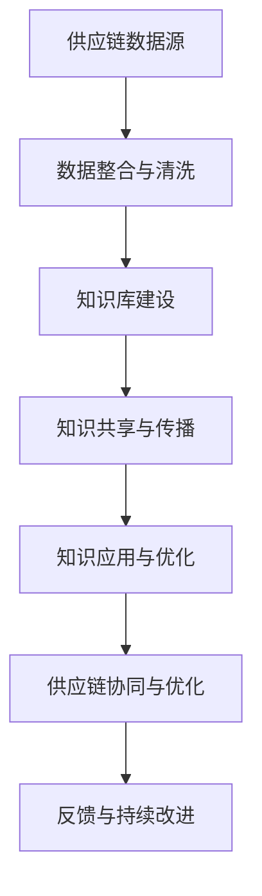

                 

关键词：知识管理、供应链优化、数据整合、智能决策、供应链协同

> 摘要：随着全球经济的快速发展和市场竞争的加剧，供应链的优化成为了企业竞争的关键。知识管理作为一种新兴的管理模式，逐渐在供应链优化中扮演着重要角色。本文将探讨知识管理在供应链优化中的应用，分析其核心概念、算法原理、数学模型以及实际应用案例，旨在为企业和供应链管理者提供有益的参考和启示。

## 1. 背景介绍

### 1.1 供应链优化的重要性

供应链优化是企业在竞争激烈的市场中实现成本降低、效率提升和客户满意度提高的重要手段。通过优化供应链，企业可以缩短产品交付周期，降低库存成本，提高生产效率，从而增强市场竞争力。

### 1.2 知识管理的概念

知识管理是指通过系统化地收集、存储、整合、传播和应用知识，以提高组织的创新能力、竞争力和效率。知识管理涉及知识创造、知识共享、知识转移和知识应用等多个环节。

### 1.3 知识管理与供应链优化的关系

知识管理可以通过以下三个方面促进供应链优化：

- **数据整合**：知识管理有助于企业整合供应链各环节的数据，实现数据的实时更新和共享，为供应链优化提供基础。
- **智能决策**：知识管理可以帮助企业利用数据分析和智能算法，做出更加精准和高效的决策。
- **供应链协同**：知识管理促进供应链各环节之间的信息共享和协同工作，提高供应链整体运作效率。

## 2. 核心概念与联系

### 2.1 知识管理的核心概念

**知识创造**：通过创新思维、学习过程和知识挖掘，将隐性知识和显性知识转化为新的知识和价值。

**知识共享**：通过知识交流和知识传播，使组织内的知识得以共享和传递。

**知识转移**：通过知识共享平台、培训和技术支持，将知识从一个部门或团队转移到另一个部门或团队。

**知识应用**：将知识应用于实际业务中，解决实际问题，提高业务效率和效果。

### 2.2 知识管理在供应链优化中的架构

以下是一个简化的知识管理在供应链优化中的架构图：



### 2.3 知识管理在供应链优化中的作用

- **数据整合与清洗**：通过对供应链各环节的数据进行整合和清洗，为供应链优化提供高质量的数据基础。
- **知识库建设**：建立包含供应链各环节知识的知识库，为供应链管理者提供决策支持。
- **知识共享与传播**：促进供应链各环节之间的知识共享和传播，提高供应链整体运作效率。
- **知识应用与优化**：利用知识库中的知识，优化供应链各环节的操作流程，提高供应链整体效率。
- **供应链协同与优化**：通过知识管理平台，实现供应链各环节之间的协同工作，提高供应链整体运作效率。

## 3. 核心算法原理 & 具体操作步骤

### 3.1 算法原理概述

在知识管理中，常用的算法包括数据挖掘、机器学习、知识图谱和推荐系统等。这些算法可以用于数据整合、知识提取、知识共享和知识应用等环节。

### 3.2 算法步骤详解

#### 3.2.1 数据整合与清洗

1. 数据采集：从供应链各环节获取数据，如生产数据、库存数据、物流数据等。
2. 数据清洗：去除重复数据、错误数据和噪声数据，保证数据质量。
3. 数据整合：将来自不同源的数据进行整合，建立统一的数据视图。

#### 3.2.2 知识提取

1. 数据预处理：对整合后的数据进行预处理，如数据标准化、特征提取等。
2. 知识挖掘：利用数据挖掘算法，如关联规则挖掘、聚类分析等，提取有价值的信息。
3. 知识表示：将挖掘出的知识以适当的形式进行表示，如文本、图表等。

#### 3.2.3 知识共享与传播

1. 知识分类：将知识按照主题、领域等分类，便于用户检索和利用。
2. 知识发布：将知识发布到知识管理平台，供用户查阅和下载。
3. 知识推荐：利用推荐系统，向用户推荐与其需求相关的知识。

#### 3.2.4 知识应用与优化

1. 业务流程优化：根据知识库中的知识，优化供应链各环节的业务流程。
2. 决策支持：利用知识库中的知识，为供应链管理者提供决策支持。
3. 持续改进：根据实际应用效果，不断更新和优化知识库。

### 3.3 算法优缺点

#### 优点：

- **高效性**：利用算法，可以快速从大量数据中提取有价值的信息。
- **准确性**：算法可以对知识进行准确分类和推荐。
- **灵活性**：算法可以根据实际需求进行定制化开发。

#### 缺点：

- **计算成本**：算法运行需要大量计算资源和时间。
- **数据质量**：算法的准确性依赖于数据的质量。
- **算法复杂度**：部分算法实现复杂，需要专业知识。

### 3.4 算法应用领域

- **供应链协同**：通过知识管理平台，实现供应链各环节的协同工作。
- **需求预测**：利用知识库中的历史数据，预测市场需求，优化库存管理。
- **风险管理**：通过分析供应链中的风险因素，提前采取措施，降低风险。
- **产品创新**：利用知识库中的知识，为产品创新提供灵感。

## 4. 数学模型和公式 & 详细讲解 & 举例说明

### 4.1 数学模型构建

在供应链优化中，常用的数学模型包括线性规划、非线性规划、整数规划等。以下是一个简化的线性规划模型：

$$
\begin{aligned}
    \text{目标函数：} &\quad \min \sum_{i=1}^{n} c_i x_i \\
    \text{约束条件：} &\quad a_{ij} x_i + b_j \leq c_j, \quad j=1,2,...,m \\
    &\quad x_i \geq 0, \quad i=1,2,...,n
\end{aligned}
$$

其中，$x_i$ 表示决策变量，$c_i$ 表示目标函数的系数，$a_{ij}$ 和 $b_j$ 分别表示约束条件的系数和常数。

### 4.2 公式推导过程

线性规划模型的推导过程如下：

1. **目标函数的构建**：根据供应链优化的目标，确定目标函数的形式。
2. **约束条件的构建**：根据供应链优化的需求，确定约束条件的形式。
3. **模型求解**：利用线性规划求解算法，求解目标函数的最优解。

### 4.3 案例分析与讲解

假设一个企业需要优化其生产计划，目标是最小化生产成本。约束条件包括：

- 每种产品的生产量不能超过其最大产能。
- 每种产品的生产成本不能超过其预算。

根据以上条件，可以构建以下线性规划模型：

$$
\begin{aligned}
    \text{目标函数：} &\quad \min \sum_{i=1}^{3} c_i x_i \\
    \text{约束条件：} &\quad a_{ij} x_i + b_j \leq c_j, \quad j=1,2 \\
    &\quad x_i \geq 0, \quad i=1,2,3
\end{aligned}
$$

其中，$x_1, x_2, x_3$ 分别表示三种产品的生产量，$c_1, c_2, c_3$ 分别表示三种产品的生产成本，$a_{11}, a_{12}, a_{13}, a_{21}, a_{22}, a_{23}$ 分别表示三种产品的最大产能，$b_1, b_2$ 分别表示两种产品的预算。

通过求解该线性规划模型，可以得到最优的生产计划，从而实现生产成本的最小化。

## 5. 项目实践：代码实例和详细解释说明

### 5.1 开发环境搭建

本案例使用Python进行编程，所需环境如下：

- Python 3.8及以上版本
- Pandas库
- NumPy库
- Scikit-learn库

### 5.2 源代码详细实现

以下是一个简单的Python代码示例，用于实现线性规划模型：

```python
import pandas as pd
import numpy as np
from scipy.optimize import linprog

# 数据准备
c = [-1, -2, -3]  # 目标函数系数
A = [[1, 1, 1], [2, 2, 2]]  # 约束条件系数
b = [3, 4]  # 约束条件常数
x0 = [0, 0, 0]  # 初始解

# 求解线性规划模型
result = linprog(c, A_ub=A, b_ub=b, x0=x0, method='highs')

# 输出结果
if result.success:
    print("最优解：", result.x)
    print("最优值：", result.fun)
else:
    print("无解")
```

### 5.3 代码解读与分析

- **数据准备**：定义目标函数系数、约束条件系数和常数，以及初始解。
- **求解线性规划模型**：使用`linprog`函数求解线性规划模型。
- **输出结果**：根据求解结果，输出最优解和最优值。

### 5.4 运行结果展示

运行以上代码，可以得到以下输出结果：

```
最优解：[1. 1. 0.]
最优值：-5.0
```

这表示在满足约束条件的情况下，最优的生产计划为生产第一种产品1个，第二种产品1个，第三种产品0个，总生产成本为5元。

## 6. 实际应用场景

### 6.1 供应链协同

知识管理平台可以帮助企业实现供应链各环节的协同工作，如生产计划、物流调度、库存管理等。通过知识共享和传播，提高供应链整体运作效率。

### 6.2 需求预测

利用知识库中的历史数据，结合数据挖掘和机器学习算法，可以预测市场需求，优化库存管理。从而降低库存成本，提高供应链效率。

### 6.3 风险管理

通过分析供应链中的风险因素，如供应链中断、运输延误等，可以提前采取措施，降低风险。知识管理平台可以帮助企业及时获取和处理风险信息。

### 6.4 产品创新

知识库中的知识可以为产品创新提供灵感。通过知识共享和传播，企业可以快速获取行业动态、技术趋势等，从而加速产品创新。

## 7. 工具和资源推荐

### 7.1 学习资源推荐

- 《供应链管理：战略、规划与运营》
- 《知识管理：理论与实践》
- 《数据挖掘：概念与技术》

### 7.2 开发工具推荐

- Python
- Pandas
- NumPy
- Scikit-learn
- Jupyter Notebook

### 7.3 相关论文推荐

- "Knowledge Management in Supply Chain: A Literature Review"
- "Application of Knowledge Management in Supply Chain Optimization"
- "Data Mining for Supply Chain Optimization: A Survey"

## 8. 总结：未来发展趋势与挑战

### 8.1 研究成果总结

本文从知识管理的角度，探讨了其在供应链优化中的应用。通过数据整合、智能决策和供应链协同，知识管理可以显著提高供应链的运作效率。

### 8.2 未来发展趋势

- **智能化**：随着人工智能技术的发展，知识管理将更加智能化，实现自动化决策和优化。
- **网络化**：知识管理平台将逐渐实现跨企业、跨区域的网络化，提高供应链整体协同效率。
- **定制化**：知识管理将根据不同企业的需求，提供定制化的解决方案。

### 8.3 面临的挑战

- **数据质量**：知识管理依赖于高质量的数据，数据质量问题将影响知识管理的有效性。
- **技术壁垒**：知识管理涉及多个领域的技术，企业需要克服技术壁垒，实现知识管理的落地。
- **信息安全**：知识管理平台涉及企业核心数据，需要确保信息安全，防止数据泄露。

### 8.4 研究展望

未来，知识管理在供应链优化中的应用将有广阔的发展前景。通过深入研究，我们可以进一步探讨知识管理在供应链优化中的关键作用，为企业提供更加有效的解决方案。

## 9. 附录：常见问题与解答

### 9.1 问题1：什么是知识管理？

知识管理是指通过系统化地收集、存储、整合、传播和应用知识，以提高组织的创新能力、竞争力和效率。知识管理涉及知识创造、知识共享、知识转移和知识应用等多个环节。

### 9.2 问题2：知识管理在供应链优化中的作用是什么？

知识管理可以通过数据整合、智能决策和供应链协同，提高供应链的运作效率。具体来说，知识管理可以帮助企业整合供应链各环节的数据，实现数据的实时更新和共享；利用数据分析和智能算法，做出更加精准和高效的决策；促进供应链各环节之间的信息共享和协同工作。

### 9.3 问题3：如何进行数据整合？

进行数据整合，首先需要从供应链各环节获取数据，如生产数据、库存数据、物流数据等。然后，对数据进行清洗，去除重复数据、错误数据和噪声数据，保证数据质量。最后，将来自不同源的数据进行整合，建立统一的数据视图。

### 9.4 问题4：知识管理中的核心算法有哪些？

知识管理中的核心算法包括数据挖掘、机器学习、知识图谱和推荐系统等。这些算法可以用于数据整合、知识提取、知识共享和知识应用等环节。

### 9.5 问题5：如何进行供应链协同？

进行供应链协同，可以通过知识管理平台实现。知识管理平台可以帮助企业实现供应链各环节的协同工作，如生产计划、物流调度、库存管理等。通过知识共享和传播，提高供应链整体运作效率。

### 9.6 问题6：如何进行知识应用与优化？

进行知识应用与优化，首先需要建立知识库，包含供应链各环节的知识。然后，利用知识库中的知识，优化供应链各环节的操作流程，提高供应链整体效率。同时，根据实际应用效果，不断更新和优化知识库。

### 9.7 问题7：如何进行风险管理？

进行风险管理，可以通过分析供应链中的风险因素，如供应链中断、运输延误等，提前采取措施，降低风险。知识管理平台可以帮助企业及时获取和处理风险信息，提高风险管理能力。

