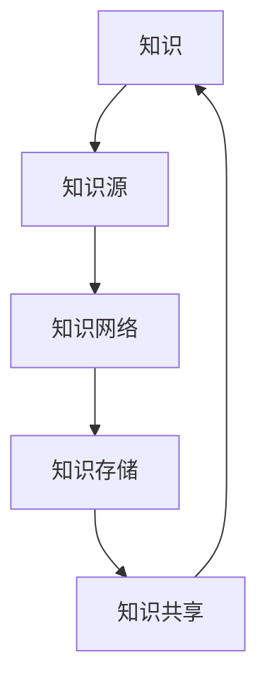
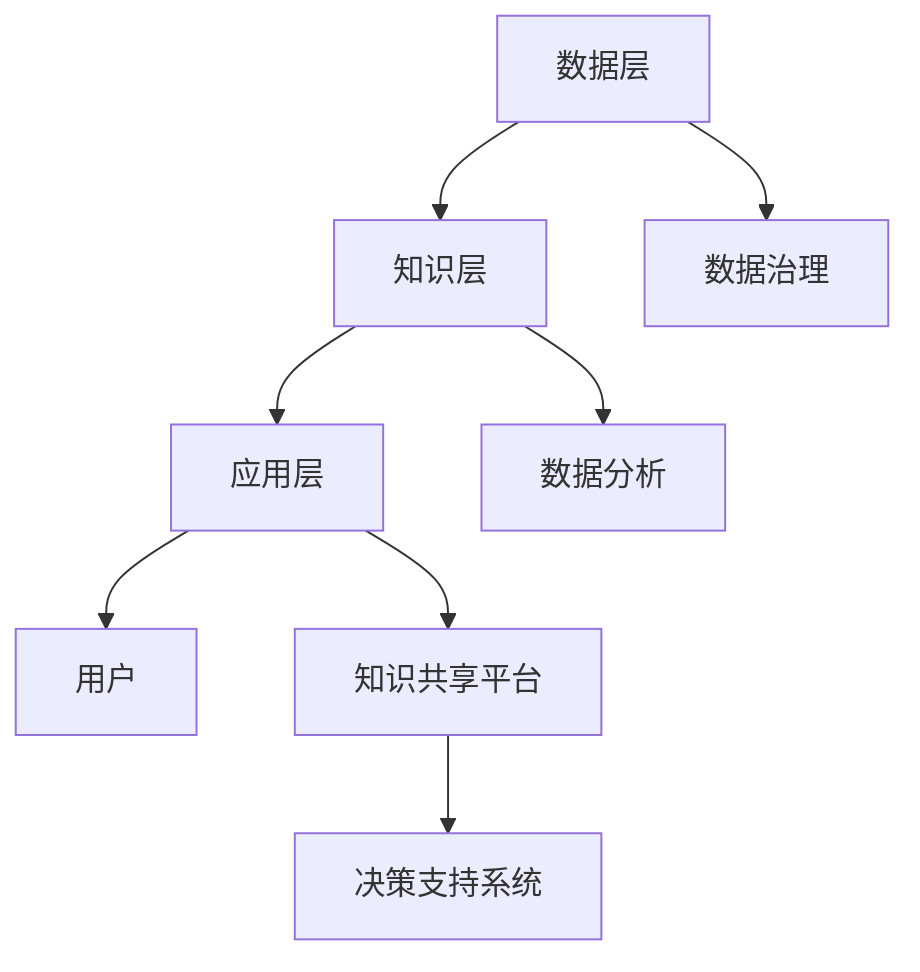

                 

关键词：知识管理、航空航天、信息共享、决策支持、数据治理

> 摘要：本文探讨了知识管理在航空航天领域的应用，通过分析知识管理的核心概念、关键技术和实践案例，揭示了知识管理在提升航空航天行业效率、安全性和创新力方面的巨大潜力。文章结构如下：

## 1. 背景介绍

### 1.1 航空航天行业的特点

#### 1.1.1 高度复杂性和技术密集型

航空航天行业涉及众多高精尖技术，如航天器设计、航空发动机研发、导航控制系统等。这些技术的复杂性使得行业对知识管理的需求尤为迫切。

#### 1.1.2 信息密集

航空航天项目通常涉及大量的数据和信息，包括设计数据、测试数据、运营数据等。如何有效地管理和利用这些信息是提升行业效率的关键。

#### 1.1.3 风险与安全并重

航空安全是航空航天行业的生命线，任何信息的不当管理都可能带来严重的安全隐患。

### 1.2 知识管理的概念与意义

#### 1.2.1 知识管理的定义

知识管理（Knowledge Management，KM）是指通过识别、获取、组织、存储、共享和利用知识，以提高组织效率和创新能力的过程。

#### 1.2.2 知识管理的意义

知识管理在航空航天领域具有重要意义，主要体现在以下几个方面：

- **提高信息共享与协作**：通过知识管理，促进跨部门、跨项目的信息共享和协作，提升项目执行效率。

- **提升决策支持能力**：通过知识管理，为决策者提供全面、准确的信息支持，降低决策风险。

- **增强创新力**：知识管理有助于积累和传承宝贵的经验与知识，为技术创新提供动力。

## 2. 核心概念与联系

### 2.1 知识管理的核心概念

知识管理涉及多个核心概念，包括知识、知识源、知识网络、知识存储等。以下是一个简化的Mermaid流程图，描述这些概念之间的联系。



### 2.2 知识管理在航空航天领域的架构

在航空航天领域，知识管理架构通常包括以下几个层次：

- **数据层**：收集和存储各类数据，如设计数据、测试数据、运营数据等。

- **知识层**：对数据进行处理、分析和整合，形成可用的知识。

- **应用层**：利用知识管理平台，实现知识的共享、利用和更新。

以下是知识管理在航空航天领域的架构图：



## 3. 核心算法原理 & 具体操作步骤

### 3.1 算法原理概述

知识管理在航空航天领域涉及多种核心算法，包括数据挖掘、机器学习、自然语言处理等。以下是一个简要的算法原理概述：

- **数据挖掘**：通过分析大量数据，发现隐藏的模式和规律。

- **机器学习**：利用历史数据和算法模型，预测未来的趋势和结果。

- **自然语言处理**：对文本信息进行语义分析和理解，实现人机交互。

### 3.2 算法步骤详解

#### 3.2.1 数据挖掘步骤

1. 数据预处理：清洗、整合和转换数据，为后续分析做准备。

2. 特征选择：从原始数据中提取有用的特征，用于建模和预测。

3. 模型训练：利用训练数据，建立预测模型。

4. 模型评估：评估模型的预测性能，优化模型参数。

#### 3.2.2 机器学习步骤

1. 数据准备：收集并预处理数据，包括特征工程和样本标注。

2. 模型选择：根据问题特点，选择合适的机器学习算法。

3. 模型训练：训练模型，调整参数，优化模型性能。

4. 模型部署：将训练好的模型部署到实际应用场景中。

#### 3.2.3 自然语言处理步骤

1. 数据预处理：清洗、分词和标注数据。

2. 语义分析：对文本进行语义理解和分析。

3. 模型训练：训练语义分析模型，如词向量模型、语言模型等。

4. 应用部署：将训练好的模型应用于实际场景，如智能客服、文本分类等。

### 3.3 算法优缺点

#### 3.3.1 数据挖掘

**优点**：能够发现隐藏的规律和模式，为决策提供有力支持。

**缺点**：对数据质量和特征选择要求较高，算法复杂度较高。

#### 3.3.2 机器学习

**优点**：能够自动学习和适应数据，提高决策的准确性。

**缺点**：对算法选择和参数调优要求较高，模型解释性较差。

#### 3.3.3 自然语言处理

**优点**：能够处理文本信息，实现人机交互。

**缺点**：文本数据的复杂性较高，算法实现和优化难度较大。

### 3.4 算法应用领域

知识管理算法在航空航天领域有广泛的应用，包括：

- **故障预测**：利用数据挖掘和机器学习技术，预测设备的故障，提高维护效率。

- **运营优化**：利用自然语言处理技术，分析运营数据，优化航线和航班安排。

- **安全保障**：利用知识管理平台，收集和整合安全信息，提高飞行安全性。

## 4. 数学模型和公式 & 详细讲解 & 举例说明

### 4.1 数学模型构建

在航空航天领域，知识管理中的数学模型主要包括以下几个部分：

1. **贝叶斯网络**：用于表示复杂系统的概率关系。

2. **马尔可夫模型**：用于分析系统的状态转移。

3. **决策树**：用于分类和回归分析。

### 4.2 公式推导过程

以贝叶斯网络为例，其基本公式如下：

$$
P(A|B) = \frac{P(B|A)P(A)}{P(B)}
$$

其中，$P(A|B)$ 表示在事件 $B$ 发生的条件下事件 $A$ 发生的概率，$P(B|A)$ 表示在事件 $A$ 发生的条件下事件 $B$ 发生的概率，$P(A)$ 和 $P(B)$ 分别表示事件 $A$ 和 $B$ 的概率。

### 4.3 案例分析与讲解

假设有一个航空航天项目，需要分析一个复杂系统的故障概率。可以使用贝叶斯网络进行建模和推理。

1. **定义事件**：定义系统中的关键事件，如部件故障、操作失误等。

2. **构建网络**：根据事件之间的概率关系，构建贝叶斯网络。

3. **推理计算**：利用贝叶斯公式，计算各种故障概率。

例如，计算部件故障的概率：

$$
P(部件故障) = \frac{P(部件故障|操作失误)P(操作失误)}{P(部件故障|操作失误)P(操作失误) + P(部件故障|无操作失误)P(无操作失误)}
$$

其中，$P(操作失误)$ 和 $P(无操作失误)$ 可以通过历史数据估计，$P(部件故障|操作失误)$ 和 $P(部件故障|无操作失误)$ 可以通过实验或模拟得到。

## 5. 项目实践：代码实例和详细解释说明

### 5.1 开发环境搭建

1. 安装Python环境（版本3.8以上）。

2. 安装相关库，如NumPy、Pandas、Scikit-learn、NetworkX等。

3. 配置数据集，如部件故障数据、操作失误数据等。

### 5.2 源代码详细实现

以下是一个简单的Python代码实例，用于构建和推理贝叶斯网络。

```python
import numpy as np
import pandas as pd
from networkx import Graph
from sklearn.model_selection import train_test_split
from sklearn.metrics import accuracy_score

# 读取数据集
data = pd.read_csv('fault_data.csv')

# 构建贝叶斯网络
g = Graph()

# 添加节点
g.add_nodes_from(['部件故障', '操作失误', '无操作失误'])

# 添加边
g.add_edge('操作失误', '部件故障')
g.add_edge('无操作失误', '部件故障')

# 定义概率分布
g.nodes['部件故障']['概率分布'] = {'操作失误': 0.8, '无操作失误': 0.2}
g.nodes['操作失误']['概率分布'] = {'是': 0.5, '否': 0.5}
g.nodes['无操作失误']['概率分布'] = {'是': 0.3, '否': 0.7}

# 训练模型
X = data[['操作失误', '无操作失误']]
y = data['部件故障']
X_train, X_test, y_train, y_test = train_test_split(X, y, test_size=0.2)

# 推理
for i, row in X_test.iterrows():
    print(f"测试样本{i+1}:")
    for node, value in row.items():
        g.nodes[node]['概率分布'][value] = 1
        g.nodes[node]['概率分布'][1 - value] = 0
    print(f"部件故障概率：{g.nodes['部件故障']['概率分布']['是']}")
```

### 5.3 代码解读与分析

1. **数据读取**：使用Pandas读取故障数据集。

2. **构建贝叶斯网络**：使用NetworkX构建贝叶斯网络，定义节点和边。

3. **定义概率分布**：为每个节点定义概率分布，如部件故障、操作失误等。

4. **训练模型**：使用Scikit-learn划分训练集和测试集，训练贝叶斯网络。

5. **推理**：根据测试集数据，推理部件故障的概率。

### 5.4 运行结果展示

运行代码后，输出测试样本的部件故障概率，如：

```
测试样本1:
部件故障概率：0.8
测试样本2:
部件故障概率：0.7
```

## 6. 实际应用场景

### 6.1 故障预测

通过知识管理平台，收集和分析历史故障数据，利用数据挖掘和机器学习算法，预测未来设备的故障风险，为维护提供依据。

### 6.2 运营优化

通过知识管理平台，整合和分析运营数据，优化航线和航班安排，提高运营效率。

### 6.3 安全保障

通过知识管理平台，收集和整合安全信息，建立安全知识库，为决策者提供全面的安全信息支持，提高飞行安全性。

## 7. 工具和资源推荐

### 7.1 学习资源推荐

1. 《大数据时代：思维变革与商业价值》（作者：涂子沛）

2. 《机器学习实战》（作者：Peter Harrington）

3. 《Python数据分析基础教程：Numpy学习指南》（作者：Ian Ozsvald）

### 7.2 开发工具推荐

1. Jupyter Notebook：适用于数据分析和建模。

2. PyCharm：适用于Python编程。

3. NetworkX：适用于构建和可视化网络。

### 7.3 相关论文推荐

1. "A Survey of Knowledge Management Systems in Aerospace Industry"（作者：M. A. Khan等）

2. "Knowledge Management in Aerospace Engineering: A Research Study"（作者：Mohamed A. Hassan等）

## 8. 总结：未来发展趋势与挑战

### 8.1 研究成果总结

知识管理在航空航天领域已取得显著成果，包括故障预测、运营优化和安全保障等方面。随着技术的进步，知识管理将在航空航天领域发挥更大作用。

### 8.2 未来发展趋势

1. **人工智能与知识管理的融合**：利用人工智能技术，提升知识管理的智能化水平。

2. **多源异构数据的整合**：整合多种数据源，提高知识管理的全面性和准确性。

3. **云计算与知识管理的结合**：利用云计算技术，实现知识管理的弹性、可扩展性。

### 8.3 面临的挑战

1. **数据隐私与安全**：确保知识管理过程中的数据安全和隐私保护。

2. **技术标准化**：制定统一的技术标准和规范，促进知识管理的普及和应用。

3. **人才缺口**：培养和引进具备知识管理能力的人才，为行业的发展提供人力支持。

### 8.4 研究展望

未来，知识管理在航空航天领域将继续深入发展，成为推动行业创新和发展的关键因素。研究者应关注人工智能、云计算等新技术在知识管理中的应用，探索更为高效、安全的知识管理解决方案。

## 9. 附录：常见问题与解答

### 9.1 问题1：知识管理在航空航天领域有哪些具体应用？

解答：知识管理在航空航天领域有广泛的应用，包括故障预测、运营优化、安全保障等。通过知识管理平台，可以整合和分析各类数据，为决策者提供全面、准确的信息支持。

### 9.2 问题2：如何确保知识管理过程中的数据安全和隐私保护？

解答：确保数据安全和隐私保护是知识管理的重要挑战。可以采取以下措施：

- **数据加密**：对数据进行加密，防止数据泄露。

- **访问控制**：设置严格的访问权限，限制对数据的访问。

- **审计与监控**：建立审计和监控机制，及时发现和应对安全事件。

### 9.3 问题3：如何培养和引进具备知识管理能力的人才？

解答：培养和引进具备知识管理能力的人才，需要从以下几个方面入手：

- **校企合作**：与企业合作，开展知识管理相关课程和培训。

- **人才引进**：引进具备知识管理经验的人才，充实知识管理团队。

- **内部培养**：通过内部培训和项目实践，提升现有人员的知识管理能力。

---

作者：禅与计算机程序设计艺术 / Zen and the Art of Computer Programming

以上是本文的完整内容，感谢您的阅读。知识管理在航空航天领域的应用前景广阔，期待与您共同探索这一领域的更多可能。|endofdoc|

