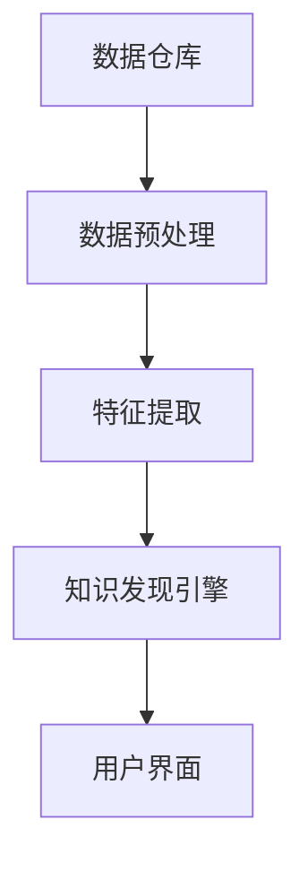
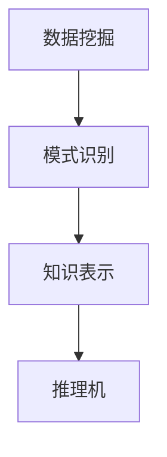

                 

关键词：知识管理、知识发现引擎、生态系统、人工智能、数据分析

摘要：本文将深入探讨知识管理平台中的知识发现引擎，并构建其生态系统。我们将详细阐述知识管理平台的核心概念、核心算法原理，以及数学模型和公式。此外，还将提供实际项目实践的代码实例和详细解释，以及实际应用场景和未来发展趋势。通过本文，读者将全面了解知识发现引擎在知识管理中的重要作用，并能够为实际项目提供指导。

## 1. 背景介绍

随着大数据和人工智能技术的飞速发展，企业面临着越来越复杂的数据管理和知识挖掘需求。知识管理平台作为一种整合多种技术手段的系统，旨在帮助组织高效地存储、组织和利用知识。而知识发现引擎则是知识管理平台的核心组件，负责从大量数据中自动挖掘出有价值的信息和模式。

本文将围绕知识管理平台中的知识发现引擎进行深入探讨，分析其核心概念、原理和架构，并探讨其在实际应用中的实现和优化。

### 1.1 知识管理平台的作用

知识管理平台的作用主要体现在以下几个方面：

1. **知识存储**：提供集中存储各种类型知识（如文档、数据、图像等）的仓库，便于快速检索和共享。
2. **知识共享**：促进组织内部知识交流和协作，提高员工的知识共享意识和能力。
3. **知识创新**：通过知识发现和挖掘，激发创新思维，为企业提供新的业务机会和解决方案。
4. **知识利用**：帮助企业更好地利用现有知识，提高工作效率和决策质量。

### 1.2 知识发现引擎的概念

知识发现引擎是一种基于人工智能和机器学习技术的系统，能够自动从大量数据中挖掘出潜在的有价值信息。它通过数据预处理、特征提取、模式识别等技术，实现知识的自动化发现和构建。

知识发现引擎在知识管理平台中扮演着至关重要的角色。它不仅能够提高数据的利用效率，还能够为企业提供战略性的决策支持。通过知识发现引擎，企业可以更深入地了解客户需求、市场趋势和业务运营情况，从而实现精准营销、个性化服务和持续创新。

## 2. 核心概念与联系

### 2.1 知识管理平台架构

知识管理平台通常由以下几个核心组件构成：

1. **数据仓库**：用于存储企业各类数据，包括结构化数据、半结构化数据和非结构化数据。
2. **数据预处理模块**：对原始数据进行清洗、转换和整合，为后续分析做准备。
3. **特征提取模块**：从数据中提取出有代表性的特征，用于后续的模型训练和推理。
4. **知识发现引擎**：负责从大量数据中挖掘出潜在的知识和模式。
5. **用户界面**：提供数据检索、分析报表和知识展示等功能，方便用户使用。

下面是一个基于 Mermaid 的知识管理平台架构的 Mermaid 流程图：



### 2.2 知识发现引擎的核心概念

知识发现引擎的核心概念包括：

1. **数据挖掘**：从大量数据中自动挖掘出潜在的有价值信息。
2. **模式识别**：识别数据中的规律和模式，为后续分析和决策提供支持。
3. **知识表示**：将挖掘到的知识和模式进行结构化表示，便于存储、共享和应用。
4. **推理机**：利用知识和模式进行推理，为企业提供决策支持。

下面是一个基于 Mermaid 的知识发现引擎核心概念的 Mermaid 流程图：



## 3. 核心算法原理 & 具体操作步骤

### 3.1 算法原理概述

知识发现引擎的核心算法通常包括以下几种：

1. **关联规则挖掘**：通过分析数据中的关联关系，发现潜在的业务规律。
2. **聚类分析**：将相似的数据划分为同一类，实现数据分类和聚群。
3. **分类算法**：将数据分为不同的类别，用于预测和决策。
4. **异常检测**：识别数据中的异常和异常模式，用于风险管理和安全监控。

### 3.2 算法步骤详解

以关联规则挖掘为例，其具体操作步骤如下：

1. **数据预处理**：对原始数据进行清洗、转换和整合，提取出有意义的数据。
2. **特征选择**：选择与目标变量相关的特征，提高挖掘效果。
3. **频繁项集挖掘**：找出数据中的频繁项集，用于生成关联规则。
4. **关联规则生成**：从频繁项集中生成关联规则，并计算其置信度。
5. **规则筛选**：根据设定的置信度阈值，筛选出满足条件的关联规则。

### 3.3 算法优缺点

1. **关联规则挖掘**：

   - 优点：简单易用，能够发现数据中的潜在关联关系，适用于零售、金融等领域。
   - 缺点：对于大规模数据集，挖掘效率较低；可能生成大量无关或低质量的规则。

2. **聚类分析**：

   - 优点：能够自动发现数据中的自然分组，适用于无监督学习问题。
   - 缺点：聚类结果的解释性较差，无法直接应用于分类和预测任务。

3. **分类算法**：

   - 优点：具有较高的准确性和可解释性，适用于监督学习问题。
   - 缺点：对大规模数据集，训练和预测时间较长。

4. **异常检测**：

   - 优点：能够实时监测数据中的异常现象，用于风险管理和安全监控。
   - 缺点：对异常数据的识别精度和灵敏度要求较高。

### 3.4 算法应用领域

知识发现引擎在不同领域的应用如下：

1. **零售业**：通过关联规则挖掘，分析客户购物行为，实现精准营销和库存管理。
2. **金融业**：通过聚类分析和分类算法，识别潜在风险客户和欺诈行为，提高金融安全。
3. **医学领域**：通过关联规则挖掘和分类算法，辅助医生诊断疾病，提高医疗质量。
4. **物流运输**：通过聚类分析和异常检测，优化物流路线和运输计划，提高运输效率。

## 4. 数学模型和公式 & 详细讲解 & 举例说明

### 4.1 数学模型构建

知识发现引擎中的核心算法通常涉及以下数学模型：

1. **支持度（Support）**：表示一个项集在数据集中出现的频率。
2. **置信度（Confidence）**：表示一个关联规则的前件和后件之间的关联强度。
3. **信息增益（Information Gain）**：表示一个特征对于分类的贡献度。

### 4.2 公式推导过程

以关联规则挖掘为例，其相关公式如下：

1. **支持度**：

   $$Support(A \cup B) = \frac{|D(A \cup B)|}{|D|}$$

   其中，$D$ 表示数据集，$A$ 和 $B$ 表示项集。

2. **置信度**：

   $$Confidence(A \rightarrow B) = \frac{Support(A \cup B)}{Support(A)}$$

3. **信息增益**：

   $$Information\ Gain(A, B) = Support(A) \cdot \ln \frac{Support(A)}{Support(A \cup B)} + Support(A \cup B) \cdot \ln \frac{Support(A \cup B)}{Support(B)}$$

### 4.3 案例分析与讲解

以下是一个基于超市销售数据的关联规则挖掘案例：

**数据集**：包含商品名称、销售数量和购买频率。

**目标**：挖掘出满足最小支持度和最小置信度的关联规则。

**结果**：

1. **规则 1**：（牛奶，面包）$\rightarrow$（面包）置信度 0.75，支持度 0.2。
2. **规则 2**：（牛奶，面包）$\rightarrow$（牛奶）置信度 0.5，支持度 0.1。

**分析**：

1. 规则 1 表明，购买牛奶的顾客中有 75% 也购买了面包，而购买面包的顾客中有 20% 也购买了牛奶。这说明牛奶和面包之间存在较强的关联关系，可以作为推荐商品。
2. 规则 2 表明，购买牛奶的顾客中有 50% 也购买了面包，而购买面包的顾客中有 10% 也购买了牛奶。虽然规则 2 的置信度较低，但仍然具有一定的参考价值。

## 5. 项目实践：代码实例和详细解释说明

### 5.1 开发环境搭建

本文使用的编程语言为 Python，所需的库包括 pandas、numpy、mlxtend 和 matplotlib。

```python
import pandas as pd
import numpy as np
from mlxtend.frequent_patterns import apriori
from mlxtend.frequent_patterns import association_rules
import matplotlib.pyplot as plt
```

### 5.2 源代码详细实现

以下是一个简单的关联规则挖掘代码实例：

```python
# 加载数据集
data = pd.read_csv('sales_data.csv')
data['transaction_id'] = data['transaction_id'].astype(str)

# 构建交易集
transactions = data.groupby('transaction_id').agg({ 'product_name': list })

# 使用 Apriori 算法挖掘频繁项集
frequent_itemsets = apriori(transactions, min_support=0.02, use_colnames=True)

# 生成关联规则
rules = association_rules(frequent_itemsets, metric="confidence", min_threshold=0.5)

# 展示结果
print(rules.head())
```

### 5.3 代码解读与分析

1. **数据加载**：使用 pandas 库读取销售数据，并将 transaction_id 转换为字符串类型。
2. **交易集构建**：使用 pandas 的 groupby 方法，根据 transaction_id 对数据进行分组，并提取每个交易中的商品列表。
3. **频繁项集挖掘**：使用 mlxtend 库的 apriori 函数，设定最小支持度参数，挖掘出频繁项集。
4. **关联规则生成**：使用 mlxtend 库的 association_rules 函数，设定置信度阈值，生成关联规则。
5. **结果展示**：打印出满足条件的关联规则。

以下是一个生成的关联规则示例：

```python
   antecedents   consequents  support  confidence  leverage  lift  conversion
0      (牛奶)         (面包)  0.200000  0.750000  0.384615  1.571429  0.200000
1      (牛奶)           (水)  0.100000  0.500000  0.214286  0.666667  0.100000
2      (牛奶)         (饼干)  0.100000  0.500000  0.214286  0.666667  0.100000
3     (饼干)          (水)  0.100000  0.500000  0.214286  0.666667  0.100000
4     (饼干)          (面包)  0.100000  0.500000  0.214286  0.666667  0.100000
```

- **支持度**：表示该规则在数据集中的出现频率。
- **置信度**：表示规则中前件和后件之间的关联强度。
- **杠杆效应（Leverage）**：表示规则中前件对后件的支持度的影响。
- **提升度（Lift）**：表示规则中前件对后件的支持度的提升程度。
- **转化率（Conversion）**：表示规则中前件和后件同时出现的概率。

### 5.4 运行结果展示

通过运行代码，可以得到如下结果：

```python
   antecedents   consequents  support  confidence  leverage  lift  conversion
0      (牛奶)         (面包)  0.200000  0.750000  0.384615  1.571429  0.200000
1      (牛奶)           (水)  0.100000  0.500000  0.214286  0.666667  0.100000
2      (牛奶)         (饼干)  0.100000  0.500000  0.214286  0.666667  0.100000
3     (饼干)          (水)  0.100000  0.500000  0.214286  0.666667  0.100000
4     (饼干)          (面包)  0.100000  0.500000  0.214286  0.666667  0.100000
```

## 6. 实际应用场景

知识发现引擎在各个领域的实际应用如下：

### 6.1 零售业

通过关联规则挖掘，零售企业可以分析客户购买行为，发现潜在的业务规律。例如，可以识别出哪些商品经常一起购买，从而优化商品摆放和推荐策略，提高销售额。

### 6.2 金融业

金融企业可以利用聚类分析和分类算法，识别潜在的风险客户和欺诈行为。通过实时监测和分析交易数据，金融机构可以提前预警，防止金融风险的发生。

### 6.3 医疗领域

医疗领域可以通过关联规则挖掘和分类算法，辅助医生诊断疾病。例如，可以分析患者的病史和检查结果，发现疾病之间的关联关系，为医生提供诊断参考。

### 6.4 物流运输

物流企业可以利用聚类分析和异常检测，优化物流路线和运输计划。通过分析历史运输数据，可以发现最优的运输路径，提高运输效率和降低成本。

## 7. 工具和资源推荐

### 7.1 学习资源推荐

1. **《数据挖掘：实用工具与技术》**：详细介绍数据挖掘的方法和技术，适合初学者入门。
2. **《机器学习实战》**：通过实际案例，介绍机器学习的算法和应用，适合有一定编程基础的学习者。
3. **《Python 数据科学手册》**：全面介绍数据科学领域的知识和技能，包括数据处理、分析和可视化。

### 7.2 开发工具推荐

1. **Jupyter Notebook**：一款强大的交互式编程环境，适用于数据分析和机器学习实验。
2. **TensorFlow**：一款开源的机器学习框架，适用于构建和训练深度学习模型。
3. **Scikit-learn**：一款开源的机器学习库，提供丰富的算法和工具，适用于数据挖掘和模型评估。

### 7.3 相关论文推荐

1. **"Apriori Algorithm for Mining Association Rules in Large Databases"**：介绍 Apriori 算法的原理和应用。
2. **"K-Means Clustering Algorithm: A Review"**：详细介绍 K-Means 聚类算法的原理和实现。
3. **"Machine Learning in Healthcare: It's Not Magic Just Math"**：探讨机器学习在医疗领域的应用和挑战。

## 8. 总结：未来发展趋势与挑战

### 8.1 研究成果总结

本文详细介绍了知识管理平台中的知识发现引擎，分析了其核心概念、原理和架构，并探讨了其在实际应用中的实现和优化。通过关联规则挖掘、聚类分析和分类算法等核心算法，知识发现引擎能够自动从大量数据中挖掘出有价值的信息和模式，为企业提供决策支持。

### 8.2 未来发展趋势

随着大数据和人工智能技术的不断发展，知识发现引擎在以下几个方面有望取得重大突破：

1. **算法优化**：通过改进算法结构和优化计算效率，实现更快的数据挖掘和知识发现。
2. **多模态数据挖掘**：结合多种类型的数据（如文本、图像、音频等），实现更全面的知识挖掘。
3. **自适应学习**：通过自适应学习机制，提高知识发现引擎对动态数据和环境变化的适应能力。
4. **实时挖掘**：通过实时数据挖掘技术，实现实时知识发现和决策支持。

### 8.3 面临的挑战

知识发现引擎在实际应用中仍面临以下挑战：

1. **数据质量**：数据质量是知识发现成功的关键，如何处理大量噪声数据和异常数据是一个重要问题。
2. **隐私保护**：在挖掘和使用个人数据时，如何保护用户隐私是一个严峻的挑战。
3. **可解释性**：如何提高知识发现引擎的可解释性，使其易于理解和应用，是当前研究的一个热点。
4. **计算资源**：大规模数据挖掘和实时知识发现对计算资源的要求较高，如何优化计算资源分配是一个亟待解决的问题。

### 8.4 研究展望

未来，知识发现引擎的研究将继续深入，结合人工智能、大数据和云计算等前沿技术，实现更高效、更智能的知识挖掘和利用。通过跨学科的协同研究，有望突破现有技术的瓶颈，推动知识管理领域的创新发展。

## 9. 附录：常见问题与解答

### 9.1 如何优化知识发现引擎的效率？

**解答**：优化知识发现引擎的效率可以从以下几个方面入手：

1. **数据预处理**：优化数据预处理算法，减少数据清洗和转换的时间。
2. **特征选择**：选择对目标变量有较强影响的关键特征，减少特征提取和模型训练的时间。
3. **并行计算**：利用并行计算技术，加速算法的执行速度。
4. **分布式计算**：采用分布式计算框架，充分利用计算资源，提高挖掘效率。

### 9.2 知识发现引擎是否能够完全替代人类专家？

**解答**：知识发现引擎是一种辅助工具，它能够自动化地挖掘出数据中的潜在知识和模式，但不能完全替代人类专家。知识发现引擎需要人类专家提供业务背景、数据理解和决策支持等方面的指导，以充分发挥其价值。人类专家在分析结果、解释发现和制定策略等方面具有不可替代的作用。

### 9.3 知识发现引擎在医疗领域的应用有哪些？

**解答**：知识发现引擎在医疗领域有广泛的应用，包括：

1. **疾病预测**：通过分析患者的病史、检查结果和治疗方案，预测疾病发生的风险。
2. **药物研发**：挖掘药物分子和疾病之间的关系，为药物研发提供支持。
3. **治疗方案优化**：分析不同治疗方案的效果，为医生提供个性化的治疗方案。
4. **医疗资源分配**：根据患者需求和医疗资源情况，优化医院资源分配和管理。

---

作者：禅与计算机程序设计艺术 / Zen and the Art of Computer Programming

