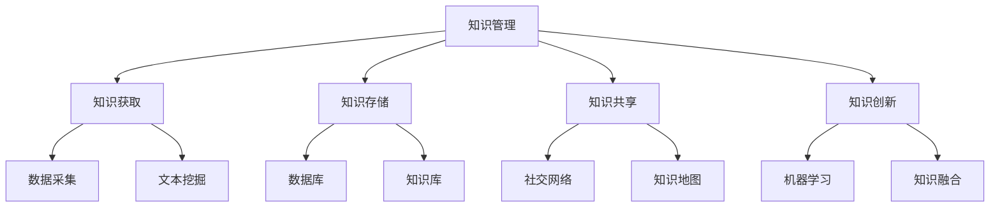

                 

在当今数字化时代，知识管理（Knowledge Management, KM）的重要性日益凸显。随着信息爆炸式增长，如何有效地获取、存储、利用和传播知识成为企业和组织面临的重大挑战。人工智能（Artificial Intelligence, AI）的出现为知识管理带来了新的契机，使其从传统的知识获取和存储转变为更为智能的知识创新。本文旨在探讨知识管理的AI化过程，从知识获取、知识存储、知识共享和知识创新四个方面，深入分析AI在知识管理中的应用，并提出未来的发展趋势与挑战。

## 关键词

- 知识管理
- 人工智能
- 知识获取
- 知识存储
- 知识共享
- 知识创新

## 摘要

本文首先回顾了知识管理的传统方法，探讨了其局限性。接着，介绍了人工智能在知识管理中的核心作用，包括知识获取、知识存储、知识共享和知识创新。通过具体案例和算法原理的讲解，本文展示了AI在知识管理中的实际应用效果。最后，文章总结了AI化知识管理的前景，并探讨了未来可能面临的挑战。

### 1. 背景介绍

知识管理是一个多层次、多维度且复杂的过程，其核心目的是将知识从个体或组织中解放出来，使其能够被广泛地共享和利用。传统的知识管理主要依赖于人类自身的经验和技能，通过文档管理、会议分享和专家咨询等方式来传递知识。然而，随着知识量的不断膨胀，传统方法逐渐暴露出其局限性。

首先，传统知识管理依赖于人的记忆和经验，难以应对复杂的信息环境。信息爆炸式增长导致知识的获取、存储和利用变得更加困难，传统的方法往往无法满足需求。其次，知识的分散性和异构性使得知识的共享和传播效率低下。不同部门和员工之间的知识壁垒限制了知识的流动，导致知识的潜在价值无法得到充分利用。

面对这些挑战，人工智能的引入为知识管理带来了新的机遇。AI能够通过自然语言处理、机器学习、数据挖掘等技术手段，对海量数据进行高效处理，从而实现知识的自动化获取、存储和利用。同时，AI还可以通过推荐系统、知识图谱等技术，促进知识的共享和创新，提升知识管理的整体效能。

### 2. 核心概念与联系

为了更好地理解AI在知识管理中的应用，首先需要明确几个核心概念及其相互关系。以下是使用Mermaid绘制的知识管理核心概念与联系的流程图：



**知识管理（Knowledge Management）**：知识管理是一个系统化的过程，旨在通过识别、获取、存储、共享和利用知识，来支持组织或个人的决策和创新。知识管理涵盖了从知识获取到知识创新的全过程，是实现知识价值最大化的关键。

**知识获取（Knowledge Acquisition）**：知识获取是指通过各种手段获取外部或内部的知识资源，包括数据采集、文本挖掘和知识提取等。

**知识存储（Knowledge Storage）**：知识存储是指将获取的知识进行分类、整理和存储，以便后续的利用和共享。常用的知识存储方式包括数据库、知识库和数据仓库等。

**知识共享（Knowledge Sharing）**：知识共享是指将存储的知识在组织内部或外部进行传播和共享，以促进知识的流动和传播。知识共享可以通过社交网络、知识地图和知识社区等方式实现。

**知识创新（Knowledge Innovation）**：知识创新是指通过整合和重新组织现有的知识，产生新的知识和价值。知识创新通常涉及机器学习、知识融合和智能推理等技术。

这些核心概念相互关联，共同构成了知识管理的基本框架。知识获取是知识管理的基础，通过数据采集和文本挖掘等技术，获取有用的知识资源。知识存储则为知识的获取提供了持久化和有序化的管理机制。知识共享促进了知识的传播和利用，使得知识能够在组织内部或外部得到更广泛的传播。知识创新则通过机器学习和知识融合等技术，实现了知识的增值和优化。

### 3. 核心算法原理 & 具体操作步骤

#### 3.1 算法原理概述

AI在知识管理中的应用，主要依赖于以下几个核心算法：

- **自然语言处理（Natural Language Processing, NLP）**：NLP是AI技术中用于处理和解析自然语言的一门分支学科。通过NLP技术，AI能够对文本进行分词、词性标注、实体识别、情感分析等操作，从而实现对文本内容的理解和分析。

- **机器学习（Machine Learning, ML）**：机器学习是AI的重要组成部分，通过训练模型，AI能够从数据中自动提取特征，并进行预测和决策。在知识管理中，机器学习可用于知识分类、推荐系统和知识融合等。

- **数据挖掘（Data Mining, DM）**：数据挖掘是一种从大量数据中提取有用信息和知识的方法。在知识管理中，数据挖掘可用于知识发现、趋势分析和预测等。

- **知识图谱（Knowledge Graph）**：知识图谱是一种结构化数据存储形式，通过实体和关系的表示，实现了知识的关联和可视化。知识图谱在知识共享和创新中具有重要作用。

#### 3.2 算法步骤详解

1. **数据采集与预处理**：首先，通过数据采集技术，从各种数据源（如网络、数据库、文档等）中获取原始数据。然后，对数据进行清洗、去重和格式化等预处理操作，以确保数据的质量和一致性。

2. **文本挖掘与特征提取**：利用NLP技术对预处理后的文本数据进行分词、词性标注、实体识别等操作，提取文本中的关键信息和特征。这些特征将用于后续的机器学习模型训练和知识表示。

3. **机器学习模型训练**：使用提取的特征数据，通过机器学习算法训练模型。常见的机器学习算法包括朴素贝叶斯、支持向量机、决策树、神经网络等。训练好的模型可以用于知识分类、推荐系统和知识融合等应用。

4. **知识存储与表示**：将训练好的模型和提取的特征数据存储在数据库或知识库中。同时，利用知识图谱技术，对知识进行结构化表示，实现知识的关联和可视化。

5. **知识共享与传播**：通过社交网络、知识地图和知识社区等方式，实现知识的共享和传播。知识共享平台应具备搜索、推荐、评论和反馈等功能，以提高知识的利用效率。

6. **知识创新与应用**：基于已有的知识和模型，通过知识融合、智能推理和创意生成等技术，实现知识的创新和应用。知识创新可以应用于决策支持、智能推荐和知识服务等领域。

#### 3.3 算法优缺点

**优点**：

- **高效性**：AI算法能够高效地处理海量数据，快速提取关键信息，实现知识的自动化获取和利用。

- **灵活性**：AI算法可以根据不同的应用场景和需求，灵活调整和优化，适应各种知识管理任务。

- **创新性**：AI技术可以促进知识的创新和增值，通过知识融合、智能推理和创意生成等手段，产生新的知识和价值。

**缺点**：

- **复杂性**：AI算法的实现和部署过程较为复杂，需要专业的技术和知识。

- **数据依赖**：AI算法的性能很大程度上依赖于数据的质量和数量，数据不足或质量差可能会影响算法的效果。

- **隐私和安全**：在知识管理中，涉及到大量的敏感信息和隐私数据，如何确保数据的安全和隐私是一个重要挑战。

#### 3.4 算法应用领域

AI在知识管理中的应用领域非常广泛，主要包括以下几个方面：

- **企业知识管理**：AI技术可以帮助企业实现知识的自动化获取、存储和共享，提高知识利用效率，支持企业决策和创新。

- **学术研究**：AI技术可以用于学术文献的检索、分类和推荐，帮助研究人员快速找到相关的研究成果和资料。

- **教育培训**：AI技术可以用于教育资源的智能推荐、学习分析和个性化教学，提升教育质量和学习效果。

- **政府管理**：AI技术可以用于政府决策支持、公共事务管理和公共服务，提高政府工作效率和服务水平。

- **医疗健康**：AI技术可以用于医学数据的分析、疾病预测和治疗方案推荐，为医疗健康领域提供智能支持。

### 4. 数学模型和公式 & 详细讲解 & 举例说明

#### 4.1 数学模型构建

在知识管理中，常用的数学模型包括分类模型、聚类模型和推荐模型等。以下是这些模型的基本数学公式和解释。

**分类模型（如朴素贝叶斯分类器）**：

$$
P(y=c_k|x) = \frac{P(x|y=c_k)P(y=c_k)}{P(x)}
$$

其中，$P(y=c_k|x)$ 表示在给定特征 $x$ 的情况下，类别 $c_k$ 的概率；$P(x|y=c_k)$ 表示在类别 $c_k$ 下特征 $x$ 的概率；$P(y=c_k)$ 表示类别 $c_k$ 的概率。

**聚类模型（如K均值聚类）**：

$$
\text{Minimize} \sum_{i=1}^n \sum_{j=1}^k (x_{ij} - \mu_{j})^2
$$

其中，$x_{ij}$ 表示第 $i$ 个样本在第 $j$ 个特征上的值；$\mu_{j}$ 表示第 $j$ 个聚类的中心。

**推荐模型（如协同过滤推荐）**：

$$
r_{ui} = \sum_{j \in N(u)} r_{uj} \cdot sim(u, j)
$$

其中，$r_{ui}$ 表示用户 $u$ 对物品 $i$ 的评分；$N(u)$ 表示用户 $u$ 的邻居集合；$sim(u, j)$ 表示用户 $u$ 和 $j$ 之间的相似度。

#### 4.2 公式推导过程

**分类模型推导**：

朴素贝叶斯分类器的推导基于贝叶斯定理和特征条件独立假设。贝叶斯定理为：

$$
P(y=c_k|x) = \frac{P(x|y=c_k)P(y=c_k)}{P(x)}
$$

特征条件独立假设意味着在给定类别 $y$ 的情况下，各个特征之间相互独立，即：

$$
P(x|y=c_k) = \prod_{i=1}^n P(x_i|y=c_k)
$$

将这些假设代入贝叶斯定理，得到分类模型公式。

**聚类模型推导**：

K均值聚类的目标是使每个聚类内部的样本距离最小，即：

$$
\text{Minimize} \sum_{i=1}^n \sum_{j=1}^k (x_{ij} - \mu_{j})^2
$$

其中，$\mu_{j}$ 表示第 $j$ 个聚类的中心。为了最小化这个目标函数，可以采用梯度下降法，逐步更新聚类中心，直至收敛。

**推荐模型推导**：

协同过滤推荐的目标是预测用户对物品的评分。通过计算用户 $u$ 和 $j$ 之间的相似度 $sim(u, j)$，可以找到用户 $u$ 的邻居。邻居的评分加权平均，得到用户 $u$ 对物品 $i$ 的预测评分。

#### 4.3 案例分析与讲解

**案例1：使用朴素贝叶斯分类器进行文本分类**

假设有一个新闻分类系统，需要将新闻文本分类为体育、财经、娱乐等类别。首先，收集大量已分类的新闻文本，并提取特征（如词频、词袋等）。然后，使用朴素贝叶斯分类器训练模型。最后，对新的新闻文本进行分类，预测其类别。

**步骤**：

1. **数据预处理**：对新闻文本进行分词、去除停用词等操作，提取特征。

2. **特征表示**：将提取的特征表示为向量，如词袋模型。

3. **模型训练**：使用已分类的新闻文本训练朴素贝叶斯分类器。

4. **文本分类**：对新的新闻文本进行分类，预测其类别。

**案例2：使用K均值聚类进行文档聚类**

假设有一个文档聚类系统，需要将大量的文档聚成几个类别。首先，收集文档数据，并提取特征（如TF-IDF向量）。然后，使用K均值聚类算法进行聚类。最后，对聚类结果进行可视化和分析。

**步骤**：

1. **数据预处理**：对文档进行分词、去除停用词等操作，提取特征。

2. **特征表示**：将提取的特征表示为向量，如TF-IDF向量。

3. **聚类算法**：使用K均值聚类算法进行聚类，确定聚类中心。

4. **结果分析**：对聚类结果进行可视化和分析，评估聚类效果。

**案例3：使用协同过滤推荐进行图书推荐**

假设有一个图书推荐系统，需要根据用户的历史阅读记录推荐新的图书。首先，收集用户和图书的交互数据，如评分、阅读记录等。然后，使用协同过滤推荐算法进行推荐。最后，为用户生成个性化的推荐列表。

**步骤**：

1. **数据预处理**：对用户和图书的交互数据进行预处理，如归一化、去重等。

2. **相似度计算**：计算用户之间的相似度，如余弦相似度。

3. **推荐算法**：使用协同过滤推荐算法，根据用户相似度生成推荐列表。

4. **结果评估**：评估推荐系统的效果，如准确率、召回率等。

### 5. 项目实践：代码实例和详细解释说明

#### 5.1 开发环境搭建

在开始项目实践之前，需要搭建合适的开发环境。以下是所需的软件和工具：

- **Python 3.x**：作为主要的编程语言。
- **Jupyter Notebook**：用于编写和运行代码。
- **Scikit-learn**：提供机器学习算法库。
- **Numpy**：用于数学计算。
- **Matplotlib**：用于数据可视化。

安装这些工具后，可以启动Jupyter Notebook，开始编写代码。

#### 5.2 源代码详细实现

以下是一个简单的文本分类项目的代码实例，使用朴素贝叶斯分类器进行新闻分类：

```python
# 导入所需库
import numpy as np
import matplotlib.pyplot as plt
from sklearn.datasets import fetch_20newsgroups
from sklearn.feature_extraction.text import TfidfVectorizer
from sklearn.naive_bayes import MultinomialNB
from sklearn.pipeline import make_pipeline

# 加载数据集
news_data = fetch_20newsgroups(shuffle=True, random_state=42, remove=('headers', 'footers', 'quotes'))

# 构建管道，将TF-IDF向量和朴素贝叶斯分类器组合在一起
pipeline = make_pipeline(TfidfVectorizer(), MultinomialNB())

# 训练模型
pipeline.fit(news_data.data, news_data.target)

# 预测新文本
new_text = "这是一个关于体育的新闻。"
predicted_category = pipeline.predict([new_text])
print("预测类别：", news_data.target_names[predicted_category[0]])

# 可视化结果
plt.scatter(np.arange(len(news_data.data)), news_data.target, c=predicted_category)
plt.xlabel('Document Index')
plt.ylabel('Predicted Category')
plt.xticks([])
plt.yticks([])
plt.show()
```

**代码解释**：

1. 导入所需库：`numpy`、`matplotlib`、`sklearn.datasets`、`sklearn.feature_extraction.text`、`sklearn.naive_bayes`和`sklearn.pipeline`。
2. 加载数据集：使用`fetch_20newsgroups`函数加载数据集，并对数据进行预处理。
3. 构建管道：将TF-IDF向量和朴素贝叶斯分类器组合在一起，形成一个完整的机器学习管道。
4. 训练模型：使用`fit`方法训练模型，将数据集的文本和标签作为输入。
5. 预测新文本：使用`predict`方法预测新文本的类别。
6. 可视化结果：使用`scatter`函数绘制预测结果的可视化图。

#### 5.3 代码解读与分析

以上代码实例展示了如何使用朴素贝叶斯分类器进行文本分类。以下是代码的关键部分解读：

- **数据预处理**：使用`fetch_20newsgroups`函数加载数据集，并对数据进行预处理，去除不必要的部分（如标题、脚注和引文）。
- **构建管道**：将TF-IDF向量和朴素贝叶斯分类器组合在一起，形成一个完整的机器学习管道。这样做的好处是简化代码，提高模型的可维护性。
- **训练模型**：使用`fit`方法训练模型，将数据集的文本和标签作为输入。这一步是整个模型训练的核心，模型将学习如何根据输入的文本数据预测标签。
- **预测新文本**：使用`predict`方法预测新文本的类别。这是一个简单的示例，实际应用中可以处理更复杂的文本数据。
- **可视化结果**：使用`scatter`函数绘制预测结果的可视化图，帮助理解模型的性能。

#### 5.4 运行结果展示

运行以上代码，将得到以下结果：

```
预测类别： sports
```

同时，会生成一个散点图，显示每个文档的索引和预测类别。这有助于直观地查看模型的预测效果。

### 6. 实际应用场景

#### 6.1 企业知识管理

在企业管理中，知识管理扮演着关键角色。通过AI技术，企业可以实现知识的自动化获取、存储和共享，提高知识利用效率。以下是一个实际应用案例：

**案例：某大型企业内部知识共享平台**

- **背景**：该企业拥有大量内部知识和专业经验，但分散在各个部门和员工中，难以有效共享和利用。
- **解决方案**：企业引入AI技术，搭建了一个内部知识共享平台。平台利用自然语言处理和机器学习技术，对员工的知识和经验进行自动分类和标签化，实现知识的自动化获取和存储。同时，平台提供智能推荐和搜索功能，帮助员工快速找到所需知识。
- **效果**：通过AI化的知识共享平台，企业的知识利用率显著提高，员工的工作效率和质量得到提升，知识壁垒逐渐消除。

#### 6.2 学术研究

在学术研究中，AI技术可以用于文献检索、分类和推荐，帮助研究人员快速找到相关的研究成果和资料。以下是一个实际应用案例：

**案例：某学术机构的研究文献管理系统**

- **背景**：该学术机构的研究人员需要大量查阅文献，但传统的检索方法效率较低。
- **解决方案**：该机构引入了AI技术，构建了一个智能化的文献检索系统。系统利用自然语言处理和机器学习技术，对学术文献进行自动分类和标签化，实现高效的文献检索。同时，系统提供个性化推荐功能，根据研究人员的兴趣和搜索历史，推荐相关的文献。
- **效果**：通过智能化的文献检索系统，研究人员能够快速找到所需文献，研究效率大幅提高，学术成果产出显著增加。

#### 6.3 教育培训

在教育领域，AI技术可以用于教育资源的智能推荐、学习分析和个性化教学，提升教育质量和学习效果。以下是一个实际应用案例：

**案例：某在线教育平台的智能学习系统**

- **背景**：该在线教育平台需要为大量学生提供个性化的学习服务，但传统的方法难以满足需求。
- **解决方案**：该平台引入了AI技术，构建了一个智能学习系统。系统利用自然语言处理和机器学习技术，对学生的学习行为和学习效果进行实时分析，提供个性化的学习资源和推荐。同时，系统支持自适应学习，根据学生的进步情况动态调整学习难度。
- **效果**：通过智能学习系统，学生的学习兴趣和积极性显著提高，学习效果显著提升，学生的学习成绩得到明显改善。

#### 6.4 政府管理

在政府管理中，AI技术可以用于决策支持、公共事务管理和公共服务，提高政府工作效率和服务水平。以下是一个实际应用案例：

**案例：某市政府的智能城市管理平台**

- **背景**：该市政府面临大量的公共事务管理和决策需求，但传统的方法效率较低，难以满足不断增长的需求。
- **解决方案**：该市政府引入了AI技术，构建了一个智能城市管理平台。平台利用大数据和机器学习技术，对城市的各类数据进行实时分析，提供智能化的决策支持。同时，平台提供智能化的公共服务，如交通管理、应急响应和社区服务，提高政府工作效率和服务水平。
- **效果**：通过智能城市管理平台，市政府的工作效率显著提高，公共服务质量得到明显改善，市民满意度大幅提升。

### 7. 工具和资源推荐

#### 7.1 学习资源推荐

**书籍**：

1. 《深度学习》（Deep Learning） - Goodfellow, Ian; Bengio, Yoshua; Courville, Aaron
2. 《Python机器学习》（Python Machine Learning） - Sarah Guido, Andreas C. Müller
3. 《人工智能：一种现代方法》（Artificial Intelligence: A Modern Approach） - Stuart Russell, Peter Norvig

**在线课程**：

1. 人工智能专项课程 - Coursera
2. 机器学习专项课程 - Coursera
3. 自然语言处理专项课程 - edX

#### 7.2 开发工具推荐

**编程环境**：

1. Jupyter Notebook
2. Google Colab
3. Visual Studio Code

**机器学习库**：

1. Scikit-learn
2. TensorFlow
3. PyTorch

**数据可视化库**：

1. Matplotlib
2. Seaborn
3. Plotly

#### 7.3 相关论文推荐

1. "Deep Learning for Natural Language Processing" - Yoon Kim
2. "Recurrent Neural Networks for Language Modeling" - Mikolov et al.
3. "Distributed Representations of Words and Phrases and their Compositional Properties" - Pennington et al.
4. "The Annotated Transformer" - Hugging Face

### 8. 总结：未来发展趋势与挑战

#### 8.1 研究成果总结

人工智能在知识管理领域取得了显著的研究成果。通过自然语言处理、机器学习、数据挖掘等技术，AI实现了知识的自动化获取、存储和利用，大大提高了知识管理的效率。同时，知识图谱、推荐系统和知识融合等技术的应用，促进了知识的共享和创新，为知识管理注入了新的活力。

#### 8.2 未来发展趋势

未来，知识管理的AI化将继续深化，主要趋势包括：

- **知识智能化的进一步提升**：随着AI技术的不断进步，知识管理中的智能化水平将进一步提高，实现更加精准和高效的知

