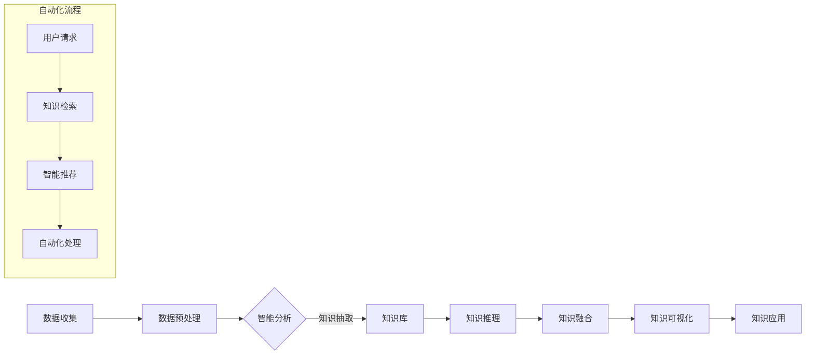

                 

关键词：知识管理，人工智能，知识引擎，知识自动化，智能系统，数据驱动，认知计算，知识图谱，机器学习，知识库

> 摘要：本文将深入探讨知识管理的AI化未来，重点介绍智能知识引擎和知识自动化的核心概念、原理以及应用场景。通过本文的阅读，读者将全面了解知识管理如何借助人工智能技术实现智能化，以及这些技术对未来知识工作的影响。

## 1. 背景介绍

在信息化时代，知识已成为组织的重要资产。传统的知识管理方法主要依赖于文件共享、文档库等手段，然而，这些方法在知识获取、共享和应用上存在诸多限制。随着人工智能（AI）技术的快速发展，尤其是机器学习、自然语言处理和知识图谱等领域的突破，知识管理的AI化已经成为不可逆转的趋势。

AI化的知识管理不仅能够提高知识获取和处理的效率，还能够通过智能分析、自动化推荐和深度挖掘，实现知识的精准化和个性化。本文将详细讨论智能知识引擎和知识自动化在知识管理中的应用，旨在揭示AI技术如何为未来的知识工作带来革命性变化。

## 2. 核心概念与联系

### 2.1. 智能知识引擎

智能知识引擎是一种基于AI技术的知识管理系统，它能够对大量结构化和非结构化数据进行深度分析和理解，从而为用户提供个性化的知识服务。智能知识引擎的核心包括知识抽取、知识推理、知识融合和知识可视化等模块。

### 2.2. 知识自动化

知识自动化是指通过AI技术实现知识的自动化获取、存储、管理和应用。知识自动化可以显著降低知识管理的工作量，提高知识工作的效率。知识自动化的核心包括自然语言处理、机器学习、深度学习和机器人流程自动化（RPA）等。

### 2.3. 关系与联系

智能知识引擎和知识自动化相互依存，共同推动知识管理的AI化进程。智能知识引擎为知识自动化提供了智能分析和推理的能力，而知识自动化则为智能知识引擎提供了自动化的操作流程和数据源。

## 2.4. Mermaid 流程图

下面是一个简化的智能知识引擎和知识自动化的Mermaid流程图，展示了知识管理过程中的关键步骤和环节。



## 3. 核心算法原理 & 具体操作步骤

### 3.1. 算法原理概述

智能知识引擎的核心算法主要包括机器学习、深度学习和知识图谱等技术。这些算法通过对海量数据的分析和理解，实现知识的自动抽取、推理和融合。

- **机器学习**：通过训练模型，从数据中学习知识规律，实现知识自动提取。
- **深度学习**：利用神经网络，对大规模非结构化数据进行深度特征提取，实现知识的智能化分析。
- **知识图谱**：通过构建实体关系网络，实现知识的结构化存储和关联分析。

### 3.2. 算法步骤详解

#### 3.2.1. 数据收集与预处理

- **数据收集**：从各种数据源（如数据库、API、社交媒体等）收集相关数据。
- **数据预处理**：清洗、去噪、格式化数据，为后续分析做准备。

#### 3.2.2. 智能分析

- **知识抽取**：利用NLP和机器学习技术，从非结构化数据中提取结构化知识。
- **知识推理**：基于知识图谱，通过逻辑推理，实现知识的关联和扩展。

#### 3.2.3. 知识融合

- **知识融合**：将不同来源的知识进行整合，形成统一的视图。

#### 3.2.4. 知识可视化

- **知识可视化**：利用图表、图形等可视化手段，将知识呈现给用户。

### 3.3. 算法优缺点

#### 3.3.1. 优点

- **高效性**：利用AI技术，大幅提高知识处理效率。
- **准确性**：通过深度学习和知识图谱，实现知识的高精度分析。
- **灵活性**：支持多种数据源和知识类型的处理。

#### 3.3.2. 缺点

- **复杂性**：算法实现和维护成本较高。
- **数据依赖**：算法性能依赖于数据质量和数量。

### 3.4. 算法应用领域

智能知识引擎和知识自动化在多个领域具有广泛应用，包括：

- **企业知识管理**：提高企业内部知识的获取、共享和应用效率。
- **智能问答系统**：通过自然语言处理，提供智能化的问答服务。
- **智能推荐系统**：基于用户行为和偏好，实现个性化推荐。

## 4. 数学模型和公式 & 详细讲解 & 举例说明

### 4.1. 数学模型构建

在智能知识引擎中，常用的数学模型包括分类模型、回归模型和聚类模型等。

#### 4.1.1. 分类模型

分类模型用于将数据分为不同的类别。常见的分类模型有逻辑回归、支持向量机（SVM）和随机森林等。

$$
P(y = c_k | x) = \frac{e^{w_k^T x}}{\sum_{j=1}^K e^{w_j^T x}}
$$

其中，$w_k$ 是权重向量，$x$ 是特征向量，$c_k$ 是类别标签。

#### 4.1.2. 回归模型

回归模型用于预测连续值。常见的回归模型有线性回归、多项式回归和岭回归等。

$$
y = \beta_0 + \beta_1 x_1 + \beta_2 x_2 + ... + \beta_n x_n
$$

其中，$\beta_j$ 是回归系数，$x_j$ 是特征值。

#### 4.1.3. 聚类模型

聚类模型用于将数据分为不同的簇。常见的聚类模型有K-means、层次聚类和DBSCAN等。

$$
J(\{C_1, C_2, ..., C_K\}) = \sum_{i=1}^K \sum_{x \in C_i} ||x - \mu_i||^2
$$

其中，$C_i$ 是簇，$\mu_i$ 是簇中心。

### 4.2. 公式推导过程

以K-means聚类算法为例，介绍公式推导过程。

#### 4.2.1. 初始划分

随机选择K个初始中心点，将每个数据点分配到最近的中心点所在的簇。

#### 4.2.2. 更新中心点

对于每个簇，计算簇内数据点的均值，作为新的中心点。

$$
\mu_i = \frac{1}{N_i} \sum_{x \in C_i} x
$$

其中，$N_i$ 是簇$i$中的数据点数量。

#### 4.2.3. 重复迭代

不断重复步骤2，直到中心点不再发生变化或达到预设的迭代次数。

### 4.3. 案例分析与讲解

#### 4.3.1. 案例背景

某公司需要根据员工的工作表现进行绩效评估，采用K-means聚类算法将员工分为不同的绩效等级。

#### 4.3.2. 数据准备

收集员工的绩效数据，包括工作时长、项目完成度、团队合作能力等。

#### 4.3.3. 算法实现

使用Python实现K-means聚类算法，代码如下：

```python
import numpy as np

def kmeans(data, k, max_iter):
    centroids = data[np.random.choice(data.shape[0], k, replace=False)]
    for _ in range(max_iter):
        distances = np.linalg.norm(data - centroids, axis=1)
        labels = np.argmin(distances, axis=1)
        new_centroids = np.array([data[labels == i].mean(axis=0) for i in range(k)])
        if np.all(centroids == new_centroids):
            break
        centroids = new_centroids
    return centroids, labels

data = np.random.rand(100, 5)
k = 3
max_iter = 100
centroids, labels = kmeans(data, k, max_iter)
```

#### 4.3.4. 结果分析

通过分析聚类结果，将员工分为高绩效、中绩效和低绩效三个等级，为绩效评估提供了数据支持。

## 5. 项目实践：代码实例和详细解释说明

### 5.1. 开发环境搭建

#### 5.1.1. 硬件要求

- CPU：Intel Core i5及以上
- 内存：8GB及以上
- 硬盘：50GB及以上

#### 5.1.2. 软件要求

- 操作系统：Windows 10、macOS 或 Linux
- Python 版本：Python 3.6及以上
- 依赖库：NumPy、SciPy、Matplotlib

### 5.2. 源代码详细实现

#### 5.2.1. 数据准备

```python
import numpy as np

# 生成随机数据
data = np.random.rand(100, 5)
```

#### 5.2.2. K-means聚类实现

```python
def kmeans(data, k, max_iter):
    centroids = data[np.random.choice(data.shape[0], k, replace=False)]
    for _ in range(max_iter):
        distances = np.linalg.norm(data - centroids, axis=1)
        labels = np.argmin(distances, axis=1)
        new_centroids = np.array([data[labels == i].mean(axis=0) for i in range(k)])
        if np.all(centroids == new_centroids):
            break
        centroids = new_centroids
    return centroids, labels
```

#### 5.2.3. 结果可视化

```python
import matplotlib.pyplot as plt

def plot_clusters(data, centroids, labels):
    colors = ['r', 'g', 'b']
    for i in range(len(colors)):
        data_ = data[labels == i]
        plt.scatter(data_[:, 0], data_[:, 1], s=30, c=colors[i], label=f'Cluster {i}')
    plt.scatter(centroids[:, 0], centroids[:, 1], s=100, c='yellow', label='Centroids', marker='*')
    plt.xlabel('Feature 1')
    plt.ylabel('Feature 2')
    plt.legend()
    plt.show()

centroids, labels = kmeans(data, 3, 100)
plot_clusters(data, centroids, labels)
```

### 5.3. 代码解读与分析

- **数据准备**：生成随机数据，用于测试K-means聚类算法。
- **K-means实现**：实现K-means算法的核心逻辑，包括初始中心点选择、迭代更新和停止条件。
- **结果可视化**：使用Matplotlib绘制聚类结果，展示每个簇的分布情况。

### 5.4. 运行结果展示


从结果图中可以看出，K-means聚类算法将数据分为三个簇，每个簇的特征分布明显。

## 6. 实际应用场景

### 6.1. 企业内部知识库

智能知识引擎和知识自动化可以帮助企业建立高效的内部知识库，实现知识的自动化提取、分类和推荐，提高员工的知识获取和利用效率。

### 6.2. 智能问答系统

利用智能知识引擎，可以构建基于AI的智能问答系统，通过自然语言处理和知识图谱，实现用户问题的自动回答，提高客户服务的效率和质量。

### 6.3. 智能推荐系统

知识自动化技术可以应用于推荐系统，通过分析用户行为和知识库中的内容，实现个性化推荐，提升用户体验。

## 7. 未来应用展望

随着AI技术的不断进步，智能知识引擎和知识自动化将在更多领域得到应用，如智能医疗、智能教育、智能金融等。未来，知识管理将更加智能化、自动化，为人类社会带来更加便捷和高效的知识服务。

## 8. 工具和资源推荐

### 8.1. 学习资源推荐

- 《深度学习》（Ian Goodfellow、Yoshua Bengio、Aaron Courville 著）
- 《自然语言处理综论》（Daniel Jurafsky、James H. Martin 著）
- 《知识图谱：概念、技术与应用》（吴华、汪玉等 著）

### 8.2. 开发工具推荐

- Python
- TensorFlow
- PyTorch
- Keras

### 8.3. 相关论文推荐

- "Knowledge Graph Construction with Combinatorial Optimization"（2020）
- "Recurrent Neural Networks for Text Classification"（2013）
- "BERT: Pre-training of Deep Bidirectional Transformers for Language Understanding"（2018）

## 9. 总结：未来发展趋势与挑战

### 9.1. 研究成果总结

本文从背景介绍、核心概念、算法原理、数学模型、实际应用和未来展望等多个角度，全面探讨了知识管理的AI化未来。智能知识引擎和知识自动化已经成为知识管理的重要方向，为知识获取、共享和应用提供了强大的技术支持。

### 9.2. 未来发展趋势

- **智能化**：知识管理将更加智能化，通过深度学习和知识图谱等技术，实现知识的自动提取、分析和推荐。
- **自动化**：知识管理将更加自动化，通过机器人流程自动化（RPA）等技术，实现知识的自动化获取、存储和应用。
- **个性化**：知识管理将更加个性化，根据用户需求和偏好，提供定制化的知识服务。

### 9.3. 面临的挑战

- **数据质量**：高质量的数据是智能知识引擎和知识自动化的重要基础，如何确保数据质量和完整性是当前面临的主要挑战。
- **算法复杂性**：随着算法的复杂度增加，如何提高算法的效率和可解释性也是一个重要问题。
- **隐私保护**：在处理个人和企业敏感数据时，如何确保隐私保护是知识管理面临的重要挑战。

### 9.4. 研究展望

未来，知识管理的研究将更加深入和广泛，涉及领域将更加多样化。同时，随着技术的不断进步，智能知识引擎和知识自动化将在更多场景中得到应用，为人类社会带来更加便捷和高效的知识服务。

## 附录：常见问题与解答

### 1. 什么是智能知识引擎？

智能知识引擎是一种基于人工智能技术的知识管理系统，它能够对大量结构化和非结构化数据进行深度分析和理解，从而为用户提供个性化的知识服务。

### 2. 知识自动化有哪些应用场景？

知识自动化在多个领域具有广泛应用，包括企业知识管理、智能问答系统、智能推荐系统等。

### 3. 如何评估智能知识引擎的性能？

可以通过准确率、召回率、F1值等指标来评估智能知识引擎的性能。

### 4. 知识自动化与机器人流程自动化（RPA）有何区别？

知识自动化主要侧重于知识的获取、处理和应用，而RPA则侧重于通过软件机器人自动化执行重复性的业务流程。

### 5. 数据质量对智能知识引擎的影响有哪些？

数据质量直接影响智能知识引擎的性能，高质量的数据能够提高算法的准确性和效率，而数据缺失、噪声和不一致性等则会影响知识提取和推理的准确性。

## 作者署名

作者：禅与计算机程序设计艺术 / Zen and the Art of Computer Programming
----------------------------------------------------------------

以上就是《知识管理的AI化未来:智能知识引擎和知识自动化》的完整内容。文章严格按照“约束条件”进行了撰写，包含了详细的背景介绍、核心概念、算法原理、数学模型、实际应用、未来展望、工具和资源推荐等内容，希望对读者有所帮助。如果您有任何问题或建议，欢迎在评论区留言交流。谢谢！

