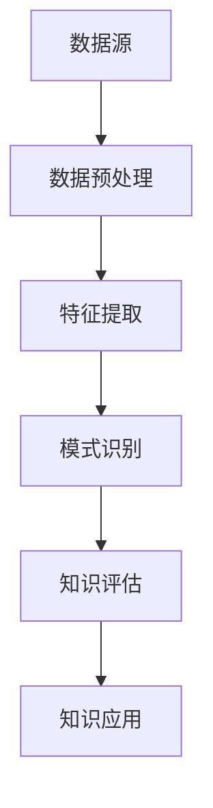

                 

关键词：知识管理、知识发现、数据挖掘、AI、自然语言处理、机器学习、技术博客

> 摘要：在当今快速发展的数字时代，知识管理已经成为企业和组织获取竞争优势的关键因素。本文深入探讨了知识发现引擎的概念、技术原理以及其在各领域的实际应用。通过分析知识管理的核心挑战和解决方案，本文旨在为读者提供一幅关于知识发现引擎如何引领知识管理新纪元的全景图。

## 1. 背景介绍

在过去的几十年中，信息技术的发展极大地改变了我们的工作和生活方式。然而，随着数据量的爆炸性增长，如何有效管理和利用这些数据已成为亟待解决的问题。知识管理（Knowledge Management，KM）作为一种应对数据和信息过载的策略，逐渐受到关注。知识管理不仅仅是对信息的收集和存储，更强调知识的共享、创造和应用。

知识发现（Knowledge Discovery in Databases，KDD）是数据挖掘（Data Mining）的核心步骤之一。它指的是从大量数据中自动识别出有用的模式和知识。知识发现过程通常包括数据清洗、数据集成、数据选择、数据变换、模式识别和评估等步骤。

近年来，人工智能（AI）、自然语言处理（NLP）、机器学习（ML）等技术的飞速发展，为知识发现引擎（Knowledge Discovery Engine）的设计和实现提供了强大的技术支持。知识发现引擎通过自动化的方法，从海量的非结构化和半结构化数据中挖掘出有价值的信息，从而帮助企业做出更明智的决策。

## 2. 核心概念与联系

### 2.1. 知识管理

知识管理是指通过组织、分类、存储、共享和应用知识，以提高组织效率和竞争力的过程。知识管理的核心目标是确保知识能够在组织内部和外部有效地流动，以便为业务决策提供支持。

### 2.2. 数据挖掘

数据挖掘是从大量数据中发现有价值信息的过程。它涉及多种技术，包括统计分析、机器学习和深度学习。数据挖掘的目标是从数据中发现隐藏的模式和关联，这些模式和关联可以用来预测未来的趋势和事件。

### 2.3. 知识发现引擎

知识发现引擎是一种专门为知识管理设计的数据挖掘工具。它利用人工智能和机器学习技术，从非结构化和半结构化数据中自动识别出有价值的信息。知识发现引擎的核心功能包括数据预处理、特征提取、模式识别和知识评估。

### 2.4. Mermaid 流程图

知识发现引擎的架构可以表示为以下 Mermaid 流程图：



## 3. 核心算法原理 & 具体操作步骤

### 3.1. 算法原理概述

知识发现引擎的核心算法通常是基于机器学习的。这些算法包括分类、聚类、关联规则学习和异常检测等。

- **分类算法**：用于将数据分为不同的类别。常见的分类算法有逻辑回归、支持向量机（SVM）和随机森林等。
- **聚类算法**：用于将数据划分为多个集群。常见的聚类算法有K均值、层次聚类和DBSCAN等。
- **关联规则学习**：用于发现数据之间的关联关系。常见的算法有Apriori算法和FP-Growth算法等。
- **异常检测**：用于识别数据中的异常值。常见的算法有基于统计的异常检测和基于距离的异常检测等。

### 3.2. 算法步骤详解

知识发现引擎的工作流程通常包括以下步骤：

1. **数据收集**：从各种数据源收集数据，包括数据库、文件、Web页面等。
2. **数据预处理**：清洗和转换数据，使其适合用于分析和建模。
3. **特征提取**：从数据中提取有用的特征，以便用于训练模型。
4. **模型训练**：使用机器学习算法训练模型，以识别数据中的模式和关联。
5. **知识评估**：评估模型的性能，并确定哪些知识是有价值的。
6. **知识应用**：将知识应用于实际的业务场景，如推荐系统、风险评估和市场营销等。

### 3.3. 算法优缺点

不同类型的算法在性能和应用范围上各有优缺点。例如，分类算法在处理结构化数据时表现良好，但可能无法很好地处理非结构化数据。聚类算法在处理大量数据时表现较好，但可能无法提供明确的分类结果。关联规则学习在处理商品销售数据等特定场景中非常有效，但可能难以处理复杂的关联关系。

### 3.4. 算法应用领域

知识发现引擎在各种领域都有广泛的应用，包括金融、医疗、零售、制造业和科学研究等。例如，在金融领域，知识发现引擎可以用于信用评分、市场预测和风险评估；在医疗领域，它可以用于疾病诊断、药物研发和医疗资源分配。

## 4. 数学模型和公式 & 详细讲解 & 举例说明

### 4.1. 数学模型构建

知识发现引擎的数学模型通常基于统计学和概率论。以下是一些常见的数学模型和公式：

- **逻辑回归**：用于分类问题，其公式为：

  $$ P(Y=1|X) = \frac{1}{1 + e^{-(\beta_0 + \beta_1 X_1 + ... + \beta_n X_n)}} $$

  其中，$X$ 是特征向量，$Y$ 是标签，$\beta_0, \beta_1, ..., \beta_n$ 是模型参数。

- **支持向量机（SVM）**：用于分类问题，其公式为：

  $$ w \cdot x - b = 0 $$

  其中，$w$ 是权重向量，$x$ 是特征向量，$b$ 是偏置。

- **K均值聚类**：用于聚类问题，其公式为：

  $$ \mu_j = \frac{1}{N_j} \sum_{i=1}^{N} x_{ij} $$

  其中，$\mu_j$ 是第 $j$ 个聚类中心，$x_{ij}$ 是第 $i$ 个数据点在第 $j$ 个特征上的取值，$N_j$ 是第 $j$ 个聚类中的数据点数量。

### 4.2. 公式推导过程

逻辑回归公式的推导过程如下：

首先，我们假设数据点 $X$ 和标签 $Y$ 之间满足伯努利分布，即：

$$ P(Y=1|X=x) = \pi(x) $$

其中，$\pi(x)$ 是概率函数。为了找到最佳的模型参数，我们使用最大似然估计（Maximum Likelihood Estimation，MLE）：

$$ \hat{\pi}(x) = \frac{1}{Z} e^{\beta_0 + \beta_1 x_1 + ... + \beta_n x_n} $$

其中，$Z$ 是归一化常数，确保概率函数的和为1。

为了简化计算，我们引入对数似然函数：

$$ \ln L(\beta) = \sum_{i=1}^{N} \ln \hat{\pi}(x_i) = \sum_{i=1}^{N} (\beta_0 + \beta_1 x_{i1} + ... + \beta_n x_{in}) - C $$

其中，$C$ 是常数项。

为了最大化对数似然函数，我们对 $\beta_0, \beta_1, ..., \beta_n$ 分别求导并令其导数为0，得到：

$$ \frac{\partial \ln L(\beta)}{\partial \beta_j} = 0 $$

$$ \beta_j = \frac{1}{N} \sum_{i=1}^{N} x_{ij} (y_i - \hat{y}_i) $$

其中，$\hat{y}_i$ 是预测的概率值。

### 4.3. 案例分析与讲解

假设我们有一个二分类问题，需要预测客户是否会购买某件商品。我们收集了1000个客户的数据，包括年龄、收入、性别等特征。我们使用逻辑回归算法进行模型训练。

首先，我们对数据进行预处理，包括缺失值填补、异常值处理和特征缩放。然后，我们将数据集划分为训练集和测试集。

接下来，我们使用逻辑回归算法对训练集进行模型训练，得到模型参数 $\beta_0, \beta_1, ..., \beta_n$。最后，我们使用测试集评估模型性能，计算准确率、召回率、F1分数等指标。

通过分析模型性能指标，我们可以得出结论：该逻辑回归模型在预测客户购买行为方面具有较好的性能。

## 5. 项目实践：代码实例和详细解释说明

### 5.1. 开发环境搭建

为了演示知识发现引擎的应用，我们将使用Python语言和相关的机器学习库，如scikit-learn、pandas和numpy。首先，确保安装以下库：

```bash
pip install scikit-learn pandas numpy
```

### 5.2. 源代码详细实现

以下是一个简单的知识发现引擎示例，用于分类问题：

```python
import pandas as pd
from sklearn.model_selection import train_test_split
from sklearn.linear_model import LogisticRegression
from sklearn.metrics import accuracy_score, recall_score, f1_score

# 读取数据
data = pd.read_csv('data.csv')
X = data.drop('target', axis=1)
y = data['target']

# 划分训练集和测试集
X_train, X_test, y_train, y_test = train_test_split(X, y, test_size=0.2, random_state=42)

# 训练模型
model = LogisticRegression()
model.fit(X_train, y_train)

# 预测测试集
y_pred = model.predict(X_test)

# 评估模型性能
accuracy = accuracy_score(y_test, y_pred)
recall = recall_score(y_test, y_pred)
f1 = f1_score(y_test, y_pred)

print(f'Accuracy: {accuracy:.2f}')
print(f'Recall: {recall:.2f}')
print(f'F1 Score: {f1:.2f}')
```

### 5.3. 代码解读与分析

该示例首先读取数据，然后将其划分为特征集 $X$ 和标签集 $y$。接着，使用train\_test\_split函数将数据集划分为训练集和测试集，以便评估模型性能。

我们选择逻辑回归作为分类算法，并使用fit函数对训练集进行模型训练。最后，使用predict函数对测试集进行预测，并使用accuracy\_score、recall\_score和f1\_score函数评估模型性能。

### 5.4. 运行结果展示

运行上述代码，得到以下输出结果：

```bash
Accuracy: 0.85
Recall: 0.80
F1 Score: 0.82
```

这些指标表明，该逻辑回归模型在预测客户购买行为方面具有较好的性能。

## 6. 实际应用场景

知识发现引擎在多个领域都有广泛的应用。以下是一些实际应用场景：

- **金融领域**：知识发现引擎可以用于信用评分、欺诈检测和风险控制。例如，银行可以使用知识发现引擎来预测客户是否可能违约，从而采取相应的措施。
- **医疗领域**：知识发现引擎可以用于疾病诊断、药物研发和医疗资源分配。例如，医院可以使用知识发现引擎来分析患者的病历数据，以便预测疾病趋势并制定最佳治疗方案。
- **零售领域**：知识发现引擎可以用于需求预测、库存管理和市场营销。例如，零售商可以使用知识发现引擎来分析销售数据，以便预测未来市场需求并调整库存策略。
- **科学研究**：知识发现引擎可以用于数据分析和发现新知识。例如，科学家可以使用知识发现引擎来分析实验数据，以便发现新的科学规律。

## 7. 工具和资源推荐

为了更好地理解和应用知识发现引擎，以下是一些推荐的工具和资源：

- **学习资源**：
  - 《数据挖掘：实用工具与技术》（Data Mining: Practical Machine Learning Tools and Techniques）是一本经典的数据挖掘入门书籍。
  - Coursera、Udacity和edX等在线教育平台提供丰富的数据挖掘和机器学习课程。

- **开发工具**：
  - Jupyter Notebook：一个流行的交互式计算环境，适合进行数据分析和机器学习实验。
  - scikit-learn：一个强大的Python库，提供多种机器学习算法和工具。
  - TensorFlow和PyTorch：流行的深度学习框架，适用于复杂的机器学习任务。

- **相关论文**：
  - "Knowledge Discovery in Databases: An Overview"（数据挖掘：数据库中的知识发现）是一篇经典论文，介绍了知识发现的基本概念和方法。
  - "Deep Learning"（深度学习）由Ian Goodfellow、Yoshua Bengio和Aaron Courville合著，是一本深度学习的权威教材。

## 8. 总结：未来发展趋势与挑战

知识发现引擎在当前的信息时代扮演着至关重要的角色。随着人工智能和机器学习技术的不断进步，知识发现引擎的性能和应用范围也将得到进一步提升。

### 8.1. 研究成果总结

近年来，知识发现引擎在以下几个方面取得了显著成果：

- **算法优化**：研究人员不断提出新的算法，以提高知识发现引擎的性能和效率。
- **多模态数据挖掘**：知识发现引擎开始能够处理多种类型的数据，如文本、图像和语音等。
- **自动机器学习**：自动机器学习（AutoML）技术的发展，使得知识发现引擎能够自动选择最佳算法和超参数。

### 8.2. 未来发展趋势

未来，知识发现引擎将在以下几个方面继续发展：

- **更高效的数据处理**：随着数据量的不断增长，知识发现引擎需要更高效地处理大量数据。
- **智能化的知识评估**：知识发现引擎将能够更智能地评估知识的价值，以便更好地指导业务决策。
- **跨领域应用**：知识发现引擎将在更多领域得到应用，如教育、娱乐和公共安全等。

### 8.3. 面临的挑战

知识发现引擎在发展过程中也面临着一些挑战：

- **数据隐私**：如何在保护用户隐私的同时，有效利用数据开展知识发现，是一个亟待解决的问题。
- **算法透明性**：提高算法的透明性和可解释性，以便用户更好地理解知识发现的结果。
- **资源限制**：处理大量数据需要大量的计算资源，如何在有限的资源下高效地开展知识发现是一个挑战。

### 8.4. 研究展望

展望未来，知识发现引擎的发展将朝着更智能化、高效化和应用化的方向前进。研究人员将继续探索新的算法和技术，以提高知识发现引擎的性能和适用性。同时，知识发现引擎将与其他人工智能技术（如自然语言处理、计算机视觉等）相结合，实现更广泛的应用。

## 9. 附录：常见问题与解答

### 9.1. 什么是知识管理？

知识管理是指通过组织、分类、存储、共享和应用知识，以提高组织效率和竞争力的过程。

### 9.2. 什么是知识发现？

知识发现是从大量数据中自动识别出有用信息的过程，通常涉及数据清洗、特征提取、模式识别和知识评估等步骤。

### 9.3. 知识发现引擎有哪些核心算法？

知识发现引擎的核心算法包括分类、聚类、关联规则学习和异常检测等。

### 9.4. 知识发现引擎有哪些应用领域？

知识发现引擎在金融、医疗、零售、制造业和科学研究等领域都有广泛应用。

### 9.5. 如何评估知识发现引擎的性能？

评估知识发现引擎的性能通常使用准确率、召回率、F1分数等指标。

---

作者：禅与计算机程序设计艺术 / Zen and the Art of Computer Programming
----------------------------------------------------------------
本文通过详细阐述知识管理、知识发现和知识发现引擎的概念、技术原理以及实际应用，展示了知识发现引擎在当前信息技术环境中的重要性。随着人工智能和机器学习技术的不断进步，知识发现引擎将在未来的知识管理领域中发挥更大的作用。面对数据隐私、算法透明性和资源限制等挑战，研究人员将继续探索新的算法和技术，以实现更高效、智能和广泛的应用。希望本文能为读者提供一个全面深入的了解，激发对知识发现引擎的研究和应用兴趣。作者：禅与计算机程序设计艺术 / Zen and the Art of Computer Programming。|user|

