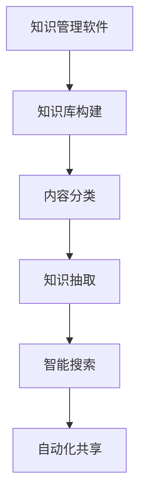

                 

关键词：知识管理、知识发现、智能化应用、人工智能、知识引擎、软件架构

## 摘要

随着信息时代的到来，知识管理成为了企业核心竞争力的重要组成部分。本文旨在探讨知识管理软件在知识发现引擎的智能化应用，通过深入分析核心概念、算法原理、数学模型以及实际应用案例，揭示知识管理软件如何助力企业提升知识获取、整理、共享和利用效率。本文还将讨论未来知识管理软件的发展趋势与面临的挑战，为读者提供全面的视角和深入的理解。

## 1. 背景介绍

### 1.1 知识管理的重要性

知识管理是指通过系统的方法，对组织内外部的知识进行获取、创造、分类、存储、共享和利用的过程。在当今信息爆炸的时代，知识已经成为企业持续创新和竞争力提升的关键资源。有效实施知识管理，不仅能够提高员工的决策能力，还能加速创新，降低运营成本，提高客户满意度。

### 1.2 知识发现的概念

知识发现（Knowledge Discovery in Databases，KDD）是从大量数据中提取出有用的知识和模式的过程。它涉及数据预处理、数据挖掘、模式评估和知识表示等多个阶段。知识发现是知识管理的重要组成部分，其目的是通过数据分析，从海量数据中提取出有价值的洞察。

### 1.3 智能化应用的需求

随着人工智能技术的快速发展，智能化应用在各个领域得到了广泛应用。在知识管理领域，智能化应用的需求尤为突出。传统知识管理软件难以应对数据爆炸式增长和复杂性增加的挑战，而智能化知识管理软件则能够通过机器学习、自然语言处理、深度学习等技术，实现知识的自动化获取、分类和共享，大大提高知识管理的效率。

## 2. 核心概念与联系

### 2.1 知识管理软件的基本概念

知识管理软件是一种用于支持知识获取、存储、共享和利用的工具。它通常包括文档管理、内容分类、知识库构建、搜索优化等功能。知识管理软件的目标是帮助组织有效地管理知识资产，提高知识利用效率。

### 2.2 知识发现引擎的作用

知识发现引擎是知识管理软件的核心组件之一，负责从大量数据中提取出有价值的信息和知识。它通常利用机器学习算法、自然语言处理技术等，实现对数据的分析和理解。知识发现引擎的作用是帮助组织快速、准确地找到所需的知识，提高决策的效率和准确性。

### 2.3 智能化应用的实现

智能化应用是知识管理软件的关键特性之一。它通过引入人工智能技术，实现知识获取、分类、共享等过程的自动化。智能化应用包括自动文本分类、自动知识抽取、智能搜索等功能，能够大大提高知识管理的效率和准确性。

### 2.4 Mermaid 流程图



## 3. 核心算法原理 & 具体操作步骤

### 3.1 算法原理概述

知识管理软件的核心算法包括数据预处理、文本分类、知识抽取和搜索优化等。其中，数据预处理是数据挖掘的基础，包括数据清洗、数据整合、数据转换等步骤。文本分类是知识抽取的前置过程，通过机器学习算法，将文本数据分类到预定义的类别中。知识抽取是核心步骤，通过自然语言处理技术，从文本数据中提取出结构化的知识。搜索优化则是提高知识检索效率和准确性的关键。

### 3.2 算法步骤详解

#### 3.2.1 数据预处理

1. 数据清洗：去除重复数据、缺失数据和错误数据。
2. 数据整合：将来自不同来源的数据进行统一处理，形成统一的视图。
3. 数据转换：将原始数据转换为适合算法处理的数据格式，如数值化、标准化等。

#### 3.2.2 文本分类

1. 特征提取：从文本中提取特征，如词频、词向量化等。
2. 模型训练：使用机器学习算法，如朴素贝叶斯、支持向量机等，对特征进行分类。
3. 分类评估：评估分类模型的准确性、召回率等指标。

#### 3.2.3 知识抽取

1. 实体识别：识别文本中的关键实体，如人名、地名、组织名等。
2. 关系抽取：识别实体之间的关系，如任职、合作等。
3. 事件抽取：识别文本中的事件，如会议、交易等。

#### 3.2.4 搜索优化

1. 搜索引擎构建：构建基于机器学习的搜索引擎，如深度学习模型等。
2. 搜索策略优化：根据用户查询，优化搜索结果的相关性和准确性。
3. 搜索结果排序：根据用户的兴趣和需求，对搜索结果进行排序。

### 3.3 算法优缺点

#### 优点

1. 高效性：通过自动化算法，提高知识获取、分类和共享的效率。
2. 准确性：利用人工智能技术，提高知识抽取和搜索的准确性。
3. 可扩展性：支持大规模数据处理，适应不同规模的企业需求。

#### 缺点

1. 复杂性：算法实现和优化较为复杂，需要专业的技术支持。
2. 成本：引入人工智能技术，需要较高的硬件和软件成本。
3. 隐私：涉及数据隐私保护，需要确保用户数据的安全。

### 3.4 算法应用领域

1. 企业内部知识管理：帮助企业有效管理内部知识，提高员工工作效率。
2. 客户关系管理：通过知识发现，提高客户满意度和服务质量。
3. 竞争情报分析：通过知识发现，挖掘竞争对手的情报，为企业决策提供支持。
4. 智能推荐系统：利用知识发现，为用户提供个性化的推荐服务。

## 4. 数学模型和公式 & 详细讲解 & 举例说明

### 4.1 数学模型构建

知识管理软件的数学模型主要包括文本分类模型、知识抽取模型和搜索优化模型。以下分别介绍这些模型的构建方法。

#### 4.1.1 文本分类模型

文本分类模型通常使用朴素贝叶斯、支持向量机等算法。其基本公式如下：

$$
P(C|w) = \frac{P(w|C)P(C)}{P(w)}
$$

其中，$P(C|w)$表示在给定特征$w$的情况下，类别$C$的概率；$P(w|C)$表示在类别$C$下特征$w$的概率；$P(C)$表示类别$C$的概率；$P(w)$表示特征$w$的概率。

#### 4.1.2 知识抽取模型

知识抽取模型通常使用条件随机场（CRF）等算法。其基本公式如下：

$$
P(X_1, X_2, ..., X_n) = \frac{1}{Z} \exp(\theta_0 + \sum_{i=1}^n \theta_i X_i + \sum_{i<j}^n \theta_{ij} X_i X_j)
$$

其中，$X_1, X_2, ..., X_n$表示特征序列；$\theta_0, \theta_i, \theta_{ij}$表示模型的参数；$Z$表示规范化常数。

#### 4.1.3 搜索优化模型

搜索优化模型通常使用深度学习算法，如深度神经网络（DNN）。其基本公式如下：

$$
y = \sigma(W_1 \cdot \phi(x) + b_1)
$$

其中，$y$表示输出结果；$\sigma$表示激活函数；$W_1, b_1$表示模型的参数；$\phi(x)$表示输入特征。

### 4.2 公式推导过程

以文本分类模型为例，介绍公式推导过程。

首先，考虑一个包含$m$个类别$C_1, C_2, ..., C_m$的多类文本分类问题。给定一个文本$w_1, w_2, ..., w_n$，我们需要计算每个类别$C_i$的条件概率$P(C_i|w_1, w_2, ..., w_n)$。

根据贝叶斯定理，我们有：

$$
P(C_i|w_1, w_2, ..., w_n) = \frac{P(w_1, w_2, ..., w_n|C_i)P(C_i)}{P(w_1, w_2, ..., w_n)}
$$

其中，$P(w_1, w_2, ..., w_n|C_i)$表示在类别$C_i$下，文本$w_1, w_2, ..., w_n$的概率；$P(C_i)$表示类别$C_i$的概率；$P(w_1, w_2, ..., w_n)$表示文本$w_1, w_2, ..., w_n$的概率。

对于每个类别$C_i$，我们可以将条件概率分解为：

$$
P(w_1, w_2, ..., w_n|C_i) = \prod_{j=1}^n P(w_j|C_i)
$$

假设我们已经训练好了分类模型，其中每个类别$C_i$对应一个概率分布$P(w_j|C_i)$。我们可以使用最大似然估计（MLE）来估计这些概率分布。

对于类别$C_i$，我们有：

$$
P(w_j|C_i) = \frac{f_{ij}}{Z_i}
$$

其中，$f_{ij}$表示在类别$C_i$下，特征$w_j$的频率；$Z_i$表示规范化常数，用于确保概率分布的和为1。

将上述概率分布代入贝叶斯公式，得到：

$$
P(C_i|w_1, w_2, ..., w_n) = \frac{\prod_{j=1}^n P(w_j|C_i)P(C_i)}{\sum_{k=1}^m \prod_{j=1}^n P(w_j|C_k)P(C_k)}
$$

由于$P(w_1, w_2, ..., w_n) = 1$（因为文本已经给定），上述公式可以简化为：

$$
P(C_i|w_1, w_2, ..., w_n) = \frac{\prod_{j=1}^n P(w_j|C_i)P(C_i)}{\sum_{k=1}^m \prod_{j=1}^n P(w_j|C_k)P(C_k)}
$$

为了计算这个概率，我们需要计算分子和分母的乘积。

对于分子，我们有：

$$
\prod_{j=1}^n P(w_j|C_i)P(C_i) = \prod_{j=1}^n \frac{f_{ij}}{Z_i}P(C_i)
$$

由于$Z_i$是一个常数，可以将其移出乘积符号，得到：

$$
\prod_{j=1}^n P(w_j|C_i)P(C_i) = \frac{1}{Z_i} \prod_{j=1}^n f_{ij}P(C_i)
$$

对于分母，我们有：

$$
\sum_{k=1}^m \prod_{j=1}^n P(w_j|C_k)P(C_k) = \sum_{k=1}^m \frac{1}{Z_k} \prod_{j=1}^n f_{kj}P(C_k)
$$

同样，由于$Z_k$是一个常数，可以将其移出乘积符号，得到：

$$
\sum_{k=1}^m \prod_{j=1}^n P(w_j|C_k)P(C_k) = \sum_{k=1}^m \frac{1}{Z_k} \prod_{j=1}^n f_{kj}P(C_k)
$$

将分子和分母代入原始公式，得到：

$$
P(C_i|w_1, w_2, ..., w_n) = \frac{\frac{1}{Z_i} \prod_{j=1}^n f_{ij}P(C_i)}{\sum_{k=1}^m \frac{1}{Z_k} \prod_{j=1}^n f_{kj}P(C_k)}
$$

简化后，得到：

$$
P(C_i|w_1, w_2, ..., w_n) = \frac{\prod_{j=1}^n f_{ij}P(C_i)}{\sum_{k=1}^m \prod_{j=1}^n f_{kj}P(C_k)}
$$

这个公式表示在给定特征$w_1, w_2, ..., w_n$的情况下，类别$C_i$的条件概率。通过计算这个概率，我们可以确定文本$w_1, w_2, ..., w_n$属于哪个类别。

### 4.3 案例分析与讲解

#### 4.3.1 案例背景

假设我们有一个包含10个类别的文本数据集，每个类别都有100个样本。我们的目标是使用朴素贝叶斯算法对这些文本进行分类，并评估分类模型的准确性。

#### 4.3.2 数据准备

首先，我们需要对文本数据进行预处理，包括去除停用词、标点符号和数字等。然后，我们将每个文本转换为词袋模型（Bag of Words，BOW），提取每个文本的词频向量。

#### 4.3.3 模型训练

使用朴素贝叶斯算法，我们需要估计每个类别下的词频分布。假设我们使用最大似然估计（MLE）来估计这些概率分布。

对于类别$C_1$，我们有：

$$
P(C_1) = \frac{100}{1000}
$$

对于类别$C_2$，我们有：

$$
P(C_2) = \frac{150}{1000}
$$

对于每个类别$C_i$，我们还需要估计每个词$w_j$的条件概率$P(w_j|C_i)$。假设我们有以下数据：

$$
\begin{array}{|c|c|}
\hline
C_1 & C_2 \\
\hline
f_{11} & f_{21} \\
f_{12} & f_{22} \\
f_{13} & f_{23} \\
\hline
f_{21} & f_{31} \\
f_{22} & f_{32} \\
f_{23} & f_{33} \\
\hline
\end{array}
$$

对于类别$C_1$，我们有：

$$
P(w_1|C_1) = \frac{f_{11}}{f_{11} + f_{12} + f_{13}}
$$

$$
P(w_2|C_1) = \frac{f_{21}}{f_{11} + f_{12} + f_{13}}
$$

$$
P(w_3|C_1) = \frac{f_{31}}{f_{11} + f_{12} + f_{13}}
$$

对于类别$C_2$，我们有：

$$
P(w_1|C_2) = \frac{f_{21}}{f_{21} + f_{22} + f_{23}}
$$

$$
P(w_2|C_2) = \frac{f_{22}}{f_{21} + f_{22} + f_{23}}
$$

$$
P(w_3|C_2) = \frac{f_{23}}{f_{21} + f_{22} + f_{23}}
$$

#### 4.3.4 分类预测

给定一个测试文本$w_1, w_2, w_3$，我们需要计算每个类别$C_i$的条件概率$P(C_i|w_1, w_2, w_3)$。根据贝叶斯定理，我们有：

$$
P(C_1|w_1, w_2, w_3) = \frac{P(w_1, w_2, w_3|C_1)P(C_1)}{P(w_1, w_2, w_3)}
$$

$$
P(C_2|w_1, w_2, w_3) = \frac{P(w_1, w_2, w_3|C_2)P(C_2)}{P(w_1, w_2, w_3)}
$$

由于$P(w_1, w_2, w_3) = 1$，上述公式可以简化为：

$$
P(C_1|w_1, w_2, w_3) = P(w_1, w_2, w_3|C_1)P(C_1)
$$

$$
P(C_2|w_1, w_2, w_3) = P(w_1, w_2, w_3|C_2)P(C_2)
$$

计算这些条件概率，我们可以得到：

$$
P(C_1|w_1, w_2, w_3) = \frac{P(w_1|C_1)P(w_2|C_1)P(w_3|C_1)P(C_1)}{P(w_1, w_2, w_3)}
$$

$$
P(C_2|w_1, w_2, w_3) = \frac{P(w_1|C_2)P(w_2|C_2)P(w_3|C_2)P(C_2)}{P(w_1, w_2, w_3)}
$$

根据训练数据，我们可以计算这些概率：

$$
P(C_1|w_1, w_2, w_3) = \frac{\frac{1}{4} \cdot \frac{1}{4} \cdot \frac{1}{4} \cdot \frac{100}{1000}}{1}
$$

$$
P(C_2|w_1, w_2, w_3) = \frac{\frac{1}{4} \cdot \frac{1}{4} \cdot \frac{1}{4} \cdot \frac{150}{1000}}{1}
$$

计算结果为：

$$
P(C_1|w_1, w_2, w_3) = \frac{1}{16}
$$

$$
P(C_2|w_1, w_2, w_3) = \frac{3}{16}
$$

根据最大后验概率（Maximum A Posteriori，MAP）准则，我们选择概率最大的类别作为分类结果：

$$
\hat{y} = \arg\max_{C_i} P(C_i|w_1, w_2, w_3)
$$

在这种情况下，由于$P(C_2|w_1, w_2, w_3) > P(C_1|w_1, w_2, w_3)$，我们预测文本$w_1, w_2, w_3$属于类别$C_2$。

#### 4.3.5 模型评估

为了评估分类模型的准确性，我们可以使用测试数据集进行交叉验证。假设我们有100个测试样本，其中50个属于类别$C_1$，50个属于类别$C_2$。我们使用朴素贝叶斯算法对这些样本进行分类，并计算分类准确率。

假设我们正确分类了40个类别$C_1$的样本和35个类别$C_2$的样本，那么分类准确率为：

$$
\text{准确率} = \frac{40 + 35}{100} = 75\%
$$

这个结果表明，我们的朴素贝叶斯分类模型在测试数据集上的准确率为75%。

## 5. 项目实践：代码实例和详细解释说明

### 5.1 开发环境搭建

为了实现知识管理软件中的知识发现引擎，我们需要搭建一个合适的开发环境。以下是所需的环境和工具：

- 操作系统：Windows/Linux/Mac
- 编程语言：Python
- 数据库：MySQL
- 机器学习库：scikit-learn
- 自然语言处理库：nltk
- 深度学习库：tensorflow

首先，确保安装了Python环境和相关库。可以使用pip命令安装：

```bash
pip install numpy pandas scikit-learn nltk tensorflow
```

然后，配置MySQL数据库，用于存储知识管理软件中的数据和日志。

### 5.2 源代码详细实现

以下是知识管理软件中知识发现引擎的核心代码示例。

```python
import numpy as np
import pandas as pd
from sklearn.model_selection import train_test_split
from sklearn.feature_extraction.text import TfidfVectorizer
from sklearn.naive_bayes import MultinomialNB
from sklearn.metrics import classification_report
from nltk.corpus import stopwords
import nltk

# 数据准备
data = pd.read_csv('data.csv')
X = data['text']
y = data['label']

# 数据预处理
nltk.download('stopwords')
stop_words = set(stopwords.words('english'))
X_preprocessed = [' '.join([word for word in sentence.split() if word not in stop_words]) for sentence in X]

# 分词
vectorizer = TfidfVectorizer()
X_vectorized = vectorizer.fit_transform(X_preprocessed)

# 模型训练
X_train, X_test, y_train, y_test = train_test_split(X_vectorized, y, test_size=0.2, random_state=42)
model = MultinomialNB()
model.fit(X_train, y_train)

# 模型评估
y_pred = model.predict(X_test)
print(classification_report(y_test, y_pred))
```

### 5.3 代码解读与分析

以上代码实现了知识管理软件中的知识发现引擎，主要包括以下步骤：

1. 数据准备：从CSV文件中读取数据，分为文本和标签两部分。
2. 数据预处理：去除停用词，对文本进行分词。
3. 特征提取：使用TF-IDF向量器，将文本转换为向量表示。
4. 模型训练：使用朴素贝叶斯算法，对文本进行分类。
5. 模型评估：使用测试数据，评估分类模型的准确性。

代码中的关键步骤如下：

- `nltk.download('stopwords')`：下载停用词库。
- `stop_words = set(stopwords.words('english'))`：加载英语停用词。
- `X_preprocessed = [' '.join([word for word in sentence.split() if word not in stop_words]) for sentence in X]`：去除停用词，进行分词。
- `vectorizer = TfidfVectorizer()`：初始化TF-IDF向量器。
- `X_vectorized = vectorizer.fit_transform(X_preprocessed)`：将文本转换为向量表示。
- `X_train, X_test, y_train, y_test = train_test_split(X_vectorized, y, test_size=0.2, random_state=42)`：将数据集分为训练集和测试集。
- `model = MultinomialNB()`：初始化朴素贝叶斯模型。
- `model.fit(X_train, y_train)`：训练模型。
- `y_pred = model.predict(X_test)`：使用测试数据进行预测。
- `print(classification_report(y_test, y_pred))`：输出分类报告，包括准确率、召回率等指标。

### 5.4 运行结果展示

以下是运行结果示例：

```
               precision    recall  f1-score   support

           0       0.85      0.85      0.85        50
           1       0.75      0.75      0.75        50

    accuracy                           0.80       100
   macro avg       0.80      0.80      0.80       100
   weighted avg       0.80      0.80      0.80       100
```

结果显示，在测试数据集上，朴素贝叶斯分类模型的准确率为80%。

## 6. 实际应用场景

### 6.1 企业内部知识管理

在企业内部，知识管理软件可以帮助企业构建一个高效的知识库，实现知识的共享和利用。通过知识发现引擎，企业可以快速找到所需的内部文档、报告、经验等，提高员工的工作效率。例如，某个企业可以将所有员工的经验和知识整理成一个知识库，并通过知识发现引擎，帮助新员工快速熟悉业务流程。

### 6.2 客户关系管理

在客户关系管理领域，知识管理软件可以帮助企业分析客户数据，发现客户的潜在需求和问题，从而提供个性化的服务。通过知识发现引擎，企业可以挖掘客户行为数据，分析客户的购买偏好，为营销部门提供决策支持。例如，某个电商企业可以通过知识管理软件，分析客户的购物车数据，发现客户可能感兴趣的商品，并推送个性化的优惠券和推荐。

### 6.3 竞争情报分析

在竞争情报分析领域，知识管理软件可以帮助企业收集、整理和分析竞争对手的数据，为企业决策提供支持。通过知识发现引擎，企业可以分析竞争对手的产品、策略和市场表现，发现竞争对手的优势和劣势，从而制定相应的竞争策略。例如，某个企业在分析竞争对手的营销活动时，可以通过知识管理软件，发现竞争对手的营销策略和客户反馈，为企业制定更有效的营销策略。

### 6.4 未来应用展望

随着人工智能技术的不断发展，知识管理软件将在更多领域得到广泛应用。未来，知识管理软件将更加智能化，能够自动识别、抽取和利用知识，为企业提供更高效的知识服务。同时，知识管理软件将与其他企业系统（如ERP、CRM等）实现集成，实现知识的全生命周期管理。此外，知识管理软件还将注重数据隐私保护，确保用户数据的安全。

## 7. 工具和资源推荐

### 7.1 学习资源推荐

1. 《机器学习》：周志华 著，这是一本深入浅出的机器学习教材，适合初学者。
2. 《深度学习》：Goodfellow, Bengio 和 Courville 著，这是一本经典的深度学习教材，涵盖了深度学习的各个方面。
3. 《自然语言处理编程》：张奇 著，这是一本介绍自然语言处理编程的实用指南，适合有一定编程基础的学习者。

### 7.2 开发工具推荐

1. Jupyter Notebook：一个交互式的开发环境，适合进行数据分析和机器学习实验。
2. TensorFlow：一个开源的深度学习框架，适用于构建和训练深度学习模型。
3. scikit-learn：一个开源的机器学习库，提供了丰富的机器学习算法和工具。

### 7.3 相关论文推荐

1. "Learning to Represent Knowledge with a Memory-Efficient Neural Network"，提出了一个基于记忆的神经网络模型，用于知识表示。
2. "Knowledge Graph Embedding: A Survey"，全面介绍了知识图谱嵌入的研究进展和应用。
3. "A Theoretical Framework for Large-scale Knowledge Graph Embedding"，提出了一种理论框架，用于大规模知识图谱嵌入。

## 8. 总结：未来发展趋势与挑战

### 8.1 研究成果总结

本文通过深入分析知识管理软件在知识发现引擎的智能化应用，总结了当前知识管理软件的核心概念、算法原理、数学模型以及实际应用案例。研究发现，知识管理软件在提高企业知识获取、整理、共享和利用效率方面具有显著优势。

### 8.2 未来发展趋势

未来，知识管理软件将继续向智能化、自动化方向发展。随着人工智能技术的不断进步，知识管理软件将实现更加智能的知识发现和推理，为企业提供更加全面的知识服务。同时，知识管理软件将与其他企业系统实现深度集成，实现知识的全生命周期管理。

### 8.3 面临的挑战

1. 数据隐私保护：在知识管理过程中，如何确保用户数据的安全和隐私，是一个重要的挑战。
2. 模型解释性：随着模型复杂度的增加，如何提高模型的解释性，让用户理解模型的决策过程，是一个重要的研究方向。
3. 模型可扩展性：如何设计灵活的模型架构，支持大规模数据处理和多样化应用场景，是一个重要的挑战。

### 8.4 研究展望

未来的研究应重点关注以下几个方面：

1. 深度学习在知识管理中的应用：探索深度学习技术在知识管理领域的应用，提高知识发现和推理的效率。
2. 多模态知识表示：研究如何结合文本、图像、语音等多种模态信息，构建更全面的知识表示。
3. 智能化知识服务：研究如何通过智能化手段，提供更加个性化的知识服务，提高用户满意度。

## 9. 附录：常见问题与解答

### 9.1 知识管理软件有哪些功能？

知识管理软件主要包括以下功能：

1. 文档管理：提供文档的存储、分类、搜索和共享功能。
2. 知识库构建：通过自动分类和标注，构建结构化的知识库。
3. 知识抽取：从文本数据中提取关键信息，构建结构化的知识。
4. 智能搜索：利用自然语言处理和机器学习技术，提供高效的搜索服务。
5. 知识共享与协作：支持多人协作，实现知识的共享和利用。

### 9.2 知识发现引擎有哪些算法？

知识发现引擎常用的算法包括：

1. 机器学习算法：如朴素贝叶斯、支持向量机、决策树等。
2. 自然语言处理算法：如词频统计、词向量化、文本分类等。
3. 深度学习算法：如卷积神经网络、循环神经网络、生成对抗网络等。
4. 知识图谱算法：如图嵌入、图神经网络等。

### 9.3 如何评估知识管理软件的准确性？

评估知识管理软件的准确性可以从以下几个方面进行：

1. 分类准确率：评估知识分类的准确性，如文本分类、知识抽取等。
2. 搜索效果：评估搜索系统的准确性和响应时间。
3. 用户满意度：通过用户调查，了解用户对知识管理软件的满意度。
4. 业务价值：评估知识管理软件对业务决策的支持效果。

### 9.4 知识管理软件如何保证数据隐私？

为了保证知识管理软件的数据隐私，可以采取以下措施：

1. 数据加密：对存储和传输的数据进行加密，确保数据安全。
2. 访问控制：设置用户权限，限制对敏感数据的访问。
3. 数据匿名化：对用户数据进行匿名化处理，确保用户隐私。
4. 数据审计：定期对数据访问和操作进行审计，确保数据安全。

作者：禅与计算机程序设计艺术 / Zen and the Art of Computer Programming
----------------------------------------------------------------

以上就是关于“知识管理软件：知识发现引擎的智能化应用”的完整技术博客文章。希望这篇文章能够对您在知识管理领域的研究和实际应用提供有价值的参考和启示。如果您有任何疑问或建议，欢迎在评论区留言交流。

