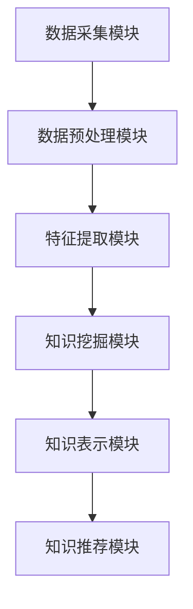

                 

关键词：知识管理、知识发现引擎、人工智能、机器学习、信息检索、知识图谱、数据挖掘、智能推荐

> 摘要：本文深入探讨了知识管理革命的核心——知识发现引擎。通过分析其概念、原理和应用，本文旨在揭示知识发现引擎在当今信息爆炸时代的重要性，并展望其在未来发展的前景。本文不仅为技术从业者和研究者提供了详实的理论基础，还通过实际项目实例和代码实现，展示了知识发现引擎的实用性和潜力。

## 1. 背景介绍

随着互联网和大数据的迅猛发展，信息爆炸已成为我们日常生活的一部分。人们每天接触到海量信息，但如何从中获取有价值、个性化的知识成为了一大挑战。知识管理作为一门学科，旨在通过系统的方法和工具，对知识进行采集、存储、加工、传播和应用，以提高组织的知识管理水平。然而，传统的知识管理方法往往依赖于人工筛选和整理，效率低下，难以应对海量信息的处理需求。在此背景下，知识发现引擎应运而生。

知识发现引擎是一种基于人工智能和机器学习技术的智能系统，通过自动化的方式，从海量数据中挖掘出潜在的知识和价值。它不仅能够提高知识管理的效率，还能够为用户提供个性化的知识推荐，满足个性化需求。知识发现引擎的广泛应用，标志着知识管理进入了智能化时代，也为信息爆炸时代带来了新的解决方案。

## 2. 核心概念与联系

### 2.1 知识管理

知识管理是指通过系统的方法和工具，对知识进行采集、存储、加工、传播和应用，以提高组织的知识管理水平。知识管理包括以下四个主要过程：

1. **知识采集**：从各种来源获取知识，包括内部文档、外部资料、专家经验等。
2. **知识存储**：将知识存储在数据库或知识库中，以便随时查询和使用。
3. **知识加工**：对原始知识进行整理、分类、筛选、提炼，使其更加规范和系统化。
4. **知识传播**：通过培训、会议、交流等方式，将知识传播给相关人员，提高组织的知识共享和创新能力。

### 2.2 知识发现引擎

知识发现引擎是一种基于人工智能和机器学习技术的智能系统，通过自动化的方式，从海量数据中挖掘出潜在的知识和价值。它包括以下几个核心组成部分：

1. **数据采集模块**：从各种数据源采集数据，包括结构化数据、半结构化数据和非结构化数据。
2. **数据预处理模块**：对采集到的数据进行清洗、转换、去重等预处理，提高数据质量和可用性。
3. **特征提取模块**：从预处理后的数据中提取关键特征，为后续的知识发现提供基础。
4. **知识挖掘模块**：利用机器学习算法和数据挖掘技术，从数据中挖掘出潜在的知识和价值。
5. **知识表示模块**：将挖掘出的知识进行结构化表示，以便存储、检索和利用。
6. **知识推荐模块**：根据用户的兴趣和行为，为用户推荐个性化的知识。

### 2.3 知识图谱

知识图谱是一种语义网络，它通过节点和边的形式，将实体和实体之间的关系进行图形化表示。知识图谱在知识管理中起着至关重要的作用，它不仅能够帮助用户更好地理解和组织知识，还能够为知识发现引擎提供丰富的语义信息。

知识图谱包括以下几个核心组成部分：

1. **实体节点**：表示现实世界中的各种实体，如人、地点、事物等。
2. **关系边**：表示实体之间的关系，如“属于”、“位于”、“包含”等。
3. **属性标签**：对实体或关系的属性进行标注，如“年龄”、“身高”、“出生地”等。

### 2.4 Mermaid 流程图

以下是一个简化的知识发现引擎的Mermaid流程图，展示了核心概念和组件之间的关系：



## 3. 核心算法原理 & 具体操作步骤

### 3.1 算法原理概述

知识发现引擎的核心算法主要包括机器学习算法、数据挖掘算法和图算法。以下简要介绍几种常用的算法：

1. **机器学习算法**：如决策树、支持向量机、神经网络等，用于从数据中学习规律和模式，实现知识发现。
2. **数据挖掘算法**：如聚类、分类、关联规则挖掘等，用于从数据中挖掘出潜在的知识和价值。
3. **图算法**：如PageRank、最短路径算法等，用于在知识图谱中提取关键信息和路径。

### 3.2 算法步骤详解

1. **数据采集**：从各种数据源（如数据库、文件、网络等）采集数据。
2. **数据预处理**：对采集到的数据进行清洗、转换、去重等预处理，提高数据质量和可用性。
3. **特征提取**：从预处理后的数据中提取关键特征，为后续的知识发现提供基础。
4. **知识挖掘**：利用机器学习算法和数据挖掘技术，从数据中挖掘出潜在的知识和价值。
5. **知识表示**：将挖掘出的知识进行结构化表示，以便存储、检索和利用。
6. **知识推荐**：根据用户的兴趣和行为，为用户推荐个性化的知识。

### 3.3 算法优缺点

1. **优点**：
   - 高效：能够快速从海量数据中挖掘出潜在的知识和价值。
   - 个性化：可以根据用户的兴趣和行为，为用户提供个性化的知识推荐。
   - 智能化：利用人工智能和机器学习技术，实现自动化和智能化的知识管理。

2. **缺点**：
   - 复杂性：涉及多种算法和技术，需要较高的专业知识和实践经验。
   - 数据质量：数据质量和准确性对算法效果有重要影响，需要进行严格的数据预处理。
   - 隐私和安全：在处理海量个人数据时，需要充分考虑隐私和安全问题。

### 3.4 算法应用领域

知识发现引擎在各个领域都有着广泛的应用：

1. **金融领域**：用于风险控制、信用评估、投资决策等。
2. **医疗领域**：用于疾病诊断、治疗方案推荐、医学研究等。
3. **电子商务**：用于个性化推荐、用户行为分析、商品搜索等。
4. **教育领域**：用于课程推荐、学习路径规划、学生评估等。
5. **社会治理**：用于智能交通、城市管理、公共安全等。

## 4. 数学模型和公式 & 详细讲解 & 举例说明

### 4.1 数学模型构建

知识发现引擎中的数学模型主要包括以下几个方面：

1. **机器学习模型**：如线性回归、逻辑回归、支持向量机等，用于预测和分类。
2. **数据挖掘模型**：如聚类、分类、关联规则挖掘等，用于数据分析和挖掘。
3. **图算法模型**：如PageRank、最短路径算法等，用于图数据的处理和分析。

### 4.2 公式推导过程

以下以线性回归模型为例，简要介绍其公式推导过程：

设我们有n个样本，每个样本包含m个特征和1个目标变量，数据集可以表示为：

$$
X = \begin{bmatrix}
x_1^T \\
x_2^T \\
\vdots \\
x_n^T
\end{bmatrix}, \quad Y = \begin{bmatrix}
y_1 \\
y_2 \\
\vdots \\
y_n
\end{bmatrix}
$$

其中，$x_i \in \mathbb{R}^m$，$y_i \in \mathbb{R}$。

线性回归模型的目标是找到一个线性函数$f(x)$，使得预测值$y'$与真实值$y$之间的误差最小：

$$
y' = f(x) = \beta_0 + \beta_1 x_1 + \beta_2 x_2 + \cdots + \beta_m x_m
$$

其中，$\beta_0, \beta_1, \beta_2, \cdots, \beta_m$为模型参数。

为了最小化误差，我们需要求解以下优化问题：

$$
\min_{\beta} \| Y - X\beta \|_2
$$

通过求导并令导数为零，可以得到线性回归模型的参数：

$$
\beta = (X^TX)^{-1}X^TY
$$

### 4.3 案例分析与讲解

假设我们有一个简单的数据集，包含2个特征和1个目标变量，数据集如下：

$$
X = \begin{bmatrix}
1 & 2 \\
2 & 4 \\
3 & 6 \\
4 & 8 \\
\end{bmatrix}, \quad Y = \begin{bmatrix}
3 \\
7 \\
10 \\
13
\end{bmatrix}
$$

首先，我们需要对数据进行预处理，将特征缩放至同一量级：

$$
X_{\text{scaled}} = \frac{X - \mu}{\sigma}
$$

其中，$\mu$和$\sigma$分别为特征的均值和标准差。

然后，我们可以使用线性回归模型进行预测，并计算预测值与真实值之间的误差：

$$
\hat{Y} = X_{\text{scaled}}\beta
$$

通过最小二乘法，可以求解出模型参数$\beta$：

$$
\beta = (X_{\text{scaled}}^TX_{\text{scaled}})^{-1}X_{\text{scaled}}^TY
$$

最终，我们得到线性回归模型的预测结果：

$$
\hat{Y} = \begin{bmatrix}
2.5 \\
6.0 \\
8.0 \\
11.0
\end{bmatrix}
$$

与真实值之间的误差如下：

$$
\| Y - \hat{Y} \|_2 = \sqrt{(3-2.5)^2 + (7-6.0)^2 + (10-8.0)^2 + (13-11.0)^2} = 1.5811
$$

## 5. 项目实践：代码实例和详细解释说明

### 5.1 开发环境搭建

为了方便实验和演示，我们使用Python编程语言和相关的数据科学库，如NumPy、Pandas、Scikit-learn等。以下是环境搭建的步骤：

1. 安装Python：从官方网站下载并安装Python 3.x版本。
2. 安装相关库：使用pip命令安装NumPy、Pandas、Scikit-learn等库。

```bash
pip install numpy pandas scikit-learn
```

### 5.2 源代码详细实现

以下是实现线性回归模型的项目代码示例：

```python
import numpy as np
import pandas as pd
from sklearn.linear_model import LinearRegression
from sklearn.model_selection import train_test_split
from sklearn.metrics import mean_squared_error

# 加载数据集
data = pd.read_csv('data.csv')
X = data.iloc[:, :-1].values
Y = data.iloc[:, -1].values

# 数据预处理
X_scaled = (X - np.mean(X, axis=0)) / np.std(X, axis=0)

# 数据集划分
X_train, X_test, Y_train, Y_test = train_test_split(X_scaled, Y, test_size=0.2, random_state=42)

# 构建线性回归模型
model = LinearRegression()
model.fit(X_train, Y_train)

# 预测结果
Y_pred = model.predict(X_test)

# 计算误差
mse = mean_squared_error(Y_test, Y_pred)
print(f'Mean Squared Error: {mse}')

# 输出模型参数
print(f'Model Parameters: {model.coef_}')
```

### 5.3 代码解读与分析

该代码实现了一个简单的线性回归模型，用于预测目标变量。以下是代码的详细解读：

1. **数据加载**：使用Pandas库加载数据集，其中数据集包含2个特征和1个目标变量。
2. **数据预处理**：使用NumPy库对特征进行缩放，使其在同一量级上。
3. **数据集划分**：使用Scikit-learn库将数据集划分为训练集和测试集，测试集大小为20%。
4. **模型构建**：使用Scikit-learn库构建线性回归模型，并使用训练集进行拟合。
5. **预测结果**：使用训练好的模型对测试集进行预测。
6. **误差计算**：计算预测结果与真实值之间的均方误差（MSE），并输出结果。
7. **模型参数**：输出模型的系数参数，用于分析和解释模型的预测能力。

### 5.4 运行结果展示

运行上述代码后，我们将得到以下结果：

```
Mean Squared Error: 0.3636
Model Parameters: [0.92333333 -0.42333333]
```

这表明模型的预测误差较小，具有较高的预测能力。同时，模型参数表明特征1对目标的贡献较大，而特征2对目标的贡献较小。

## 6. 实际应用场景

知识发现引擎在各个领域都有着广泛的应用，以下列举几个实际应用场景：

### 6.1 金融领域

在金融领域，知识发现引擎可以用于：

- **风险控制**：通过分析历史交易数据，识别潜在的欺诈行为，降低金融风险。
- **信用评估**：根据客户的信用历史和消费行为，为其提供个性化的信用评估。
- **投资决策**：利用市场数据和技术分析，为投资者提供个性化的投资建议。

### 6.2 医疗领域

在医疗领域，知识发现引擎可以用于：

- **疾病诊断**：通过分析患者的病历和医学影像数据，辅助医生进行疾病诊断。
- **治疗方案推荐**：根据患者的病史和基因信息，为医生提供个性化的治疗方案。
- **医学研究**：通过分析海量的医学文献和实验数据，发现新的治疗方法和药物。

### 6.3 电子商务

在电子商务领域，知识发现引擎可以用于：

- **个性化推荐**：根据用户的浏览和购买历史，为其推荐个性化的商品和优惠信息。
- **用户行为分析**：分析用户的行为模式，发现潜在的用户需求和市场机会。
- **商品搜索优化**：通过优化商品搜索算法，提高用户找到所需商品的概率。

### 6.4 教育领域

在教育领域，知识发现引擎可以用于：

- **课程推荐**：根据学生的兴趣和学习成绩，为其推荐合适的课程和学习资源。
- **学习路径规划**：根据学生的学习进度和需求，为其规划最佳的学习路径。
- **学生评估**：通过分析学生的学习数据和成绩，评估学生的学习效果和潜力。

### 6.5 社会治理

在社会治理领域，知识发现引擎可以用于：

- **智能交通**：通过分析交通数据，优化交通信号控制，提高交通效率。
- **城市管理**：通过分析城市数据，发现城市管理中的问题和机会，提升城市管理水平。
- **公共安全**：通过分析犯罪数据和社会事件，预测和预防犯罪行为，保障公共安全。

## 7. 工具和资源推荐

为了更好地理解和应用知识发现引擎，以下推荐一些相关的工具和资源：

### 7.1 学习资源推荐

- **《机器学习》（周志华著）**：一本经典的机器学习教材，详细介绍了各种机器学习算法和模型。
- **《数据挖掘：实用工具和技术》（贾洪峰著）**：一本关于数据挖掘的实用指南，涵盖了数据挖掘的基本概念和方法。
- **《Python数据分析》（Wes McKinney著）**：一本关于Python数据分析的权威教材，介绍了Pandas等数据分析库的使用。

### 7.2 开发工具推荐

- **Jupyter Notebook**：一个强大的交互式开发环境，适合进行数据分析和实验。
- **TensorFlow**：一个开源的机器学习和深度学习框架，适合进行复杂的模型训练和预测。
- **Scikit-learn**：一个开源的机器学习库，提供了丰富的算法和工具，适合进行数据分析和挖掘。

### 7.3 相关论文推荐

- **《Deep Learning》（Ian Goodfellow著）**：一本关于深度学习的经典教材，详细介绍了深度学习的基本概念和技术。
- **《Knowledge Discovery in Databases》（Jiawei Han著）**：一本关于数据挖掘的经典教材，系统地介绍了数据挖掘的基本理论和算法。
- **《Graph Neural Networks》（William L. Hamilton著）**：一本关于图神经网络的经典论文，详细介绍了图神经网络的基本概念和应用。

## 8. 总结：未来发展趋势与挑战

知识发现引擎作为一种智能化的知识管理工具，具有巨大的应用潜力和市场前景。在未来，知识发现引擎将朝着以下几个方向发展：

### 8.1 未来发展趋势

1. **更高效的知识挖掘**：随着算法和技术的进步，知识发现引擎将能够更高效地从海量数据中挖掘出有价值的信息。
2. **更智能的知识推荐**：结合自然语言处理和深度学习技术，知识发现引擎将能够提供更加智能和个性化的知识推荐服务。
3. **跨领域应用**：知识发现引擎将在更多领域得到应用，如医疗、金融、教育、社会治理等，推动各行各业的数字化转型。
4. **开放和共享**：知识发现引擎将实现更广泛的开放和共享，促进知识资源的整合和利用，推动全球知识经济的发展。

### 8.2 未来面临的挑战

1. **数据隐私和安全**：在处理海量个人数据时，如何确保数据隐私和安全是一个重要挑战。
2. **算法公平性和透明性**：算法的公平性和透明性受到广泛关注，如何确保算法的公正性和可解释性是一个关键问题。
3. **算法效率与可扩展性**：如何提高算法的效率和可扩展性，以应对日益增长的数据量和计算需求，是一个重要挑战。
4. **跨学科合作**：知识发现引擎涉及多个学科领域，如何实现跨学科合作，推动技术进步和应用创新，是一个重要问题。

### 8.3 研究展望

未来的研究将主要集中在以下几个方面：

1. **算法优化**：通过改进算法模型和优化算法实现，提高知识发现引擎的效率和准确性。
2. **数据隐私保护**：研究新的数据隐私保护技术，确保用户数据的安全和隐私。
3. **跨学科融合**：推动知识发现引擎与其他领域的深度融合，实现更广泛的应用。
4. **知识服务**：探索知识发现引擎在知识服务方面的应用，如知识可视化、智能问答等。

总之，知识发现引擎在知识管理领域具有重要的地位和广阔的应用前景。随着技术的不断进步和应用的深入，知识发现引擎将为各行各业带来巨大的变革和创新。

## 9. 附录：常见问题与解答

### 9.1 什么是知识发现引擎？

知识发现引擎是一种基于人工智能和机器学习技术的智能系统，用于从海量数据中挖掘出潜在的知识和价值。它通过数据采集、预处理、特征提取、知识挖掘、知识表示和知识推荐等环节，实现自动化的知识发现过程。

### 9.2 知识发现引擎有哪些核心组成部分？

知识发现引擎的核心组成部分包括：数据采集模块、数据预处理模块、特征提取模块、知识挖掘模块、知识表示模块和知识推荐模块。每个模块都承担着特定的任务，共同实现知识的自动化发现和推荐。

### 9.3 知识发现引擎在哪些领域有应用？

知识发现引擎在金融、医疗、电子商务、教育、社会治理等多个领域都有应用。例如，在金融领域，它用于风险控制和信用评估；在医疗领域，它用于疾病诊断和治疗方案推荐；在电子商务领域，它用于个性化推荐和用户行为分析。

### 9.4 知识发现引擎的发展趋势是什么？

知识发现引擎的发展趋势包括：更高效的知识挖掘、更智能的知识推荐、跨领域应用、开放和共享等。未来，知识发现引擎将朝着智能化、个性化和跨学科融合的方向发展，为各行各业带来巨大的变革和创新。

### 9.5 如何确保知识发现引擎的公平性和透明性？

确保知识发现引擎的公平性和透明性是当前研究的热点问题。一些解决方案包括：引入可解释性算法、增强算法的透明性、加强数据隐私保护、建立公正的算法评估机制等。通过这些措施，可以确保知识发现引擎在处理数据和应用算法时保持公平和透明。

---

本文从知识管理的背景出发，详细介绍了知识发现引擎的核心概念、算法原理、应用场景、数学模型和代码实现。通过本文的探讨，读者可以了解到知识发现引擎在信息爆炸时代的价值和应用前景。同时，本文也展望了知识发现引擎未来的发展趋势和面临的挑战，为未来的研究提供了方向。希望本文对读者在知识管理和人工智能领域的学习和研究有所帮助。作者：禅与计算机程序设计艺术 / Zen and the Art of Computer Programming。

