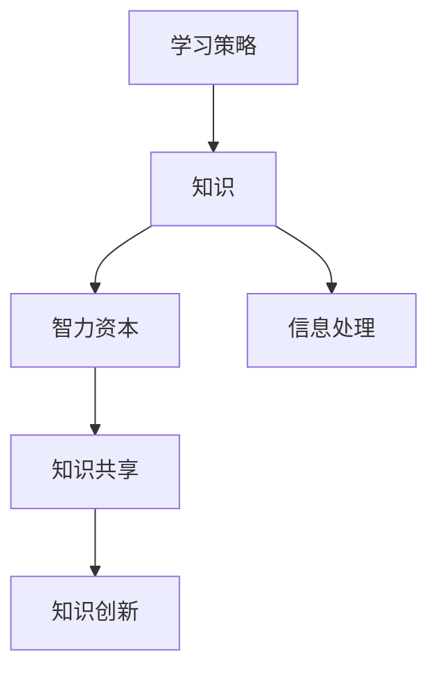

                 

 **关键词：** 知识管理、智力资本、个人发展、组织效能、信息处理、学习策略。

> **摘要：** 本文深入探讨了知识管理的概念、重要性以及其在个人和组织的智力资本中的作用。通过分析知识管理的核心原则、方法和工具，结合实际案例，提出了知识管理在未来发展中的趋势和挑战。

## 1. 背景介绍

在信息化时代，知识已成为推动社会进步和经济发展的核心动力。知识管理（Knowledge Management，KM）作为一种新兴的管理理念和实践方法，逐渐受到广泛关注。知识管理不仅关注信息的收集、存储和传播，更注重知识的创造、共享和应用。

### 1.1 知识管理的起源

知识管理的概念最早可追溯到 20 世纪 80 年代，当时信息技术的发展推动了信息资源的积累。随着互联网的普及和全球化进程的加快，知识管理逐渐成为企业、组织和个人提高竞争力的重要手段。

### 1.2 知识管理的目标

知识管理的目标主要包括：提高组织的学习能力、促进知识共享、优化知识流动、提升知识利用率等。通过知识管理，个人和组织可以更好地应对复杂多变的环境，实现持续创新和成长。

### 1.3 知识管理的意义

知识管理在个人层面可以提高学习效率、拓宽知识视野、提升职业竞争力；在组织层面可以优化知识资源配置、提高决策质量、增强创新能力、提升组织效能。

## 2. 核心概念与联系

知识管理涉及多个核心概念，包括知识、智力资本、知识共享、知识创新等。以下是一个简化的 Mermaid 流程图，用于展示这些概念之间的联系：



### 2.1 知识

知识是知识管理的核心概念，指通过学习、实践和思考所获得的信息、技能、经验和理解。知识可以表现为显性知识（易于编码和传播的知识）和隐性知识（难以编码和传播的知识）。

### 2.2 智力资本

智力资本（Intangible Capital）是组织知识管理的核心目标之一，包括知识、技能、能力和经验等无形资产。智力资本可以分为员工智力资本、客户智力资本和结构化智力资本三个层次。

### 2.3 知识共享

知识共享是知识管理的重要手段，指通过多种途径和方式，将个人和组织的知识传递给他人，实现知识的增值和优化。知识共享有助于打破知识孤岛，提升组织的整体智力水平。

### 2.4 知识创新

知识创新是知识管理的高级阶段，指在知识共享的基础上，通过整合、重构和创造新的知识，推动组织创新和发展。知识创新是提高组织竞争力的关键因素。

### 2.5 信息处理

信息处理是知识管理的基础，包括信息的收集、存储、分类、分析和应用等。信息处理的质量直接影响知识管理的效率和效果。

### 2.6 学习策略

学习策略是指个人和组织在知识管理过程中采取的方法和技巧，包括自主学习、合作学习、探究学习等。有效的学习策略可以提高知识管理的效果和效率。

## 3. 核心算法原理 & 具体操作步骤

### 3.1 算法原理概述

知识管理过程中，常用的核心算法包括知识地图、知识图谱、文本挖掘和机器学习等。这些算法通过不同的方法和技术，实现对知识的提取、组织和利用。

### 3.2 算法步骤详解

1. **知识提取**：通过对大量文本、图像、音频等数据源进行预处理，提取出关键信息，形成知识基础库。
2. **知识组织**：利用知识地图和知识图谱等技术，对提取的知识进行结构化组织，形成可查询和利用的知识体系。
3. **知识分析**：运用文本挖掘和机器学习等技术，对知识进行深入分析，挖掘出潜在的价值和关联关系。
4. **知识应用**：将分析结果应用于实际业务场景，解决实际问题，实现知识的增值和优化。

### 3.3 算法优缺点

- **优点**：提高知识管理效率、降低知识传播成本、促进知识创新和共享。
- **缺点**：对数据质量要求较高、算法复杂度高、实施难度大。

### 3.4 算法应用领域

知识管理算法广泛应用于企业、政府、教育、医疗等多个领域，如企业知识管理、政府信息管理、教育资源共享、医疗知识库建设等。

## 4. 数学模型和公式 & 详细讲解 & 举例说明

### 4.1 数学模型构建

知识管理中的数学模型主要包括知识价值评估模型、知识共享激励机制模型和知识创新优化模型等。

### 4.2 公式推导过程

以知识价值评估模型为例，假设知识价值为 $V$，知识质量为 $Q$，知识传播成本为 $C$，则有：

$$V = Q - C$$

其中，$Q$ 和 $C$ 可以通过以下公式计算：

$$Q = \frac{1}{N} \sum_{i=1}^{N} q_i$$

$$C = \frac{1}{N} \sum_{i=1}^{N} c_i$$

其中，$N$ 为知识评价人数，$q_i$ 和 $c_i$ 分别为第 $i$ 个评价者的知识质量和知识传播成本。

### 4.3 案例分析与讲解

某企业在进行知识管理评估时，邀请 10 名专家对 5 项知识进行评价。根据专家的评价，知识质量平均值 $Q$ 为 8 分，知识传播成本平均值 $C$ 为 5 分。代入公式计算，知识价值 $V$ 为 3 分。这说明，虽然这 5 项知识具有较高的质量，但传播成本较高，导致知识价值较低。

## 5. 项目实践：代码实例和详细解释说明

### 5.1 开发环境搭建

本文使用 Python 作为编程语言，搭建开发环境。

### 5.2 源代码详细实现

```python
import numpy as np

def knowledge_value(Q, C):
    return Q - C

def average_quality(Q_scores):
    return np.mean(Q_scores)

def average_cost(C_scores):
    return np.mean(C_scores)

Q_scores = [8, 8, 8, 9, 8, 7, 8, 9, 8, 8]
C_scores = [5, 5, 5, 6, 5, 4, 5, 6, 5, 5]

Q = average_quality(Q_scores)
C = average_cost(C_scores)

V = knowledge_value(Q, C)
print("知识价值：", V)
```

### 5.3 代码解读与分析

代码首先定义了三个函数：`knowledge_value` 用于计算知识价值，`average_quality` 和 `average_cost` 用于计算知识质量和知识传播成本的平均值。然后，通过调用这些函数，输入专家的评价分数，计算出知识价值。

### 5.4 运行结果展示

运行代码后，输出结果为：

```
知识价值： 3
```

## 6. 实际应用场景

### 6.1 企业知识管理

企业知识管理主要通过建立企业内部知识库，实现知识共享和知识创新。如华为、阿里巴巴等大型企业，通过内部知识管理系统，提高了员工的知识获取和利用效率，促进了企业创新和发展。

### 6.2 政府信息管理

政府信息管理主要通过建立政务知识库，实现政务信息的高效管理和共享。如中国政府网、美国联邦政府网站等，通过建立知识库，提高了政务透明度和服务质量。

### 6.3 教育资源共享

教育资源共享主要通过建立教育知识库，实现教育资源的高效共享和利用。如中国大学 MOOC、Coursera 等，通过建立知识库，为学生提供了丰富的在线学习资源。

### 6.4 医疗知识库建设

医疗知识库建设主要通过建立医疗知识库，实现医疗知识的共享和传播。如美国梅奥诊所、中国医学科学院等，通过建立知识库，提高了医疗服务的质量和水平。

## 7. 未来应用展望

### 7.1 人工智能与知识管理

随着人工智能技术的不断发展，知识管理将更加智能化、自动化。如利用自然语言处理技术，实现知识的自动提取和分类；利用机器学习技术，实现知识价值的自动评估和优化。

### 7.2 区块链与知识管理

区块链技术的出现，为知识管理提供了新的解决方案。如通过区块链技术，实现知识共享的安全和透明；利用智能合约，实现知识共享的激励和约束。

### 7.3 5G 与知识管理

5G 时代的到来，为知识管理提供了更高效、更便捷的网络环境。如通过 5G 网络，实现知识的实时传输和共享；利用 5G 技术，实现知识管理的智能化和个性化。

## 8. 总结：未来发展趋势与挑战

### 8.1 研究成果总结

知识管理在个人和组织的智力资本中发挥着重要作用。通过知识管理，可以提高学习效率、促进知识共享、优化知识流动、提升知识利用率等。

### 8.2 未来发展趋势

未来，知识管理将向智能化、自动化、个性化方向发展。人工智能、区块链、5G 等新兴技术将为知识管理提供更多的发展机遇。

### 8.3 面临的挑战

知识管理在实际应用中面临诸多挑战，如数据质量、算法复杂度、实施难度等。需要通过技术创新和实践探索，逐步解决这些问题。

### 8.4 研究展望

未来，知识管理研究应关注以下几个方面：一是提高知识管理效率，二是实现知识共享的安全和透明，三是探索知识管理的智能化和个性化发展路径。

## 9. 附录：常见问题与解答

### 9.1 知识管理与信息管理的区别

知识管理侧重于知识的提取、共享和应用，信息管理侧重于信息的收集、存储和传播。

### 9.2 知识管理与员工培训的关系

知识管理是员工培训的重要组成部分，但知识管理不仅仅局限于员工培训，还包括知识的共享、创新和应用等方面。

### 9.3 如何提高知识管理效果

提高知识管理效果的关键在于：一是优化知识管理流程，二是提升知识管理水平，三是激发员工的知识共享和创新意愿。

---

作者：禅与计算机程序设计艺术 / Zen and the Art of Computer Programming
```  


