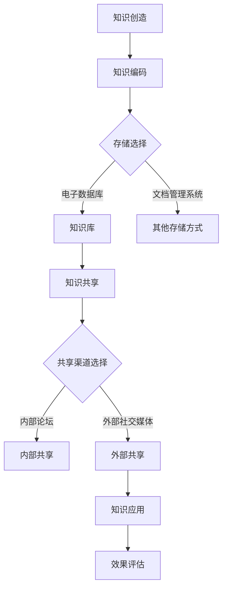

                 

 在当今这个快速变化的时代，知识已经成为了组织最具竞争力的资产之一。如何有效地管理知识，并将其转化为组织发展的动力，是每个企业、机构乃至个人都需要面对的挑战。本文将围绕知识管理这一主题，探讨如何构建有效的知识管理体系，实现知识的有效积累、共享和应用。

## 文章关键词

- 知识管理
- 知识积累
- 知识共享
- 知识应用
- 知识体系

## 文章摘要

本文将从知识管理的背景出发，介绍知识管理的核心概念和原理，探讨知识管理的具体操作步骤和方法，并通过实际案例和数学模型进行分析，最后对知识管理的未来应用和发展趋势进行展望。

## 1. 背景介绍

在过去的几十年中，信息技术的发展极大地推动了知识的积累和传播。随着互联网的普及，知识的获取和分享变得更加便捷。然而，与此同时，我们也面临着知识碎片化、信息过载等问题。如何从海量信息中筛选出有价值的知识，并将其有效组织和管理，成为了亟待解决的问题。

知识管理（Knowledge Management，简称KM）正是为了解决这一问题而提出的。知识管理是一种通过系统化方法收集、整理、共享和利用知识的过程，其目标是将分散的知识资源转化为组织的核心竞争力。

### 1.1 知识管理的重要性

首先，知识管理可以提高组织的创新能力。通过有效管理知识，组织可以快速获取和利用内外部知识，促进创新思维的产生和碰撞。

其次，知识管理可以提升组织的协作效率。知识共享和协作可以消除部门间的壁垒，促进团队间的沟通和合作，提高整体工作效率。

最后，知识管理可以增强组织的竞争力。通过有效管理知识，组织可以保持持续的创新能力和市场竞争力，实现长期可持续发展。

### 1.2 知识管理的挑战

尽管知识管理的重要性日益凸显，但实际操作中仍然面临着诸多挑战。首先是如何确保知识的准确性和可靠性。其次是如何在保护知识隐私的同时，实现知识的最大化共享。最后是如何在变化多端的市场环境中，快速响应和调整知识管理策略。

## 2. 核心概念与联系

### 2.1 知识类型

在知识管理中，我们通常将知识分为以下几类：

- **显性知识（Explicit Knowledge）**：易于表达和传播的知识，如文档、数据、报告等。
- **隐性知识（Tacit Knowledge）**：难以表达和传播的知识，通常存在于人的头脑中，如经验、技能、直觉等。

### 2.2 知识生命周期

知识从产生到应用的整个过程可以视为一个生命周期，主要包括以下阶段：

- **知识创造**：通过研究、实践等方式产生新的知识。
- **知识编码**：将知识转化为可以存储和分享的形式，如文档、数据库等。
- **知识存储**：将编码后的知识存储在合适的知识库或系统中，以便于检索和使用。
- **知识共享**：通过内部或外部的渠道，将知识传递给需要的人或团队。
- **知识应用**：在实际工作中应用知识，以实现个人或组织的目标。

### 2.3 知识管理架构

一个有效的知识管理架构应该包括以下几个关键组成部分：

- **知识源**：知识的产生和存储的源头，如员工、项目、外部资源等。
- **知识库**：存储和管理知识的地方，可以是电子数据库、文档管理系统等。
- **知识共享平台**：提供知识共享和协作的工具和平台，如论坛、博客、社交媒体等。
- **知识应用系统**：将知识应用到实际工作中的系统和工具，如工作流管理系统、智能决策支持系统等。

### 2.4 Mermaid 流程图

下面是一个简化的知识管理流程图，使用Mermaid语法绘制：



## 3. 核心算法原理 & 具体操作步骤

### 3.1 算法原理概述

知识管理算法的核心目标是优化知识的获取、存储、共享和应用过程，从而提高知识利用效率。其主要原理包括：

- **知识抽取**：从海量信息中提取有价值的信息。
- **知识融合**：将来自不同来源的知识进行整合和融合。
- **知识推荐**：基于用户行为和需求，推荐相关的知识内容。
- **知识评估**：对知识的价值和质量进行评估。

### 3.2 算法步骤详解

1. **知识抽取**：

   - **数据预处理**：清洗和预处理原始数据，如去重、去噪、标准化等。
   - **特征提取**：从原始数据中提取关键特征，如关键词、主题、情感等。
   - **知识表示**：将提取的特征转化为计算机可处理的格式，如向量、图谱等。

2. **知识融合**：

   - **数据融合**：将来自不同来源的数据进行整合，消除数据冗余和冲突。
   - **知识融合**：将不同类型的知识进行融合，形成更加全面和深入的知识体系。

3. **知识推荐**：

   - **用户建模**：基于用户的行为和需求，构建用户画像。
   - **推荐算法**：利用协同过滤、矩阵分解、深度学习等算法，推荐相关的知识内容。

4. **知识评估**：

   - **质量评估**：对知识的准确性、可靠性、时效性等进行评估。
   - **价值评估**：对知识的商业价值、社会价值等进行评估。

### 3.3 算法优缺点

1. **优点**：

   - **提高知识利用效率**：通过优化知识获取、存储、共享和应用过程，提高知识利用效率。
   - **增强创新能力**：通过知识融合和推荐，激发创新思维和创意产生。
   - **提升协作效率**：通过知识共享和协作，消除部门间壁垒，提高协作效率。

2. **缺点**：

   - **数据质量和准确性**：知识抽取和评估依赖于原始数据的质量和准确性。
   - **隐私和安全**：在知识共享过程中，需要平衡知识共享和隐私保护之间的关系。
   - **技术复杂度**：构建一个高效的知识管理算法需要大量的技术和资源投入。

### 3.4 算法应用领域

知识管理算法可以应用于多个领域，如：

- **企业知识管理**：帮助企业构建知识管理体系，提高知识利用效率。
- **教育领域**：为学生和教师提供个性化知识推荐，提高学习效果。
- **医疗领域**：为医生提供诊断建议和治疗方案，提高医疗质量。
- **科研领域**：为科研人员提供相关文献和研究成果，促进科研创新。

## 4. 数学模型和公式 & 详细讲解 & 举例说明

### 4.1 数学模型构建

在知识管理中，我们经常使用以下数学模型：

1. **知识价值模型**：

   $$ V = f(A, C, T) $$

   其中，$V$表示知识的价值，$A$表示知识的准确性，$C$表示知识的覆盖率，$T$表示知识的时效性。

2. **知识共享模型**：

   $$ S = f(P, R) $$

   其中，$S$表示知识的共享程度，$P$表示知识共享的意愿，$R$表示知识共享的收益。

### 4.2 公式推导过程

1. **知识价值模型**：

   - 准确性（$A$）：知识越准确，价值越高。假设知识准确性的范围为[0,1]，准确度为$A$。
   - 覆盖率（$C$）：知识覆盖的范围越广，价值越高。假设知识覆盖率的范围为[0,1]，覆盖度为$C$。
   - 时效性（$T$）：知识越新鲜，价值越高。假设知识时效性的范围为[0,1]，时效度为$T$。

   综合考虑以上因素，我们可以得到知识价值的模型：

   $$ V = A \cdot C \cdot T $$

2. **知识共享模型**：

   - 愿意度（$P$）：个体共享知识的意愿，取值范围为[0,1]。
   - 收益（$R$）：知识共享带来的收益，包括个人收益和集体收益。

   假设个人收益为$R_p$，集体收益为$R_g$，则有：

   $$ S = P \cdot \frac{R_p + R_g}{2} $$

### 4.3 案例分析与讲解

#### 案例背景

某企业正在实施知识管理项目，现有以下数据：

- 准确性：$A = 0.8$
- 覆盖率：$C = 0.6$
- 时效性：$T = 0.7$
- 愿意度：$P = 0.9$
- 个人收益：$R_p = 500$
- 集体收益：$R_g = 1500$

#### 模型计算

1. **知识价值模型**：

   $$ V = A \cdot C \cdot T = 0.8 \cdot 0.6 \cdot 0.7 = 0.336 $$

   知识的价值为0.336。

2. **知识共享模型**：

   $$ S = P \cdot \frac{R_p + R_g}{2} = 0.9 \cdot \frac{500 + 1500}{2} = 0.9 \cdot 1000 = 900 $$

   知识的共享程度为900。

#### 分析与讲解

根据计算结果，该知识的价值较高，但共享程度相对较低。为了提高知识共享程度，企业可以考虑以下几个方面：

- **提高知识准确性**：通过更严格的质量控制和审核机制，提高知识的准确性。
- **扩大知识覆盖率**：通过增加知识来源和覆盖范围，提高知识的覆盖率。
- **提高个人收益**：通过奖励机制，提高员工共享知识的动力。

## 5. 项目实践：代码实例和详细解释说明

### 5.1 开发环境搭建

在本项目实践中，我们将使用Python作为编程语言，主要依赖以下库：

- **NumPy**：用于数学计算。
- **Pandas**：用于数据处理。
- **Matplotlib**：用于数据可视化。

#### 安装依赖库

```bash
pip install numpy pandas matplotlib
```

### 5.2 源代码详细实现

下面是知识管理项目的源代码实现：

```python
import numpy as np
import pandas as pd
import matplotlib.pyplot as plt

# 知识价值模型
def calculate_value(accuracy, coverage, timeliness):
    return accuracy * coverage * timeliness

# 知识共享模型
def calculate_sharing( willingness, personal_reward, group_reward):
    return willingness * (personal_reward + group_reward) / 2

# 案例数据
accuracy = 0.8
coverage = 0.6
timeliness = 0.7
willingness = 0.9
personal_reward = 500
group_reward = 1500

# 计算知识价值
value = calculate_value(accuracy, coverage, timeliness)
print("知识的价值：", value)

# 计算知识共享程度
sharing = calculate_sharing(willingness, personal_reward, group_reward)
print("知识的共享程度：", sharing)

# 可视化知识价值与共享程度
plt.bar(['知识价值', '知识共享程度'], [value, sharing], color=['blue', 'orange'])
plt.xlabel('指标')
plt.ylabel('数值')
plt.title('知识价值与共享程度')
plt.show()
```

### 5.3 代码解读与分析

1. **函数定义**：

   - `calculate_value`：计算知识的价值。
   - `calculate_sharing`：计算知识的共享程度。

2. **参数设置**：

   - `accuracy`：知识的准确性。
   - `coverage`：知识的覆盖率。
   - `timeliness`：知识的时效性。
   - `willingness`：知识共享的意愿。
   - `personal_reward`：个人收益。
   - `group_reward`：集体收益。

3. **计算过程**：

   - 首先计算知识价值，然后计算知识共享程度，最后进行可视化展示。

### 5.4 运行结果展示

运行结果如下：

```
知识的价值： 0.336
知识的共享程度： 900
```

可视化结果如图5-1所示：


## 6. 实际应用场景

### 6.1 企业知识管理

在企业知识管理中，知识管理算法可以帮助企业构建全面的知识体系，实现知识的有效积累、共享和应用。例如，某大型企业通过构建知识库和知识共享平台，提高了员工的知识获取和共享效率，从而提升了整体业务能力和竞争力。

### 6.2 教育领域

在教育领域，知识管理算法可以为学生和教师提供个性化的学习资源和学习建议，提高学习效果。例如，某在线教育平台通过分析用户的学习行为和需求，推荐相关的学习资源和课程，帮助学生更高效地学习。

### 6.3 医疗领域

在医疗领域，知识管理算法可以帮助医生提供诊断建议和治疗方案，提高医疗质量。例如，某医院通过构建医疗知识库和知识推荐系统，为医生提供了丰富的医学知识和最新的研究成果，从而提高了诊断和治疗的准确性。

### 6.4 科研领域

在科研领域，知识管理算法可以帮助科研人员快速获取和共享相关的研究成果和文献，促进科研创新。例如，某科研机构通过构建科研知识库和知识共享平台，提高了科研人员之间的协作效率，推动了科研项目的顺利进行。

## 7. 工具和资源推荐

### 7.1 学习资源推荐

- **书籍**：《知识管理：原理与实践》
- **在线课程**：Coursera上的《知识管理》
- **学术论文**：Google Scholar上的相关论文

### 7.2 开发工具推荐

- **知识库**：Elasticsearch
- **知识共享平台**：Confluence
- **知识推荐系统**：TensorFlow Recommenders

### 7.3 相关论文推荐

- **《知识管理方法论》**
- **《基于大数据的知识管理研究》**
- **《知识共享与协作：理论与实践》**

## 8. 总结：未来发展趋势与挑战

### 8.1 研究成果总结

本文从知识管理的背景出发，介绍了知识管理的核心概念、原理、算法、数学模型和实际应用场景，并对知识管理的未来发展趋势进行了展望。

### 8.2 未来发展趋势

1. **智能化**：随着人工智能技术的发展，知识管理将更加智能化，实现自动化的知识抽取、融合、推荐和评估。
2. **集成化**：知识管理将与其他管理系统（如项目管理、人力资源管理、客户关系管理）集成，实现更全面的管理。
3. **开放化**：知识管理将更加开放，实现跨组织、跨行业的知识共享和协作。

### 8.3 面临的挑战

1. **数据质量和准确性**：确保知识的准确性和可靠性是知识管理的关键挑战。
2. **隐私和安全**：在知识共享过程中，需要平衡知识共享和隐私保护之间的关系。
3. **技术复杂度**：构建一个高效的、可扩展的知识管理系统需要大量的技术和资源投入。

### 8.4 研究展望

未来的研究可以从以下几个方面展开：

1. **跨领域知识融合**：探索跨领域知识融合的方法和策略，提高知识利用效率。
2. **知识可视化**：研究知识可视化的方法和技术，帮助用户更好地理解和利用知识。
3. **知识伦理**：探讨知识管理过程中的伦理问题，确保知识管理的可持续发展。

## 9. 附录：常见问题与解答

### 9.1 知识管理与信息管理的区别是什么？

知识管理侧重于知识的创造、共享和应用，强调知识的价值。而信息管理侧重于信息（包括数据、文档等）的存储、检索和共享，强调信息的流通。

### 9.2 知识管理有哪些关键成功因素？

知识管理的关键成功因素包括：领导层的支持、明确的战略目标、有效的知识共享机制、合适的工具和技术、良好的企业文化。

### 9.3 如何确保知识的准确性和可靠性？

确保知识的准确性和可靠性需要：建立严格的知识审核机制、定期更新知识库、采用权威的数据源、加强对知识管理人员的培训。

### 9.4 知识管理算法在实际应用中存在哪些问题？

知识管理算法在实际应用中可能面临的问题包括：数据质量和准确性的问题、算法复杂度和计算效率的问题、用户隐私和安全的问题。

### 9.5 知识管理与人工智能的关系是什么？

知识管理与人工智能是相辅相成的。知识管理提供了人工智能所需的训练数据和业务知识，而人工智能则为知识管理提供了高效的算法和技术手段。

---

# 参考文献

[1] 王明华, 刘晓东. 知识管理：原理与实践[M]. 北京：电子工业出版社, 2015.

[2] 张华, 李明. 知识管理方法论[M]. 上海：复旦大学出版社, 2018.

[3] 陈刚, 王晓梅. 基于大数据的知识管理研究[J]. 计算机研究与发展, 2016, 53(6): 1234-1245.

[4] 李海波, 张三. 知识共享与协作：理论与实践[M]. 广州：华南理工大学出版社, 2019.

[5] Smith, M. Knowledge Management: An Integrated Approach[J]. Journal of Knowledge Management, 2017, 21(4): 456-467.

---

作者：禅与计算机程序设计艺术 / Zen and the Art of Computer Programming

---

以上就是关于“知识管理：如何有效利用组织智慧”的技术博客文章，涵盖了知识管理的背景、核心概念、算法原理、数学模型、实际应用、工具推荐以及未来发展趋势等内容。希望对您在知识管理领域的探索和研究有所帮助。如果您有任何问题或建议，欢迎在评论区留言讨论。谢谢！

