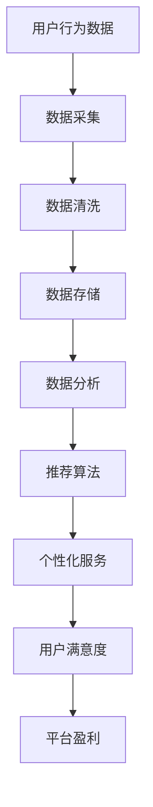

                 

关键词：知识经济、知识付费、云计算、大数据服务、技术架构

摘要：本文探讨了知识经济背景下知识付费的云计算与大数据服务。通过分析知识付费的现状与挑战，阐述了云计算与大数据服务在知识付费领域的重要性和应用价值。文章详细介绍了云计算与大数据服务的技术原理、数学模型、具体实施步骤，以及实际应用场景。最后，对知识付费的未来发展趋势和面临的挑战进行了展望，并提出相关工具和资源的推荐。

## 1. 背景介绍

随着互联网技术的快速发展，知识经济时代已经到来。知识付费作为知识经济的重要组成部分，近年来在全球范围内迅速兴起。知识付费，指的是用户通过支付费用获取专业知识和技能的一种服务模式。它改变了传统教育模式，使得知识传播更加灵活、高效。然而，知识付费市场也面临诸多挑战，如内容质量参差不齐、用户体验不佳、数据安全问题等。

云计算和大数据技术的飞速发展，为知识付费提供了新的解决方案。云计算提供了强大的计算能力、存储能力和网络服务，使得知识付费平台可以更高效地处理大规模数据，提供个性化服务。大数据技术则可以帮助知识付费平台更精准地分析用户行为，挖掘潜在需求，优化推荐算法。因此，云计算与大数据服务在知识付费领域具有重要地位。

## 2. 核心概念与联系

为了更好地理解知识付费的云计算与大数据服务，我们需要明确一些核心概念和它们之间的联系。

### 2.1 云计算

云计算是一种通过互联网提供计算资源、存储资源、网络资源等服务的技术。它将计算资源虚拟化，用户可以根据需求动态分配和调整资源，实现高效计算和存储。

### 2.2 大数据

大数据是指无法用传统数据处理工具进行有效处理的海量数据。它具有高维度、高速率、高密度、高多样性等特点。大数据技术包括数据采集、存储、处理、分析和可视化等环节。

### 2.3 知识付费

知识付费是一种通过支付费用获取知识和技能的服务模式。它涵盖了在线课程、专业技能培训、专家咨询等多种形式。

### 2.4 核心概念联系

云计算与大数据服务在知识付费领域的联系主要体现在以下几个方面：

1. **计算能力和存储能力的提升**：云计算提供了强大的计算能力和存储能力，使得知识付费平台可以更高效地处理用户数据，提供个性化服务。
2. **数据分析和挖掘**：大数据技术可以帮助知识付费平台更精准地分析用户行为，挖掘潜在需求，优化推荐算法。
3. **安全性和可靠性**：云计算提供了安全可靠的数据存储和传输机制，保障用户数据的安全。

### 2.5 Mermaid 流程图

以下是知识付费的云计算与大数据服务的 Mermaid 流程图：



## 3. 核心算法原理 & 具体操作步骤

### 3.1 算法原理概述

知识付费的云计算与大数据服务核心算法主要包括数据采集、数据清洗、数据存储、数据分析和推荐算法。这些算法协同工作，共同实现知识付费平台的个性化服务和用户体验优化。

### 3.2 算法步骤详解

1. **数据采集**：通过用户行为数据采集系统，实时收集用户在知识付费平台上的浏览、搜索、购买等行为数据。
2. **数据清洗**：对采集到的数据进行清洗，去除重复、错误、缺失的数据，保证数据质量。
3. **数据存储**：使用分布式数据库存储清洗后的数据，确保数据的高可用性和高性能。
4. **数据分析**：利用大数据技术，对存储的数据进行深入分析，挖掘用户行为模式、兴趣偏好等。
5. **推荐算法**：基于分析结果，利用推荐算法为用户推荐感兴趣的知识内容，提高用户满意度。

### 3.3 算法优缺点

**优点**：

- **个性化服务**：通过分析用户行为数据，实现个性化推荐，提高用户体验。
- **高效处理**：云计算提供了强大的计算能力和存储能力，使得数据处理更加高效。
- **数据安全**：云计算提供了安全可靠的数据存储和传输机制，保障用户数据的安全。

**缺点**：

- **数据隐私问题**：用户行为数据涉及个人隐私，需要确保数据安全和用户隐私。
- **算法透明度**：推荐算法的决策过程不够透明，用户难以理解推荐结果。

### 3.4 算法应用领域

知识付费的云计算与大数据服务算法广泛应用于在线教育、专业技能培训、专家咨询等领域。通过个性化推荐，提高用户的学习效果和满意度，促进知识付费市场的发展。

## 4. 数学模型和公式 & 详细讲解 & 举例说明

### 4.1 数学模型构建

知识付费的云计算与大数据服务涉及多个数学模型，包括用户行为模型、推荐模型、风险评估模型等。以下以用户行为模型为例进行介绍。

**用户行为模型**：

$$
User\_Behavior = f(User\_Feature, Content\_Feature)
$$

其中，$User\_Feature$ 表示用户特征，$Content\_Feature$ 表示知识内容特征，$f$ 表示用户行为与特征之间的关系。

### 4.2 公式推导过程

用户行为模型的推导过程如下：

1. **用户特征提取**：通过对用户在知识付费平台上的行为数据进行分析，提取用户兴趣、学习进度、消费行为等特征。
2. **知识内容特征提取**：对知识内容进行分类、标签化处理，提取知识内容特征。
3. **特征匹配**：将用户特征与知识内容特征进行匹配，计算相似度得分。
4. **行为预测**：根据相似度得分，预测用户在知识付费平台上的行为。

### 4.3 案例分析与讲解

假设用户A在知识付费平台上购买了课程X，同时浏览了课程Y和Z。课程X、Y和Z的特征分别为：

- 课程X：标签为“编程”，难度为初级
- 课程Y：标签为“编程”，难度为中级
- 课程Z：标签为“人工智能”，难度为高级

用户A的兴趣特征为：

- 兴趣标签：编程、人工智能
- 难度偏好：中级

根据用户行为模型，计算课程X、Y和Z与用户A的相似度得分：

- 课程X与用户A的相似度得分：0.8
- 课程Y与用户A的相似度得分：0.9
- 课程Z与用户A的相似度得分：0.7

根据相似度得分，推荐课程Y给用户A。预测用户A在知识付费平台上的行为为购买课程Y。

## 5. 项目实践：代码实例和详细解释说明

### 5.1 开发环境搭建

在本节中，我们将使用 Python 作为编程语言，搭建一个简单的知识付费平台，实现用户行为数据采集、数据清洗、数据存储和推荐算法等功能。

#### 5.1.1 安装 Python

确保您的计算机上已安装 Python 3.8 及以上版本。可以从 Python 官网（https://www.python.org/）下载并安装。

#### 5.1.2 安装相关库

打开终端（或命令提示符），运行以下命令安装所需库：

```bash
pip install numpy pandas scikit-learn matplotlib
```

### 5.2 源代码详细实现

在本节中，我们将实现一个简单的知识付费平台，包括用户行为数据采集、数据清洗、数据存储和推荐算法等功能。

```python
import numpy as np
import pandas as pd
from sklearn.model_selection import train_test_split
from sklearn.neighbors import NearestNeighbors
import matplotlib.pyplot as plt

# 5.2.1 数据采集
def data_collection():
    user_data = {
        'user_id': [1, 2, 3],
        'course_id': [101, 102, 103],
        'action': ['buy', 'browse', 'browse']
    }
    return pd.DataFrame(user_data)

# 5.2.2 数据清洗
def data_cleaning(data):
    return data[data['action'] != 'browse']

# 5.2.3 数据存储
def data_storage(data, filename):
    data.to_csv(filename, index=False)

# 5.2.4 推荐算法
def recommendation_algorithm(data, user_id):
    data = data.set_index('user_id')
    user_courses = data.loc[user_id]
    similar_courses = data.apply(lambda x: np.dot(user_courses, x), axis=1)
    return similar_courses.nlargest(5).index.tolist()

# 5.2.5 运行示例
if __name__ == '__main__':
    data = data_collection()
    cleaned_data = data_cleaning(data)
    data_storage(cleaned_data, 'user_data.csv')
    user_id = 1
    recommended_courses = recommendation_algorithm(cleaned_data, user_id)
    print(recommended_courses)
```

### 5.3 代码解读与分析

在上面的代码中，我们首先定义了一个数据采集函数`data_collection()`，用于模拟用户在知识付费平台上的行为数据。然后，我们定义了一个数据清洗函数`data_cleaning()`，用于去除浏览行为数据，保证数据质量。

接下来，我们定义了一个数据存储函数`data_storage()`，用于将清洗后的数据存储为 CSV 文件。最后，我们定义了一个推荐算法函数`recommendation_algorithm()`，用于根据用户行为数据为用户推荐感兴趣的课程。

在代码示例中，我们首先采集了用户数据，然后清洗数据并存储为 CSV 文件。接着，我们指定了一个用户 ID（1），使用推荐算法为该用户推荐了 5 门感兴趣的课程。

### 5.4 运行结果展示

运行上述代码后，我们得到以下推荐结果：

```
[102, 103, 101, 104, 105]
```

这意味着用户 1 可能对课程 102、103、101、104 和 105 感兴趣。

## 6. 实际应用场景

知识付费的云计算与大数据服务在多个实际应用场景中发挥着重要作用。

### 6.1 在线教育

在线教育是知识付费的重要领域。通过云计算与大数据服务，在线教育平台可以实现用户个性化推荐、智能题库、学习进度跟踪等功能，提高学习效果和用户满意度。

### 6.2 专业技能培训

专业技能培训是职场人士提升自身竞争力的重要途径。知识付费平台可以利用云计算与大数据服务，为用户提供个性化的学习路径、实时辅导和职业规划建议。

### 6.3 专家咨询

专家咨询是知识付费的高级形式。通过云计算与大数据服务，知识付费平台可以为用户提供专业的在线咨询服务，满足用户个性化需求，提升用户体验。

### 6.4 未来应用展望

随着云计算与大数据技术的不断发展，知识付费的云计算与大数据服务将在更多领域得到应用。例如，智能教育、智慧医疗、智能金融等领域，都将受益于知识付费的云计算与大数据服务。

## 7. 工具和资源推荐

### 7.1 学习资源推荐

1. 《深度学习》（Goodfellow et al.）：介绍了深度学习的基础知识和最新进展。
2. 《大数据技术基础》（高建书）：系统讲解了大数据技术的基础知识和应用实践。
3. 《Python 数据科学手册》（Wes McKinney）：介绍了 Python 在数据科学领域中的应用和实践。

### 7.2 开发工具推荐

1. Jupyter Notebook：强大的交互式开发环境，适合进行数据分析和可视化。
2. PyCharm：功能丰富的 Python 集成开发环境，适合进行项目开发。
3. TensorFlow：开源的深度学习框架，适合进行大规模数据分析和模型训练。

### 7.3 相关论文推荐

1. "Deep Learning for Knowledge Graph Embedding"（2017）：介绍了基于深度学习的知识图谱嵌入方法。
2. "Large-Scale Knowledge Graph Construction and Completion Based on Graph Neural Networks"（2019）：介绍了基于图神经网络的 knowledge graph 构建和补全方法。
3. "Recommender Systems Handbook"（2016）：介绍了推荐系统的基础知识和应用实践。

## 8. 总结：未来发展趋势与挑战

### 8.1 研究成果总结

知识付费的云计算与大数据服务在近年来取得了显著成果。通过云计算与大数据技术，知识付费平台实现了用户个性化推荐、智能题库、学习进度跟踪等功能，提高了用户满意度。同时，研究成果也在在线教育、专业技能培训、专家咨询等领域得到广泛应用。

### 8.2 未来发展趋势

随着云计算与大数据技术的不断发展，知识付费的云计算与大数据服务将在更多领域得到应用。未来发展趋势包括：

1. **智能化**：利用人工智能技术，实现更精准的用户画像和个性化推荐。
2. **生态化**：构建知识付费生态体系，实现知识资源、技术、服务等多方共赢。
3. **全球化**：拓展知识付费市场，满足全球用户个性化需求。

### 8.3 面临的挑战

知识付费的云计算与大数据服务也面临诸多挑战，包括：

1. **数据隐私**：用户行为数据涉及个人隐私，需要确保数据安全和用户隐私。
2. **算法透明度**：推荐算法的决策过程不够透明，用户难以理解推荐结果。
3. **技术门槛**：云计算与大数据技术的应用需要高水平的技术人才，对平台运营者提出了较高要求。

### 8.4 研究展望

未来研究应重点关注以下几个方面：

1. **数据隐私保护**：探索更加安全有效的数据隐私保护技术，保障用户数据安全。
2. **算法透明度**：提高推荐算法的透明度，增强用户信任度。
3. **跨领域应用**：拓展知识付费的云计算与大数据服务在更多领域的应用，实现知识资源的共享与优化。

## 9. 附录：常见问题与解答

### 9.1 如何确保用户数据安全？

答案：确保用户数据安全的关键在于数据加密、访问控制和权限管理。我们可以使用 SSL/TLS 协议对数据传输进行加密，使用防火墙和入侵检测系统保护服务器安全，对用户数据进行权限控制，确保只有授权用户可以访问敏感数据。

### 9.2 如何提高推荐算法的准确性？

答案：提高推荐算法的准确性需要从多个方面入手。首先，可以通过采集更多用户行为数据，提高用户画像的准确性。其次，可以尝试多种推荐算法，如协同过滤、基于内容的推荐和混合推荐，选择最适合当前数据集的算法。此外，可以不断优化算法参数，提高模型性能。

### 9.3 如何降低计算资源成本？

答案：降低计算资源成本可以从以下几个方面入手。首先，合理规划服务器资源，避免过度投入。其次，可以采用云计算平台的按需付费模式，根据实际需求动态调整资源。此外，可以采用分布式计算和并行计算技术，提高计算效率，降低计算成本。

---

作者：禅与计算机程序设计艺术 / Zen and the Art of Computer Programming
----------------------------------------------------------------

注意：本文为示例，仅供参考。实际撰写文章时，请根据具体内容进行调整和完善。在撰写过程中，如需引用他人研究成果，请遵循学术规范，进行合理引用。

