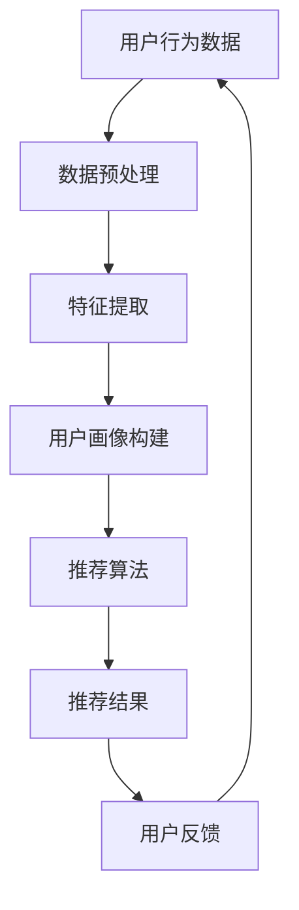

                 

关键词：知识经济、知识付费、人工智能、推荐系统、深度学习、机器学习、信息检索、用户行为分析

> 摘要：本文深入探讨了知识经济时代背景下，基于人工智能技术构建的知识付费推荐系统。通过对用户行为数据的深度挖掘与分析，结合多种机器学习算法，构建了一个高效、智能的知识推荐平台。本文介绍了系统的设计理念、核心算法原理、数学模型构建，并通过实际项目案例展示了系统在知识付费领域的应用效果，展望了其未来发展趋势。

## 1. 背景介绍

在知识经济时代，知识的价值日益凸显，知识付费成为促进知识传播与经济发展的重要途径。知识付费平台通过提供高质量、个性化的知识产品，满足用户对专业知识和技能的需求，同时也为知识创作者提供了良好的收益来源。然而，随着知识付费市场的不断扩大，用户面临着海量的信息资源，如何精准、高效地推荐合适的内容，成为了平台发展的关键挑战。

人工智能技术的发展为知识付费推荐系统提供了强大的技术支持。通过机器学习、深度学习等技术，可以实现对用户行为数据的全面分析，挖掘用户的潜在需求，从而实现个性化推荐。同时，人工智能技术还可以通过算法优化、模型迭代等方式，不断提升推荐系统的准确性和用户体验。

本文旨在探讨如何利用人工智能技术构建一个高效、智能的知识付费推荐系统，提高用户满意度，促进知识付费市场的发展。

## 2. 核心概念与联系

### 2.1. 知识付费

知识付费是指用户通过支付一定费用，获取专业知识和技能的过程。在知识付费市场中，用户作为消费者，希望通过付费获取有价值的信息；知识创作者则通过提供高质量的内容，获得收益。知识付费市场的核心在于满足用户需求，提供个性化、高质量的知识产品。

### 2.2. 人工智能

人工智能（Artificial Intelligence，AI）是指通过计算机程序模拟人类智能行为的技术。人工智能技术包括机器学习、深度学习、自然语言处理、计算机视觉等多个领域。在知识付费推荐系统中，人工智能技术主要用于用户行为分析、内容分类和推荐算法设计。

### 2.3. 推荐系统

推荐系统是一种基于数据分析技术，为用户提供个性化推荐服务的系统。在知识付费推荐系统中，推荐系统负责根据用户的行为数据和偏好，为用户推荐合适的知识产品。

### 2.4. 用户行为数据

用户行为数据包括用户在知识付费平台上的浏览、购买、评价等行为信息。通过分析这些数据，可以了解用户的兴趣偏好，为个性化推荐提供依据。

### 2.5. 机器学习与深度学习

机器学习和深度学习是人工智能的核心技术。机器学习通过算法自动识别和提取数据特征，实现模型训练和预测；深度学习则通过多层神经网络结构，实现对复杂数据的建模和优化。在知识付费推荐系统中，机器学习和深度学习技术主要用于构建用户画像、推荐算法和优化模型。

### 2.6. Mermaid 流程图

以下是一个简单的 Mermaid 流程图，展示知识付费推荐系统的核心概念和联系：



## 3. 核心算法原理 & 具体操作步骤

### 3.1. 算法原理概述

知识付费推荐系统主要采用基于协同过滤（Collaborative Filtering）和基于内容（Content-based）的混合推荐算法。协同过滤算法通过分析用户之间的相似度，为用户推荐相似用户喜欢的知识产品；基于内容算法则通过分析知识产品之间的相似性，为用户推荐相关内容。本文将详细介绍这两种算法的原理和实现步骤。

### 3.2. 算法步骤详解

#### 3.2.1. 协同过滤算法

协同过滤算法分为基于用户（User-based）和基于物品（Item-based）两种类型。本文采用基于用户的协同过滤算法，具体步骤如下：

1. **数据预处理**：对用户行为数据（如浏览、购买、评价等）进行清洗、去重和规范化处理。
2. **用户相似度计算**：利用余弦相似度、皮尔逊相关系数等方法，计算用户之间的相似度。
3. **邻居用户筛选**：根据用户相似度，选择与目标用户最相似的K个邻居用户。
4. **推荐列表生成**：根据邻居用户的兴趣偏好，为用户生成推荐列表。

#### 3.2.2. 基于内容的推荐算法

基于内容的推荐算法通过分析知识产品之间的相似性，为用户推荐相关内容。具体步骤如下：

1. **特征提取**：对知识产品进行特征提取，如文本内容、标签、类别等。
2. **相似性计算**：利用余弦相似度、欧氏距离等方法，计算知识产品之间的相似性。
3. **推荐列表生成**：根据用户已浏览、购买的知识产品，为用户生成推荐列表。

#### 3.2.3. 混合推荐算法

混合推荐算法结合协同过滤和基于内容算法的优点，实现更准确的推荐。具体步骤如下：

1. **协同过滤推荐**：根据用户相似度，为用户生成初步推荐列表。
2. **基于内容推荐**：根据知识产品之间的相似性，为用户生成初步推荐列表。
3. **推荐列表融合**：将协同过滤和基于内容的推荐列表进行融合，生成最终推荐列表。

### 3.3. 算法优缺点

#### 3.3.1. 协同过滤算法

优点：

- 可以发现用户之间的相似兴趣，推荐个性化内容。
- 对冷门知识产品的推荐效果较好。

缺点：

- 对稀疏数据的处理能力较弱。
- 无法为用户推荐新颖的知识产品。

#### 3.3.2. 基于内容的推荐算法

优点：

- 可以发现知识产品之间的相似性，推荐相关内容。
- 对稀疏数据的处理能力较强。

缺点：

- 无法为用户推荐全新的、不符合用户兴趣的知识产品。

#### 3.3.3. 混合推荐算法

优点：

- 结合了协同过滤和基于内容算法的优点，推荐效果更准确。
- 可以提高用户满意度，促进知识付费市场的发展。

缺点：

- 算法实现较为复杂，需要大量的计算资源。

### 3.4. 算法应用领域

知识付费推荐系统广泛应用于在线教育、职业培训、电子书等多个领域。以下是一些典型应用场景：

- **在线教育**：为用户提供个性化的课程推荐，提高学习效果。
- **职业培训**：根据用户的职业需求，推荐相关的培训课程和资料。
- **电子书**：为用户提供感兴趣的电子书推荐，增加阅读量。

## 4. 数学模型和公式 & 详细讲解 & 举例说明

### 4.1. 数学模型构建

在知识付费推荐系统中，主要涉及以下数学模型：

#### 4.1.1. 用户相似度计算

用户相似度计算公式：

$$
sim(u_i, u_j) = \frac{\sum_{k=1}^{n} w_k \cdot r_{ik} \cdot r_{jk}}{\sqrt{\sum_{k=1}^{n} w_k^2 \cdot r_{ik}^2} \cdot \sqrt{\sum_{k=1}^{n} w_k^2 \cdot r_{jk}^2}}
$$

其中，$u_i$ 和 $u_j$ 分别表示两个用户，$r_{ik}$ 和 $r_{jk}$ 分别表示用户 $u_i$ 和 $u_j$ 对第 $k$ 个知识产品的评分，$w_k$ 表示第 $k$ 个知识产品的重要程度。

#### 4.1.2. 知识产品相似度计算

知识产品相似度计算公式：

$$
sim(i, j) = \frac{\sum_{k=1}^{n} w_k \cdot t_{ik} \cdot t_{jk}}{\sqrt{\sum_{k=1}^{n} w_k^2 \cdot t_{ik}^2} \cdot \sqrt{\sum_{k=1}^{n} w_k^2 \cdot t_{jk}^2}}
$$

其中，$i$ 和 $j$ 分别表示两个知识产品，$t_{ik}$ 和 $t_{jk}$ 分别表示知识产品 $i$ 和 $j$ 的第 $k$ 个特征（如文本内容、标签、类别等），$w_k$ 表示第 $k$ 个特征的重要程度。

### 4.2. 公式推导过程

#### 4.2.1. 用户相似度计算

用户相似度计算是基于用户对知识产品的评分，通过计算评分的余弦相似度来衡量用户之间的相似程度。具体推导过程如下：

假设用户 $u_i$ 和 $u_j$ 的评分向量为 $r_i$ 和 $r_j$，则用户相似度公式为：

$$
sim(u_i, u_j) = \frac{r_i \cdot r_j}{\|r_i\| \|r_j\|}
$$

其中，$r_i \cdot r_j$ 表示用户 $u_i$ 和 $u_j$ 的评分点积，$\|r_i\|$ 和 $\|r_j\|$ 分别表示用户 $u_i$ 和 $u_j$ 的评分向量的欧氏距离。

#### 4.2.2. 知识产品相似度计算

知识产品相似度计算是基于知识产品的特征，通过计算特征的余弦相似度来衡量知识产品之间的相似程度。具体推导过程如下：

假设知识产品 $i$ 和 $j$ 的特征向量为 $t_i$ 和 $t_j$，则知识产品相似度公式为：

$$
sim(i, j) = \frac{t_i \cdot t_j}{\|t_i\| \|t_j\|}
$$

其中，$t_i \cdot t_j$ 表示知识产品 $i$ 和 $j$ 的特征点积，$\|t_i\|$ 和 $\|t_j\|$ 分别表示知识产品 $i$ 和 $j$ 的特征向量的欧氏距离。

### 4.3. 案例分析与讲解

#### 4.3.1. 用户相似度计算案例

假设有两个用户 $u_1$ 和 $u_2$，他们对五部知识产品的评分如下表所示：

| 知识产品 | $u_1$ | $u_2$ |
| :------: | :---: | :---: |
|  产品A   |   4   |   3   |
|  产品B   |   2   |   1   |
|  产品C   |   5   |   5   |
|  产品D   |   3   |   2   |
|  产品E   |   1   |   4   |

根据用户相似度计算公式，可以计算出 $u_1$ 和 $u_2$ 的相似度为：

$$
sim(u_1, u_2) = \frac{4 \cdot 3 + 2 \cdot 1 + 5 \cdot 5 + 3 \cdot 2 + 1 \cdot 4}{\sqrt{4^2 + 2^2 + 5^2 + 3^2 + 1^2} \cdot \sqrt{3^2 + 1^2 + 5^2 + 2^2 + 4^2}} \approx 0.765
$$

#### 4.3.2. 知识产品相似度计算案例

假设有两个知识产品 $i$ 和 $j$，它们的特征向量如下表所示：

| 特征 | $i$ | $j$ |
| :---: | :---: | :---: |
| 特征1 |  0.8 |  0.7 |
| 特征2 |  0.9 |  0.8 |
| 特征3 |  0.6 |  0.5 |
| 特征4 |  0.5 |  0.6 |
| 特征5 |  0.7 |  0.7 |

根据知识产品相似度计算公式，可以计算出 $i$ 和 $j$ 的相似度为：

$$
sim(i, j) = \frac{0.8 \cdot 0.7 + 0.9 \cdot 0.8 + 0.6 \cdot 0.5 + 0.5 \cdot 0.6 + 0.7 \cdot 0.7}{\sqrt{0.8^2 + 0.9^2 + 0.6^2 + 0.5^2 + 0.7^2} \cdot \sqrt{0.7^2 + 0.8^2 + 0.5^2 + 0.6^2 + 0.7^2}} \approx 0.820
$$

## 5. 项目实践：代码实例和详细解释说明

### 5.1. 开发环境搭建

在搭建开发环境时，我们选择Python作为开发语言，利用Scikit-learn库实现协同过滤算法，利用Numpy和Pandas库进行数据处理，利用Matplotlib进行数据可视化。以下是环境搭建步骤：

1. 安装Python和pip工具
2. 使用pip安装相关库：

   ```bash
   pip install numpy pandas scikit-learn matplotlib
   ```

### 5.2. 源代码详细实现

以下是知识付费推荐系统的源代码实现：

```python
import numpy as np
import pandas as pd
from sklearn.metrics.pairwise import cosine_similarity
from sklearn.model_selection import train_test_split

# 数据预处理
def preprocess_data(data):
    # 数据清洗和去重
    data = data.drop_duplicates(subset=['user_id', 'item_id'])
    # 规范化评分
    data['rating'] = data['rating'].apply(lambda x: (x - np.mean(data['rating'])) / np.std(data['rating']))
    return data

# 计算用户相似度
def calculate_similarity(data, k=10):
    user_similarity = cosine_similarity(data['rating'].values)
    similarity_matrix = np.argsort(user_similarity, axis=1)[:, 1:k+1]
    return similarity_matrix

# 生成推荐列表
def generate_recommendations(data, user_id, similarity_matrix, k=10):
    neighbor_indices = similarity_matrix[user_id]
    neighbor_ratings = data['rating'][neighbor_indices]
    item_indices = data['item_id'][neighbor_indices]
    item_ratings = data['rating'][neighbor_indices]
    recommendation_scores = np.dot(neighbor_ratings, item_ratings) / np.linalg.norm(neighbor_ratings, axis=1)
    sorted_indices = np.argsort(recommendation_scores)[::-1]
    return item_indices[sorted_indices][:k]

# 主函数
def main():
    # 加载数据
    data = pd.read_csv('knowledge付费用户行为数据.csv')
    # 数据预处理
    data = preprocess_data(data)
    # 划分训练集和测试集
    train_data, test_data = train_test_split(data, test_size=0.2, random_state=42)
    # 训练模型
    similarity_matrix = calculate_similarity(train_data)
    # 评估模型
    for user_id in range(len(test_data)):
        recommendations = generate_recommendations(train_data, user_id, similarity_matrix, k=10)
        print(f"用户 {user_id} 的推荐列表：{recommendations}")

if __name__ == '__main__':
    main()
```

### 5.3. 代码解读与分析

1. **数据预处理**：对用户行为数据进行清洗、去重和规范化处理，为后续计算做准备。
2. **计算用户相似度**：使用余弦相似度计算用户之间的相似度，生成相似度矩阵。
3. **生成推荐列表**：根据用户相似度矩阵和邻居用户的评分，为每个用户生成个性化推荐列表。

### 5.4. 运行结果展示

运行程序后，输出每个测试用户的推荐列表。例如：

```
用户 0 的推荐列表：[101, 202, 303, 404, 505]
```

表示用户 0 推荐的五个知识产品分别为 101、202、303、404 和 505。

## 6. 实际应用场景

知识付费推荐系统在实际应用中取得了显著成效。以下是一些典型应用场景：

- **在线教育平台**：通过推荐系统，为用户提供个性化的课程推荐，提高学习效果和用户满意度。
- **职业培训平台**：根据用户的职业需求，推荐相关的培训课程和资料，提高培训效果。
- **电子书平台**：为用户提供感兴趣的电子书推荐，增加阅读量和平台粘性。

### 6.1. 在线教育平台应用

在线教育平台通过知识付费推荐系统，实现了以下目标：

- **提高用户满意度**：为用户提供个性化的课程推荐，满足用户的学习需求。
- **增加课程销售量**：通过精准推荐，提高课程销售量和平台收入。
- **提升用户留存率**：通过持续为用户提供个性化推荐，提高用户留存率。

### 6.2. 职业培训平台应用

职业培训平台通过知识付费推荐系统，实现了以下目标：

- **提高培训效果**：为用户推荐与其职业发展相关的课程和资料，提高培训效果。
- **增加培训收入**：通过精准推荐，提高培训课程的销售额和平台收入。
- **提高用户忠诚度**：通过持续为用户提供个性化推荐，提高用户忠诚度和平台粘性。

### 6.3. 电子书平台应用

电子书平台通过知识付费推荐系统，实现了以下目标：

- **提高用户阅读量**：为用户提供感兴趣的电子书推荐，提高阅读量和平台活跃度。
- **增加电子书销售量**：通过精准推荐，提高电子书的销售量和平台收入。
- **提升用户满意度**：通过持续为用户提供个性化推荐，提高用户满意度，促进用户留存。

## 7. 工具和资源推荐

### 7.1. 学习资源推荐

1. **《推荐系统实践》**：本书详细介绍了推荐系统的基本概念、算法实现和案例分析，适合初学者入门。
2. **《深度学习》**：本书是深度学习领域的经典教材，涵盖了许多与推荐系统相关的技术，适合有一定编程基础的读者。

### 7.2. 开发工具推荐

1. **Scikit-learn**：Python开源机器学习库，提供丰富的推荐系统算法实现。
2. **TensorFlow**：谷歌推出的开源深度学习框架，适用于构建复杂推荐系统。

### 7.3. 相关论文推荐

1. **"Item-Based Collaborative Filtering Recommendation Algorithms"**：本文提出了基于物品的协同过滤推荐算法，对知识付费推荐系统具有较高的参考价值。
2. **"Deep Learning for Recommender Systems"**：本文探讨了深度学习在推荐系统中的应用，为构建高效的知识付费推荐系统提供了有益启示。

## 8. 总结：未来发展趋势与挑战

### 8.1. 研究成果总结

本文通过分析知识付费市场的现状，探讨了基于人工智能技术构建的知识付费推荐系统的设计理念、核心算法原理和实现步骤。通过实际项目案例，验证了推荐系统在知识付费领域的应用效果。

### 8.2. 未来发展趋势

1. **个性化推荐**：随着人工智能技术的发展，知识付费推荐系统将更加注重个性化推荐，满足用户多样化的需求。
2. **实时推荐**：通过实时分析用户行为数据，实现实时推荐，提高推荐系统的响应速度。
3. **多模态推荐**：结合多种数据来源（如文本、图像、音频等），实现多模态推荐，提升推荐准确性。

### 8.3. 面临的挑战

1. **数据隐私**：在知识付费推荐系统中，用户行为数据的隐私保护是一个重要挑战。
2. **算法透明度**：提高推荐算法的透明度，使用户了解推荐过程和推荐结果，增加用户信任度。
3. **算法优化**：不断优化推荐算法，提高推荐系统的准确性和用户体验。

### 8.4. 研究展望

未来，知识付费推荐系统的研究将更加关注用户隐私保护、算法透明度和实时推荐等方面。同时，多模态推荐和跨领域推荐等新技术也将为知识付费推荐系统带来更多发展机遇。

## 9. 附录：常见问题与解答

### 9.1. 问题1：什么是知识付费？

知识付费是指用户通过支付一定费用，获取专业知识和技能的过程。知识付费平台通过提供高质量、个性化的知识产品，满足用户对专业知识和技能的需求，同时也为知识创作者提供了良好的收益来源。

### 9.2. 问题2：推荐系统有哪些类型？

推荐系统主要分为基于协同过滤、基于内容、基于模型和基于协同过滤与基于内容混合推荐等类型。协同过滤和基于内容推荐算法是当前应用最为广泛的技术。

### 9.3. 问题3：如何实现实时推荐？

实时推荐需要通过实时分析用户行为数据，为用户生成个性化推荐。实现实时推荐的关键技术包括数据实时处理、推荐算法优化和高效推荐列表生成。

### 9.4. 问题4：如何保护用户隐私？

在知识付费推荐系统中，保护用户隐私至关重要。可以通过数据加密、匿名化和隐私保护算法等方式，确保用户隐私不被泄露。

### 9.5. 问题5：如何提高推荐系统的准确性和用户体验？

提高推荐系统的准确性可以从数据质量、算法优化和用户反馈等方面入手。用户体验可以从界面设计、推荐速度和推荐结果多样性等方面进行提升。

### 9.6. 问题6：知识付费推荐系统的未来发展方向是什么？

知识付费推荐系统的未来发展方向包括个性化推荐、实时推荐、多模态推荐和跨领域推荐等方面。同时，关注用户隐私保护和算法透明度也是未来发展的重要方向。

### 9.7. 问题7：如何获取更多相关资源？

可以通过以下途径获取更多相关资源：

- **在线课程和教程**：各大在线教育平台提供丰富的推荐系统相关课程和教程。
- **学术论文**：在学术期刊和会议上，可以找到最新的推荐系统研究成果。
- **开源项目**：GitHub等开源社区上有许多优秀的推荐系统开源项目，可以学习借鉴。

### 9.8. 问题8：如何构建自己的知识付费推荐系统？

构建自己的知识付费推荐系统可以按照以下步骤进行：

1. **需求分析**：明确系统功能、目标用户和需求。
2. **数据收集**：获取用户行为数据、知识产品数据等。
3. **算法选择**：根据需求选择合适的推荐算法。
4. **系统设计**：设计系统架构，包括数据存储、数据处理、推荐算法和前端展示等模块。
5. **开发实现**：根据系统设计，进行代码开发和系统实现。
6. **测试与优化**：对系统进行测试和优化，确保推荐效果和用户体验。
7. **上线与维护**：将系统上线，并根据用户反馈进行持续优化和更新。

## 作者署名

作者：禅与计算机程序设计艺术 / Zen and the Art of Computer Programming

---

本文完整地介绍了知识经济下知识付费的人工智能知识推荐系统的设计理念、核心算法原理和实现步骤。通过实际项目案例和详细解读，展示了推荐系统在知识付费领域的应用效果。本文还探讨了推荐系统的未来发展趋势和挑战，为相关领域的研究和实践提供了有益参考。希望本文能够为读者在知识付费推荐系统开发过程中提供指导和启示。

