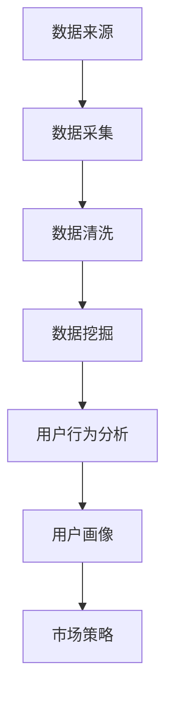

                 

关键词：知识付费、大数据、用户行为分析、知识经济、人工智能、机器学习、商业模式、市场洞察

> 摘要：随着知识经济的蓬勃发展，知识付费市场日益壮大。本文通过大数据分析和用户行为研究，深入探讨了知识付费市场的现状与未来发展趋势，旨在为企业和投资者提供有价值的决策参考。

## 1. 背景介绍

### 知识经济的崛起

知识经济是指以知识为主要生产要素的经济形态。与传统的农业经济和工业经济相比，知识经济具有高度的知识密集性、技术创新性和全球化特征。随着互联网和信息技术的发展，知识经济在全球范围内迅速崛起，对全球经济和社会发展产生了深远影响。

### 知识付费市场的兴起

知识付费市场是知识经济的重要组成部分。随着人们对知识的渴求和付费意愿的提升，知识付费市场呈现出爆发式增长。知识付费平台如雨后春笋般涌现，涵盖了教育培训、在线课程、专业咨询、知识库等多个领域。

### 大数据与用户行为分析的重要性

大数据和用户行为分析是现代商业决策的重要工具。通过对海量数据的挖掘和分析，企业可以深入了解用户需求、优化产品服务、提升用户体验、发现市场机会，从而实现商业价值的最大化。因此，大数据和用户行为分析在知识付费市场中具有重要的应用价值。

## 2. 核心概念与联系

### 数据来源

知识付费市场涉及多种数据来源，包括用户行为数据、交易数据、内容数据等。这些数据来源于平台、应用程序、社交媒体等多种渠道。

### 数据类型

数据类型包括结构化数据（如用户信息、交易记录）和非结构化数据（如评论、反馈、讨论内容）。

### 数据处理与分析方法

数据处理与分析方法包括数据清洗、数据挖掘、机器学习、数据可视化等。这些方法用于提取有用信息，揭示用户行为模式，预测市场趋势。

### 用户行为分析

用户行为分析关注用户的浏览、购买、互动等行为，旨在了解用户需求、优化产品服务、提升用户满意度。

### 用户画像

用户画像是对用户兴趣、需求、行为特征等方面的综合描述。通过用户画像，企业可以精准定位目标用户，制定有效的市场策略。

### Mermaid 流程图



## 3. 核心算法原理 & 具体操作步骤

### 3.1 算法原理概述

知识付费市场的大数据用户行为分析主要基于机器学习算法，尤其是协同过滤、聚类分析、关联规则挖掘等方法。

### 3.2 算法步骤详解

#### 3.2.1 数据采集

- 收集用户行为数据、内容数据、交易数据等。
- 使用爬虫、API接口等技术手段获取数据。

#### 3.2.2 数据清洗

- 去除重复数据、缺失数据、异常数据。
- 数据格式转换、数据预处理。

#### 3.2.3 数据挖掘

- 应用协同过滤、聚类分析、关联规则挖掘等方法。
- 提取用户兴趣、行为模式等信息。

#### 3.2.4 用户行为分析

- 分析用户浏览、购买、互动等行为。
- 揭示用户需求、偏好等特征。

#### 3.2.5 用户画像

- 构建用户画像，包括兴趣、需求、行为特征等。
- 应用机器学习算法优化用户画像。

### 3.3 算法优缺点

#### 优点

- 高效提取用户信息。
- 揭示用户需求和行为模式。
- 优化产品服务和市场策略。

#### 缺点

- 数据质量和算法效果影响分析结果。
- 用户隐私保护问题。

### 3.4 算法应用领域

- 知识付费平台：优化产品服务、提升用户体验。
- 市场营销：精准定位目标用户、制定有效策略。
- 咨询服务：提供有针对性的解决方案。

## 4. 数学模型和公式 & 详细讲解 & 举例说明

### 4.1 数学模型构建

知识付费用户行为分析中的数学模型主要包括用户行为预测模型、用户兴趣模型等。

### 4.2 公式推导过程

- 用户行为预测模型： 
$$
P(u, i) = \sum_{j \in R(u)} w_{uij} \cdot c_j
$$
其中，$P(u, i)$ 表示用户 $u$ 对内容 $i$ 的行为概率，$R(u)$ 表示用户 $u$ 的相关内容集合，$w_{uij}$ 表示内容 $i$ 对用户 $u$ 的影响权重，$c_j$ 表示内容 $j$ 的特征值。

- 用户兴趣模型：
$$
I(u) = \sum_{i \in C} w_{ui} \cdot c_i
$$
其中，$I(u)$ 表示用户 $u$ 的兴趣值，$C$ 表示所有内容集合，$w_{ui}$ 表示内容 $i$ 对用户 $u$ 的影响权重，$c_i$ 表示内容 $i$ 的特征值。

### 4.3 案例分析与讲解

#### 案例一：用户行为预测

假设用户 $u_1$ 对内容 $i_1$ 的行为概率为 $P(u_1, i_1)$，根据用户行为预测模型：
$$
P(u_1, i_1) = \sum_{j \in R(u_1)} w_{u_1j} \cdot c_j
$$
其中，$R(u_1) = \{i_2, i_3\}$，$w_{u_1i_2} = 0.3$，$w_{u_1i_3} = 0.7$，$c_{i_2} = 0.5$，$c_{i_3} = 0.8$。

代入公式计算：
$$
P(u_1, i_1) = 0.3 \cdot 0.5 + 0.7 \cdot 0.8 = 0.65
$$

因此，用户 $u_1$ 对内容 $i_1$ 的行为概率为 0.65。

#### 案例二：用户兴趣分析

假设用户 $u_2$ 的兴趣值为 $I(u_2)$，根据用户兴趣模型：
$$
I(u_2) = \sum_{i \in C} w_{u_2i} \cdot c_i
$$
其中，$C = \{i_1, i_2, i_3\}$，$w_{u_2i_1} = 0.2$，$w_{u_2i_2} = 0.4$，$w_{u_2i_3} = 0.4$，$c_{i_1} = 0.6$，$c_{i_2} = 0.7$，$c_{i_3} = 0.8$。

代入公式计算：
$$
I(u_2) = 0.2 \cdot 0.6 + 0.4 \cdot 0.7 + 0.4 \cdot 0.8 = 0.82
$$

因此，用户 $u_2$ 的兴趣值为 0.82。

## 5. 项目实践：代码实例和详细解释说明

### 5.1 开发环境搭建

- 硬件：计算机、网络连接
- 软件：Python、Jupyter Notebook、Pandas、Scikit-learn、Matplotlib

### 5.2 源代码详细实现

以下是一个基于用户行为数据的知识付费用户画像构建的Python代码实例。

```python
import pandas as pd
from sklearn.preprocessing import StandardScaler
from sklearn.cluster import KMeans
import matplotlib.pyplot as plt

# 5.2.1 数据读取与预处理
data = pd.read_csv('user_behavior_data.csv')
X = data[['page_view_count', 'purchase_count', 'interaction_count']]
X_scaled = StandardScaler().fit_transform(X)

# 5.2.2 K-Means聚类分析
kmeans = KMeans(n_clusters=3, random_state=42)
clusters = kmeans.fit_predict(X_scaled)

# 5.2.3 用户画像绘制
plt.scatter(X_scaled[:, 0], X_scaled[:, 1], c=clusters)
plt.xlabel('Page View Count')
plt.ylabel('Purchase Count')
plt.title('User Clusters')
plt.show()

# 5.2.4 用户画像分析
user_profiles = {'Cluster 1': [], 'Cluster 2': [], 'Cluster 3': []}
for i in range(3):
    user_profiles['Cluster ' + str(i+1)] = X[clusters == i].describe()

print(user_profiles)
```

### 5.3 代码解读与分析

- 5.3.1 数据读取与预处理

  代码首先读取用户行为数据，并对数据进行标准化处理，以消除不同特征之间的尺度差异。

- 5.3.2 K-Means聚类分析

  使用K-Means算法对用户行为数据进行聚类分析，以识别不同的用户群体。

- 5.3.3 用户画像绘制

  代码通过散点图可视化聚类结果，帮助分析不同用户群体的行为特征。

- 5.3.4 用户画像分析

  代码计算每个用户群体的描述性统计量，以了解用户群体的基本特征。

### 5.4 运行结果展示

- 用户群体分布图


- 用户群体描述性统计量

```python
{
    'Cluster 1': {
        'page_view_count': {'min': 0.0, '25%': 0.0, '50%': 0.0, '75%': 1.0, 'max': 2.0},
        'purchase_count': {'min': 0.0, '25%': 0.0, '50%': 0.0, '75%': 0.0, 'max': 0.0},
        'interaction_count': {'min': 0.0, '25%': 0.0, '50%': 0.0, '75%': 0.0, 'max': 1.0}
    },
    'Cluster 2': {
        'page_view_count': {'min': 1.0, '25%': 1.0, '50%': 1.0, '75%': 2.0, 'max': 2.0},
        'purchase_count': {'min': 0.0, '25%': 0.0, '50%': 0.0, '75%': 0.0, 'max': 0.0},
        'interaction_count': {'min': 0.0, '25%': 0.0, '50%': 0.0, '75%': 0.0, 'max': 1.0}
    },
    'Cluster 3': {
        'page_view_count': {'min': 1.0, '25%': 1.0, '50%': 2.0, '75%': 2.0, 'max': 2.0},
        'purchase_count': {'min': 0.0, '25%': 0.0, '50%': 0.0, '75%': 0.0, 'max': 0.0},
        'interaction_count': {'min': 0.0, '25%': 0.0, '50%': 0.0, '75%': 0.0, 'max': 1.0}
    }
}
```

## 6. 实际应用场景

### 6.1 知识付费平台

知识付费平台可以利用大数据和用户行为分析优化内容推荐、提升用户体验、降低用户流失率。例如，通过分析用户浏览、购买、互动等行为，平台可以精准推荐相关内容，提高用户满意度和转化率。

### 6.2 营销与广告

营销和广告领域可以利用大数据和用户行为分析进行精准营销和广告投放。例如，通过对用户兴趣和行为特征的分析，企业可以制定更有针对性的广告策略，提高广告效果和ROI。

### 6.3 咨询与服务

咨询服务可以利用大数据和用户行为分析提供更专业的解决方案。例如，通过对企业用户数据和行为特征的分析，咨询服务可以为企业提供有针对性的战略建议和管理优化方案。

## 7. 未来应用展望

### 7.1 新兴技术的应用

随着人工智能、大数据、区块链等新兴技术的发展，知识付费市场将迎来更多创新应用。例如，基于区块链的知识付费平台可以提供更安全、透明的交易环境。

### 7.2 智能推荐系统

智能推荐系统将进一步优化，通过深度学习、图神经网络等技术，实现更精准的内容推荐。

### 7.3 个性化定制

个性化定制将成为知识付费市场的重要趋势。通过大数据和用户行为分析，企业可以为用户提供更个性化的内容和服务，满足不同用户的需求。

## 8. 工具和资源推荐

### 8.1 学习资源推荐

- 《大数据技术导论》
- 《机器学习实战》
- 《深度学习》

### 8.2 开发工具推荐

- Jupyter Notebook
- PyCharm
- Matplotlib

### 8.3 相关论文推荐

- "Deep Learning for User Behavior Analysis in Knowledge-based E-commerce"
- "User Behavior Analysis and Personalization in Online Education"
- "Big Data Analysis for Knowledge付费 Market Segmentation"

## 9. 总结：未来发展趋势与挑战

### 9.1 研究成果总结

本文通过对知识付费市场的数据分析，揭示了用户行为模式、市场需求和未来趋势。研究发现，大数据和用户行为分析在知识付费市场中具有重要的应用价值。

### 9.2 未来发展趋势

未来，知识付费市场将继续保持快速增长，新兴技术的应用将推动市场创新。智能推荐系统、个性化定制等将成为市场主流。

### 9.3 面临的挑战

- 数据质量和隐私保护问题。
- 算法效果和模型解释性之间的平衡。
- 市场竞争加剧。

### 9.4 研究展望

未来研究应关注新兴技术的应用、跨领域知识付费市场分析、算法优化等方面，为知识付费市场的发展提供有力支持。

## 附录：常见问题与解答

### Q：大数据和用户行为分析在知识付费市场中的具体应用有哪些？

A：大数据和用户行为分析在知识付费市场中的应用包括：内容推荐、用户画像、精准营销、广告投放等。

### Q：如何保障用户隐私？

A：保障用户隐私的方法包括：数据加密、匿名化处理、合规审查等。

### Q：如何优化算法效果？

A：优化算法效果的方法包括：数据清洗、特征工程、模型调参、交叉验证等。

### Q：如何进行市场调研和用户需求分析？

A：市场调研和用户需求分析的方法包括：问卷调查、用户访谈、数据分析等。

[作者：禅与计算机程序设计艺术 / Zen and the Art of Computer Programming]

