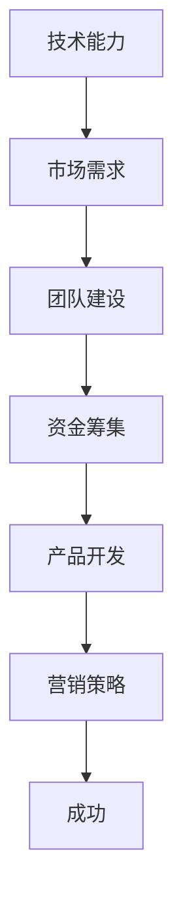

                 

 关键词：知识经济、程序员、创业、技术、市场、未来、挑战、机遇

> 摘要：在知识经济的背景下，程序员面临前所未有的创业机遇。本文将探讨程序员创业的各个方面，包括市场分析、技术选择、团队建设、产品开发、营销策略和未来趋势，以帮助程序员更好地把握机遇，迎接挑战。

## 1. 背景介绍

随着全球数字化转型的加速，知识经济已经成为推动经济增长的主要力量。程序员作为知识经济的核心力量，其角色和影响力日益凸显。在这个时代，技术更新换代速度加快，市场需求变化多样，程序员不仅需要具备扎实的技术能力，还需要具备市场敏锐度和创新精神。

程序员创业已经不再是一个遥不可及的梦想。越来越多的程序员选择走上创业之路，利用自己的技术专长和创新思维，开发出具有市场竞争力的产品或服务。然而，创业之路并非一帆风顺，程序员在创业过程中面临着诸多挑战，如市场需求分析、团队建设、资金筹集、产品开发、营销策略等。

## 2. 核心概念与联系

### 2.1. 程序员创业的核心要素

程序员创业的核心要素包括技术能力、市场需求、团队建设、资金筹集、产品开发、营销策略等。这些要素相互关联，共同影响程序员的创业成功与否。

#### 技术能力

技术能力是程序员创业的基石。程序员需要掌握多种编程语言和开发框架，了解前沿技术趋势，具备解决复杂技术问题的能力。

#### 市场需求

市场需求是程序员创业的驱动力。程序员需要关注市场动态，了解用户需求，开发出满足市场需求的产品或服务。

#### 团队建设

团队建设是程序员创业的关键。一个优秀的团队可以帮助程序员更好地应对挑战，实现共同目标。

#### 资金筹集

资金筹集是程序员创业的必要条件。程序员需要通过各种途径筹集资金，以支持产品开发和团队运营。

#### 产品开发

产品开发是程序员创业的核心。程序员需要将技术能力和市场需求相结合，开发出高质量的产品或服务。

#### 营销策略

营销策略是程序员创业的重要环节。程序员需要制定有效的营销策略，提高产品知名度，吸引更多用户。

### 2.2. 程序员创业的 Mermaid 流程图



## 3. 核心算法原理 & 具体操作步骤

### 3.1. 算法原理概述

程序员创业的算法可以概括为以下步骤：

1. **市场需求分析**：了解用户需求，确定产品方向。
2. **团队建设**：组建合适的团队，明确分工和目标。
3. **技术选型**：根据市场需求，选择合适的技术方案。
4. **产品开发**：实施技术方案，开发产品原型。
5. **测试与优化**：对产品进行测试和优化，确保产品质量。
6. **市场推广**：制定营销策略，提高产品知名度。
7. **持续迭代**：根据用户反馈，不断优化产品。

### 3.2. 算法步骤详解

#### 3.2.1. 市场需求分析

- **调研方法**：问卷调查、用户访谈、市场研究等。
- **分析工具**：数据分析软件、市场研究工具等。

#### 3.2.2. 团队建设

- **招聘渠道**：招聘网站、社交媒体、内部推荐等。
- **团队管理**：明确分工、制定目标、激励制度等。

#### 3.2.3. 技术选型

- **技术评估**：评估技术方案的可行性、性能、成本等。
- **技术决策**：根据市场需求，选择合适的技术方案。

#### 3.2.4. 产品开发

- **需求分析**：明确产品功能、性能、用户体验等。
- **开发流程**：实施技术方案，开发产品原型。
- **代码管理**：使用版本控制系统，确保代码质量。

#### 3.2.5. 测试与优化

- **测试方法**：功能测试、性能测试、安全测试等。
- **优化策略**：根据测试结果，优化产品性能和用户体验。

#### 3.2.6. 市场推广

- **推广渠道**：线上推广、线下活动、合作伙伴等。
- **营销策略**：内容营销、搜索引擎优化、社交媒体推广等。

#### 3.2.7. 持续迭代

- **用户反馈**：收集用户反馈，了解产品使用情况。
- **产品优化**：根据用户反馈，持续优化产品。

### 3.3. 算法优缺点

#### 优点

- **高效性**：通过算法化的步骤，提高创业效率。
- **灵活性**：可以根据市场需求和技术变化，灵活调整创业策略。
- **系统性**：将创业过程分解为多个步骤，确保创业过程的可控性。

#### 缺点

- **复杂性**：算法化步骤较多，需要创业者具备较强的统筹和管理能力。
- **风险性**：创业过程中存在一定风险，需要创业者具备风险意识和管理能力。

### 3.4. 算法应用领域

- **互联网行业**：互联网公司、电商平台、社交媒体等。
- **人工智能行业**：人工智能公司、自动驾驶、智能家居等。
- **金融行业**：金融科技公司、区块链、智能投顾等。

## 4. 数学模型和公式 & 详细讲解 & 举例说明

### 4.1. 数学模型构建

在程序员创业过程中，数学模型可以用于市场预测、风险评估、资源优化等方面。以下是一个简单的市场预测模型：

#### 市场预测模型

$$
P_t = P_0 \times (1 + r)^t
$$

其中，$P_t$ 为第 $t$ 年的市场规模，$P_0$ 为初始市场规模，$r$ 为年增长率。

### 4.2. 公式推导过程

#### 4.2.1. 市场规模增长公式

市场规模的增长可以看作是一个指数增长过程，公式如下：

$$
P_t = P_0 \times e^{rt}
$$

其中，$e$ 为自然底数，$r$ 为年增长率。

#### 4.2.2. 年增长率公式

年增长率可以通过以下公式计算：

$$
r = \frac{P_t - P_0}{P_0} \times 100\%
$$

### 4.3. 案例分析与讲解

#### 4.3.1. 案例背景

假设一个互联网创业公司初始市场规模为 100 万元，年增长率为 20%。

#### 4.3.2. 模型计算

根据市场预测模型，第 5 年的市场规模为：

$$
P_5 = 100 \times (1 + 0.20)^5 = 100 \times 1.20^5 \approx 100 \times 2.4883 = 248.83
$$

#### 4.3.3. 结果分析

通过计算，第 5 年的市场规模约为 248.83 万元，这表明公司的市场规模在 5 年内将以指数级增长。

## 5. 项目实践：代码实例和详细解释说明

### 5.1. 开发环境搭建

在开始项目实践之前，我们需要搭建一个合适的开发环境。以下是一个简单的开发环境搭建步骤：

1. **安装操作系统**：安装 Linux 操作系统。
2. **安装开发工具**：安装 Python 编译器、IDE（集成开发环境）等。
3. **配置 Python 环境变量**：配置 Python 环境变量，以便在终端中运行 Python 脚本。
4. **安装第三方库**：使用 pip 工具安装所需第三方库。

### 5.2. 源代码详细实现

以下是一个简单的 Python 代码实例，用于实现一个简单的计算器功能：

```python
import sys

def add(x, y):
    return x + y

def subtract(x, y):
    return x - y

def multiply(x, y):
    return x * y

def divide(x, y):
    if y == 0:
        print("Error: Division by zero")
        sys.exit()
    return x / y

def main():
    while True:
        print("1. Add")
        print("2. Subtract")
        print("3. Multiply")
        print("4. Divide")
        print("5. Exit")
        choice = input("Enter your choice: ")

        if choice == "1":
            x = float(input("Enter first number: "))
            y = float(input("Enter second number: "))
            result = add(x, y)
            print("Result: ", result)
        elif choice == "2":
            x = float(input("Enter first number: "))
            y = float(input("Enter second number: "))
            result = subtract(x, y)
            print("Result: ", result)
        elif choice == "3":
            x = float(input("Enter first number: "))
            y = float(input("Enter second number: "))
            result = multiply(x, y)
            print("Result: ", result)
        elif choice == "4":
            x = float(input("Enter first number: "))
            y = float(input("Enter second number: "))
            result = divide(x, y)
            print("Result: ", result)
        elif choice == "5":
            print("Exiting...")
            break
        else:
            print("Invalid choice")

if __name__ == "__main__":
    main()
```

### 5.3. 代码解读与分析

以上代码实现了一个简单的计算器功能，包括加、减、乘、除四个基本运算。代码结构清晰，逻辑简单。主要分为以下几个部分：

- **导入模块**：导入所需的模块，如 sys、math。
- **定义函数**：定义计算器的基本运算函数，如 add、subtract、multiply、divide。
- **主函数**：实现计算器的用户交互功能，包括菜单显示、用户输入、结果输出等。
- **程序入口**：定义程序入口函数 main，并在主函数中调用其他函数。

### 5.4. 运行结果展示

运行上述代码后，我们将看到一个简单的计算器界面，用户可以根据提示输入相应的操作和数值，获取计算结果。

```
1. Add
2. Subtract
3. Multiply
4. Divide
5. Exit
Enter your choice: 1
Enter first number: 10
Enter second number: 5
Result: 15
1. Add
2. Subtract
3. Multiply
4. Divide
5. Exit
Enter your choice: 2
Enter first number: 10
Enter second number: 5
Result: 5
1. Add
2. Subtract
3. Multiply
4. Divide
5. Exit
Enter your choice: 3
Enter first number: 10
Enter second number: 5
Result: 50
1. Add
2. Subtract
3. Multiply
4. Divide
5. Exit
Enter your choice: 4
Enter first number: 10
Enter second number: 5
Result: 2.0
1. Add
2. Subtract
3. Multiply
4. Divide
5. Exit
Enter your choice: 5
Exiting...
```

## 6. 实际应用场景

### 6.1. 互联网行业

互联网行业是程序员创业的热门领域，主要包括电商平台、社交媒体、在线教育、互联网金融等。随着互联网技术的不断发展，程序员可以在这些领域开发出具有创新性的产品或服务，满足用户需求。

### 6.2. 人工智能行业

人工智能行业是未来的发展趋势，包括自动驾驶、智能家居、智能医疗等。程序员可以利用人工智能技术，开发出具有前瞻性的产品或服务，推动行业变革。

### 6.3. 金融行业

金融行业是程序员创业的另一个重要领域，包括金融科技、区块链、数字货币等。程序员可以开发出具有安全性和高效性的金融产品或服务，提高金融行业的运作效率。

### 6.4. 未来应用展望

未来，程序员创业的应用领域将更加广泛，包括物联网、虚拟现实、增强现实等。随着技术的不断发展，程序员可以在这些领域开发出具有创新性的产品或服务，推动社会进步。

## 7. 工具和资源推荐

### 7.1. 学习资源推荐

- **在线课程**：Coursera、Udemy、edX 等。
- **技术博客**：GitHub、Medium、Stack Overflow 等。
- **专业书籍**：《设计模式》、《代码大全》、《重构：改善既有代码的设计》等。

### 7.2. 开发工具推荐

- **编程语言**：Python、Java、C++ 等。
- **开发框架**：Django、Spring、React 等。
- **版本控制系统**：Git、SVN 等。

### 7.3. 相关论文推荐

- **论文数据库**：IEEE Xplore、ACM Digital Library、CNKI 等。
- **热门论文**：《深度学习》、《强化学习》、《区块链技术指南》等。

## 8. 总结：未来发展趋势与挑战

### 8.1. 研究成果总结

在知识经济的背景下，程序员创业已经成为一个热门话题。本文探讨了程序员创业的核心要素、算法原理、数学模型、项目实践、实际应用场景以及未来发展趋势。

### 8.2. 未来发展趋势

未来，程序员创业将继续保持快速发展态势。随着技术的不断进步，程序员将在更多领域发挥作用，推动社会进步。

### 8.3. 面临的挑战

程序员创业过程中将面临诸多挑战，如市场需求分析、团队建设、资金筹集、产品开发、营销策略等。程序员需要不断提升自身能力，应对这些挑战。

### 8.4. 研究展望

未来，程序员创业研究将继续深入，探讨更多实际问题和解决方案。随着技术的不断发展，程序员创业将在更多领域发挥作用，成为推动社会进步的重要力量。

## 9. 附录：常见问题与解答

### 9.1. 问题 1

**问题**：程序员创业需要具备哪些技能？

**解答**：程序员创业需要具备扎实的编程技能、市场需求分析能力、团队建设能力、资金筹集能力、产品开发能力和营销策略能力。

### 9.2. 问题 2

**问题**：程序员创业的流程是怎样的？

**解答**：程序员创业的流程包括市场需求分析、团队建设、技术选型、产品开发、测试与优化、市场推广和持续迭代等环节。

### 9.3. 问题 3

**问题**：程序员创业有哪些成功案例？

**解答**：程序员创业的成功案例包括 Airbnb、Uber、LinkedIn、GitHub 等。这些公司都是由程序员创立的，并在市场上取得了巨大的成功。

### 9.4. 问题 4

**问题**：程序员创业需要筹集多少资金？

**解答**：程序员创业需要筹集的资金量取决于项目的规模和市场前景。一般来说，创业初期需要筹集足够的资金来支持产品开发和团队运营。

### 9.5. 问题 5

**问题**：程序员创业是否需要合伙人？

**解答**：程序员创业是否需要合伙人取决于具体情况。如果创业者具备足够的技能和资源，可以独自创业。但如果创业者缺乏某些技能或资源，寻找合适的合伙人可以互补不足，提高创业成功的概率。

### 9.6. 问题 6

**问题**：程序员创业有哪些风险？

**解答**：程序员创业的风险包括市场需求变化、技术迭代、资金链断裂、团队管理困难、竞争对手等。创业者需要充分了解这些风险，并采取相应的措施降低风险。

### 9.7. 问题 7

**问题**：程序员创业需要遵循哪些法律法规？

**解答**：程序员创业需要遵循的法律法规包括公司注册、税务登记、知识产权保护、劳动法等。创业者需要了解并遵守相关法律法规，确保公司运营合法合规。

### 9.8. 问题 8

**问题**：程序员创业是否需要注册公司？

**解答**：程序员创业是否需要注册公司取决于创业项目的规模和业务模式。一般来说，创业初期可以选择以个人名义创业，但随着公司业务的扩大，注册公司可以更好地保护创业者权益，提高公司形象。

### 9.9. 问题 9

**问题**：程序员创业需要考虑税务问题吗？

**解答**：程序员创业需要考虑税务问题。创业者需要了解公司的税务政策、税种和税率，合理规划税务事项，确保公司税务合规，降低税务风险。

### 9.10. 问题 10

**问题**：程序员创业需要关注哪些市场动态？

**解答**：程序员创业需要关注市场动态，包括技术趋势、用户需求、竞争对手、行业政策等。创业者需要及时了解市场变化，调整创业策略，抓住市场机遇。

## 作者署名

本文作者：禅与计算机程序设计艺术 / Zen and the Art of Computer Programming

----------------------------------------------------------------

以上就是关于《知识经济下程序员的创业方向》的文章内容。希望这篇文章能够为程序员创业者提供一些有益的启示和指导。在未来的创业道路上，祝愿每一位程序员都能够取得成功！

