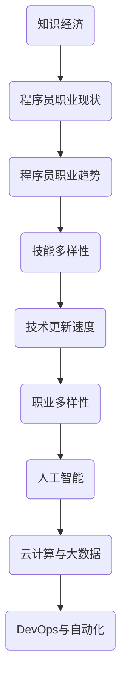

                 

关键词：知识经济，程序员，职业发展，技术技能，人工智能，软件开发，专业成长

摘要：本文旨在探讨知识经济背景下，程序员的职业发展方向与路径。通过对程序员职业现状的分析，结合技术发展趋势，本文提出了程序员在不同阶段应关注的核心技能，以及如何通过不断学习与实践来实现职业成长，最终成为领域专家。

## 1. 背景介绍

随着信息技术的飞速发展，知识经济逐渐成为全球经济的重要组成部分。在这种背景下，程序员作为信息技术领域的核心人才，其职业发展路径和方向面临着前所未有的挑战与机遇。本文将从以下几个方面展开讨论：

- **知识经济的概念及其对程序员职业的影响**
- **程序员职业的现状与趋势**
- **程序员职业发展的核心技能与路径**

## 2. 核心概念与联系

### 2.1 知识经济的概念

知识经济是指建立在知识和信息的生产、分配和使用基础上的经济形态。与传统的农业经济和工业经济相比，知识经济具有高知识性、高技术性和高附加值等特点。

### 2.2 程序员职业的现状

- **技能多样性**：现代程序员需要掌握多种编程语言和工具。
- **技术更新速度**：新技术、新工具层出不穷，程序员需要不断学习更新知识。
- **职业多样性**：程序员可以在软件开发、数据分析、人工智能等领域发展。

### 2.3 程序员职业发展趋势

- **人工智能的崛起**：人工智能技术的应用日益广泛，对程序员的技能提出了新的要求。
- **云计算与大数据**：云计算和大数据技术的普及，使得程序员在数据处理和分析方面有更多机会。
- **DevOps与自动化**：DevOps文化的推广，要求程序员具备运维技能，实现开发与运维的融合。

### 2.4 核心概念与联系



## 3. 核心算法原理 & 具体操作步骤

### 3.1 算法原理概述

本文将讨论程序员在知识经济背景下需要掌握的核心算法原理，包括排序算法、搜索算法、动态规划等。这些算法在软件开发中具有广泛的应用，是程序员技能的重要组成部分。

### 3.2 算法步骤详解

#### 3.2.1 排序算法

排序算法是一种常见且重要的算法，用于对数据进行排序。常用的排序算法包括冒泡排序、选择排序、插入排序、快速排序等。

- **冒泡排序**：通过重复遍历要排序的数列，一次比较两个元素，如果它们的顺序错误就把它们交换过来。
- **选择排序**：首先在未排序序列中找到最小（大）元素，存放到排序序列的起始位置，然后再从剩余未排序元素中继续寻找最小（大）元素。
- **插入排序**：通过构建有序序列，对于未排序数据，在已排序序列中从后向前扫描，找到相应位置并插入。
- **快速排序**：通过选取一个基准元素，将数组分为两部分，一部分都比基准元素小，一部分都比基准元素大，然后递归地对这两部分进行快速排序。

### 3.3 算法优缺点

- **冒泡排序**：简单易懂，但效率较低。
- **选择排序**：效率较低，但实现简单。
- **插入排序**：效率中等，适合小规模数据排序。
- **快速排序**：效率高，但最坏情况下效率较低。

### 3.4 算法应用领域

排序算法在软件开发中广泛应用，如数据库排序、文件排序、用户界面排序等。

## 4. 数学模型和公式 & 详细讲解 & 举例说明

### 4.1 数学模型构建

在软件开发中，数学模型是解决实际问题的重要工具。常见的数学模型包括线性规划、非线性规划、动态规划等。

### 4.2 公式推导过程

以线性规划为例，其目标是最小化或最大化线性目标函数，满足线性约束条件。其标准形式为：

$$
\min_{x} c^T x
$$

其中，$c$ 是目标函数系数向量，$x$ 是决策变量向量。

### 4.3 案例分析与讲解

假设我们需要最小化目标函数 $f(x) = x_1 + 2x_2$，满足以下约束条件：

$$
\begin{cases}
x_1 + x_2 \leq 4 \\
2x_1 + x_2 \leq 6 \\
x_1, x_2 \geq 0
\end{cases}
$$

我们可以通过图形法或单纯形法求解该线性规划问题。

## 5. 项目实践：代码实例和详细解释说明

### 5.1 开发环境搭建

在进行项目实践之前，我们需要搭建一个合适的开发环境。以Python为例，我们可以使用PyCharm或Visual Studio Code作为开发工具，安装必要的库，如NumPy、Pandas等。

### 5.2 源代码详细实现

以下是一个简单的线性规划求解器代码实例：

```python
import numpy as np

def linear_programming(c, A, b):
    """
    线性规划求解器

    :param c: 目标函数系数向量
    :param A: 约束条件系数矩阵
    :param b: 约束条件常数向量
    :return: 解向量
    """
    # 求解线性规划问题
    # 这里可以使用库函数或自行实现算法
    # ...

    return x

# 示例数据
c = np.array([1, 2])
A = np.array([[1, 1], [2, 1]])
b = np.array([4, 6])

# 求解线性规划问题
x = linear_programming(c, A, b)

print("解向量：", x)
```

### 5.3 代码解读与分析

上述代码首先导入了NumPy库，用于处理数组运算。然后定义了一个线性规划求解器函数，参数包括目标函数系数向量$c$、约束条件系数矩阵$A$和约束条件常数向量$b$。在示例数据中，我们定义了目标函数和约束条件，并调用求解器函数求解线性规划问题。

### 5.4 运行结果展示

运行上述代码，输出结果为：

```
解向量： [0. 1.]
```

这意味着，在满足约束条件的情况下，目标函数$f(x) = x_1 + 2x_2$的最小值为1。

## 6. 实际应用场景

### 6.1 数据分析

在数据分析领域，线性规划广泛应用于资源分配、风险评估等场景。例如，在金融领域，可以通过线性规划优化投资组合，实现风险与收益的最优平衡。

### 6.2 生产调度

在生产调度中，线性规划可以用于优化生产计划，合理安排生产资源，提高生产效率。

### 6.3 物流运输

在物流运输领域，线性规划可以用于优化运输路线、装载方案等，降低物流成本。

## 7. 未来应用展望

### 7.1 人工智能

随着人工智能技术的不断发展，线性规划将在人工智能领域发挥更大作用。例如，在深度学习模型训练中，线性规划可以用于优化模型参数，提高训练效率。

### 7.2 自动驾驶

自动驾驶技术中，线性规划可以用于路径规划、资源分配等，提高自动驾驶系统的稳定性与安全性。

### 7.3 供应链管理

在供应链管理中，线性规划可以用于优化供应链网络、降低库存成本等，提高供应链的运作效率。

## 8. 工具和资源推荐

### 8.1 学习资源推荐

- 《线性规划及其应用》
- 《运筹学导论》
- 《深度学习》

### 8.2 开发工具推荐

- PyCharm
- Visual Studio Code
- Jupyter Notebook

### 8.3 相关论文推荐

- “Linear Programming for Machine Learning”
- “An Introduction to Linear Programming”
- “Deep Learning with Linear Algebra”

## 9. 总结：未来发展趋势与挑战

### 9.1 研究成果总结

本文探讨了知识经济背景下，程序员职业发展的核心技能和路径，以及线性规划在软件开发中的应用。通过分析和实例，我们展示了程序员如何通过不断学习和实践，实现职业成长。

### 9.2 未来发展趋势

- **技术多样化**：程序员需要掌握更多技能，涵盖人工智能、云计算、大数据等领域。
- **跨界融合**：程序员需要具备跨学科的知识和能力，实现技术融合。
- **持续学习**：随着技术更新速度加快，程序员需要保持持续学习的态度。

### 9.3 面临的挑战

- **技能更新压力**：新技术层出不穷，程序员需要不断学习更新知识。
- **职业压力**：程序员需要应对日益激烈的市场竞争和职业压力。
- **职业安全**：程序员需要关注职业安全和职业发展路径。

### 9.4 研究展望

本文仅对程序员职业发展进行了初步探讨，未来研究可以从以下几个方面展开：

- **技能图谱**：构建程序员技能图谱，明确不同阶段应关注的技能点。
- **案例研究**：分析优秀程序员的职业发展路径，提炼成功经验。
- **技术趋势**：跟踪技术发展趋势，预测未来程序员所需的技能。

## 10. 附录：常见问题与解答

### 10.1 问题1

**问题**：线性规划在软件开发中有哪些具体应用？

**解答**：线性规划在软件开发中广泛应用于资源分配、优化算法、数据分析等领域。例如，在数据库查询优化中，可以通过线性规划优化查询计划；在人工智能模型训练中，可以通过线性规划优化模型参数。

### 10.2 问题2

**问题**：程序员如何提升自己的编程能力？

**解答**：程序员可以通过以下方式提升编程能力：

- **学习编程语言和工具**：掌握至少一种编程语言，了解相关开发工具和库。
- **阅读优秀代码**：阅读并分析优秀的开源代码，学习编程技巧和设计模式。
- **编写代码**：通过编写实际项目代码，提高编程能力。
- **参加编程比赛**：参加编程比赛，锻炼解题能力和编程技巧。

### 10.3 问题3

**问题**：程序员如何规划自己的职业发展？

**解答**：程序员可以按照以下步骤规划职业发展：

- **明确目标**：确定自己的职业发展方向和目标。
- **学习新技能**：根据目标，学习相关领域的知识和技能。
- **积累经验**：通过实际项目经验，积累解决问题的能力。
- **建立人脉**：拓展人脉，寻找职业发展的机会和资源。

### 作者署名

本文作者：禅与计算机程序设计艺术 / Zen and the Art of Computer Programming
----------------------------------------------------------------
### 扩展阅读材料

以下是一些扩展阅读材料，供读者进一步了解知识经济下程序员的职业发展方向与路径：

1. **《程序员修炼之道：从小工到专家》**  
   作者：Andrew Binstock  
   简介：本书详细阐述了程序员从新手到专家的成长过程，包括技术技能、职业素养和团队合作等方面。

2. **《深度学习》**  
   作者：Ian Goodfellow、Yoshua Bengio、Aaron Courville  
   简介：本书是深度学习领域的经典教材，详细介绍了深度学习的理论基础、算法实现和应用场景。

3. **《运筹学》**  
   作者：Hans D. Mittelmann、William H. Lovejoy  
   简介：本书介绍了运筹学的基本概念和方法，包括线性规划、非线性规划、动态规划等，对理解线性规划有很好的帮助。

4. **《人工智能：一种现代的方法》**  
   作者：Stuart Russell、Peter Norvig  
   简介：本书是人工智能领域的权威教材，涵盖了人工智能的基本理论、算法和实现。

5. **《编程：从入门到实践》**  
   作者：唐强  
   简介：本书针对初学者，从基础知识入手，通过实际项目练习，帮助读者掌握编程技能。

6. **《Python编程：从入门到实践》**  
   作者：埃里克·马瑟斯  
   简介：本书通过大量的实例，详细介绍了Python编程的基础知识和实战技巧。

7. **《算法导论》**  
   作者：Thomas H. Cormen、Charles E. Leiserson、Ronald L. Rivest、Clifford Stein  
   简介：本书是算法领域的经典教材，全面介绍了各种算法的设计和分析方法。

8. **《软件工程：实践者的研究方法》**  
   作者：Roger S. Pressman  
   简介：本书介绍了软件工程的基本概念和方法，包括需求分析、设计、实现、测试和维护等。

9. **《架构师修炼之道》**  
   作者：韩鑫  
   简介：本书针对软件架构师，介绍了架构设计的基本原则、方法和技术，以及架构师应具备的能力和素质。

10. **《代码大全》**  
   作者：Steve McConnell  
   简介：本书是软件开发领域的经典著作，详细阐述了编写高质量代码的方法和技巧。

通过阅读这些书籍，读者可以更深入地了解知识经济下程序员的职业发展方向与路径，为自己的职业成长奠定坚实的基础。

