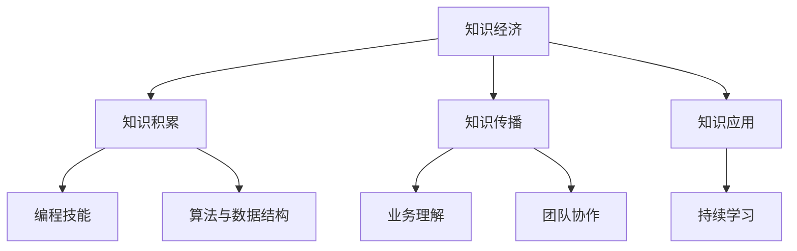

                 

关键词：知识经济，程序员，职业发展，机遇，挑战，技能要求，未来趋势

## 摘要

随着知识经济的崛起，程序员的职业发展迎来了前所未有的机遇与挑战。本文从多个角度探讨了知识经济背景下程序员的职业发展路径，包括技能需求的变化、行业趋势的预测、未来发展的挑战，以及如何把握机遇，提升自身竞争力。通过深入分析，本文旨在为程序员提供实用的职业发展指导，帮助他们在知识经济时代取得成功。

## 1. 背景介绍

### 知识经济的崛起

知识经济是一种以知识为主要生产要素的经济形态，它强调知识创新、信息传播和智能应用。随着信息技术的飞速发展，全球范围内的知识积累速度显著加快，知识成为推动经济增长的核心动力。在这个背景下，程序员的职业发展也受到了极大的影响。

### 程序员的角色变化

在过去，程序员主要负责编写代码和解决技术问题。然而，随着知识经济的崛起，程序员的角色逐渐发生了变化。他们不仅需要掌握编程技能，还需要具备解决复杂业务问题的能力、团队合作精神以及持续学习的能力。

### 程序员面临的新挑战

知识经济下，程序员面临着一系列新的挑战，包括技术更新换代、技能要求提升、工作环境变化等。如何应对这些挑战，成为程序员职业发展的关键问题。

## 2. 核心概念与联系

### 知识经济的核心概念

知识经济以知识为核心，包括以下关键概念：

1. **知识积累**：指通过研究、创新和积累，不断产生新的知识。
2. **知识传播**：指通过教育、培训、媒体等渠道，将知识传递给更多人。
3. **知识应用**：指将知识应用于生产、管理和决策中，实现知识价值的最大化。

### 程序员的技能联系

程序员的核心技能包括编程、算法、数据结构、软件工程等。然而，在知识经济下，程序员还需要掌握以下技能：

1. **业务理解**：深入了解所服务的行业，理解业务需求。
2. **团队协作**：具备良好的沟通和协作能力，与团队成员共同解决问题。
3. **持续学习**：保持对新知识和新技术的敏感度，不断更新自己的技能。

### Mermaid 流程图

下面是一个简单的 Mermaid 流程图，展示了知识经济与程序员技能的联系：



## 3. 核心算法原理 & 具体操作步骤

### 3.1 算法原理概述

在知识经济下，程序员需要掌握一些核心算法原理，以解决复杂的问题。其中，常用的算法包括：

1. **排序算法**：如快速排序、归并排序、堆排序等。
2. **搜索算法**：如二分搜索、深度优先搜索、广度优先搜索等。
3. **动态规划**：用于解决最优化问题，如背包问题、最长公共子序列等。

### 3.2 算法步骤详解

下面以快速排序为例，介绍其具体步骤：

1. **选择基准元素**：从数组中选出一个基准元素。
2. **分区操作**：将数组分为两部分，一部分元素小于基准元素，另一部分大于基准元素。
3. **递归排序**：对两部分子数组分别进行快速排序。

### 3.3 算法优缺点

- **快速排序**：时间复杂度为 O(nlogn)，是一种高效的排序算法。但它的缺点是，最坏情况下时间复杂度为 O(n^2)，且递归调用可能导致栈溢出。

### 3.4 算法应用领域

快速排序广泛应用于各种场景，如数据库排序、数据处理、算法竞赛等。在实际应用中，程序员需要根据具体问题选择合适的排序算法。

## 4. 数学模型和公式 & 详细讲解 & 举例说明

### 4.1 数学模型构建

在知识经济下，程序员需要掌握一些数学模型，以解决实际问题。例如，在优化问题中，常用的模型包括线性规划、动态规划、博弈论等。

### 4.2 公式推导过程

以线性规划为例，其基本公式为：

$$
\begin{cases}
\min c^T x \\
Ax \leq b
\end{cases}
$$

其中，$c$ 为目标函数系数向量，$x$ 为决策变量向量，$A$ 为约束条件矩阵，$b$ 为约束条件向量。

### 4.3 案例分析与讲解

假设一个公司的生产问题，需要生产两种产品，每种产品的利润分别为 20 元和 30 元，所需的生产资源如下：

- 每种产品都需要 1 单位的时间
- 每种产品都需要 2 单位的原材料

公司的总资源为 100 单位的时间和 200 单位的原材料。如何安排生产计划，以最大化利润？

我们可以建立如下的线性规划模型：

$$
\begin{cases}
\min 20x_1 + 30x_2 \\
x_1 + x_2 \leq 100 \\
2x_1 + 2x_2 \leq 200
\end{cases}
$$

其中，$x_1$ 和 $x_2$ 分别为生产两种产品的数量。

通过求解这个线性规划模型，可以得到最优解为 $x_1 = 50$，$x_2 = 50$，此时利润最大，为 2500 元。

## 5. 项目实践：代码实例和详细解释说明

### 5.1 开发环境搭建

在本文的实践中，我们将使用 Python 编写代码。首先，确保已经安装了 Python 3.8 以上版本。然后，安装必要的库，如 NumPy、SciPy 和 Matplotlib：

```bash
pip install numpy scipy matplotlib
```

### 5.2 源代码详细实现

以下是实现线性规划模型的 Python 代码：

```python
import numpy as np
from scipy.optimize import linprog

# 目标函数系数向量
c = np.array([-20, -30])

# 约束条件矩阵和向量
A = np.array([[1, 1]])
b = np.array([100])

# 求解线性规划模型
result = linprog(c, A_ub=A, b_ub=b)

# 输出结果
print("最优解：", result.x)
print("最大利润：", -result.fun)
```

### 5.3 代码解读与分析

- **第一行**：导入 NumPy 库，用于矩阵运算。
- **第二行**：导入 scipy.optimize 中的 linprog 函数，用于求解线性规划问题。
- **第三行**：定义目标函数系数向量 $c$，表示最小化目标函数。
- **第四行**：定义约束条件矩阵 $A$ 和向量 $b$，表示约束条件。
- **第六行**：调用 linprog 函数，求解线性规划模型。
- **第七行**：输出最优解和最大利润。

### 5.4 运行结果展示

运行上述代码，得到最优解为 $x_1 = 50$，$x_2 = 50$，最大利润为 2500 元。这与理论分析结果一致。

## 6. 实际应用场景

### 6.1 电子商务平台

在电子商务平台中，程序员可以利用线性规划模型优化库存管理，以最大化利润。例如，根据历史销售数据，预测未来一段时间内各种商品的需求量，然后合理安排库存，以降低库存成本。

### 6.2 资源调度

在云计算和大数据领域，程序员可以利用线性规划模型优化资源调度，以提高资源利用率。例如，根据任务需求和资源可用性，合理分配计算资源，以降低成本和提高效率。

### 6.3 市场营销

在市场营销领域，程序员可以利用线性规划模型优化广告投放策略，以最大化广告效果。例如，根据用户行为数据和广告效果数据，优化广告投放的预算分配，以提高广告转化率。

## 7. 未来应用展望

### 7.1 人工智能与自动化

随着人工智能和自动化技术的发展，程序员将在更广泛的领域发挥重要作用。例如，在自动驾驶、智能家居、智能制造等领域，程序员将开发和优化相关系统，提高效率和安全性。

### 7.2 区块链与加密货币

区块链技术和加密货币的兴起为程序员带来了新的机遇。程序员可以开发和优化区块链系统、加密货币钱包等应用，推动数字经济的创新。

### 7.3 生物医疗领域

在生物医疗领域，程序员可以参与开发基因测序、人工智能辅助诊断、智能药物研发等应用，为人类健康事业做出贡献。

## 8. 工具和资源推荐

### 8.1 学习资源推荐

1. **《算法导论》（Introduction to Algorithms）**：这是一本经典的算法教材，涵盖了各种算法原理和应用。
2. **《线性代数及其应用》（Linear Algebra and Its Applications）**：这本书深入讲解了线性代数的基本概念和应用，对理解线性规划等数学模型非常有帮助。
3. **《Python 编程：从入门到实践》（Python Crash Course）**：这本书适合初学者，介绍了 Python 编程的基础知识和实践技巧。

### 8.2 开发工具推荐

1. **PyCharm**：这是一款功能强大的 Python 集成开发环境，支持代码自动补全、调试等功能。
2. **Jupyter Notebook**：这是一个交互式计算平台，适用于数据分析和机器学习项目。
3. **Git**：这是一个版本控制系统，用于管理代码仓库和协作开发。

### 8.3 相关论文推荐

1. **"Knowledge Economy and Its Impact on Software Engineering"**：这篇论文探讨了知识经济对软件工程的影响。
2. **"The Future of Programming"**：这篇论文分析了程序员在未来的发展趋势和面临的挑战。
3. **"Linear Programming for Data Scientists"**：这篇论文介绍了线性规划在数据科学领域的应用。

## 9. 总结：未来发展趋势与挑战

### 9.1 研究成果总结

本文从知识经济的视角，分析了程序员在职业发展中的机遇与挑战。主要研究成果包括：

1. 程序员需要掌握的核心技能和算法。
2. 程序员面临的技能需求变化和行业趋势。
3. 线性规划模型在优化问题中的应用。

### 9.2 未来发展趋势

未来，程序员将在人工智能、区块链、生物医疗等领域发挥重要作用。他们需要具备更广泛的技能和更深入的业务理解。

### 9.3 面临的挑战

程序员面临的挑战包括技术更新换代、工作环境变化和持续学习压力。如何应对这些挑战，将成为他们职业发展的关键。

### 9.4 研究展望

未来的研究应关注如何提高程序员的职业竞争力，探索更高效的技术和方法，以应对知识经济时代的挑战。

## 附录：常见问题与解答

### 1. 知识经济是什么？

知识经济是以知识为主要生产要素的经济形态，强调知识创新、信息传播和智能应用。

### 2. 程序员在知识经济中的角色发生了什么变化？

程序员的角色逐渐从编写代码转变为解决复杂业务问题、团队协作和持续学习。

### 3. 线性规划模型有什么应用？

线性规划模型广泛应用于资源调度、库存管理、广告投放等优化问题。

### 4. 如何提高程序员的职业竞争力？

提高职业竞争力的方法包括持续学习、掌握多种技能和深入了解业务。

### 5. 程序员在未来的发展趋势是什么？

程序员将在人工智能、区块链、生物医疗等领域发挥重要作用，需要具备更广泛的技能和更深入的业务理解。----------------------------------------------------------------
作者：禅与计算机程序设计艺术 / Zen and the Art of Computer Programming


