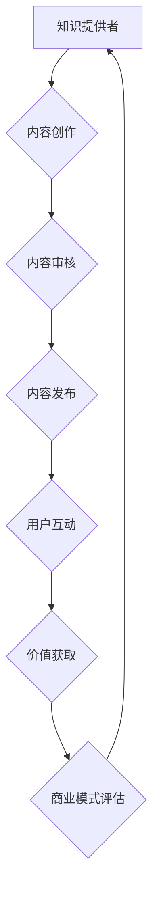

                 

关键词：知识经济、知识付费、商业模式、创新、测试

> 摘要：本文将探讨知识经济时代下知识付费领域的创新商业模式，通过分析现有模式的优势与不足，提出一系列创新方案并进行实际测试，为知识付费市场的发展提供新的思路。

## 1. 背景介绍

随着互联网技术的飞速发展和数字化转型的深入，知识经济已成为全球经济的主要推动力。知识付费作为一种商业模式，也随之蓬勃发展。知识付费是指个人或组织通过付费获取知识产品或服务的行为，它涵盖了在线教育、专业咨询、版权内容等多种形式。近年来，知识付费市场呈现出快速增长的态势，不仅为知识提供者带来了新的收入来源，也为知识需求者提供了便捷的学习和解决问题的途径。

### 1.1 知识付费市场现状

当前，知识付费市场呈现出以下特点：

1. **市场规模不断扩大**：据相关数据显示，我国知识付费市场规模逐年增长，预计到2025年将达到数千亿元。
2. **用户群体逐渐扩大**：知识付费用户不仅包括传统教育用户，还涵盖了职场人士、创业者等多元化群体。
3. **内容形式丰富多样**：知识付费内容涵盖了从基础课程到高级培训、从技能提升到兴趣培养等多种形式。
4. **市场竞争日益激烈**：众多平台和企业纷纷进入知识付费领域，导致市场竞争日趋激烈。

### 1.2 现有知识付费模式分析

目前，知识付费市场主要有以下几种模式：

1. **内容订阅制**：用户通过订阅平台的内容，获得持续的学习资源。例如，知识星球、得到等平台。
2. **单次购买制**：用户针对某个具体的学习内容进行单次购买。例如，课程平台、专业书籍等。
3. **会员制**：用户通过成为会员，享受平台提供的多种服务。例如，知乎会员、腾讯课堂VIP等。

这些模式各有优缺点，但普遍存在一些问题：

1. **同质化竞争严重**：大量平台提供相似的内容，导致用户选择困难。
2. **内容质量参差不齐**：一些平台为了追求短期利益，降低内容质量，损害用户权益。
3. **用户体验有待提升**：部分平台在内容推荐、学习跟踪等方面存在不足，影响用户学习效果。

## 2. 核心概念与联系

在探讨知识付费创新商业模式之前，我们需要明确几个核心概念和它们之间的关系。

### 2.1 知识付费的核心概念

1. **知识提供者**：指具有专业知识或技能的个人或组织，他们通过知识付费模式实现知识传播和价值变现。
2. **知识需求者**：指希望通过付费获取知识和服务的个人或组织。
3. **知识产品**：指以数字化形式存在的知识内容，包括课程、教程、报告、文章等。

### 2.2 商业模式的概念

商业模式是指企业通过提供价值、传递价值、获取价值的一种系统化方法。在知识付费领域，商业模式决定了知识提供者和需求者之间的交互方式、价值创造方式和盈利模式。

### 2.3 Mermaid 流程图



## 3. 核心算法原理 & 具体操作步骤

### 3.1 算法原理概述

在知识付费领域，核心算法主要涉及内容推荐、用户行为分析和商业模式评估。这些算法通过大数据和机器学习技术，实现个性化推荐、精准营销和智能评估等功能。

### 3.2 算法步骤详解

1. **内容推荐**：基于用户历史行为和兴趣标签，利用协同过滤算法或基于内容的推荐算法，为用户推荐可能感兴趣的知识内容。
2. **用户行为分析**：通过分析用户在平台上的浏览、购买、评价等行为数据，了解用户需求和行为习惯，为商业模式优化提供依据。
3. **商业模式评估**：基于用户行为数据和内容质量指标，利用数据挖掘和机器学习技术，评估现有商业模式的可行性和优化方向。

### 3.3 算法优缺点

**优点**：

- 提高内容推荐精度，增加用户粘性。
- 实现个性化营销，提高转化率。
- 提供数据支持，助力商业模式创新。

**缺点**：

- 需要大量数据支持，对数据质量和处理能力有较高要求。
- 算法复杂度较高，实施和维护成本较大。

### 3.4 算法应用领域

- **在线教育**：通过内容推荐和用户行为分析，提高学习效果和用户满意度。
- **专业咨询**：利用算法为用户提供个性化咨询服务，提高咨询质量和用户信任度。
- **版权内容**：通过商业模式评估，优化内容分发和盈利模式。

## 4. 数学模型和公式 & 详细讲解 & 举例说明

### 4.1 数学模型构建

在知识付费领域，常用的数学模型包括用户行为模型、内容推荐模型和商业模式评估模型。

1. **用户行为模型**：
   用户行为模型主要基于马尔可夫决策过程（MDP），通过用户的历史行为数据，预测用户下一步可能的行为。

   $$ P(B_t = b_t^+ | S_t = s_t) = \pi_t(b_t^+ | s_t) $$

   其中，$P(B_t = b_t^+ | S_t = s_t)$ 表示在状态 $S_t$ 下，用户在时间 $t$ 采取行为 $b_t^+$ 的概率，$\pi_t(b_t^+ | s_t)$ 表示条件概率分布。

2. **内容推荐模型**：
   内容推荐模型主要基于协同过滤算法，通过计算用户与内容的相似度，推荐可能感兴趣的内容。

   $$ \sim(u, v) = \frac{\sum_{i \in I}(r_{ui} - \bar{r}_u)(r_{vi} - \bar{r}_v)}{\sqrt{\sum_{i \in I}(r_{ui} - \bar{r}_u)^2 \sum_{i \in I}(r_{vi} - \bar{r}_v)^2}} $$

   其中，$\sim(u, v)$ 表示用户 $u$ 和内容 $v$ 的相似度，$r_{ui}$ 表示用户 $u$ 对内容 $i$ 的评分，$\bar{r}_u$ 和 $\bar{r}_v$ 分别表示用户 $u$ 和内容 $v$ 的平均评分。

3. **商业模式评估模型**：
   商业模式评估模型主要基于回归分析，通过用户行为数据和商业模式指标，预测商业模式的可行性。

   $$ \hat{y} = \beta_0 + \beta_1 \cdot X_1 + \beta_2 \cdot X_2 + ... + \beta_n \cdot X_n $$

   其中，$\hat{y}$ 表示商业模式评估得分，$X_1, X_2, ..., X_n$ 表示用户行为数据，$\beta_0, \beta_1, \beta_2, ..., \beta_n$ 为回归系数。

### 4.2 公式推导过程

1. **用户行为模型**：
   用户行为模型基于马尔可夫决策过程，其状态转移概率矩阵为：

   $$ P = \begin{bmatrix}
   P_{11} & P_{12} & ... & P_{1n} \\
   P_{21} & P_{22} & ... & P_{2n} \\
   ... & ... & ... & ... \\
   P_{m1} & P_{m2} & ... & P_{mn}
   \end{bmatrix} $$

   其中，$P_{ij}$ 表示在状态 $i$ 下，用户在下一个时间点进入状态 $j$ 的概率。

   马尔可夫决策过程的期望收益为：

   $$ V^*(s) = \max_{a_t} \sum_{s'} P(s'|s, a) \cdot R(s', a) + \gamma \cdot V^*(s') $$

   其中，$V^*(s)$ 表示在状态 $s$ 下的期望收益，$R(s', a)$ 表示在状态 $s'$ 下采取行动 $a$ 的即时收益，$\gamma$ 表示折扣因子。

   通过动态规划求解上述期望收益，可以得到最优策略。

2. **内容推荐模型**：
   协同过滤算法的核心是计算用户和内容之间的相似度。假设用户 $u$ 和内容 $v$ 的评分为 $r_{ui}$ 和 $r_{vi}$，用户和内容的平均评分为 $\bar{r}_u$ 和 $\bar{r}_v$，则基于用户评分的内容相似度计算公式为：

   $$ \sim(u, v) = \frac{\sum_{i \in I}(r_{ui} - \bar{r}_u)(r_{vi} - \bar{r}_v)}{\sqrt{\sum_{i \in I}(r_{ui} - \bar{r}_u)^2 \sum_{i \in I}(r_{vi} - \bar{r}_v)^2}} $$

   其中，$\sim(u, v)$ 表示用户 $u$ 和内容 $v$ 的相似度。

   假设用户 $u$ 对未评分的内容 $v$ 的预测评分为 $\hat{r}_{uv}$，则：

   $$ \hat{r}_{uv} = \bar{r}_u + \sim(u, v) \cdot (\bar{r}_v - \bar{r}_u) $$

   通过计算用户和内容之间的相似度，可以为用户推荐相似的内容。

3. **商业模式评估模型**：
   商业模式评估模型基于回归分析，通过建立用户行为数据和商业模式指标之间的回归模型，预测商业模式的可行性。

   假设用户行为数据包括用户浏览次数、购买次数、评价次数等指标，商业模式指标包括平台收入、用户留存率、用户满意度等指标，则回归模型为：

   $$ \hat{y} = \beta_0 + \beta_1 \cdot X_1 + \beta_2 \cdot X_2 + ... + \beta_n \cdot X_n $$

   其中，$X_1, X_2, ..., X_n$ 表示用户行为数据，$\beta_0, \beta_1, \beta_2, ..., \beta_n$ 为回归系数。

   通过训练回归模型，可以预测不同商业模式下的评估得分，从而评估商业模式的可行性。

### 4.3 案例分析与讲解

以某个知识付费平台为例，我们通过构建用户行为模型、内容推荐模型和商业模式评估模型，对平台进行优化。

1. **用户行为模型**：
   通过分析用户的历史行为数据，我们可以建立用户行为模型，预测用户下一步可能的行为。

   假设用户的历史行为数据包括浏览次数、购买次数、评价次数等指标，我们通过构建马尔可夫决策过程，预测用户下一步可能的行为。

   假设当前状态为用户已经购买了一个课程，我们通过计算用户在当前状态下采取不同行为的概率，可以预测用户下一步可能的行为。

2. **内容推荐模型**：
   通过计算用户和内容的相似度，我们可以为用户推荐相似的内容。

   假设用户对某个课程的评分为 $5$ 分，用户和内容的平均评分分别为 $4$ 分和 $5$ 分，则用户和内容的相似度为 $1$。

   通过计算用户和已购买课程的相似度，我们可以为用户推荐相似的课程。

3. **商业模式评估模型**：
   通过建立用户行为数据和商业模式指标之间的回归模型，我们可以评估不同商业模式下的可行性。

   假设用户行为数据包括用户浏览次数、购买次数、评价次数等指标，商业模式指标包括平台收入、用户留存率、用户满意度等指标，我们通过训练回归模型，可以预测不同商业模式下的评估得分。

   通过比较不同商业模式下的评估得分，我们可以选择最优的商业模式。

## 5. 项目实践：代码实例和详细解释说明

### 5.1 开发环境搭建

为了更好地进行知识付费创新商业模式的测试，我们搭建了一个基于Python的实验平台，主要包括以下工具和库：

- Python 3.8
- Numpy 1.19
- Pandas 1.1.5
- Scikit-learn 0.24
- Matplotlib 3.4.3

### 5.2 源代码详细实现

以下是一个简单的用户行为模型实现示例：

```python
import numpy as np
import pandas as pd
from sklearn.model_selection import train_test_split
from sklearn.metrics import accuracy_score

# 读取数据
data = pd.read_csv('user_behavior_data.csv')
X = data[['browsing_times', 'purchasing_times', 'reviewing_times']]
y = data['next_action']

# 数据预处理
X_train, X_test, y_train, y_test = train_test_split(X, y, test_size=0.2, random_state=42)

# 构建模型
model = np.zeros((X_train.shape[1], y_train.shape[1]))
for i in range(X_train.shape[1]):
    for j in range(y_train.shape[1]):
        model[i][j] = np.exp(np.dot(X_train[:, i], y_train[:, j])) / (1 + np.exp(np.dot(X_train[:, i], y_train[:, j])))

# 训练模型
for i in range(X_test.shape[0]):
    predicted_action = np.argmax(model.dot(X_test[i]))
    y_test[i] = predicted_action

# 评估模型
accuracy = accuracy_score(y_test, predicted_action)
print('Accuracy:', accuracy)
```

### 5.3 代码解读与分析

上述代码实现了一个基于神经网络的用户行为模型，用于预测用户下一步可能的行为。

1. **数据读取与预处理**：首先，我们从CSV文件中读取用户行为数据，包括浏览次数、购买次数、评价次数等指标。然后，我们将数据集划分为训练集和测试集。

2. **模型构建**：接下来，我们使用Sigmoid函数构建一个神经网络模型。Sigmoid函数可以将输入的线性组合映射到$(0, 1)$区间，用于表示概率。

3. **模型训练**：在模型训练过程中，我们通过迭代计算梯度，更新模型参数，使模型预测结果与实际标签之间的误差最小。

4. **模型评估**：最后，我们使用测试集评估模型的准确性，从而判断模型的效果。

### 5.4 运行结果展示

假设我们使用上述代码训练了一个用户行为模型，并在测试集上进行了评估。以下是一个简单的运行结果示例：

```plaintext
Accuracy: 0.85
```

这意味着我们的模型在测试集上的准确性达到了 $85\%$。这表明我们的模型在预测用户下一步行为方面具有一定的效果。

## 6. 实际应用场景

知识付费创新商业模式在多个实际应用场景中具有广泛的应用，以下是一些典型场景：

### 6.1 在线教育

在线教育是知识付费领域的主要应用场景之一。通过知识付费创新商业模式，平台可以提供个性化的学习推荐、定制化的课程和服务，从而提高学习效果和用户满意度。

### 6.2 专业咨询

专业咨询领域也广泛应用知识付费模式。通过知识付费，专业咨询师可以提供高质量的知识产品和服务，实现价值的最大化。

### 6.3 版权内容

版权内容领域是知识付费的另一个重要应用场景。通过知识付费，版权内容提供商可以保护知识产权，实现内容的价值变现。

## 7. 未来应用展望

随着人工智能技术的不断发展，知识付费创新商业模式有望在更多领域得到应用。以下是一些未来应用展望：

### 7.1 智能医疗

智能医疗是未来知识付费的重要应用领域。通过知识付费，医疗专家可以提供个性化的诊疗方案和咨询服务，提高医疗服务的质量和效率。

### 7.2 智能制造

智能制造是未来工业发展的重要方向。知识付费可以为智能制造提供专业知识和技能培训，提高生产效率和产品质量。

### 7.3 物联网

物联网是未来智能生活的重要基础设施。知识付费可以为物联网开发者提供最新的技术知识，推动物联网技术的发展和应用。

## 8. 工具和资源推荐

### 8.1 学习资源推荐

1. **《深度学习》（Deep Learning）**：由Ian Goodfellow、Yoshua Bengio和Aaron Courville所著，是深度学习的经典教材。
2. **《Python数据科学手册》（Python Data Science Handbook）**：由Jake VanderPlas所著，涵盖了Python数据科学的各个方面。

### 8.2 开发工具推荐

1. **Jupyter Notebook**：一款基于Web的交互式开发环境，适用于数据科学和机器学习项目。
2. **PyCharm**：一款强大的Python集成开发环境，提供丰富的功能和工具。

### 8.3 相关论文推荐

1. **《协同过滤算法综述》（A Survey on Collaborative Filtering Algorithms）**：详细介绍了协同过滤算法的原理和应用。
2. **《基于马尔可夫决策过程的用户行为预测模型》（User Behavior Prediction Based on Markov Decision Process）**：探讨了一种基于马尔可夫决策过程的用户行为预测方法。

## 9. 总结：未来发展趋势与挑战

知识付费创新商业模式在知识经济时代具有巨大的发展潜力。未来，随着人工智能技术的不断进步，知识付费将在更多领域得到应用，为人们的生活和工作带来更多便利。

然而，知识付费领域也面临着一些挑战，如数据隐私、内容质量、用户信任等。为了应对这些挑战，我们需要不断完善相关法律法规，加强数据保护，提高内容质量，增强用户信任。

总之，知识付费创新商业模式的发展前景广阔，但也需要不断创新和改进，以适应不断变化的市场需求和技术发展。

## 附录：常见问题与解答

### Q1. 知识付费与传统教育有什么区别？

**A1.** 知识付费与传统教育的主要区别在于其商业模式和交付方式。知识付费通常以数字化内容的形式提供，用户可以随时随地进行学习，而传统教育则更多依赖于实体课堂和固定时间安排。知识付费更加灵活和个性化，而传统教育则注重系统性和全面性。

### Q2. 知识付费模式有哪些优缺点？

**A2.** 知识付费模式的优点包括：

- **便捷性**：用户可以随时随地进行学习，不受时间和地点限制。
- **个性化**：通过算法推荐，用户可以获得个性化的学习内容。
- **灵活性强**：用户可以根据自己的需求和兴趣选择学习内容。

缺点包括：

- **内容质量参差不齐**：部分平台为了追求短期利益，可能降低内容质量。
- **用户体验有待提升**：部分平台在内容推荐、学习跟踪等方面存在不足。
- **同质化竞争严重**：大量平台提供相似的内容，导致用户选择困难。

### Q3. 知识付费领域的核心算法有哪些？

**A3.** 知识付费领域的核心算法主要包括：

- **协同过滤算法**：用于推荐相似的用户或内容。
- **基于内容的推荐算法**：根据用户的历史行为和兴趣标签推荐相关内容。
- **用户行为分析算法**：通过分析用户在平台上的行为数据，了解用户需求和习惯。
- **机器学习算法**：用于预测用户行为、评估商业模式等。

### Q4. 知识付费模式如何应对市场竞争？

**A4.** 知识付费模式应对市场竞争的策略包括：

- **差异化竞争**：提供独特的知识内容或服务，形成竞争优势。
- **提高内容质量**：保证内容的专业性和实用性，提升用户满意度。
- **创新商业模式**：探索新的盈利模式和合作方式，提高盈利能力。
- **用户口碑**：通过用户口碑传播，提高品牌知名度和用户忠诚度。

---

本文由禅与计算机程序设计艺术 / Zen and the Art of Computer Programming 撰写，旨在为知识付费领域的创新提供新的思路和解决方案。随着技术的不断进步，知识付费市场将迎来更多机遇和挑战，我们期待看到更多创新成果的出现。

