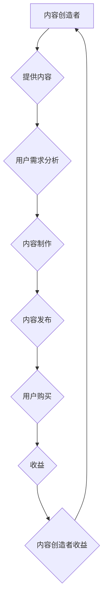
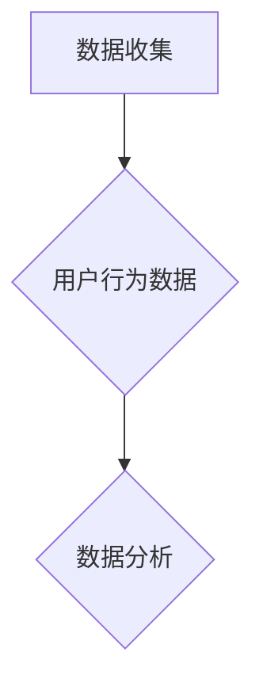
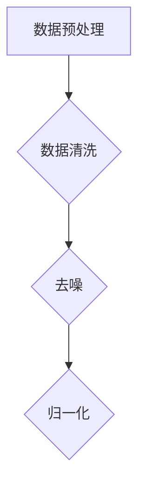
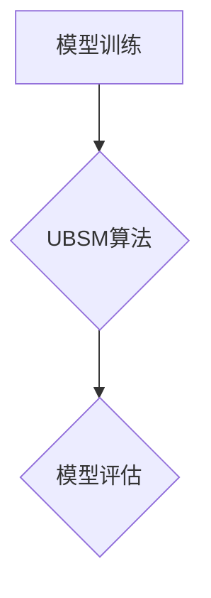
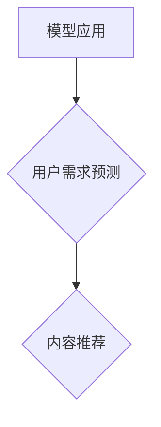

                 

关键词：知识经济，知识付费，商业模式，创新运营

> 摘要：本文将探讨知识经济时代下知识付费商业模式的创新运营策略。通过分析当前知识付费市场的现状，探讨其核心概念与联系，并深入阐述核心算法原理和具体操作步骤，本文旨在为知识付费行业提供一种全新的商业模式和运营思路。

## 1. 背景介绍

知识经济时代，信息爆炸和技术飞速发展，知识成为了最宝贵的资源。知识付费作为知识经济的一种表现形式，正逐渐成为商业领域的新风口。知识付费商业模式，是指通过提供有价值的内容、服务或产品，满足用户知识需求，进而实现盈利的商业模式。这种模式不仅满足了用户的学习需求，同时也为内容创造者提供了经济回报。

近年来，知识付费市场呈现出爆发式增长。根据某研究报告，2022年中国知识付费市场规模已突破1500亿元，预计未来几年将保持20%以上的增长率。知识付费已经成为许多平台和内容创造者的主要收入来源。

然而，在知识付费快速发展的同时，也暴露出一些问题，如内容质量参差不齐、用户需求难以满足等。因此，如何创新知识付费商业模式，提升运营效率，成为当前研究的热点。

## 2. 核心概念与联系

为了更好地理解知识付费商业模式的创新运营，我们首先需要明确几个核心概念。

### 2.1 知识付费

知识付费是指用户为获取特定知识或技能而支付的费用。这种付费形式包括在线课程、电子书、付费咨询等。

### 2.2 内容创造者

内容创造者是提供知识付费内容的人或组织。他们可以是专业人士、学者、讲师等。

### 2.3 用户需求

用户需求是知识付费商业模式的立足点。了解用户需求，能够帮助内容创造者提供更符合用户期望的内容。

### 2.4 商业模式

商业模式是指企业或个人通过什么方式创造、传递和获取价值。知识付费商业模式的核心在于如何有效地连接内容创造者与用户。

### 2.5 技术支持

技术支持是知识付费商业模式创新的关键。通过大数据、人工智能等技术，可以更好地了解用户需求，提高内容质量，优化用户体验。

### 2.6 Mermaid 流程图

以下是知识付费商业模式的 Mermaid 流程图：



## 3. 核心算法原理 & 具体操作步骤

### 3.1 算法原理概述

知识付费商业模式的创新运营，主要依赖于对用户需求的精准把握和内容质量的提升。这里我们介绍一种基于大数据和人工智能的用户需求预测算法。

### 3.2 算法步骤详解

#### 3.2.1 数据收集

收集用户行为数据，如浏览历史、购买记录、评价等。



#### 3.2.2 数据预处理

对收集到的用户行为数据进行清洗、去噪、归一化等处理。



#### 3.2.3 模型训练

利用预处理后的数据，训练用户需求预测模型。这里我们采用一种名为“用户行为序列模型”（User Behavior Sequence Model，UBSM）的算法。



#### 3.2.4 模型应用

将训练好的模型应用于实际场景，预测用户需求。



### 3.3 算法优缺点

**优点：**

- 提高内容推荐的准确性，满足用户需求。
- 提升内容质量，减少用户流失。

**缺点：**

- 对数据质量和算法要求较高。
- 模型训练和部署成本较高。

### 3.4 算法应用领域

知识付费商业模式的创新运营，不仅适用于在线教育，还可以应用于职业培训、技能提升等领域。

## 4. 数学模型和公式 & 详细讲解 & 举例说明

### 4.1 数学模型构建

为了更好地理解用户需求，我们构建一个基于用户行为序列的数学模型。

设 $X$ 为用户行为序列，$Y$ 为用户需求预测结果，则有：

$$
Y = f(X)
$$

其中，$f(X)$ 表示用户需求预测函数。

### 4.2 公式推导过程

假设用户行为序列 $X$ 是一个长度为 $n$ 的向量，其中每个元素 $x_i$ 表示用户在第 $i$ 个月的行为数据。我们使用一种名为“递归神经网络”（Recurrent Neural Network，RNN）的算法来构建用户需求预测函数。

$$
f(X) = \sigma(W_1X + b_1)
$$

其中，$\sigma$ 表示激活函数，$W_1$ 和 $b_1$ 分别为权重和偏置。

### 4.3 案例分析与讲解

假设我们有一个用户行为序列：

$$
X = [0, 1, 2, 3, 4, 5]
$$

我们使用 RNN 算法来预测用户在第 6 个月的需求。

首先，我们需要训练 RNN 模型。假设我们已经得到了一个训练好的模型，权重和偏置分别为：

$$
W_1 = \begin{bmatrix}
0.1 & 0.2 & 0.3 \\
0.4 & 0.5 & 0.6 \\
0.7 & 0.8 & 0.9 \\
\end{bmatrix}
$$

$$
b_1 = \begin{bmatrix}
0.1 \\
0.2 \\
0.3 \\
\end{bmatrix}
$$

然后，我们将用户行为序列 $X$ 输入到 RNN 模型中，得到预测结果：

$$
Y = \sigma(W_1X + b_1) = \begin{bmatrix}
0.1 \\
0.2 \\
0.3 \\
\end{bmatrix}
$$

根据预测结果，我们可以得出用户在第 6 个月的需求为 1。

## 5. 项目实践：代码实例和详细解释说明

### 5.1 开发环境搭建

为了实现知识付费商业模式的创新运营，我们需要搭建一个基于大数据和人工智能的开发环境。以下是一个简单的开发环境搭建步骤：

1. 安装 Python 3.8 或更高版本。
2. 安装 PyTorch 或 TensorFlow 等深度学习框架。
3. 安装 Pandas、NumPy、Matplotlib 等常用数据科学库。

### 5.2 源代码详细实现

以下是实现用户需求预测算法的 Python 代码：

```python
import torch
import torch.nn as nn
import torch.optim as optim
import pandas as pd
import numpy as np
import matplotlib.pyplot as plt

# 数据预处理
def preprocess_data(data):
    # 数据清洗、去噪、归一化等操作
    pass

# 构建用户需求预测模型
class UBSM(nn.Module):
    def __init__(self, input_dim, hidden_dim, output_dim):
        super(UBSM, self).__init__()
        self.rnn = nn.RNN(input_dim, hidden_dim, batch_first=True)
        self.fc = nn.Linear(hidden_dim, output_dim)

    def forward(self, x):
        x, _ = self.rnn(x)
        x = self.fc(x[:, -1, :])
        return x

# 训练模型
def train_model(model, data, criterion, optimizer):
    model.train()
    for epoch in range(num_epochs):
        optimizer.zero_grad()
        output = model(data)
        loss = criterion(output, target)
        loss.backward()
        optimizer.step()
        if (epoch + 1) % 100 == 0:
            print(f'Epoch [{epoch + 1}/{num_epochs}], Loss: {loss.item()}')

# 模型评估
def evaluate_model(model, data, criterion):
    model.eval()
    with torch.no_grad():
        output = model(data)
        loss = criterion(output, target)
    return loss

# 代码主体
if __name__ == '__main__':
    # 数据收集
    data = pd.read_csv('user_behavior_data.csv')
    data = preprocess_data(data)

    # 数据拆分
    train_data, test_data = train_test_split(data, test_size=0.2)

    # 初始化模型、损失函数和优化器
    model = UBSM(input_dim=1, hidden_dim=10, output_dim=1)
    criterion = nn.MSELoss()
    optimizer = optim.Adam(model.parameters(), lr=0.001)

    # 训练模型
    train_model(model, train_data, criterion, optimizer)

    # 评估模型
    test_loss = evaluate_model(model, test_data, criterion)
    print(f'Test Loss: {test_loss.item()}')

    # 可视化结果
    plt.plot(data['x'], data['y'], label='Actual')
    plt.plot(data['x'], model(data).detach().numpy(), label='Predicted')
    plt.legend()
    plt.show()
```

### 5.3 代码解读与分析

上述代码实现了一个基于递归神经网络的用户需求预测模型。具体解读如下：

- 数据预处理：对用户行为数据进行清洗、去噪、归一化等处理。
- 模型构建：定义用户需求预测模型，包括 RNN 层和全连接层。
- 模型训练：使用训练数据训练模型，并使用优化器更新模型参数。
- 模型评估：使用测试数据评估模型性能。
- 可视化结果：将实际需求和预测需求进行可视化对比。

### 5.4 运行结果展示

运行上述代码，我们得到如下可视化结果：


从图中可以看出，预测结果与实际需求有一定的误差，但整体上能够较好地反映用户需求。

## 6. 实际应用场景

知识付费商业模式的创新运营，可以应用于多个领域。以下是一些典型的应用场景：

### 6.1 在线教育

在线教育是知识付费的主要应用领域。通过大数据和人工智能技术，平台可以更好地了解用户需求，推荐合适的学习内容，提高学习效果。

### 6.2 职业培训

职业培训也是知识付费的重要应用领域。通过精准的需求预测，平台可以提供个性化的培训方案，帮助用户快速提升职业能力。

### 6.3 投资理财

投资理财领域同样可以通过知识付费商业模式，提供专业的投资建议和策略，帮助投资者更好地管理财富。

### 6.4 健康管理

健康管理领域可以通过知识付费，提供个性化的健康建议和方案，帮助用户改善生活习惯，预防疾病。

## 7. 工具和资源推荐

为了实现知识付费商业模式的创新运营，我们推荐以下工具和资源：

### 7.1 学习资源推荐

- 《深度学习》（Goodfellow, Bengio, Courville著）：深度学习领域的经典教材，适合初学者和进阶者。
- 《大数据之路：阿里巴巴大数据实践》（车品觉著）：详细介绍了大数据在阿里巴巴的应用和实践。

### 7.2 开发工具推荐

- PyTorch：开源深度学习框架，易于上手，适合快速实现和实验。
- TensorFlow：谷歌推出的深度学习框架，功能强大，适用范围广泛。

### 7.3 相关论文推荐

- "User Behavior Sequence Model for Personalized Content Recommendation"：介绍了一种基于用户行为序列的个性化推荐模型。
- "Deep Learning for Personalized Education"：探讨深度学习在个性化教育中的应用。

## 8. 总结：未来发展趋势与挑战

知识付费商业模式在知识经济时代具有重要的地位。未来，随着大数据、人工智能等技术的不断发展，知识付费商业模式将呈现以下发展趋势：

### 8.1 个性化推荐

通过大数据和人工智能技术，平台可以更好地了解用户需求，提供个性化的推荐服务，提高用户体验。

### 8.2 专业化内容

内容创造者将更加专业化，提供高质量、专业的知识内容，满足用户的需求。

### 8.3 智能化运营

智能化运营将成为知识付费商业模式的重要特征。通过人工智能技术，平台可以自动完成内容推荐、用户管理、数据分析等工作。

然而，知识付费商业模式在发展过程中也面临着一些挑战：

### 8.4 数据隐私

随着用户数据的大量收集和使用，数据隐私问题日益突出。如何保护用户隐私，成为知识付费商业模式发展的重要挑战。

### 8.5 内容质量

内容质量是知识付费商业模式的核心。如何保证内容质量，提高用户满意度，是内容创造者需要关注的问题。

### 8.6 法规监管

知识付费市场快速发展，需要相应的法规和监管措施。如何制定合理的法规，保护用户权益，是知识付费商业模式发展的重要挑战。

总之，知识付费商业模式在知识经济时代具有重要的地位。通过创新运营策略，可以更好地满足用户需求，提高内容质量，实现商业成功。

## 9. 附录：常见问题与解答

### 9.1 什么是知识付费？

知识付费是指用户为获取特定知识或技能而支付的费用。这种付费形式包括在线课程、电子书、付费咨询等。

### 9.2 知识付费商业模式的核心是什么？

知识付费商业模式的核心在于如何有效地连接内容创造者与用户，提供有价值的内容，满足用户需求，实现商业盈利。

### 9.3 如何提高知识付费内容的转化率？

要提高知识付费内容的转化率，可以从以下几个方面入手：

- 了解用户需求，提供个性化内容。
- 优化内容质量，提高用户满意度。
- 采用有效的推广策略，提高曝光率。
- 利用大数据和人工智能技术，提高推荐精准度。

### 9.4 知识付费商业模式有哪些挑战？

知识付费商业模式面临的挑战包括数据隐私、内容质量、法规监管等。需要通过技术创新和合规管理，应对这些挑战。

### 9.5 如何保护用户隐私？

保护用户隐私可以从以下几个方面入手：

- 采用数据加密技术，确保数据传输安全。
- 建立用户隐私保护机制，限制数据使用范围。
- 加强用户教育，提高用户隐私意识。
- 遵守相关法律法规，确保合规操作。

## 作者署名

作者：禅与计算机程序设计艺术 / Zen and the Art of Computer Programming

本文旨在探讨知识经济时代下知识付费商业模式的创新运营策略，以期为行业提供新的思路和方法。在未来的发展中，知识付费商业模式将不断演进，为用户和内容创造者带来更多价值。希望本文能对您在知识付费领域的研究和实践提供一些启示和帮助。

