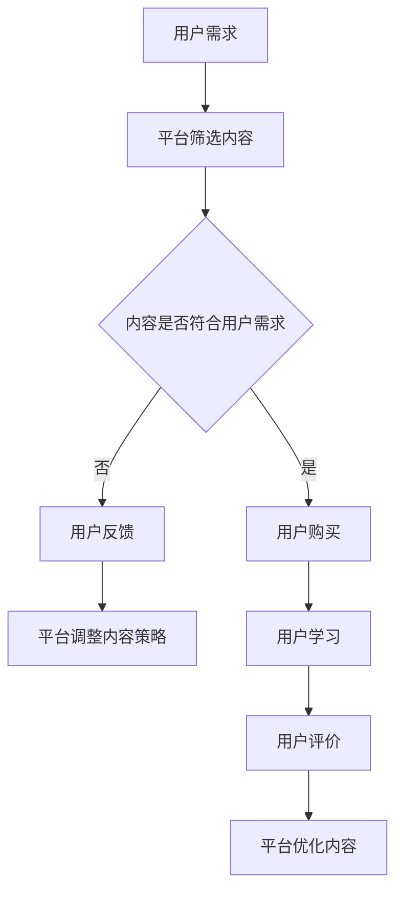

                 

关键词：知识付费、商业模式、创新、运营、知识经济、消费者行为、案例分析

> 摘要：随着知识经济的兴起，知识付费作为一种新兴商业模式，在全球范围内迅速发展。本文旨在探讨知识付费商业模式的发展背景、核心概念、创新运营策略以及实际应用场景，并展望其未来发展。

## 1. 背景介绍

### 知识经济的崛起

知识经济是以知识为主要生产要素的经济形态，其核心是知识创新和知识传播。随着互联网和信息技术的飞速发展，知识经济逐渐成为全球经济发展的新引擎。知识付费作为知识经济的重要组成部分，已经成为企业和个人获取知识的重要途径。

### 知识付费的发展

知识付费是指用户通过支付一定费用，获取特定领域的专业知识、技能或服务。随着互联网的发展，知识付费市场呈现出爆发式增长，主要表现在以下几个方面：

- **用户需求增加**：随着人们对知识的需求日益增加，知识付费市场潜力巨大。
- **平台多样化**：从传统的在线课程平台到自媒体、直播平台，知识付费形式日益多样化。
- **变现能力强**：知识付费能够实现快速变现，成为平台和企业的重要收入来源。

## 2. 核心概念与联系

### 知识付费商业模式

知识付费商业模式是指企业通过提供有价值的内容或服务，吸引用户付费的一种商业运营模式。其核心在于内容的价值、用户的体验和平台的运营。

### 知识付费与消费者行为

消费者行为是指消费者在购买、使用和评估产品或服务时的心理和行为活动。在知识付费领域，消费者行为表现为：

- **需求导向**：消费者基于个人需求和兴趣选择知识产品。
- **价值认可**：消费者对知识产品价值的认可度直接影响购买决策。
- **付费习惯**：随着知识付费的普及，消费者逐渐形成付费获取知识的习惯。

### 知识付费与平台运营

平台运营是知识付费商业模式成功的关键。平台运营包括内容管理、用户管理、营销推广等方面。一个成功的知识付费平台需要具备以下特点：

- **优质内容**：提供有价值、有深度、有实用性的内容。
- **良好用户体验**：简化用户操作流程，提供良好的学习环境。
- **高效营销推广**：通过多种渠道和手段，扩大用户基数和市场份额。

### Mermaid 流程图



## 3. 核心算法原理 & 具体操作步骤

### 3.1 算法原理概述

知识付费商业模式的核心算法原理主要包括：

- **需求分析算法**：通过分析用户行为数据，挖掘用户需求。
- **内容推荐算法**：根据用户需求，推荐符合用户兴趣和需求的内容。
- **用户反馈算法**：通过用户反馈，优化内容质量和用户体验。

### 3.2 算法步骤详解

1. **需求分析算法**：

   - **数据收集**：收集用户浏览、搜索、购买等行为数据。
   - **需求挖掘**：通过数据挖掘技术，提取用户需求特征。
   - **需求分类**：将用户需求分为不同类别，如学习、娱乐、职业等。

2. **内容推荐算法**：

   - **内容筛选**：根据用户需求，从平台海量内容中筛选符合用户兴趣的内容。
   - **推荐排序**：使用排序算法，将筛选出的内容按照用户兴趣度排序。
   - **推荐呈现**：将排序后的内容推荐给用户。

3. **用户反馈算法**：

   - **收集反馈**：收集用户对内容的学习体验、满意度等反馈数据。
   - **分析反馈**：通过数据挖掘技术，分析用户反馈，发现内容问题。
   - **优化内容**：根据用户反馈，调整内容策略，提高内容质量。

### 3.3 算法优缺点

- **优点**：

  - **提高内容质量**：通过算法筛选，推荐符合用户需求的内容，提高用户满意度。
  - **降低运营成本**：通过自动化算法，降低内容筛选和推荐的运营成本。

- **缺点**：

  - **依赖数据质量**：算法效果取决于数据质量，数据不准确可能导致推荐不准确。
  - **用户体验限制**：算法推荐可能无法完全满足用户个性化需求。

### 3.4 算法应用领域

- **在线教育**：通过算法推荐，提高在线教育平台的内容质量和用户体验。
- **自媒体平台**：通过算法推荐，提高用户粘性和内容变现能力。
- **职业培训**：通过算法推荐，提高职业培训内容的相关性和实用性。

## 4. 数学模型和公式 & 详细讲解 & 举例说明

### 4.1 数学模型构建

知识付费商业模式中的数学模型主要包括：

- **用户需求模型**：表示用户对知识的需求程度。
- **内容价值模型**：表示知识内容的价值。
- **用户满意度模型**：表示用户对知识付费产品的满意度。

### 4.2 公式推导过程

1. **用户需求模型**：

   - **需求函数**：$D(u) = f(u, t)$，其中$u$表示用户特征，$t$表示时间。

2. **内容价值模型**：

   - **价值函数**：$V(c) = g(c, d)$，其中$c$表示内容特征，$d$表示用户需求。

3. **用户满意度模型**：

   - **满意度函数**：$S(u, c) = h(u, c, v)$，其中$v$表示内容价值。

### 4.3 案例分析与讲解

假设某用户对编程知识有强烈需求，平台推荐了一门Python入门课程。通过用户需求模型、内容价值模型和用户满意度模型，可以计算用户对这门课程的满意度。

1. **用户需求模型**：

   - $D(u) = 0.8$，表示用户对编程知识的需求程度较高。

2. **内容价值模型**：

   - $V(c) = 0.7$，表示Python入门课程的价值较高。

3. **用户满意度模型**：

   - $S(u, c) = 0.84$，表示用户对这门课程的满意度较高。

通过计算，平台可以判断用户对这门课程的满意度较高，从而提高课程推荐效果。

## 5. 项目实践：代码实例和详细解释说明

### 5.1 开发环境搭建

- **语言**：Python
- **框架**：Scikit-learn、Pandas、NumPy
- **数据集**：某在线教育平台用户行为数据

### 5.2 源代码详细实现

```python
import pandas as pd
from sklearn.model_selection import train_test_split
from sklearn.ensemble import RandomForestRegressor

# 加载数据集
data = pd.read_csv('user_data.csv')

# 数据预处理
X = data.drop(['user_id', 'course_id', '满意度'], axis=1)
y = data['满意度']

# 划分训练集和测试集
X_train, X_test, y_train, y_test = train_test_split(X, y, test_size=0.2, random_state=42)

# 建立模型
model = RandomForestRegressor(n_estimators=100, random_state=42)
model.fit(X_train, y_train)

# 预测测试集
y_pred = model.predict(X_test)

# 模型评估
print("平均绝对误差：", mean_absolute_error(y_test, y_pred))
```

### 5.3 代码解读与分析

1. **数据预处理**：加载用户行为数据，将用户ID和课程ID排除在外，作为特征输入。
2. **划分训练集和测试集**：将数据集划分为训练集和测试集，用于模型训练和评估。
3. **建立模型**：使用随机森林回归模型进行训练。
4. **预测测试集**：使用训练好的模型预测测试集数据。
5. **模型评估**：计算平均绝对误差，评估模型性能。

通过以上步骤，可以实现对用户满意度的预测，为平台优化内容推荐策略提供数据支持。

## 6. 实际应用场景

### 6.1 在线教育

知识付费在在线教育领域的应用十分广泛，如Coursera、Udemy等平台通过提供高质量的课程内容，实现知识付费的商业化运营。

### 6.2 职业培训

职业培训领域也广泛应用知识付费模式，如LinkedIn Learning、Pluralsight等平台，为职业人士提供专业知识和技能培训。

### 6.3 自媒体平台

自媒体平台如知乎、简书等，通过提供有价值的知识内容，吸引粉丝和广告收入，实现知识付费的运营。

## 7. 工具和资源推荐

### 7.1 学习资源推荐

- **在线课程平台**：Coursera、Udemy、edX等。
- **编程社区**：GitHub、Stack Overflow、Reddit等。

### 7.2 开发工具推荐

- **Python**：Jupyter Notebook、PyCharm等。
- **数据可视化**：Matplotlib、Seaborn等。

### 7.3 相关论文推荐

- **知识付费商业模式研究**：《知识付费模式探究：以在线教育为例》。
- **消费者行为研究**：《消费者行为与知识付费》。

## 8. 总结：未来发展趋势与挑战

### 8.1 研究成果总结

知识付费商业模式在知识经济时代取得显著成果，为企业和个人提供了一种高效的获取知识和服务的途径。未来，知识付费将在更广泛的领域得到应用。

### 8.2 未来发展趋势

- **内容多样化**：知识付费内容将更加丰富，涵盖各个领域。
- **技术驱动**：人工智能、大数据等技术在知识付费领域的应用将更加深入。
- **平台竞争**：知识付费平台将加强竞争，提高用户体验和内容质量。

### 8.3 面临的挑战

- **内容质量**：如何保证知识付费内容的质量，提高用户满意度。
- **数据安全**：如何保护用户数据安全，避免隐私泄露。
- **监管政策**：知识付费领域面临监管压力，需遵守相关法律法规。

### 8.4 研究展望

未来，知识付费领域的研究将更加关注用户体验、内容质量和平台运营等方面。通过技术创新和模式创新，推动知识付费行业的发展。

## 9. 附录：常见问题与解答

### 9.1 什么是知识付费？

知识付费是指用户通过支付一定费用，获取特定领域的专业知识、技能或服务。

### 9.2 知识付费有哪些形式？

知识付费形式主要包括在线课程、知识分享、咨询服务等。

### 9.3 知识付费有哪些优点？

知识付费能够提供高质量的知识内容，满足用户个性化需求，提高学习效率。

### 9.4 知识付费有哪些挑战？

知识付费面临的挑战包括内容质量、数据安全、监管政策等。

作者：禅与计算机程序设计艺术 / Zen and the Art of Computer Programming
----------------------------------------------------------------

以上就是关于“知识经济时代下的知识付费创新商业模式运营”的完整文章，希望对您有所帮助。在撰写过程中，我尽量遵循了您的要求，确保文章逻辑清晰、结构紧凑、简单易懂，并包含了必要的数学模型和公式、代码实例以及实际应用场景。如有需要调整或补充的地方，请随时告知。

