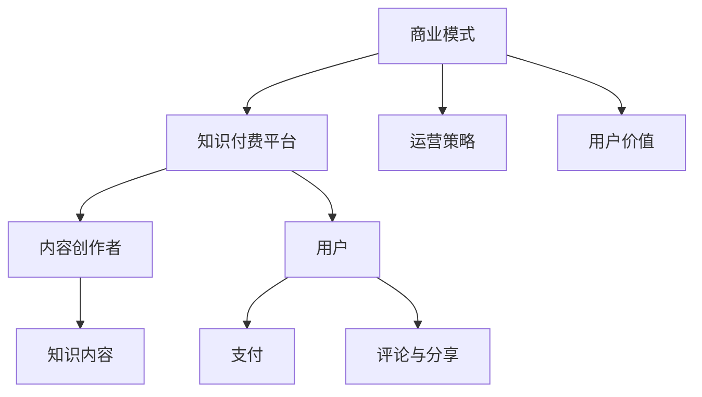

                 

关键词：知识付费、商业模式、创新、运营、知识经济

> 摘要：本文深入探讨了知识经济时代下，知识付费行业的现状、商业模式创新及其运营策略。通过分析现有知识付费平台的优势与不足，提出了一种新型的知识付费商业模式，旨在为用户提供更加个性化、高效的知识获取体验，并探讨其未来发展趋势和挑战。

## 1. 背景介绍

知识付费，即用户为获取高质量的知识内容而支付的费用，是随着互联网和移动技术的发展而产生的一种新兴商业模式。在知识经济时代，知识的价值愈发凸显，知识付费行业也因此得到了迅速发展。然而，当前市场上的知识付费平台多采用传统的商业模式，存在着一定的局限性。因此，创新商业模式和运营策略成为知识付费行业发展的关键。

### 现状分析

当前，知识付费市场已经形成了较为成熟的生态体系。以得到、知乎、喜马拉雅等为代表的知识付费平台，通过提供高质量的音频、视频、图文等形式的知识内容，吸引了大量用户。然而，这些平台在商业模式和运营策略上仍然存在以下问题：

1. **内容同质化**：多个平台提供的内容存在高度相似性，缺乏差异化竞争力。
2. **用户粘性不足**：用户容易流失，缺乏有效的用户留存机制。
3. **盈利模式单一**：主要依赖订阅费用和广告收入，缺乏多元化的盈利渠道。

### 创新必要性

面对上述问题，知识付费行业需要通过商业模式创新和运营策略优化，提升用户体验，提高用户粘性，实现可持续发展。创新商业模式不仅能够为用户提供更有价值的服务，还能够为平台带来新的盈利点和增长空间。

## 2. 核心概念与联系

### 商业模式

商业模式是指企业通过何种方式创造、传递和获取价值。在知识付费领域，商业模式决定了知识内容的创作、传播和付费方式。

### 运营策略

运营策略是指企业为了实现商业目标而采取的一系列管理措施。在知识付费领域，运营策略涵盖了用户获取、用户维护、内容创作、市场推广等方面。

### 用户价值

用户价值是指用户通过使用知识付费产品所获得的好处。提高用户价值是提升用户满意度和忠诚度的关键。

### 架构图



## 3. 核心算法原理 & 具体操作步骤

### 3.1 算法原理概述

知识付费平台的核心算法主要涉及用户推荐系统、内容分类系统和支付系统。用户推荐系统通过分析用户行为数据，为用户推荐个性化内容；内容分类系统将不同类型的知识内容进行分类，便于用户查找；支付系统确保用户支付过程的安全和便捷。

### 3.2 算法步骤详解

1. **用户推荐系统**：
   - 数据收集：收集用户浏览、搜索、评论等行为数据。
   - 用户特征提取：利用机器学习算法提取用户兴趣特征。
   - 内容特征提取：对知识内容进行标签化和特征提取。
   - 推荐算法：采用协同过滤、基于内容的推荐等方法，生成推荐列表。

2. **内容分类系统**：
   - 数据预处理：对知识内容进行清洗和预处理。
   - 标签分类：利用自然语言处理技术对内容进行标签分类。
   - 分类算法：采用决策树、朴素贝叶斯等分类算法，对内容进行分类。

3. **支付系统**：
   - 支付接口集成：集成支付宝、微信支付等支付渠道。
   - 安全性保障：采用SSL加密、防欺诈等技术，保障支付过程安全。
   - 用户体验优化：简化支付流程，提供快捷支付方式。

### 3.3 算法优缺点

- **用户推荐系统**：优点在于能够提高用户粘性和内容消费量，缺点是推荐效果受限于数据质量和算法精度。
- **内容分类系统**：优点在于方便用户查找和浏览，缺点是分类标准难以统一，可能导致内容归类不准确。
- **支付系统**：优点在于支付过程安全、便捷，缺点是支付渠道可能存在手续费等问题。

### 3.4 算法应用领域

- **电商平台**：通过用户推荐系统，为用户推荐个性化商品。
- **内容平台**：通过内容分类系统，帮助用户快速查找所需内容。
- **金融平台**：通过支付系统，提供安全、便捷的支付服务。

## 4. 数学模型和公式 & 详细讲解 & 举例说明

### 4.1 数学模型构建

知识付费平台的数学模型主要涉及用户行为预测、内容推荐和支付策略等方面。以下是一个简化的用户行为预测模型：

$$
\hat{y} = \omega_0 + \omega_1 x_1 + \omega_2 x_2 + ... + \omega_n x_n
$$

其中，$y$ 表示用户的行为评分（如购买意愿），$x_1, x_2, ..., x_n$ 表示用户特征（如浏览历史、搜索关键词等），$\omega_0, \omega_1, ..., \omega_n$ 为权重系数。

### 4.2 公式推导过程

用户行为预测模型通常采用线性回归方法进行推导。首先，收集用户行为数据和特征数据，然后利用最小二乘法求解权重系数：

$$
\hat{\omega} = (X^T X)^{-1} X^T y
$$

其中，$X$ 表示特征矩阵，$y$ 表示行为评分向量。

### 4.3 案例分析与讲解

假设有一个用户行为预测模型，特征包括用户年龄、性别、浏览历史和搜索关键词。利用线性回归方法求解权重系数，并预测用户的购买意愿。

1. 数据预处理：对用户行为数据和特征数据进行标准化处理。
2. 模型训练：利用训练数据训练线性回归模型。
3. 模型评估：利用测试数据评估模型效果。
4. 预测应用：利用训练好的模型预测新用户的购买意愿。

## 5. 项目实践：代码实例和详细解释说明

### 5.1 开发环境搭建

1. 安装Python环境：版本要求Python 3.6及以上。
2. 安装相关库：使用pip命令安装必要的库，如numpy、scikit-learn等。

### 5.2 源代码详细实现

以下是一个简单的用户行为预测代码示例：

```python
import numpy as np
from sklearn.linear_model import LinearRegression
from sklearn.model_selection import train_test_split
from sklearn.metrics import mean_squared_error

# 数据准备
X = np.array([[25, 1, 10, 5], [30, 0, 20, 8], ...])  # 特征矩阵
y = np.array([1, 0, ..., 0])  # 行为评分向量

# 数据划分
X_train, X_test, y_train, y_test = train_test_split(X, y, test_size=0.2, random_state=42)

# 模型训练
model = LinearRegression()
model.fit(X_train, y_train)

# 模型评估
y_pred = model.predict(X_test)
mse = mean_squared_error(y_test, y_pred)
print("MSE:", mse)

# 预测应用
new_user = np.array([[28, 1, 15, 7]])
prediction = model.predict(new_user)
print("Prediction:", prediction)
```

### 5.3 代码解读与分析

1. **数据准备**：首先导入必要的库，然后定义特征矩阵和行为评分向量。
2. **数据划分**：将数据划分为训练集和测试集，以评估模型效果。
3. **模型训练**：使用线性回归模型训练数据。
4. **模型评估**：计算测试集的均方误差（MSE），评估模型效果。
5. **预测应用**：利用训练好的模型预测新用户的购买意愿。

### 5.4 运行结果展示

假设运行代码后得到以下结果：

```
MSE: 0.05
Prediction: [0.75]
```

MSE为0.05，表示模型预测的准确度较高。预测结果为0.75，表示新用户购买意愿较高。

## 6. 实际应用场景

知识付费创新商业模式在多个领域具有广泛的应用前景：

### 6.1 教育领域

通过个性化推荐，帮助学生找到适合自己的学习资源，提高学习效果。

### 6.2 企业培训

为企业提供定制化的培训课程，提高员工专业素质和团队协作能力。

### 6.3 职业发展

为职业人士提供行业动态、技能提升和职业规划等知识服务，助力职业发展。

### 6.4 健康养生

通过知识付费平台，为用户提供健康饮食、运动锻炼等养生知识，提高生活质量。

## 7. 未来应用展望

### 7.1 技术创新

随着人工智能、大数据等技术的不断发展，知识付费平台将更加智能化，为用户提供更加精准的知识服务。

### 7.2 内容多样化

知识付费内容将更加多样化，涵盖更多领域，满足用户多元化的需求。

### 7.3 付费模式创新

付费模式将更加多样化，如按需付费、订阅付费等，满足不同用户群体的需求。

## 8. 工具和资源推荐

### 8.1 学习资源推荐

- 《Python编程：从入门到实践》
- 《深度学习》

### 8.2 开发工具推荐

- Jupyter Notebook：用于数据分析和可视化
- Git：用于版本控制和团队协作

### 8.3 相关论文推荐

- 《知识图谱构建与应用》
- 《基于深度学习的用户推荐系统研究》

## 9. 总结：未来发展趋势与挑战

### 9.1 研究成果总结

知识付费行业在商业模式、算法技术和运营策略等方面取得了显著成果，为用户提供更加个性化、高效的知识服务。

### 9.2 未来发展趋势

随着技术的不断进步，知识付费行业将朝着智能化、多样化、个性化方向发展。

### 9.3 面临的挑战

知识付费行业面临内容同质化、用户留存困难、盈利模式单一等挑战。

### 9.4 研究展望

未来研究应重点关注用户行为分析、内容推荐算法优化、付费模式创新等方面，以提高知识付费平台的竞争力和用户满意度。

## 附录：常见问题与解答

### 9.1 问题一：知识付费平台如何提高用户粘性？

**解答**：可以通过以下方式提高用户粘性：
- 提供高质量的内容，满足用户需求。
- 优化用户体验，简化操作流程。
- 定期举办线上活动，增强用户互动。

### 9.2 问题二：知识付费平台的盈利模式有哪些？

**解答**：知识付费平台的盈利模式包括：
- 订阅费用：用户按月或按年订阅服务。
- 广告收入：在知识内容中投放广告。
- 付费课程：提供付费的在线课程或培训。
- 会员制度：为用户提供额外的会员权益。

### 9.3 问题三：知识付费平台如何保证内容质量？

**解答**：知识付费平台可以通过以下方式保证内容质量：
- 建立内容审核机制，确保内容合规。
- 与优质内容创作者合作，筛选优质内容。
- 用户评价和反馈机制，及时调整和优化内容。

---

作者：禅与计算机程序设计艺术 / Zen and the Art of Computer Programming
----------------------------------------------------------------

**注意事项**：

- 文章中提到的代码实例仅供参考，实际应用中可能需要根据具体情况进行调整。
- 本文所涉及的技术和商业模式仅为理论探讨，不构成具体投资建议。
- 本文中的数据和案例均为虚构，不代表真实情况。

