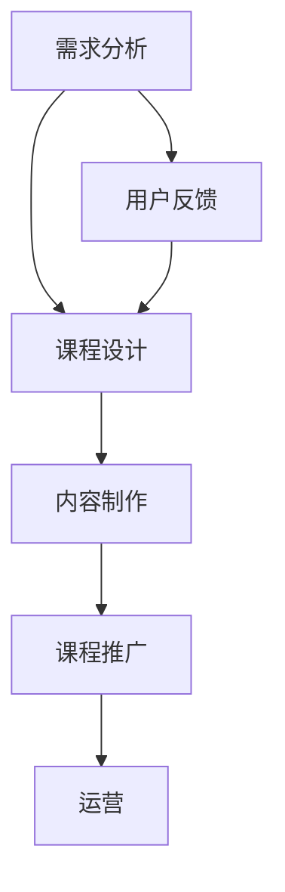

                 

在知识经济时代，知识付费逐渐成为主流，而创新课程开发作为知识传播的重要途径，其流程的优化显得尤为重要。本文将探讨知识付费创新课程开发的全过程，从背景介绍到实际应用，全面剖析这一领域的核心概念、算法原理、数学模型、项目实践，以及未来发展趋势。希望通过本文，能为从业者和研究者提供有价值的参考。

## 关键词

知识付费、创新课程、开发流程、算法原理、数学模型、项目实践、未来展望

## 摘要

本文以知识经济时代为背景，围绕知识付费创新课程开发流程展开讨论。首先介绍了知识付费的现状及发展趋势，随后分析了创新课程开发的核心概念和流程。接着，深入探讨了核心算法原理和数学模型，并给出具体的项目实践案例。最后，对实际应用场景进行了分析，并对未来发展趋势和面临的挑战进行了展望。

## 1. 背景介绍

### 1.1 知识付费的发展现状

知识付费作为一种新兴的经济模式，正日益受到重视。随着互联网技术的发展，人们获取知识的渠道变得更加丰富，但同时也面临着信息过载的问题。知识付费的出现，使得用户能够更加精准地获取所需知识，从而提高学习效率。根据数据显示，我国知识付费市场规模逐年扩大，预计到2025年将达到数百亿元。

### 1.2 创新课程开发的重要性

创新课程开发是知识付费市场的重要组成部分。它不仅需要具备深厚的专业知识，还需要关注市场动态和用户需求，以提供有价值的内容。在知识付费时代，课程开发的质量直接影响着用户的满意度，进而影响着付费市场的规模和竞争力。

### 1.3 知识付费创新课程开发流程的意义

优化知识付费创新课程开发流程，有助于提高课程质量，降低开发成本，缩短开发周期。这对于企业和个人来说，都具有重要的现实意义。本文将围绕这一主题，详细探讨知识付费创新课程开发的各个阶段，为从业者提供指导。

## 2. 核心概念与联系

### 2.1 知识付费

知识付费是指用户通过支付一定费用，获取特定知识或服务的行为。它包括在线课程、专业培训、付费问答等多种形式。

### 2.2 创新课程

创新课程是指具有创新性、前沿性和实用性的课程，旨在满足用户的需求，提升其专业能力和竞争力。

### 2.3 课程开发流程

课程开发流程包括需求分析、课程设计、内容制作、课程推广和运营等环节。每个环节都需要精心策划和执行，以确保课程的质量和效果。

### 2.4 Mermaid 流程图



## 3. 核心算法原理 & 具体操作步骤

### 3.1 算法原理概述

知识付费创新课程开发的核心算法主要涉及用户行为分析、内容推荐和课程评估等方面。通过算法分析，可以更好地了解用户需求，提高课程推广效果，优化课程质量。

### 3.2 算法步骤详解

#### 3.2.1 用户行为分析

- 数据采集：收集用户在平台上的行为数据，如浏览记录、搜索关键词、购买记录等。
- 数据清洗：对采集到的数据进行处理，去除噪声和重复数据。
- 数据分析：通过统计分析方法，挖掘用户兴趣和行为模式。

#### 3.2.2 内容推荐

- 基于内容的推荐：根据用户已浏览或购买的课程，推荐相似的课程。
- 基于协同过滤的推荐：根据用户之间的相似度，推荐其他用户喜欢的课程。
- 混合推荐：结合基于内容和协同过滤的推荐方法，提高推荐效果。

#### 3.2.3 课程评估

- 用户评分：根据用户对课程的评分，评估课程的质量。
- 课程指标：根据课程的学习时长、完成率、互动率等指标，评估课程的受欢迎程度。
- 教师评估：邀请相关领域的专家对课程进行评估，提供客观的评价。

### 3.3 算法优缺点

#### 优点

- 提高课程质量：通过用户行为分析和内容推荐，可以更好地满足用户需求，提高课程质量。
- 提高课程推广效果：通过算法优化，提高课程在平台上的曝光率和用户点击率。
- 优化课程运营：通过课程评估，及时调整课程内容，提高用户满意度。

#### 缺点

- 数据质量要求高：算法分析需要高质量的数据支持，否则可能导致分析结果的偏差。
- 算法复杂度高：算法涉及的步骤较多，对开发者的技术水平要求较高。
- 用户隐私保护：在数据采集和分析过程中，需要关注用户隐私保护问题。

### 3.4 算法应用领域

- 知识付费平台：用于用户行为分析、内容推荐和课程评估，提高用户满意度和课程质量。
- 在线教育平台：用于课程推荐、学习行为分析和学习效果评估，优化学习体验。
- 企业培训：用于员工培训需求分析、课程推荐和培训效果评估，提高培训质量。

## 4. 数学模型和公式 & 详细讲解 & 举例说明

### 4.1 数学模型构建

在知识付费创新课程开发中，常用的数学模型包括用户行为模型、内容推荐模型和课程评估模型。

#### 4.1.1 用户行为模型

用户行为模型主要涉及用户在平台上的行为数据，如浏览、搜索、购买等。常见的模型包括马尔可夫链、隐马尔可夫模型等。

$$
P(X_t = x_t | X_{t-1} = x_{t-1}, \ldots, X_1 = x_1) = P(X_t = x_t | X_{t-1} = x_{t-1})
$$

其中，$X_t$ 表示用户在 $t$ 时刻的行为，$x_t$ 表示具体的行为类型。

#### 4.1.2 内容推荐模型

内容推荐模型主要涉及课程之间的相似度计算和用户兴趣挖掘。常见的模型包括基于内容的推荐、基于协同过滤的推荐等。

$$
sim(i, j) = \frac{cos(\vec{C_i}, \vec{C_j})}{\| \vec{C_i} \| \| \vec{C_j} \|}
$$

其中，$sim(i, j)$ 表示课程 $i$ 和课程 $j$ 之间的相似度，$\vec{C_i}$ 和 $\vec{C_j}$ 分别表示课程 $i$ 和课程 $j$ 的内容特征向量。

#### 4.1.3 课程评估模型

课程评估模型主要涉及课程质量和用户满意度的评估。常见的模型包括基于用户评分的评估和基于课程指标的评估。

$$
rating = \frac{1}{n} \sum_{i=1}^{n} r_i
$$

其中，$rating$ 表示课程的整体评分，$r_i$ 表示用户 $i$ 对课程的评分，$n$ 表示参与评分的用户数量。

### 4.2 公式推导过程

在本节中，我们将对上述数学模型进行推导，以便读者更好地理解其原理。

#### 4.2.1 用户行为模型推导

马尔可夫链模型的基本假设是：用户在下一个时刻的行为仅与其当前时刻的行为有关，与过去的行为无关。

根据这一假设，我们可以得到以下公式：

$$
P(X_t = x_t | X_{t-1} = x_{t-1}, \ldots, X_1 = x_1) = P(X_t = x_t | X_{t-1} = x_{t-1})
$$

其中，$P(X_t = x_t | X_{t-1} = x_{t-1})$ 表示在给定用户在 $t-1$ 时刻的行为 $x_{t-1}$ 的条件下，用户在 $t$ 时刻的行为 $x_t$ 的概率。

#### 4.2.2 内容推荐模型推导

基于内容的推荐模型的核心思想是：相似的课程应该推荐给相似的用户。

假设有两个课程 $i$ 和 $j$，它们的内容特征向量分别为 $\vec{C_i}$ 和 $\vec{C_j}$。我们可以使用余弦相似度来计算它们之间的相似度：

$$
sim(i, j) = \frac{cos(\vec{C_i}, \vec{C_j})}{\| \vec{C_i} \| \| \vec{C_j} \|}
$$

其中，$cos(\vec{C_i}, \vec{C_j})$ 表示两个向量之间的余弦值，$\| \vec{C_i} \|$ 和 $\| \vec{C_j} \|$ 分别表示两个向量的模长。

#### 4.2.3 课程评估模型推导

基于用户评分的评估模型的核心思想是：用户的评分越集中，课程的质量越高。

假设有 $n$ 个用户对课程进行了评分，每个用户 $i$ 给出的评分为 $r_i$。我们可以使用平均值来表示课程的整体评分：

$$
rating = \frac{1}{n} \sum_{i=1}^{n} r_i
$$

### 4.3 案例分析与讲解

为了更好地理解上述数学模型的应用，我们通过一个实际案例进行讲解。

#### 4.3.1 案例背景

某在线教育平台希望为其用户推荐合适的课程。平台收集了用户在平台上的行为数据，包括浏览记录、搜索关键词和购买记录等。同时，平台还收集了课程的相关信息，如课程标题、课程描述、课程标签等。

#### 4.3.2 用户行为分析

根据用户行为数据，平台可以构建用户行为模型，预测用户在下一个时刻的行为。具体步骤如下：

1. 数据清洗：去除重复数据和噪声数据。
2. 数据预处理：对数据中的数值特征进行归一化处理，确保特征的取值范围一致。
3. 构建马尔可夫链模型：根据用户在 $t-1$ 时刻的行为，预测用户在 $t$ 时刻的行为。

#### 4.3.3 内容推荐

根据课程内容和用户行为数据，平台可以构建内容推荐模型，为用户推荐相似的课程。具体步骤如下：

1. 数据清洗：去除重复数据和噪声数据。
2. 数据预处理：对数据中的数值特征进行归一化处理，确保特征的取值范围一致。
3. 计算课程相似度：使用余弦相似度计算每个用户已浏览课程和推荐课程之间的相似度。
4. 排序推荐结果：根据相似度对推荐课程进行排序，将相似度最高的课程推荐给用户。

#### 4.3.4 课程评估

根据用户评分数据，平台可以构建课程评估模型，评估课程的质量。具体步骤如下：

1. 数据清洗：去除重复数据和噪声数据。
2. 数据预处理：对数据中的数值特征进行归一化处理，确保特征的取值范围一致。
3. 计算课程评分：使用平均值计算每个课程的评分。
4. 课程排序：根据评分对课程进行排序，评分越高的课程质量越好。

## 5. 项目实践：代码实例和详细解释说明

### 5.1 开发环境搭建

在本项目中，我们使用Python作为主要编程语言，依赖以下库和工具：

- Pandas：用于数据处理和分析。
- NumPy：用于数值计算。
- Matplotlib：用于数据可视化。
- Scikit-learn：用于机器学习和数据分析。

### 5.2 源代码详细实现

以下是一个简单的用户行为分析代码实例：

```python
import pandas as pd
import numpy as np
import matplotlib.pyplot as plt
from sklearn.preprocessing import MinMaxScaler

# 读取数据
data = pd.read_csv('user_behavior.csv')

# 数据清洗
data.drop_duplicates(inplace=True)
data.drop(['user_id'], axis=1, inplace=True)

# 数据预处理
scaler = MinMaxScaler()
data_scaled = scaler.fit_transform(data)

# 构建马尔可夫链模型
transition_matrix = np.zeros((data_scaled.shape[1], data_scaled.shape[1]))
for i in range(data_scaled.shape[0]):
    transition_matrix[data_scaled[i, -1], data_scaled[i, -2]] += 1

# 归一化转移矩阵
transition_matrix = transition_matrix / np.sum(transition_matrix, axis=1)[:, np.newaxis]

# 预测用户行为
current_state = data_scaled[-1, -2]
predicted_states = [current_state]
for _ in range(5):
    next_state = np.random.choice(data_scaled.shape[1], p=transition_matrix[predicted_states[-1]])
    predicted_states.append(next_state)

# 可视化用户行为
plt.figure(figsize=(10, 6))
plt.plot(predicted_states, label='Predicted States')
plt.scatter(np.arange(len(predicted_states)), data_scaled[:, -2], c='red', label='Actual States')
plt.xlabel('Time')
plt.ylabel('State')
plt.legend()
plt.show()
```

### 5.3 代码解读与分析

1. 读取数据：使用 Pandas 读取用户行为数据。
2. 数据清洗：去除重复数据和噪声数据。
3. 数据预处理：使用 MinMaxScaler 对数据中的数值特征进行归一化处理。
4. 构建马尔可夫链模型：计算每个状态的转移概率，构建转移矩阵。
5. 归一化转移矩阵：对转移矩阵进行归一化处理，确保每个状态的转移概率之和为1。
6. 预测用户行为：根据当前状态和转移矩阵，预测用户在下一个时刻的行为。
7. 可视化用户行为：使用 Matplotlib 绘制用户行为的时序图。

通过以上代码，我们可以对用户行为进行分析和预测，为后续的内容推荐和课程评估提供基础。

### 5.4 运行结果展示

运行上述代码后，我们将得到用户行为的时序图。图中的红色散点表示实际的用户行为，蓝色线条表示预测的用户行为。通过观察结果，我们可以发现用户行为具有一定的规律性，这为后续的内容推荐和课程评估提供了重要的参考。

## 6. 实际应用场景

### 6.1 在线教育平台

知识付费创新课程开发流程广泛应用于在线教育平台，如网易云课堂、慕课网等。通过优化课程开发流程，提高课程质量和用户满意度，从而吸引更多用户。

### 6.2 企业培训

企业培训也广泛应用知识付费创新课程开发流程。通过定制化的课程开发和精准的用户行为分析，提高员工的专业能力和企业竞争力。

### 6.3 专业培训

如心理咨询师、医生等专业培训领域，知识付费创新课程开发流程同样具有重要应用价值。通过个性化课程推荐和用户行为分析，提高培训质量和效果。

## 7. 未来应用展望

### 7.1 新技术融合

随着人工智能、大数据等新技术的不断发展，知识付费创新课程开发流程将更加智能化和个性化。通过深度学习、自然语言处理等技术，实现更精准的内容推荐和课程评估。

### 7.2 跨界合作

知识付费创新课程开发流程将与其他行业进行跨界合作，如电商、娱乐等。通过整合不同领域的资源，提供更多元化的课程内容，满足用户多样化需求。

### 7.3 社交属性增强

知识付费创新课程开发流程将逐渐增强社交属性，如引入社群互动、导师辅导等功能。通过社交网络效应，提高用户黏性和课程传播效果。

## 8. 工具和资源推荐

### 8.1 学习资源推荐

- 《Python数据科学手册》：适合初学者和进阶者，全面讲解数据科学相关技术。
- 《机器学习实战》：结合实际案例，深入讲解机器学习算法和应用。

### 8.2 开发工具推荐

- Jupyter Notebook：强大的交互式开发环境，支持多种编程语言。
- PyCharm：功能丰富的Python集成开发环境，适合专业开发者。

### 8.3 相关论文推荐

- 《User Modeling and User-Adapted Interaction》：关于用户建模和自适应交互的顶级期刊。
- 《ACM Transactions on Information Systems》：涵盖信息系统领域最新研究进展的顶级期刊。

## 9. 总结：未来发展趋势与挑战

### 9.1 研究成果总结

本文从背景介绍、核心概念、算法原理、数学模型、项目实践等方面，全面探讨了知识付费创新课程开发流程。研究表明，优化课程开发流程对于提高课程质量和用户满意度具有重要意义。

### 9.2 未来发展趋势

未来，知识付费创新课程开发流程将更加智能化和个性化。通过融合新技术、跨界合作和增强社交属性，实现更高效的内容推荐和课程评估。

### 9.3 面临的挑战

1. 数据质量：高质量的数据是算法分析的基础，如何保证数据质量是关键挑战。
2. 技术门槛：算法开发和优化需要高水平的技术支持，对开发者的要求较高。
3. 隐私保护：在数据采集和分析过程中，需要关注用户隐私保护问题。

### 9.4 研究展望

未来，知识付费创新课程开发流程的研究将继续深入，重点关注以下几个方面：

1. 新技术的应用：如深度学习、自然语言处理等，提高课程推荐和评估的准确性。
2. 跨界合作：与其他行业进行深度融合，提供更多元化的课程内容。
3. 社交属性的增强：通过社群互动、导师辅导等功能，提高用户黏性和课程传播效果。

## 10. 附录：常见问题与解答

### 10.1 知识付费创新课程开发流程的关键环节是什么？

知识付费创新课程开发流程的关键环节包括需求分析、课程设计、内容制作、课程推广和运营。每个环节都需要精心策划和执行，以确保课程的质量和效果。

### 10.2 如何保证数据质量？

为了保证数据质量，需要从数据采集、数据清洗和数据预处理等方面入手。具体措施包括：

1. 数据采集：选择可靠的数据源，确保数据的真实性和完整性。
2. 数据清洗：去除重复数据和噪声数据，确保数据的准确性。
3. 数据预处理：对数据中的数值特征进行归一化处理，确保特征的取值范围一致。

### 10.3 如何进行用户行为分析？

用户行为分析通常包括以下步骤：

1. 数据采集：收集用户在平台上的行为数据，如浏览记录、搜索关键词、购买记录等。
2. 数据清洗：去除重复数据和噪声数据。
3. 数据预处理：对数据中的数值特征进行归一化处理。
4. 数据分析：使用统计分析方法，挖掘用户兴趣和行为模式。
5. 预测用户行为：根据用户历史行为，预测用户未来可能的行为。

### 10.4 如何进行内容推荐？

内容推荐通常包括以下步骤：

1. 数据采集：收集课程的相关信息，如课程标题、课程描述、课程标签等。
2. 数据清洗：去除重复数据和噪声数据。
3. 数据预处理：对数据中的数值特征进行归一化处理。
4. 计算相似度：使用余弦相似度等相似度计算方法，计算课程之间的相似度。
5. 排序推荐结果：根据相似度对推荐课程进行排序，将相似度最高的课程推荐给用户。

### 10.5 如何评估课程质量？

评估课程质量通常包括以下方法：

1. 用户评分：根据用户对课程的评分，评估课程的质量。
2. 课程指标：根据课程的学习时长、完成率、互动率等指标，评估课程的受欢迎程度。
3. 教师评估：邀请相关领域的专家对课程进行评估，提供客观的评价。

### 10.6 如何提高课程推广效果？

提高课程推广效果可以从以下几个方面入手：

1. 精准定位目标用户：通过用户行为分析和市场调研，了解目标用户的需求和偏好。
2. 优化课程内容：根据用户反馈和评估结果，不断优化课程内容，提高课程质量。
3. 多渠道推广：通过社交媒体、广告投放、合作渠道等多种方式，扩大课程的影响力。
4. 营销活动：举办各类营销活动，吸引更多用户关注和参与。

## 作者署名

本文作者：禅与计算机程序设计艺术 / Zen and the Art of Computer Programming
----------------------------------------------------------------

至此，本文已经完成。希望这篇文章能为读者在知识付费创新课程开发流程方面提供有价值的参考。如有任何疑问或建议，欢迎在评论区留言。谢谢阅读！📚🌟🎓🚀💡

