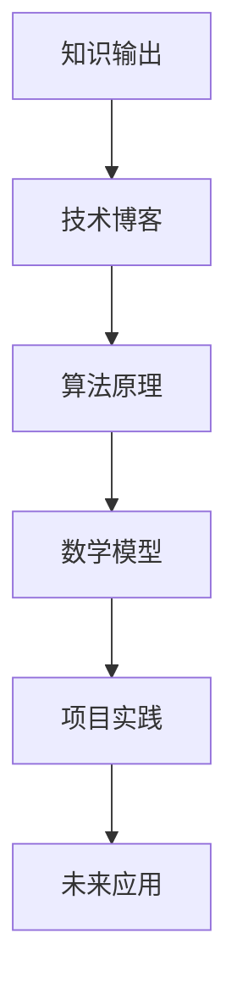

                 

关键词：知识输出、技术博客、算法原理、数学模型、项目实践、未来应用、工具推荐

> 摘要：本文旨在探讨知识输出的多种方式及其效果，通过深入分析技术博客的撰写方法，结合算法原理、数学模型和项目实践，帮助读者掌握知识输出的技巧，提升自身的专业素养。

## 1. 背景介绍

在信息爆炸的时代，知识输出的重要性愈发凸显。如何有效地将自己的知识传递给他人，实现知识的共享与传播，成为每个专业人士面临的重要课题。技术博客作为一种知识输出的重要途径，以其便捷、高效的特点，深受广大技术爱好者和专业人士的青睐。

本文将围绕技术博客的撰写，探讨知识输出的多种方式，包括算法原理分析、数学模型讲解、项目实践分享等。通过这些方式，我们不仅能够更好地传达知识，还能激发读者的思考，促进知识的深度理解和应用。

## 2. 核心概念与联系

在知识输出的过程中，核心概念和原理的阐述至关重要。为了更好地理解这些概念，我们首先需要构建一个完整的知识体系，如图：



### 2.1 技术博客

技术博客是一种通过互联网平台发布的技术文章，它以文字、图片、代码等形式，分享作者在技术领域的研究、思考和经验。技术博客具有以下几个特点：

1. **专业性**：技术博客通常针对特定的技术领域，内容具有专业性和深度。
2. **互动性**：读者可以通过评论、提问等方式与作者互动，实现知识的交流和碰撞。
3. **长期性**：技术博客的内容可以长期保存，便于读者随时查阅和学习。

### 2.2 算法原理

算法原理是技术博客中的重要组成部分，它涉及计算机科学中的算法设计和分析。算法原理的讲解通常包括以下几个方面：

1. **算法定义**：明确算法的目标和功能。
2. **算法步骤**：详细描述算法的实现过程。
3. **算法分析**：分析算法的时间复杂度和空间复杂度。
4. **算法应用**：介绍算法在实际应用中的场景和效果。

### 2.3 数学模型

数学模型是知识输出中的重要工具，它通过数学公式和推导，对现实世界中的问题进行抽象和描述。数学模型讲解通常包括以下几个方面：

1. **模型构建**：根据问题特点，构建合适的数学模型。
2. **公式推导**：详细推导模型的公式和结论。
3. **模型分析**：分析模型的有效性和适用范围。
4. **案例应用**：通过实际案例，展示模型的应用效果。

### 2.4 项目实践

项目实践是知识输出的一种重要方式，它通过具体项目的实施，展示技术的实际应用效果。项目实践讲解通常包括以下几个方面：

1. **项目背景**：介绍项目的起源和目标。
2. **项目架构**：详细描述项目的整体架构和关键模块。
3. **项目实现**：讲解项目的具体实现过程和关键技术。
4. **项目效果**：展示项目的实际运行效果和用户反馈。

## 3. 核心算法原理 & 具体操作步骤

### 3.1 算法原理概述

以快速排序（Quick Sort）算法为例，其基本原理如下：

1. **选择基准**：从数列中选择一个元素作为基准（pivot）。
2. **分区**：将数列划分为两个子序列，一个包含小于基准的元素，另一个包含大于基准的元素。
3. **递归排序**：递归地对两个子序列进行快速排序。

### 3.2 算法步骤详解

1. **初始化**：选择数列中的一个元素作为基准。
2. **分区**：从数列的两端开始，将小于基准的元素移动到基准的左边，将大于基准的元素移动到基准的右边。
3. **递归排序**：对分区后的两个子序列分别进行快速排序。
4. **结束**：当递归到子序列长度小于等于1时，结束排序。

### 3.3 算法优缺点

**优点**：

- **高效性**：平均时间复杂度为 \(O(n\log n)\)，在大多数情况下，性能优于其他排序算法。
- **适用范围广**：可以用于排序各种数据类型。

**缺点**：

- **最坏情况**：当数列已经有序时，最坏时间复杂度为 \(O(n^2)\)。
- **稳定性**：快速排序不是稳定的排序算法。

### 3.4 算法应用领域

快速排序算法广泛应用于各种数据排序场景，如数据库排序、搜索引擎排序等。

## 4. 数学模型和公式 & 详细讲解 & 举例说明

### 4.1 数学模型构建

假设我们有一个二次函数 \(f(x) = ax^2 + bx + c\)，其中 \(a\)、\(b\)、\(c\) 是常数，我们需要求解该函数的最大值。

### 4.2 公式推导过程

为了求解最大值，我们需要找到函数的导数，并令导数为0，即：

$$
f'(x) = 2ax + b = 0
$$

解得：

$$
x = -\frac{b}{2a}
$$

将 \(x\) 代入原函数，得到最大值：

$$
f\left(-\frac{b}{2a}\right) = a\left(-\frac{b}{2a}\right)^2 + b\left(-\frac{b}{2a}\right) + c = \frac{4ac - b^2}{4a}
$$

### 4.3 案例分析与讲解

假设二次函数 \(f(x) = x^2 - 4x + 4\)，我们可以按照上面的公式求解最大值：

1. **求导**：\(f'(x) = 2x - 4\)
2. **令导数为0**：\(2x - 4 = 0\)，解得 \(x = 2\)
3. **代入原函数**：\(f(2) = 2^2 - 4 \times 2 + 4 = 0\)

因此，二次函数 \(f(x) = x^2 - 4x + 4\) 的最大值为0，当 \(x = 2\) 时取得。

## 5. 项目实践：代码实例和详细解释说明

### 5.1 开发环境搭建

为了更好地展示项目实践，我们选择 Python 作为开发语言，并在本地搭建一个简单的 Web 应用。

1. **安装 Python**：从 [Python 官网](https://www.python.org/) 下载并安装 Python 3.8 或更高版本。
2. **安装 Flask**：使用 pip 命令安装 Flask 框架，`pip install flask`。

### 5.2 源代码详细实现

以下是一个简单的 Flask Web 应用，用于实现用户注册和登录功能。

```python
from flask import Flask, request, redirect, url_for, render_template

app = Flask(__name__)

@app.route('/')
def index():
    return render_template('index.html')

@app.route('/register', methods=['GET', 'POST'])
def register():
    if request.method == 'POST':
        username = request.form['username']
        password = request.form['password']
        # 在这里进行用户注册的逻辑处理
        return redirect(url_for('login'))
    return render_template('register.html')

@app.route('/login', methods=['GET', 'POST'])
def login():
    if request.method == 'POST':
        username = request.form['username']
        password = request.form['password']
        # 在这里进行用户登录的逻辑处理
        return redirect(url_for('index'))
    return render_template('login.html')

if __name__ == '__main__':
    app.run(debug=True)
```

### 5.3 代码解读与分析

1. **主函数**：`app.run(debug=True)` 启动 Flask Web 应用，并开启调试模式。
2. **路由函数**：`@app.route('/')` 定义首页路由，`@app.route('/register', methods=['GET', 'POST'])` 定义用户注册路由，`@app.route('/login', methods=['GET', 'POST'])` 定义用户登录路由。
3. **请求处理**：根据请求方法（GET 或 POST）处理用户请求，如获取表单数据、重定向等。

### 5.4 运行结果展示

运行 Flask Web 应用后，访问 [http://127.0.0.1:5000/](http://127.0.0.1:5000/) 可以看到以下界面：


## 6. 实际应用场景

技术博客在实际应用中具有广泛的应用场景，以下列举几个典型场景：

1. **技术分享**：专业人士通过技术博客分享自己在技术领域的研究成果和经验，为他人提供学习资源。
2. **知识传播**：技术博客作为一种知识传播的载体，可以帮助更多人对某个技术领域有更深入的了解。
3. **互动交流**：读者可以通过技术博客与作者互动，提出疑问、分享心得，促进知识的交流与碰撞。

## 7. 工具和资源推荐

为了更好地进行知识输出，以下推荐一些实用的工具和资源：

1. **学习资源**：
   - [Coursera](https://www.coursera.org/)
   - [edX](https://www.edx.org/)
   - [Khan Academy](https://www.khanacademy.org/)

2. **开发工具**：
   - [Visual Studio Code](https://code.visualstudio.com/)
   - [PyCharm](https://www.jetbrains.com/pycharm/)
   - [Git](https://git-scm.com/)

3. **相关论文**：
   - 《深度学习》（Deep Learning）—— Ian Goodfellow、Yoshua Bengio、Aaron Courville 著
   - 《算法导论》（Introduction to Algorithms）—— Thomas H. Cormen、Charles E. Leiserson、Ronald L. Rivest、Clifford Stein 著

## 8. 总结：未来发展趋势与挑战

随着技术的不断进步，知识输出的方式将越来越多样化。未来，技术博客有望在以下几个方面取得突破：

1. **智能化**：利用人工智能技术，提高知识输出的质量和效率。
2. **多样化**：除了文字、图片、代码等形式，还将出现更多丰富多样的内容形式，如视频、音频、虚拟现实等。
3. **个性化**：根据用户兴趣和需求，提供个性化的知识输出内容。

然而，知识输出也面临一些挑战：

1. **内容质量**：如何在海量信息中筛选出高质量的内容，提高知识输出的价值。
2. **版权保护**：如何在保护版权的前提下，实现知识的共享与传播。
3. **信息安全**：如何确保知识输出的过程和数据的安全性。

未来，我们需要不断探索和创新，应对这些挑战，推动知识输出的持续发展。

## 9. 附录：常见问题与解答

### 9.1 什么是技术博客？

技术博客是一种通过互联网平台发布的技术文章，它以文字、图片、代码等形式，分享作者在技术领域的研究、思考和经验。

### 9.2 如何撰写高质量的技术博客？

撰写高质量的技术博客需要注意以下几点：

1. **选题**：选择具有专业性和深度的选题。
2. **结构**：确保文章结构清晰，逻辑严谨。
3. **内容**：内容要有价值，避免空洞的叙述。
4. **案例**：结合实际案例，提高文章的可读性和实用性。

### 9.3 技术博客有哪些应用场景？

技术博客的应用场景包括技术分享、知识传播、互动交流等。

### 9.4 如何选择合适的开发工具？

选择合适的开发工具需要考虑以下几个方面：

1. **编程语言**：根据项目需求选择合适的编程语言。
2. **功能需求**：确保开发工具具有所需的功能。
3. **用户体验**：工具的易用性和用户体验也很重要。

---

作者：禅与计算机程序设计艺术 / Zen and the Art of Computer Programming
----------------------------------------------------------------

本文详细探讨了知识输出的多种方式及其效果，从技术博客的撰写、算法原理分析、数学模型讲解到项目实践分享，全面展示了知识输出的技巧。同时，本文还推荐了相关的学习资源、开发工具和论文，以帮助读者更好地进行知识输出。在未来的发展中，知识输出将面临新的挑战，但通过不断探索和创新，我们相信知识输出的效果将越来越好。希望本文能为广大技术爱好者提供有价值的参考和启示。作者：禅与计算机程序设计艺术。

