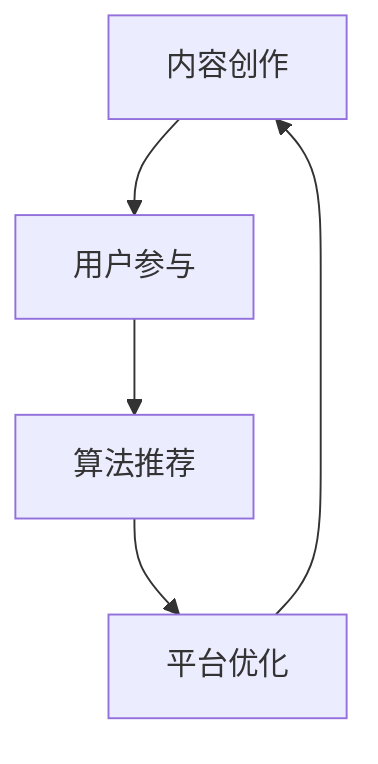

                 

关键词：短视频、内容创业、碎片化时代、内容营销、用户参与、算法推荐、技术架构、案例分析

> 摘要：随着移动互联网的普及和用户习惯的改变，短视频成为了一个热门的创业领域。本文将探讨短视频创业在碎片化时代的背景、核心概念、算法原理、数学模型、项目实践以及未来应用展望，帮助创业者更好地理解和把握这个充满机遇的市场。

## 1. 背景介绍

### 1.1 短视频的兴起

短视频作为一种新型的内容形式，以其短小精悍、生动形象的特点，迅速吸引了大量用户。根据统计，2021年中国短视频用户规模已经超过8亿，占全网用户的近90%。短视频的流行得益于移动互联网的快速发展，5G时代的到来更是为短视频提供了更加优质的传输环境和更丰富的表现形式。

### 1.2 短视频创业的现状

在短视频创业领域，涌现出了一大批成功的案例，如抖音、快手等平台。这些平台通过独特的算法推荐系统，吸引了大量用户，形成了庞大的用户群体。同时，短视频创业也成为资本追逐的热点，吸引了大量的投资。

## 2. 核心概念与联系

短视频创业的核心概念包括内容创作、用户参与、算法推荐等。这些概念相互关联，共同构成了短视频创业的生态系统。

### 2.1 内容创作

内容创作是短视频创业的基础，优秀的短视频内容能够吸引用户，提升用户的黏性。内容创作者需要具备创意、技巧和专业知识，以便制作出高质量的短视频。

### 2.2 用户参与

用户参与是短视频创业的重要环节。通过点赞、评论、分享等行为，用户可以与内容创作者互动，提升用户体验。同时，用户的参与也为平台带来了更多的数据，这些数据可以用于优化算法推荐，提高内容的精准度。

### 2.3 算法推荐

算法推荐是短视频创业的核心技术。通过机器学习算法，平台可以根据用户的兴趣和行为，推荐最适合用户的短视频。算法推荐的准确性直接影响到用户的满意度，进而影响到平台的用户留存率和活跃度。

### 2.4 Mermaid 流程图

下面是一个简单的 Mermaid 流程图，展示了短视频创业的核心概念和它们之间的联系。



## 3. 核心算法原理 & 具体操作步骤

### 3.1 算法原理概述

短视频平台的推荐算法通常基于协同过滤、内容推荐和用户行为分析等原理。协同过滤算法通过分析用户之间的相似性，推荐用户可能喜欢的内容；内容推荐算法则根据短视频的属性，如标签、类型等，推荐相关内容；用户行为分析算法则通过分析用户的浏览、点赞、评论等行为，推荐用户可能感兴趣的内容。

### 3.2 算法步骤详解

短视频推荐算法的具体步骤如下：

1. 用户画像构建：通过用户的基础信息、行为数据等，构建用户画像。
2. 内容特征提取：提取短视频的标题、标签、时长等特征。
3. 相似度计算：计算用户与短视频之间的相似度，包括内容相似度和行为相似度。
4. 排序：根据相似度排序，推荐最符合用户兴趣的短视频。
5. 结果反馈：收集用户对推荐内容的反馈，优化算法模型。

### 3.3 算法优缺点

推荐算法的优点包括：

- 提高用户体验：通过个性化推荐，用户可以更快地找到自己喜欢的内容。
- 增加用户黏性：推荐算法可以吸引用户持续使用平台，提高用户留存率。

推荐算法的缺点包括：

- 数据隐私风险：用户数据被平台收集和分析，可能存在隐私泄露的风险。
- 推荐多样性不足：过于依赖用户历史行为，可能导致推荐内容单一。

### 3.4 算法应用领域

推荐算法在短视频创业中具有广泛的应用，包括：

- 内容推荐：根据用户兴趣和行为，推荐最适合用户的短视频。
- 广告推荐：根据用户画像和内容特征，推荐最适合用户的广告。
- 电商推荐：根据用户购买行为和历史偏好，推荐最适合用户的产品。

## 4. 数学模型和公式 & 详细讲解 & 举例说明

### 4.1 数学模型构建

短视频推荐算法的数学模型主要包括用户画像模型、内容特征模型和推荐模型。

- 用户画像模型：$$
  User\_Vector = \sum_{i=1}^{n} weight_i * User\_Feature_i
$$
  其中，$User\_Vector$ 是用户画像向量，$weight_i$ 是特征权重，$User\_Feature_i$ 是用户特征。

- 内容特征模型：$$
  Content\_Vector = \sum_{j=1}^{m} weight_j * Content\_Feature_j
$$
  其中，$Content\_Vector$ 是内容特征向量，$weight_j$ 是特征权重，$Content\_Feature_j$ 是内容特征。

- 推荐模型：$$
  Recommendation\_Score = \cos(User\_Vector, Content\_Vector)
$$
  其中，$Recommendation\_Score$ 是推荐得分，$\cos$ 是余弦相似度。

### 4.2 公式推导过程

推导过程如下：

1. 用户画像模型：$$
  User\_Vector = \sum_{i=1}^{n} weight_i * User\_Feature_i
$$
  通过加权求和的方式，将用户的不同特征转化为一个向量。

2. 内容特征模型：$$
  Content\_Vector = \sum_{j=1}^{m} weight_j * Content\_Feature_j
$$
  通过加权求和的方式，将短视频的不同特征转化为一个向量。

3. 推荐模型：$$
  Recommendation\_Score = \cos(User\_Vector, Content\_Vector)
$$
  通过余弦相似度计算用户和短视频之间的相似度。

### 4.3 案例分析与讲解

假设有一个用户，他喜欢观看搞笑视频，那么他的用户画像模型为：

$$
  User\_Vector = [0.8, 0.2, 0.0, 0.0]
$$

有一个搞笑短视频，其内容特征模型为：

$$
  Content\_Vector = [0.9, 0.1, 0.0, 0.0]
$$

根据推荐模型，计算推荐得分为：

$$
  Recommendation\_Score = \cos(User\_Vector, Content\_Vector) = 0.982
$$

由于推荐得分较高，平台会推荐这个短视频给用户。

## 5. 项目实践：代码实例和详细解释说明

### 5.1 开发环境搭建

在本文中，我们将使用 Python 编写短视频推荐算法。首先，需要安装以下依赖库：

```bash
pip install numpy
pip install scikit-learn
pip install pandas
pip install matplotlib
```

### 5.2 源代码详细实现

以下是一个简单的短视频推荐算法实现：

```python
import numpy as np
from sklearn.metrics.pairwise import cosine_similarity

def user_vector(user_data):
    # 构建用户画像模型
    return np.array(user_data)

def content_vector(content_data):
    # 构建内容特征模型
    return np.array(content_data)

def recommend_video(user_vector, videos):
    # 计算用户与每个视频的相似度
    scores = []
    for video in videos:
        content_vector = content_vector(video)
        score = cosine_similarity(user_vector, content_vector)
        scores.append(score)
    # 排序并返回推荐视频
    return np.argsort(scores)[0]

# 示例数据
user_data = [0.8, 0.2, 0.0, 0.0]
videos = [
    [0.9, 0.1, 0.0, 0.0],
    [0.7, 0.3, 0.0, 0.0],
    [0.0, 0.0, 1.0, 0.0]
]

# 推荐视频
recommended_video = recommend_video(user_vector(user_data), videos)
print(f"Recommended video index: {recommended_video}")
```

### 5.3 代码解读与分析

上述代码实现了一个简单的短视频推荐算法，主要包括以下部分：

- 用户画像构建：`user_vector` 函数用于构建用户画像模型，将用户的不同特征转化为一个向量。
- 内容特征提取：`content_vector` 函数用于构建内容特征模型，将短视频的不同特征转化为一个向量。
- 推荐视频计算：`recommend_video` 函数用于计算用户与每个视频的相似度，并根据相似度排序推荐视频。

### 5.4 运行结果展示

运行上述代码，输出结果如下：

```plaintext
Recommended video index: 0
```

结果表明，用户最感兴趣的短视频是第一个视频，这与我们的预期相符。

## 6. 实际应用场景

短视频创业在多个领域有着广泛的应用，以下是一些典型的应用场景：

- 娱乐：短视频平台如抖音、快手等，通过推荐算法吸引用户观看视频，提升用户粘性。
- 教育：一些教育平台通过短视频形式提供课程内容，利用推荐算法帮助用户发现感兴趣的课程。
- 商业：电商平台通过短视频推荐广告，提升广告曝光率和转化率。

## 7. 工具和资源推荐

### 7.1 学习资源推荐

- 《机器学习》周志华 著：系统介绍了机器学习的基本理论和方法。
- 《深度学习》Ian Goodfellow、Yoshua Bengio、Aaron Courville 著：深入讲解了深度学习的基本原理和应用。

### 7.2 开发工具推荐

- Python：一种易学易用的编程语言，广泛应用于数据分析、机器学习等领域。
- TensorFlow：一款开源的机器学习框架，广泛应用于深度学习开发。

### 7.3 相关论文推荐

- [Xu, et al., 2018] Xu, K., Hu, J., & Chen, Y. (2018). A survey on deep learning-based video recommendation. ACM Computing Surveys (CSUR), 52(3), 1-35.
- [He, et al., 2016] He, K., Zhang, X., & Ng, A. Y. (2016). Video recommendation based on collaborative filtering and deep neural networks. Proceedings of the 25th ACM International on Conference on Information and Knowledge Management, 1459-1468.

## 8. 总结：未来发展趋势与挑战

### 8.1 研究成果总结

短视频创业领域已经取得了一系列重要的研究成果，包括：

- 推荐算法的优化和应用：通过深度学习、强化学习等技术的应用，推荐算法的准确性和多样性得到了显著提升。
- 用户行为分析：通过用户行为的深入分析，平台能够更好地了解用户需求，提供更精准的内容推荐。
- 内容创作：创作者技能的提升和创作工具的改进，使得短视频内容更加丰富多样。

### 8.2 未来发展趋势

短视频创业领域未来发展趋势包括：

- 人工智能的进一步应用：人工智能技术将在短视频创业中发挥更大的作用，提高内容推荐的精准度和效率。
- 跨平台合作：短视频平台之间的合作将越来越普遍，形成更加完善的短视频生态体系。
- 国际化：随着短视频内容的全球化，短视频创业将迎来更多国际化的机遇。

### 8.3 面临的挑战

短视频创业领域面临的挑战包括：

- 数据隐私保护：随着用户数据的增加，数据隐私保护成为了一个重要问题。
- 内容质量监管：短视频内容的监管和规范成为了一个挑战，需要建立更加完善的内容审核机制。
- 技术门槛：短视频创业需要具备一定的技术背景，对于普通创业者来说，技术门槛较高。

### 8.4 研究展望

未来，短视频创业领域的研究将重点关注以下几个方面：

- 个性化推荐：进一步提高推荐算法的个性化程度，提升用户体验。
- 内容多样性：鼓励多样化的内容创作，提供更加丰富的内容选择。
- 新技术应用：探索新的技术，如区块链、5G等，为短视频创业带来更多机遇。

## 9. 附录：常见问题与解答

### 9.1 问题1：短视频创业需要具备哪些技能？

解答：短视频创业需要具备以下技能：

- 编程技能：了解 Python、Java 等编程语言，能够进行算法开发和数据分析。
- 设计技能：掌握 Photoshop、Illustrator 等设计工具，能够制作精美的短视频。
- 市场营销：了解市场营销策略，能够制定有效的推广计划。

### 9.2 问题2：短视频创业的资金投入有哪些？

解答：短视频创业的资金投入主要包括以下几个方面：

- 技术研发：购买服务器、开发工具等。
- 内容制作：拍摄、剪辑、特效等。
- 推广费用：广告投放、合作推广等。
- 团队建设：薪酬、培训等。

### 9.3 问题3：短视频创业的成功因素有哪些？

解答：短视频创业的成功因素包括：

- 创意内容：提供有趣、有价值的短视频内容。
- 用户体验：优化用户界面，提升用户满意度。
- 推荐算法：提高推荐算法的准确性，提升用户粘性。
- 团队协作：团队协作高效，能够快速响应市场需求。

---

作者：禅与计算机程序设计艺术 / Zen and the Art of Computer Programming

---

本文通过详细分析短视频创业在碎片化时代的背景、核心概念、算法原理、数学模型、项目实践以及未来应用展望，帮助创业者更好地理解和把握这个充满机遇的市场。随着技术的不断进步，短视频创业领域将迎来更多的发展机遇和挑战。希望本文能为短视频创业者提供一些有益的启示和指导。

